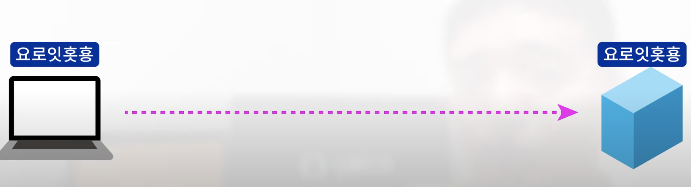
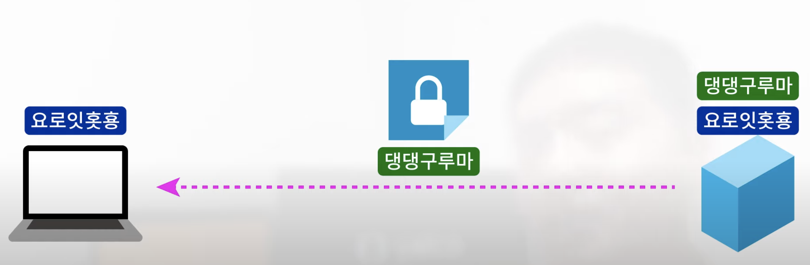
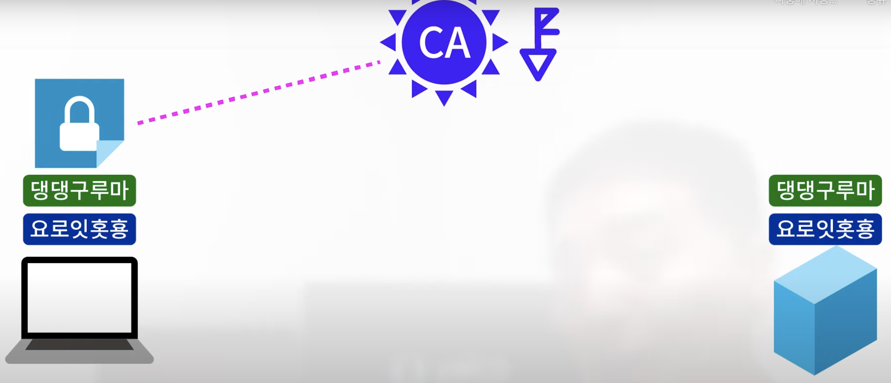
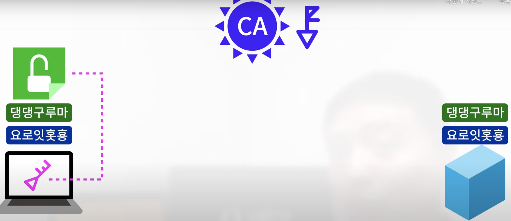
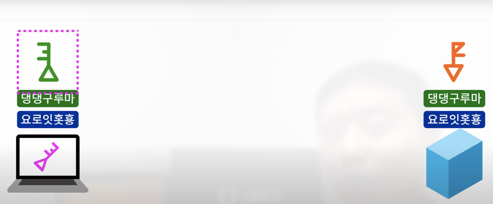
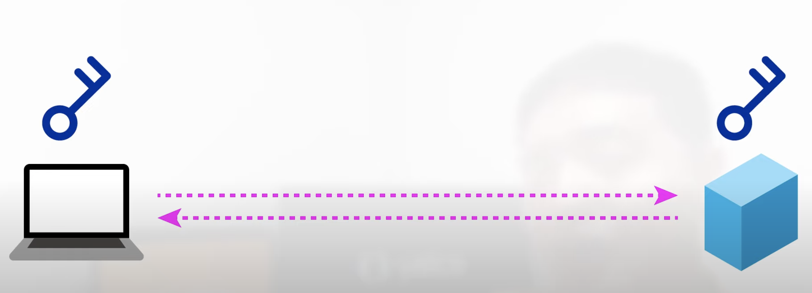
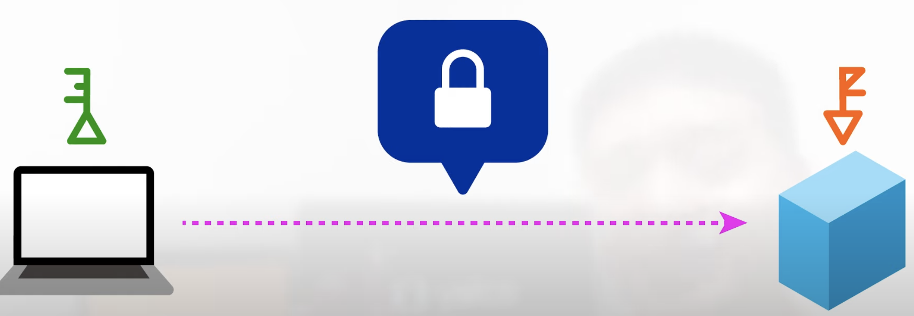

# HTTP vs HTTPS

두 방식의 차이는 간단하다. SSL(Secure Socket Layer)을 쓰냐 안쓰냐의 차이다. 동작 순서는 다음과 같다.

* HTTP 동작 순서 : TCP → HTTP
* HTTPS 동작 순서 : TCP → SSL → HTTP

SSL 프로토콜은 정보를 암호화시키고 이 때 대칭키와 비대칭키 방식을 이용한다. 즉, HTTPS는 인터넷 상에서 정보를 암호화하기 위해 SSL 프로토콜을 이용해 데이터를 전송하고 있다는 것을 말한다. 

## 대칭키와 비대칭키

"대칭키"란, 메세지를 보내는쪽과 받는쪽이 같은 키를 갖는 것. 같은 키로 평문을 암호/복호화하는 것이다. 그러나, 대칭키를 탈취되면 보안이 뚫린다는 한계가 있다. 이를 극복하기 위해서 "비대칭키" 방식이 있다. 

"비대칭키" 방식은 간단하게 두개의 키를 이용한다. 이 두개의 키를 A, B라고 해보자. 이 때 평문을 A키로 암호화하면 B키로 복호화할 수 있고 B키로 암호화하면 A키로 복호화할 수 있다. 즉 네이버는 A키를 사용자에게 나눠준다. 이것을 공개키라고 부른다. 그리고 서버에서 B키로 암호화된 문서를 복호화하거나 반대의 일을 해낸다. 이게 개인키이다.

## CA란?

"Certificate Authority"의 약자로써 공개키를 인증하는 민간 기업이다. 크롬, 파이어폭스 등 여러 브라우저는 모두 CA에 인증된 공개키를 사용한다. 

## 핸드쉐이크 과정

먼저 클라이언트가 랜덤 데이터를 서버에게 보낸다.

출처: "[얄팍한 코딩 사전 - https](https://www.yalco.kr/31_https/)"

그럼 서버 역시 랜덤 데이터와 서버의 인증서를 같이 보내게 된다.

출처: "[얄팍한 코딩 사전 - https](https://www.yalco.kr/31_https/)"

그럼 클라이언트는 브라우저에 내장된 CA의 비대칭키로 인증서를 확인한다.

출처: "[얄팍한 코딩 사전 - https](https://www.yalco.kr/31_https/)"

인증서가 진짜라면, 비대칭키로 복호화를 진행한다.

출처: "[얄팍한 코딩 사전 - https](https://www.yalco.kr/31_https/)"

이 때 복호화된 인증서에는 서버의 공개키가 포함되어 있다.

출처: "[얄팍한 코딩 사전 - https](https://www.yalco.kr/31_https/)"

이후 통신에서 데이터를 대칭키 비대칭키를 혼합해서 사용한다. 먼저 속도를 위해서 데이터는 대칭키로 암호화한다.

출처: "[얄팍한 코딩 사전 - https](https://www.yalco.kr/31_https/)"

이 때 공유되는 대칭키를 만들 때, 비대칭키를 사용하게 된다.

출처: "[얄팍한 코딩 사전 - https](https://www.yalco.kr/31_https/)"

핸드쉐이크 맨 처음 과정에서 서버와 클라이언트는 각각 랜덤한 데이터를 만들었는데, 서버/클라이언트는 이를 토대로 일련의 과정을 거쳐 공개키를 만들어 안전하게 데이터를 통신하는 것이다.
