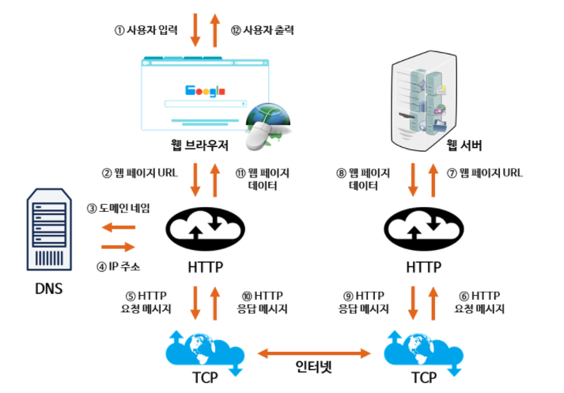

# www.naver.com 을 치면 어떻게 되나요?

## 작동 방식

출처 : [TCPSCHOOL - 웹의 동작 원리](http://tcpschool.com/webbasic/works)

1. 사용자가 "www.naver.com"을 브라우저에 입력한다.
2. HTTP 통신으로 URL이 전달된다.
3. DNS 서버에 URL에 대한 IP 주소를 쿼리한다.
4. DNS 서버는 해당 URL에 대한 IP 주소를 전달한다.
5. URL과 IP 주소를 토대로 요청 메시지를 생성하여 HTTP 통신으로 서버에게 전달한다. 
6. 서버에 요청 메세지가 전달된다.
7. 웹 페이지 URL이 전달된다.
8. 서버에서 웹 페이지 데이터를 전달한다.
9. 웹 페이지를 토대로 응답 메세지를 만들어 HTTP 통신으로 클라이언트에게 전달한다.
10. 클라이언트는 응답 메세지를 받는다.
11. 웹 페이지 데이터를 받는다.
12. 사용자 브라우저에 출력된다.

## 숨겨진 DNS 동작 방식

출처 : [Monrnig Star님의 DNS 서비스 유형](https://velog.io/@doomchit_3/Internet-DNS-%EC%9E%91%EB%8F%99%EC%9B%90%EB%A6%AC-IMBETPY)

1. 클라이언트가 www.naver.com을 입력한다.
2. Local DNS에 이 URL이 전달되고 이는 Root DNS에 전달 된다.
3. Root DNS는 "com DNS"에 대한 IP 주소를 Local DNS에 전달한다.
4. Local DNS는 "com DNS"에 URL을 쿼리한다.
5. "naver.com DNS"에 대한 IP 주소를 Local DNS에 전달한다.
6. Local DNS는 "naver.com DNS"에 URL을 쿼리한다.
7. 해당 IP 주소(222.122.195.6)를 Local DNS에 전달한다.

