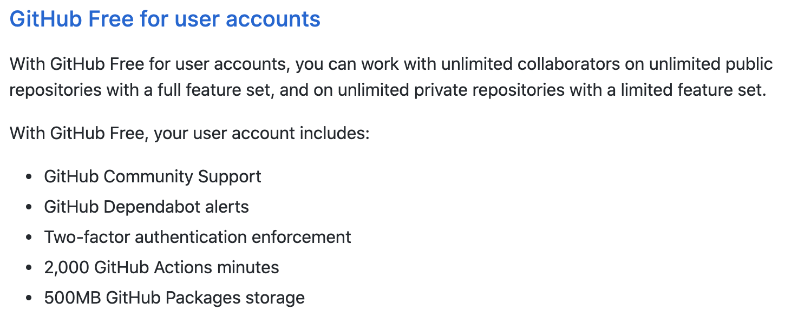

# Github Actions란 무엇인가?

> Github Actions 공식 문서를 공부하고 정리한 문서입니다.

## CI/CD란?

`Github Actions`를 알아보기 전에 먼저 `CI/CD`를 알아보자. 아래 내용은 `RedHat`의 공식 문서를 읽고 요약한 것이다. `RedHat`의 공식 문서는 [이 곳](https://www.redhat.com/ko/topics/devops/what-is-ci-cd)에서 확인할 수 있다.

**CI = Continuous Integration**

`CI`는 "지속적인 통합"이라는 말로 직역된다. 정확하게는 **개발자를 위한 자동화 프로세스**를 의미한다. 그렇다면, 개발자를 위한 자동화 프로세스에는 어떤 것이 있을까?

1. 빌드
2. 테스트
3. 병합

개발자는, 개발을 위해서 코드를 변경하거나 추가하는 작업을 한다. 이 때 추가/변경된 코드를 빌드하고 테스트한 후 그 코드들을 병합하는 과정을 거친다. 이 과정을 자동화하는 것이다. 

요약하자면, `CI/CD`의 첫 번째 단계로써, `코드 변경`, `코드 빌드`, `유닛 테스트`, `통합 테스트`, `코드 병합`이 이루어진다.

**CD = Continuous Delivery**

`CD`는 크게 2가지 의미로 많이 사용된다. 먼저 "지속적인 전달"로 직역되는 `Continuous Delivery`이다. 이 과정은, 개발자들이 애플리케이션에 적용한 변경 사항이, 버그 테스트를 거쳐 레포지토리 혹은 컨테이너 레지스트리에 자동으로 업로드 되는 것을 의미한다.

요약하자면, `CI/CD`의 두 번째 단계로써 `지속적인 통합` 단계가 먼저 이루어져 있어야 하며, 변경, 빌드, 테스트, 병합을 거친 유효한 코드를 레포지토리/컨테이너 레지스트리에 자동으로 릴리즈한다.

**CD = Continuous Deployment**

두 번째 `CD`는 `Continuous Deployment`의 약자로 "지속적인 배포"로 직역된다. 이 과정은 `Continuous Delivery` 작업을 거쳐서 레포지토리 혹은 컨테이너 레지스트리의 릴리즈된 코드를, 클라이언트가 사용 가능한 프로덕션 환경. 이를테면 사내 클라우드나 `GCP` 같은 클라우드 환경으로 배포되는 과정을 의미한다. 

요약하자면, `CI/CD`의 마지막 단계로써 `지속적인 전달` 단계가 먼저 이루어져 있어야 하며, 레포지토리/컨테이너 레지스트리에 릴리즈된 코드를 프로덕션 환경에 배포한다. 

**대표 도구**

`CI/CD`를 지원하는 대표적인 도구는 다음과 같다.

* Circle CI
* Travis CI
* Jenkins CI
* Teamcity
* Github Actions

## Github Actions란?

`CI/CD` 도구 중, `Github Actions`를 알아보도록 하겠다. 필자가 이 녀석을 선택한 이유는 다음과 같다.

1. `Github`과 연동이 쉽다.
2. 무료로 제공하는 기능들이 꽤 많다.
3. 배우기 쉽다.

`Github Actions`라는 이름에서 알 수 있듯이, 먼저 개발자라면 대부분 사용하는 `Github`에서 제공하는 `CI/CD` 도구이다. 따라서 어떤 도구보다도 `Github`과 연동이 잘 된다.

개인적인 의견이지만, 이미 `Circle CI`, `Travis CI` 등 여러 `CI/CD` 도구들을 지원하기 위한 기능들이 탑재되었었기 때문에, 어쩌면 당연한 수순이었을 것이다.

두 번째로는 무료로 제공하는 기능들이 꽤 많다. 대표적으로 빌드/배포 파이프라인에 도커 컨테이너를 사용할 수 있다. 공식 문서에 따르면, 무료 사용자는 다음만큼의 기능을 공짜로 사용할 수 있다.

짧은 영어로 해석하자면, public 레포지토리의 경우, 무제한으로 사용할 수 있다. private 레포지토리의 경우는, 분당 2000개의 `Github Ations`를 사용할 수 있다고 한다. 이 정도면, 개인적인 용도에서는 앵간하면 무료이지 않을까 싶다. 이에 대한 내용은 Github 공식 문서인 [이 곳](https://docs.github.com/en/free-pro-team@latest/github/getting-started-with-github/githubs-products)에서 확인하길 바란다.

세 번째로는 "배우기 쉽다"인데 의례적으로 그냥 써본 것이다. 사실 필자는 `Jenkins CI`만 간단하게 써 본 경험만 있고, `CI/CD` 도구를 제대로 사용한 경험이 전무하기 때문에 `Github Actions`가 배우기가 쉽다라고 말 할 수는 없을 것 같다.

다만 필자 개인적인 의견으로 공식 문서가 잘 정리되어 있다는 느낌을 받았다. 또한, `roadmap.sh`란 곳에서 가장 추천하는 `CI/CD` 도구 중 하나로 선택 받았다. 해당 내용은 [이 곳](https://roadmap.sh/devops)에서 찾아볼 수 있다. 

이 시리즈는 공식 문서에서 제공하는 다음 내용들에 대해서 주로 정리할 예정이다.

* LEARN GITHUB ACTIONS
* GUIDES

그 외 내용들은 필요하면 정리할 예정이다.
