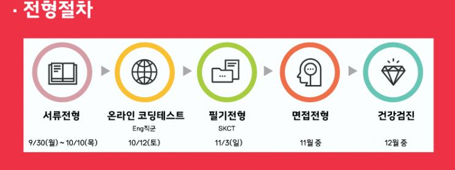
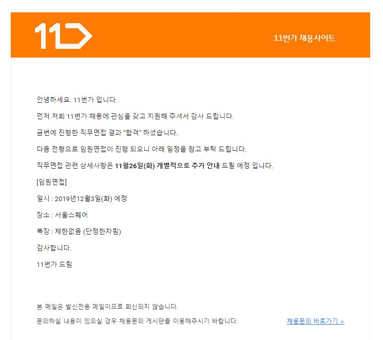

11번가 최종 합격 후기
==================

Contents
--------------

1. 들어가며..
2. 채용 프로세스
3. 1차 면접
4. 2차 면접
5. 마치며..

## 들어가며..

안녕하세요 구르미입니다! 금일, 2019년 12월 6일 "11번가 2020년 신입 채용"에 최종 합격을 했습니다. 후... 아직도 믿기지 않네요. 파란만장했던 11번가 최종 합격 후기 시작하도록 하겠습니다.

## 채용 프로세스

이번 11번가 신입 채용 프로세스는 다음과 같이 이루어졌습니다.

제 블로그를 찾아 보신 분들은 아시겠지만, 저는 올해 11번가에서 진행했던 "2019년 11번가 여름 인턴쉽"을 수료했습니다. 인턴쉽 혜택으로, 저는 코딩 테스트, SKCT는 응시하지 않고도 합격 결과를 받았습니다.

## 1차 면접

이제 합격 후, 11월 20일 1차 면접을 진행하였습니다. 1차 면접은, 지난, 인턴 때 봤던 알고리즘 코드 리뷰와 함께, 지난 번과 동일한 방식으로 직무 질문 2개 중 하나를 골라서 30분간 준비하여 면접을 보는 것입니다. 알고리즘과, 직무 질문은 회사의 자산이므로 적지 않는다는 점 이해해주시길 바랍니다.

1차 면접은 실무자 면접으로 2대 1로 진행되었습니다. 제 면접관으로 들어오셨던 분들은 인프라 부서의 PL(프로젝트 리더)님과 제가 지내온 팀, 바로 옆 팀의 실무자 분께서 들어오셨습니다. 알고리즘, 직무 질문에 대해서 질문과 답변이 간단하게 이루어졌습니다. 근데 생각도 못한 곳에서 엄청나게 절었습니다.

> "여지껏 서비스 개발을 공부해오시고 커리어를 쌓아왔는데, 인프라 엔지니어로 오래 일하실 수 있으세요?"

이 질문에 답은 이미 준비 했었는데, 막상 면접관 앞에서 하자니 이야기가 잘 안나왔습니다. 왜냐하면 제가 생각해도 인프라로 바꿀 이유는 1도 없었거든요. 제가 답변했던 것을 요약하자면 다음과 같습니다. 

1. 제가 생각했을 때 또 주변 사람들에게 물어봤을 때, 인턴 생활을 했던 인프라 그룹을 지원해야 합격 확률이 높을 것 같아서 지원을 바꿨습니다.
2. 신입 개발자/엔지니어가 날고 기어봐야 경험 상, 거기서 거기라고 생각합니다. 어느 곳에서든 열심히 하면, 그에 따라 훌륭하게 성장할 자신이 있습니다.

지금 잘 정리해도 이정도인데, 앞에선 얼마나 이상하게 답변했을까요? ㅠㅠ 아마 제 생각으로는 이번 인턴쉽을 진행하지 않았더라면, 저는 "불합격" 결과를 받았을 것 같네요. 하지만 결과는 합격!

## 2차 면접

1차 면접 합격 후, 12월 3일에 2차 면접이자, 임원 면접을 보게 되었습니다. 역시 2대1, 한 분은 채용 팀의 임원 분이셨고, 나머지 한 분은 인프라 부서의 임원 분이셨습니다. 여러가지 질문이 많았지만, 대부분 인턴쉽 때 진행했던 개인 과제에 대해서 질문을 주셨던 것 같습니다. 지금 기억나는 질문들은 다음과 같습니다.

> Q1. 인턴쉽 끝나고 6개월 간, 뭐했어요?
> A1. 친구들과 진행했던 프로젝트를 계속해서 진행하고 있습니다. 또한, 기본기가 부족한 것 같아서 자료구조, 알고리즘 등 전공 기초에 대해서 공부하는 시간을 가졌습니다.
> 
> Q2. 알고리즘 성적이 그렇게 좋은 편은 아닌데, 어떻게 생각하세요?
> A2. 저도 그것을 느껴서 1일 1알고리즘을 하고 있으며, 계속 문제를 푸는 능력을 올리려고 열심히 공부하고 있습니다.
> 
> Q3. 인턴쉽 개인 과제, 좋은 평가를 받았는데 어떤 이유일 것 같아요? 개인의 실력, 노력 운?
> A3. 첫 째로, 제 스스로 최선을 다했고, 두번 째로 팀원들이 도움을 주었습니다. 마지막으로 제 개인 과제 주제가, 많이 나왔었는데, 결과가 안 좋다고 들었습니다. 그래서 평가하시는 분들의 기대치가 낮아졌다고도 생각합니다. 따라서, 실력, 노력, 운 3박자가 잘 갖춰서 좋은 평가를 받았던 것 같습니다.
> 
> Q4. 그럼 운빨이네? 하긴 운빨도 실력이죠?
> A4. 개인적으로는 실력이 있어야 운빨도 따른다고 생각합니다.
> 
> Q5. 인프라 엄청 열심히 공부하셔야 할텐데, 어떻게 하실거에요?
> A5. 지금 현재도 기존 인프라 구조에 대해서 공부하고 있습니다. 11번가에서 이제 온프리미스 구조에서, 클라우드 구조로 인프라를 변경하고 있다고 들었습니다. 기존 인프라 구조 공부 후, 추가적으로 클라우드 역시 공부할 예정입니다. 

그 외에도 개인 과제에 대해서 많이 여쭤보셨는데, 이것은 회사의 자산에 대해서 제가 이야기할 수 있는 부분이 아닌 것 같아서 생략하겠습니다. 한 30분 정도 면접이 진행한 후, 마지막으로 질문하고 싶은 거 있으면 하라고 하시길래, 개인적으로 궁금했던 것들을 솔직하게 물어봤습니다. 

> Q1. 인프라 엔지니어 연봉은 어느정도인가요?
> A1. 잘 모르겠네요. 아마 인터넷에서 돌아다니는 정보에서 크게 다르지 않을거에요.
> 
> Q2. 복지 400만 포인트 받는 걸로 아는데, 받자마자 한 번에 다 써도 되나요?
> A2. 네 상관 없습니다.
> 
> Q3. 마지막으로, 면접관님들이 보셨을 때, 제 합격확률은 어떨 것 같으세요?
> A3. 이건 질문이 잘못된 질문이에요. 

제가 이렇게 질문했다니까 친구들이 말하길 "미친놈이네... 개념 없는 ㅅㄲ" 라고 하더라구요... 뭐 마지막 질문은 진짜 개념 없긴 하지만, 이 정도는 할 수 있을 것 같다고 생각했었는데... 친구들한테 이런 피드백을 받으니까 너무 불안하더라구요. 정말 미친듯이... 그리고 기다리고 기다리던, 오늘 마침내 결과가 나왔습니다.

드디어 합격을 했습니다!! 약 2년(뭐.. 스타트업에서 6개월 간 일했잖아..)간 긴 취업 생활 끝에 드디어 취뽀했네요.

## 마치며..

이제, "서비스 개발자"가 아닌 "인프라 엔지니어"로 직종이 바뀐만큼, 공부 내용도, 관련 포스팅도 바뀔 것 같습니다. 전공 기초 관련 포스팅은 꾸준하겠지만.. 계획했었던, "스프링 프레임워크 파헤치기"나, 애플리케이션 만들 때, 쓰는 팁들 대신, AWS, GCP 이런 클라우드 관련 포스팅이나 도커, 쿠버네틱스, 테라폼 관련 포스팅이 주를 이룰 것 같아요. 이는 추후 포스팅 할 "2019 하반기 회고록"에 적도록 하겠습니다.

아직 취업을 준비하시는 분들에게 조금 더 도움이 될 수 있을까 해서, 부끄럽지만, 제 스펙을 공개하겠습니다.

* 나이 : 1992년 생. (취업 당시 28살)
* 서울 4년제 정보통신전자공학부 졸업 (학점 3.3/4.5)
* 프로그래밍 교육 :
    * "렉토피아" 6개월
* 경력 :
    * 스타트업 "유저해빗" 6개월 
* 프로젝트 : 개인 프로젝트 6 개, 팀 프로젝트 4개

정말 유명한 대학교를 졸업한 것도 아니고, 학점이 높지도 않으며, 영어 점수, 자격증 이런 거 하나 없습니다. "정말 잘 날 것 하나 없는 스펙"이죠. 무스펙에 가까워요. 그럼에도 제 스펙을 공개한 이유는 "이런 저도 원하던 기업에 취직했다"라는 것을 알려드리기 위함입니다. 특히 IT 직군을 준비하시는 분들이라면, 정말 꾸준하게, 열정적으로, 공부하고 서비스를 만들고, 자신을 준비 하다 보면 어디든 합격할 수 있을겁니다. 

여러분들은 여러분들이 생각하는 것보다 더 뛰어나고, 훌륭하며, 잠재력이 충분한 사람이라고, 저는 생각합니다. 여러분을 믿으세요! 지금 당장 미래가 안 보일지라도, 꿈을 잊지 않고 꾸준하게 달려나가서 원하는 바를 이루셨으면 좋겠습니다. 감사합니다.