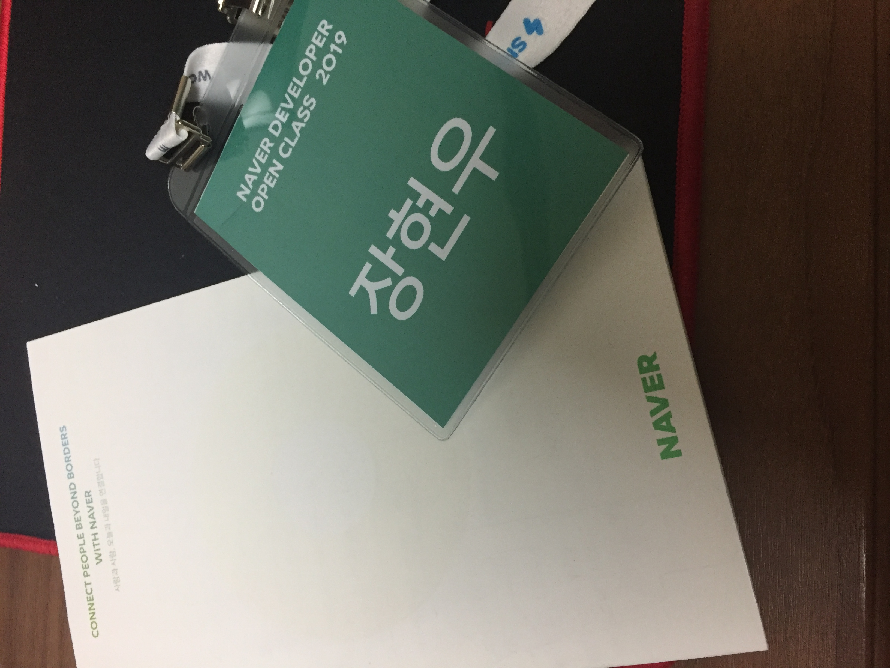
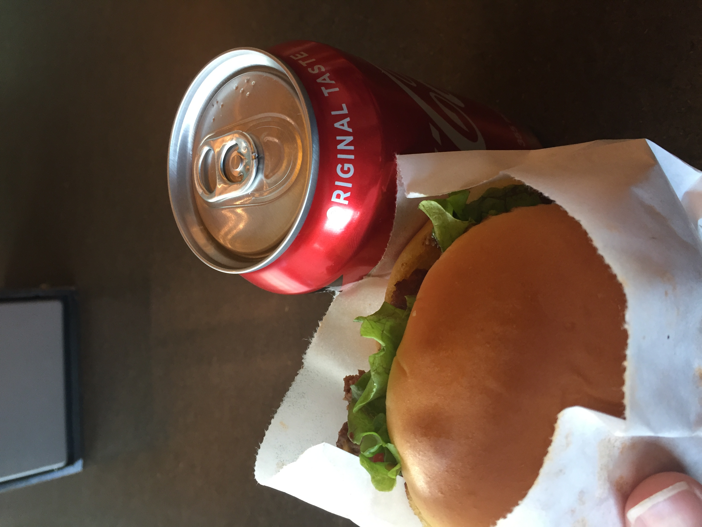
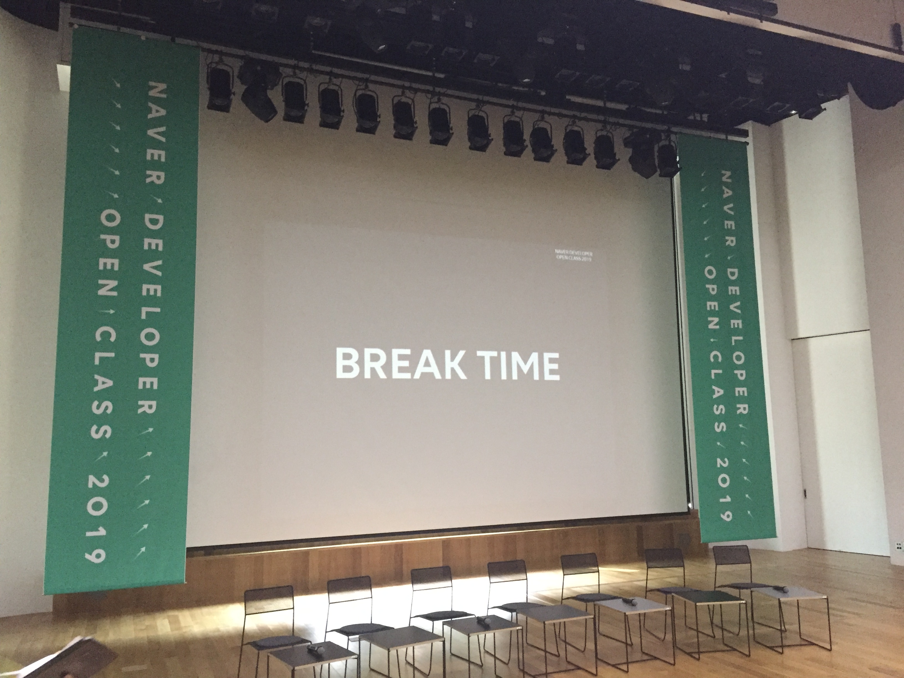

2019 네이버 오픈클래스 후기
=====================

Contents
-----------------

1. 들어가며..
2. 네이버 오픈 클래스
3. 마치며..

## 들어가며..

"오픈 클래스라 쓰고 채용 설명회라 읽는다." 

올해 하반기 네이버는 3년만에 신입 공채를 연다고 합니다. 그러면서, "오픈 클래스", 쉽게 말해서 채용 설명회를 열었는데요. 그 후기를 공유하고자 합니다.

## 네이버 오픈 클래스..

이번 네이버 오픈 클래스는 정자역에 위치한 그린 팩토리 2층 커넥트 홀에서 열렸습니다. 저번에 떨어진 NBP 신입 시험 장소이기도 하지요 ㅎㅎ.. 가슴이 아프다. 아픈 가슴을 안고 커넥트 홀로 들어섰습니다.

섹션은 다음 순서로 진행되었습니다.

1. 네이버에서 낱낱이 알려드립니다.
2. n년차 선배가 들려드립니다.
3. 네이버는 이런 분을 원합니다.
4. 네이버 개발자 TALK

##### 첫 번째 섹션 네이버에서 낱낱이 알려드립니다.

첫 번째 섹션에서는 네이버가 개발하는 서비스들은 어떤 것이 있고 네이버의 장점을 얘기하는 자리였습니다. 발표자님께서 말한 장점들은 다음과 같습니다.

1. 개발 문화
    * 활발한 코드 리뷰
    * 사내 지원
2. 입사 시 쌓을 수 있는 것들
    * 대용량 트래픽 처리 경험
    * 빅 데이터 경험
    * 글로벌 서비스 경험
    * 퍼포먼스 튜닝 경험

또 입사 시, 신입에게 바라는 점을 말씀해주셨는데 이 부분은 세번째 섹션과 일맥상통하므로 패쓰!

##### 두 번째 섹션 n년차 선배가 들려드립니다.

두 번째 섹션은 총 6명의 네이버 현직 개발자분들께서 자신이 일하는 조직과, 자신이 어떻게 네이버에 들어왔는지, 자신이 생각하는 네이버는 어떤지, 신입이 어떤걸 준비하면 되는지 알려주셨습니다. 

6명의 발표자님들 모두 공통적인 이야기를 해주셨는데요. 역시 세번째 섹션에서 다루도록 하겠습니다. 

기억에 남는 섹션은 2번째 발표자분이셨는데요. 클로버 개발팀에서 "데이터 검색 품질 평가 모델링"을 하시는 분이셨습니다. "비전공자 출신이 어떻게 네이버에서 일하는가"를 주제로 발표하셨는데, 내용과 별개로 발표가 어쩐지 기억에 남네요.(이쁘셔서 그런거잖아...) 

아무튼 6분 모두 이번 오픈 클래스를 위해서 열심히 준비하셨다라는 점이 감동 포인트였습니다.

##### 세 번째 섹션 네이버는 이런 분을 원합니다.

자 대망의 세 번째 섹션입니다. 오픈 클래스를 참여하신 분들, 그리고 이 글을 보는 분들의 주요 목적이 아닐까 싶은데요. 결론부터 말씀드리겠습니다. 네이버가 원하는 신입의 인재상은 다음과 같습니다.

1. 기본(Computer Science)이 충실한 사람
    * 자료구조
    * 알고리즘
    * 컴퓨터 구조
    * 운영체제
    * 데이터베이스
    * 네트워크 
2. 개발에 열정이 있는 사람
3. 논리적 사고력이 있는 사람

그 중 **기본**을 가장 중시하였습니다. 개인적인 생각으론 현재 네이버에서 수 많은 서비스를 개발하고 있는데, 각 서비스마다 다루는 기술들이 다를 것입니다. 제 느낌에는 "**너는 기본만 갖춰서 와. 실무는 우리가 알려줄게**"라는 느낌을 강하게 받았습니다.

그와 더불어 이번 공채 모집 기간과, 전형 일정 등에 간략히 설명해주셨습니다. 다음과 같습니다.

* 공채 모집 기간 
    * 9월 중
* 공채 일정
    1. 코딩 테스트
    2. 1차 면접
    3. 2차 면접

개인적으로는 코딩 테스트에 무조건 데이터베이스, 네트워크, 운영체제 등에 대한 테스트도 볼 것 같은데 언급은 따로 하시진 않았습니다.

그리고 2번째, 3번째 섹션 중 발표자분들께서 면접 질문 유형에 대해서 그냥 정말 간소하게 이런것들이 있겠죠? 하고 넘어갔던 부분이지만 공유해보겠습니다. 한 번 여러분들이 이 답을 해보셨으면 좋겠습니다. 

* 연결리스트와 배열의 차이는 무엇입니까?
* 스택이란 무엇입니까? (자료구조와, 컴퓨터 구조 측면에서 답해주세요)
* Call By Value, Call By Reference의 차이는 무엇입니까?

위 질문들을 가지고 심하게는 30분 정도 이야기 할 수도 있다고 합니다. 하하..

##### 네 번째 섹션 네이버 개발자 TALK

마지막 섹션은 네이버 개발자분들에게 질문하는 시간을 가졌습니다. 기본적으로 대표 질문 4개와 그에 따른 참가자들의 질문 몇 개를 받는 식으로 진행되었습니다.

개인적으로는 참여하신 분들의 질문들이 엄청 많아서 놀랐습니다. 뭐 여러 질문들이 있었는데... 기억이 잘 나지를 않네요. 일단 대표 질문의 맥락은 다음과 같습니다.

1. 네이버 복지에 대해서
2. 네이버 신입 기준 준비해야할 것
3. 프레임워크 어느 정도 다뤄야 하는지
4. 선배님들이 신입으로 돌아간다면 Github 어떻게 사용할지?

개인적으로 4번째 질문이 매우 쌈빡했던 것 같습니다. 2번째, 4번째 섹션은 정말 네이버가 신입 개발자들을 위해 얼마나 준비했는가를 볼 수 있는 시간들이었습니다. 개인적으로는 "**이 회사라면 정말 개발자로써 훌륭하게 성장할 수 있겠구나**"라는 생각이 들었습니다.

## 마치며..

다음은 찍은 사진들입니다. 쉬는 시간에 간식으로 쉑쉑버거가! 사은품으로 미니 선풍기가!! 역시 네이버!!! 나 네이버 채용 시켜줘... 이런 회사에 들어갈 수 있도록 열심히 준비해야겠습니다.

