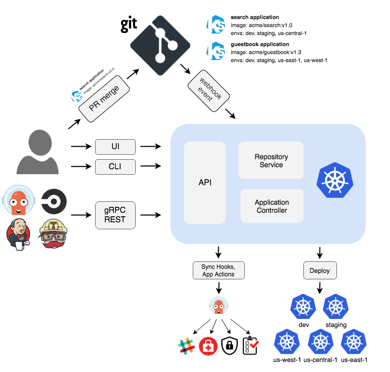
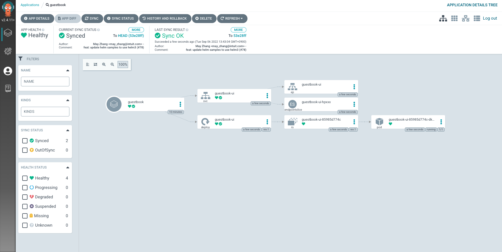

# ArgoCD 맛보기


이 문서에서는 `Gitops` 구현체 중 하나인 `ArgoCD`에 대해서 간단히 알아보도록 하곘습니다. 또한 `minikube` 쿠버네티스 클러스터 환경에서 `ArgoCD` 배포 후, `argocd` CLI를 통해 간단히 애플리케이션을 배포하는 내용을 실습해보도록 하겠습니다.

## Gitops와 ArgoCD

`Gitops`란 애플리케이션의 배포와 운영에 관련된 모든 요소를 코드화하여 깃(Git)에서 관리(Ops)하는 방법론 중 하나입니다. CI/CD 중 지속적인 배포(Continuous Deployment)에 초첨을 두고 있으며, 기본 개념은 코드를 이용하여 인프라를 프로비저닝 하고 관리하는 IaC(Infrastructure as Code)에서 나온 것으로 깃옵스는 이를 인프라에서 전체 애플리케이션 범위로 확장하였다고 보시면 됩니다.

`Gitops`의 장점은 다음과 같습니다.

* 인프라를 포함한 애플리케이션 배포와 운영에 관련된 모든 것을 코드로 관리할 수 있습니다.
* Git을 단일 진실 공급원으로 지정하고 오직 이 곳에서만 관리하도록 합니다. 모든 운영 활동의 시작은 깃이므로 사람 혹은 시스템 간의 혼선을 최소화 할 수 있습니다.
* Git 에서 누릴 수 있었던 깃의 기능을 운영 단계에서도 활용할 수 있습니다.(History, Commit, Merge Request/ Review, Revert 등)

`ArgoCD`는 `Gitops`의 대표적인 구현체이며, `Jenkins` 같은 push 방식이 아닌 pull 방식을 채택한 `Gitops` 도구입니다. 다음은 `ArgoCD`의 아키텍처를 나타낸 그림입니다.



기본적으로 쿠버네티스 클러스터 내 리소스들로 구성되며, 코드에 반영되면 설치된 `ArgoCD`가 쿠버네티스 클러스터에 설치된 리소스와 형상을 비교한 뒤, 차이가 있으면 이를 최신 코드 기준으로 동일하게 맞춰줍니다. 

자, 이제 간단하게 알아보았으니 `ArgoCD`를 통해서 애플리케이션을 배포해보는 간단한 실습을 진행해보겠습니다.

## 요구사항

실습을 진행하기 위해서는 아래 소프트웨어들이 구성되어 있어야 합니다.

* docker v20.10.17
* minikube v1.24.0
* kubectl v1.24.2

## 쿠버네티스 클러스터에 ArgoCD 배포하기

이전 절에서 언급했듯이 `ArgoCD`는 쿠버네티스 리소스로 구성되어 있습니다. 따라서 메니페스트를 구성해야 하는데, 여기서는 간단하게 CLI 명령어로 구성해보도록 하곘습니다. 아래 명령어들을 입력합니다.

```bash
# argocd 네임스페이스 생성
$ kubectl create namespace argocd

# 쿠버네티스 클러스터에 argocd 설치
$ kubectl apply -n argocd -f https://raw.githubusercontent.com/argoproj/argo-cd/stable/manifests/install.yaml
```

위 명령어를 실행하면 "argocd" 네임스페이스 아래 다음 리소스들이 구성됩니다.

```bash
$ kubectl get all -n argocd
NAME                                                    READY   STATUS    RESTARTS   AGE
pod/argocd-application-controller-0                     1/1     Running   0          115m
pod/argocd-applicationset-controller-78b8b554f9-pg6tv   1/1     Running   0          115m
pod/argocd-dex-server-6bbc85c688-fxqwf                  1/1     Running   0          115m
pod/argocd-notifications-controller-75847756c5-v9qc7    1/1     Running   0          115m
pod/argocd-redis-f4cdbff57-879q5                        1/1     Running   0          115m
pod/argocd-repo-server-d5c7f7ffb-fddm7                  1/1     Running   0          115m
pod/argocd-server-76497676b-m9gq4                       1/1     Running   0          115m

NAME                                              TYPE        CLUSTER-IP       EXTERNAL-IP   PORT(S)                      AGE
service/argocd-applicationset-controller          ClusterIP   10.111.172.181   <none>        7000/TCP,8080/TCP            115m
service/argocd-dex-server                         ClusterIP   10.100.226.17    <none>        5556/TCP,5557/TCP,5558/TCP   115m
service/argocd-metrics                            ClusterIP   10.109.114.206   <none>        8082/TCP                     115m
service/argocd-notifications-controller-metrics   ClusterIP   10.104.167.93    <none>        9001/TCP                     115m
service/argocd-redis                              ClusterIP   10.102.69.51     <none>        6379/TCP                     115m
service/argocd-repo-server                        ClusterIP   10.104.11.4      <none>        8081/TCP,8084/TCP            115m
service/argocd-server                             ClusterIP   10.109.178.58    <none>        80/TCP,443/TCP               115m
service/argocd-server-metrics                     ClusterIP   10.110.59.129    <none>        8083/TCP                     115m

NAME                                               READY   UP-TO-DATE   AVAILABLE   AGE
deployment.apps/argocd-applicationset-controller   1/1     1            1           115m
deployment.apps/argocd-dex-server                  1/1     1            1           115m
deployment.apps/argocd-notifications-controller    1/1     1            1           115m
deployment.apps/argocd-redis                       1/1     1            1           115m
deployment.apps/argocd-repo-server                 1/1     1            1           115m
deployment.apps/argocd-server                      1/1     1            1           115m

NAME                                                          DESIRED   CURRENT   READY   AGE
replicaset.apps/argocd-applicationset-controller-78b8b554f9   1         1         1       115m
replicaset.apps/argocd-dex-server-6bbc85c688                  1         1         1       115m
replicaset.apps/argocd-notifications-controller-75847756c5    1         1         1       115m
replicaset.apps/argocd-redis-f4cdbff57                        1         1         1       115m
replicaset.apps/argocd-repo-server-d5c7f7ffb                  1         1         1       115m
replicaset.apps/argocd-server-76497676b                       1         1         1       115m

NAME                                             READY   AGE
statefulset.apps/argocd-application-controller   1/1     115m
```

구성된 `ArgoCD`는 웹 UI(이하 "ArgoCD UI")를 제공합니다. 이를 브라우저로 접근하기 위해서는 다음의 4가지 방식이 있습니다.

1. 서비스 타입을 LoadBalancer로 변경
2. 서비스 타입을 NodePort로 변경
3. Ingress 생성 및 서비스 연결
4. Port Forward로 서비스 연결

여기서는 가장 간단한 `Port Forward` 방식을 이용해보도록 하곘습니다. 터미널에 다음을 입력하세요.

```bash
$ kubectl port-forward svc/argocd-server -n argocd 8080:443
```

이제 [http://localhost:8080](http://localhost:8080)으로 접속하면 `ArgoCD UI`를 접속할 수 있습니다.


이제 로그인을 해야 하는데, 이 방식으로 설치하게 되면 기본적으로 "admin" 계정과 함께 임의의 비밀번호가 생성됩니다. 비밀번호는 다음 명령어로 확인할 수 있습니다.

```bash
# 비밀번호를 확인화기 위한 명령어
$ kubectl -n argocd get secret argocd-initial-admin-secret -o jsonpath="{.data.password}" | base64 -d; echo
# 생성된 비밀번호
7FHwxAybf9aXICII
```

위에서 생성된 비밀번호와 함께 "admin" 계정으로 로그인하면 다음 화면을 확인할 수 있습니다.


## 애플리케이션 배포하기

`ArgoCD`에 애플리케이션을 배포하기 위해서는 몇 가지 설정이 추가적으로 더 필요합니다. 손 쉽게 구성하기 위해서 `argocd CLI`를 설치한다. mac 환경이라면, 다음 명령어로 손귑게 설치할 수 있습니다.

```bash
$ brew install argocd
```

먼저 `argocd CLI`로 배포한 `ArgoCD`에 로그인을 진행해야 합니다. 터미널에 다음을 입력합니다.

```bash
# argocd login <ArgoCD URL>
$ argocd login localhost:8080
WARNING: server certificate had error: x509: “Argo CD” certificate is not trusted. Proceed insecurely (y/n)? y  # <- y 입력
Username: admin # <- admin 입력
Password:       # <- 위에서 확인한 비밀번호 입력
'admin:login' logged in successfully
Context 'localhost:8080' updated
```

로그인이 다 되었으면 `application`을 배포해도록 하겠습니다. 터미널에 다음 명령어를 입력합니다.

```bash
$ argocd app create guestbook --repo https://github.com/argoproj/argocd-example-apps.git --path guestbook --dest-server https://kubernetes.default.svc --dest-namespace default
```

위 명령어는 `argocd(여기서는 argocd를 만들고 관리하는 단체를 의미한다.)`에서 제공하는 예제 샘플을 우리가 구성한 `ArgoCD`로 배포하고 관리할 수 있는 객체를 생성합니다. 이 객체, 혹은 배포 단위를 `argocd`에서는 "application"이라고 합니다. `ArgoCD UI`로 돌아가보겠습니다.

아래 그림과 같이 애플리케이션이 구성되었음을 확인할 수 있습니다.


현재 노란 색깔이 보이는데, 아직 쿠버네티스 클러스터에 배포되지 않았음을 의미합니다. 여기서 "Sync"를 누르면 배포를 할 수 있습니다.


그럼 오른쪽에서 다음 UI가 발생하는데 "Synchronize"를 누릅니다.


그럼 얼마 있다가 색깔이 노란색에서 초록색으로 바뀌게 됩니다. 예제 샘플이 배포가 되었음을 의미합니다.


애플리케이션을 UI를 클릭해보면 어떤 리소스들이 구성되는지 확인할 수 있습니다.



위 UI에서 다음 리소스들이 생성되었음을 확인할 수 있습니다.

* service x1 (endpoint, endpointslice는 서비스 생성 시 자동 구성됨)
* deployment x1
* replicaset x1
* pod x1

실제 쿠버네티스에서 구성된 리소스들과 비교해보죠. 다음 명령어를 입력합니다.

```bash
$ kubectl get all | grep "guestbook"
pod/guestbook-ui-85985d774c-dk6gz   1/1     Running   0          7m16s
service/guestbook-ui   ClusterIP   10.104.51.32   <none>        80/TCP    7m16s
deployment.apps/guestbook-ui   1/1     1            1           7m16s
replicaset.apps/guestbook-ui-85985d774c   1         1         1       7m16s
```

정확하게 일치됨을 확인할 수 있습니다.

이 문서에서는 예제 샘플, 즉 저희가 코드 관리를 할 수 없기 때문에 코드 내용이 변경될 때 싱크를 맞춰서 배포됨을 확인할 수 없습니다. 하지만, 만약 자신의 레포를 설정했다면, 레포에 코드 변경이 발생할 시 최대 3분을 기다렸다가 `ArgoCD`가 쿠버네티스 클러스터에 싱크를 맞춰서 애플리케이션을 배포하는 것을 확인할 수 있습니다.


## 참고

* [ArgoCD 공식 문서 - "Getting Started"](https://argo-cd.readthedocs.io/en/stable/getting_started/)