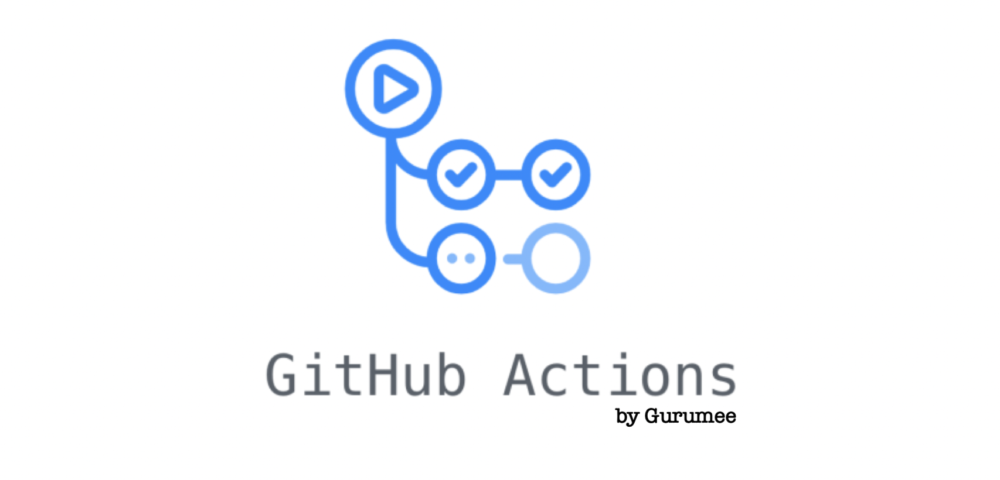
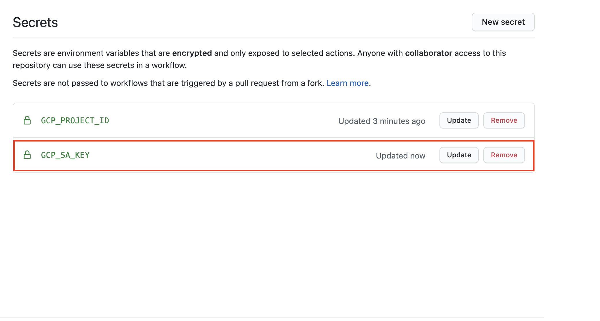
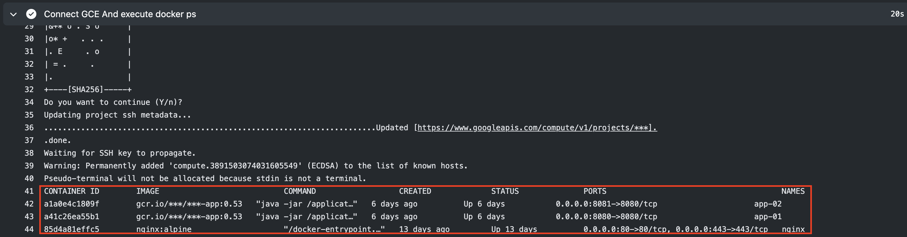

# Github Actions 달기 (Google Compute Engine)

<center></center>

> Github Actions를 사용하면서 정리한 문서입니다. 이 문서는 GCP의 gcloud를 연동시켜서 GCE에 접속하는 것에 대하여 다루고 있습니다.

## 요구 사항

먼저, `GCP`의 최소 1개 이상의 프로젝트와, `GCE` 인스턴스가 하나 이상 존재해야 한다. 없다면, 다음 문서를 참고하자.

* [GCP 가입하기](https://gurumee92.github.io/2020/09/gcp-%EA%B0%80%EC%9E%85%ED%95%98%EA%B8%B0/)
* [GCE 인스턴스 생성 및 설정하기](https://gurumee92.github.io/2020/09/gce-%EC%9D%B8%EC%8A%A4%ED%84%B4%EC%8A%A4-%EC%83%9D%EC%84%B1-%EB%B0%8F-%EC%84%A4%EC%A0%95%ED%95%98%EA%B8%B0/)

다음의 사항이 준비가 되었다면, 시작하자.


## GCE 서비스 계정 설정

`GCP`가 공식적으로 제공하는 `Github Actions`에서, `GCE` 접속을 위해서는 다음이 필요하다고 명시하고 있다.

1. `GCE` 인스턴스 1개
2. `Github Actions`를 달 레포지토리 1개
3. 다음의 `ROLE`이 있는 `GCP` 서비스 계정 1개,
   1. Compute Instance Admin 
   2. Storage Admin 
   3. Service Account User 

이 문서를 따라하기 위해서는 3-1은 반드시 필요하다. 3-2, 3-3은 반드시 필요 하지는 않다. 이에 대한 방법은 다음을 참고하라.


* [GCP 프로젝트에 서비스 계정 생성하기](https://gurumee92.github.io/2020/10/gcp-%ED%94%84%EB%A1%9C%EC%A0%9D%ED%8A%B8%EC%97%90-%EC%84%9C%EB%B9%84%EC%8A%A4-%EA%B3%84%EC%A0%95-%EC%83%9D%EC%84%B1%ED%95%98%EA%B8%B0/)
* [GCP 프로젝트에 Service Account Key 생성하기](https://gurumee92.github.io/2020/10/gcp-%ED%94%84%EB%A1%9C%EC%A0%9D%ED%8A%B8%EC%97%90-service-account-key-%EC%83%9D%EC%84%B1%ED%95%98%EA%B8%B0/)

해당 `ROLE`이 부여된 서비스 계정과, 서비스 계정 키를 얻었다면, 다음을 진행하자.

> 참고!
> 
> 서비스 계정 키를 만들 때 반드시 key.json을 로컬 머신에 저장해야 합니다. 이 파일은 만들 때 딱 한번 다운로드 할 수 있으므로 조심하시길 바랍니다.


## Github 레포지토리에 시크릿 키 설정

이제 `Github Actions`를 달 레포지토리에 시크릿 키를 설정해야 한다.


다음 화면처럼, "레포지토리 > Settings"를 클릭한다. 그럼 다음 화면이 뜬다. 왼쪽 탭에 "Secrets"를 눌른다.


그럼 다음 화면이 뜬다. "New Secret"을 눌러보자.


먼저 키 이름은 상관없지만 "Value" 입력 창에, `GCP` 프로젝트의 ID를 입력해야 한다. 나는 `GCP_PROJECT_ID`를 입력하고, 내 프로젝트 ID인 "geerio"를 입력했다. 그럼 다음 화면이 뜬다.


이제 한 번더 "New Secret"을 누른다. 이 때 역시 키 이름은 상관없지만 "Value"에, "서비스 계정 키"를 만들면서, 다운로드한 key.json을 base64 방식으로 인코딩 한 값을 넣어주어야 한다. 먼저 이 값을 얻어보자.

```bash
# cat <key.json 경로> | base64
$ cat ~/key.json | base64
...
```

이 키는 노출되면 안되기 때문에, 보여주진 않는다. 이 "..."된 값을 Value에 넣어준다 나는 키 이름을 "GCP_SA_KEY"라고 정하였다. 그럼 시크릿 키과 다음과 같아질 것이다.



이제 `Github Actions`를 달아보자.


## Github Actions 달기

다음 프로젝트 화면으로 돌아가서, "Actions"를 누른다.


아쉽게도, 현재 `Github Actions`에서는 `GCE`로 연결하는 그런 Actions를 추천하지는 않는다. `GKE`쪽을 적극적으로 지원하는 듯 싶다. 


일단 "set up a workflow yourself"를 누른다. 그 후 다음과 같이 yml 파일을 작성한다.

```yml
name: GCE Connect And Execute Script

on:
  push:
    branches: [ master ]
  pull_request:
    branches: [ master ]

env:
  PROJECT_ID: ${{ secrets.GCP_PROJECT_ID }}
  GCE_INSTANCE: geerio-instance-01	  
  GCE_INSTANCE_ZONE: asia-northeast3-a	
  
jobs:
  setup-pull-deploy:
    runs-on: ubuntu-latest
    steps:
      - name: Checkout
        uses: actions/checkout@v2

      - name: GCP Github Action
        uses: GoogleCloudPlatform/github-actions/setup-gcloud@master
        with:
            service_account_key: ${{ secrets.GCP_SA_KEY }}
            project_id: ${{ secrets.GCP_PROJECT_ID }}
      
      - name: Connect GCE And execute docker ps
        run: |-
          gcloud compute ssh "$GCE_INSTANCE" --zone "$GCE_INSTANCE_ZONE" -- 'docker ps'
```

`Github Actions` 시나리오는 다음과 같다.

1. GCP gcloud 도구 설정
2. GCE 접속 및 "docker ps" 명령어 실행

`yml`을 하나 하나 살펴보자.

```yml
name: GCE Connect And Execute Script
```

이것은 Action의 이름이다.

```yml
on:
  push:
    branches: [ master ]
  pull_request:
    branches: [ master ]
```

이 "Action"은 마스터 브랜치에 푸시가 일어나거나, 풀 리퀘스트가 일어나서 코드가 병합되었을 때, 실행된다는 뜻이다.

```yml
env:
  PROJECT_ID: ${{ secrets.GCP_PROJECT_ID }}
  GCE_INSTANCE: geerio-instance-01	  
  GCE_INSTANCE_ZONE: asia-northeast3-a	
```

이 "Action"에서 참조할 수 있는 환경 변수를 설정한다. 이는 "$환경_변수"로 접근할 수 있다. 또한, 이전에 설정했던 시크릿 키는 `{{ secrets.시크릿_키_이름 }}`으로 접근할 수 있다.

```yml
jobs:
  setup-pull-deploy:
    runs-on: ubuntu-latest
    steps:
      - name: Checkout
        uses: actions/checkout@v2

    # ...
```

`runs-on`은 `Github Actions`를 실행할 환경이다. `ubuntu-latest`에서 동작 환경을 만들어준다. 이제 첫 단계로 마스터 브랜치로 checkout 하는 것이다.

```yml
      - name: GCP Github Action
        uses: GoogleCloudPlatform/github-actions/setup-gcloud@master
        with:
            service_account_key: ${{ secrets.GCP_SA_KEY }}
            project_id: ${{ secrets.GCP_PROJECT_ID }}
```

이는 "Action"에 "GCP gcloud" 도구를 설정하다. 이 때, 설정했던, 프로젝트(GCP_PROJECT_ID), 서비스 계정 키(GCP_SA_KEY) 기반으로 설정한다.

```yml
      - name: Connect GCE And execute docker ps
        run: |-
          gcloud compute ssh "$GCE_INSTANCE" --zone "$GCE_INSTANCE_ZONE" -- 'docker ps'
```

"Action"의 마지막 단계이다. `gcloud`도구로 해당 `GCE` 인스턴스로 접속한 후 "docker ps" 명령어를 날린다. 실제 `Github Actions`가 실행된 과정을 살펴보면 다음과 같다.


여기서 "GCP Github Action" 과정을 보자. `yml`에서 설정했던 `SAK`로 `gcloud`가 설정된 것을 확인할 수 있다.


이제 실제 `GCE` 인스턴스에서 접속한 후 "docker ps" 명령어를 실행한 것을 확인할 수 있다.



이를 이용하면, 이제 `GCE` 내부에서 `CI/CD`를 구축할 수 있을 것 같다.