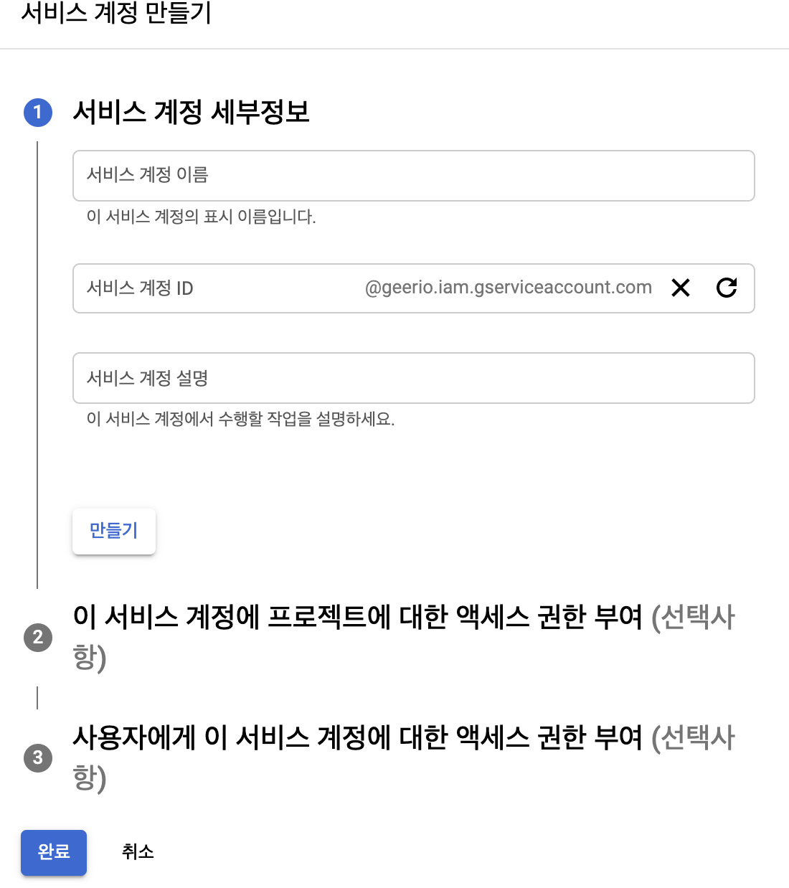
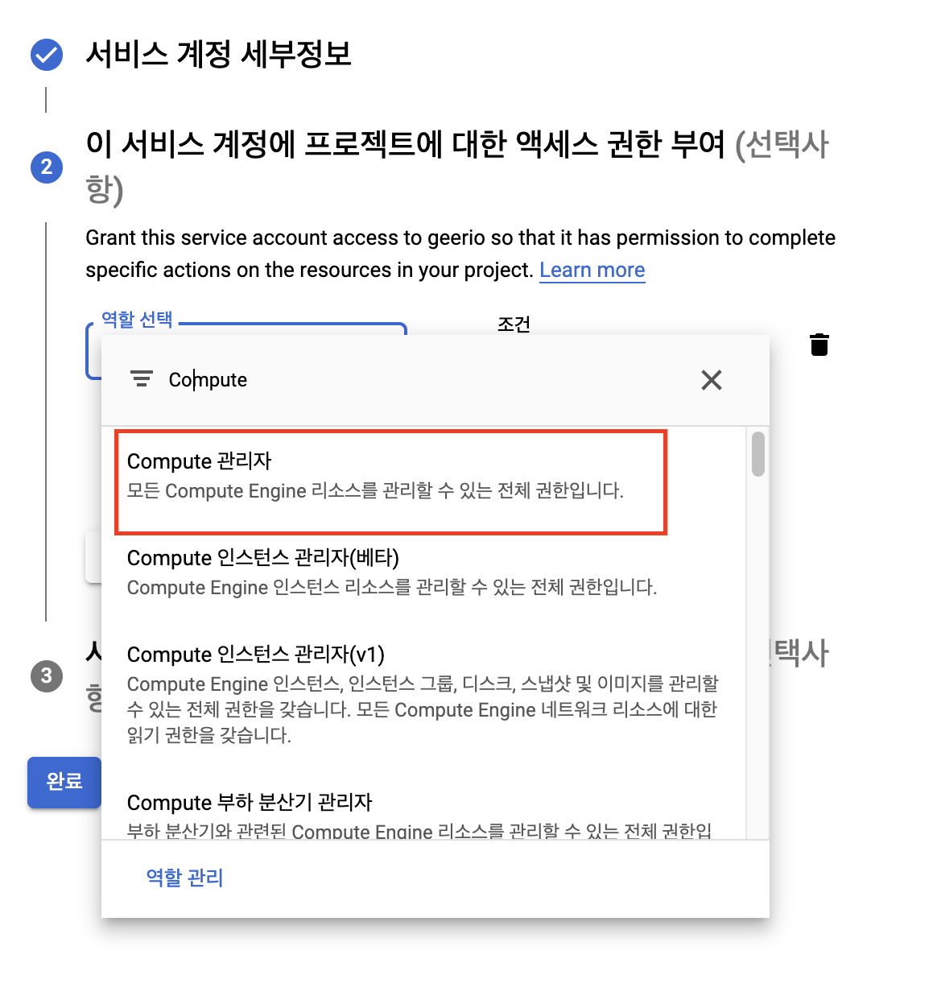

# GCP 프로젝트에 서비스 계정 생성하기

> 실제 GCP를 이용하면서 정리한 내용입니다. 이 문서는 GCP에서 만든 프로젝트에 서비스 계정을 생성하는 내용을 다루고 있습니다.

## 요구 사항

이 문서를 진행하기 위해서는 적어도 `GCP` 내에서 하나 이상의 프로젝트가 만들어져야 한다. 아직 안 만들었다면, 다음을 참고하라.

* [GCP 가입하기](https://gurumee92.github.io/2020/09/gcp-%EA%B0%80%EC%9E%85%ED%95%98%EA%B8%B0/)
* [GCE 인스턴스 생성 및 설정하기](https://gurumee92.github.io/2020/09/gce-%EC%9D%B8%EC%8A%A4%ED%84%B4%EC%8A%A4-%EC%83%9D%EC%84%B1-%EB%B0%8F-%EC%84%A4%EC%A0%95%ED%95%98%EA%B8%B0/)

자 `GCP` 가입과, 프로젝트 생성을 완료했다면, 시작해보자.

## 서비스 계정이란?

서비스 계정이란 무엇일까? 구글 공식 문서에서는 다음과 같이 정의하고 있다.

    서비스 계정은 사용자가 아닌 애플리케이션 또는 가상 머신(VM) 인스턴스에서 사용하는 특별한 유형의 계정입니다. 애플리케이션은 서비스 계정 자체 또는 G Suite로 승인되거나, 도메인 전체 위임을 통해 Cloud ID 사용자로 승인된 승인된 API 호출을 수행하기 위해 서비스 계정을 사용합니다.

일반 계정과 서비스 계정의 차이점은 다음과 같다.

* 서비스 계정에는 비밀번호가 없으며 브라우저나 쿠키를 통해 로그인할 수 없다.
* 서비스 계정은 Google을 인증하는 데 사용되는 비공개/공개 RSA 키-쌍과 연결되어 있다.
* IAM 권한을 부여하여 다른 사용자(또는 다른 서비스 계정)가 서비스 계정을 가장하도록 허용할 수 있다.
* 서비스 계정은 사용자 계정과 달리 G Suite 도메인의 구성원이 아니다.

쉽게 말해서, 프로젝트/프로젝트 관리자가 관리하는, 프로젝트에서만 사용할 수 있는 내부 계정이라고 보면 된다. 이 계정들은 역할(Role)을 부여 받아서, 역할에 맞는 프로젝트에서 관리하는 `GCP` 내부 리소스들을 접근할 수 있다.

예를 들어 `Compute Instance Admin`이라고, `GCE`의 모든 접근 권한을 가지고 있는 `ROLE`을 부여할 수 있다. 그럼 이 서비스 계정으로 `GCE`의 모든 리소스에 접근할 수 있게 된다. 이제, 서비스 계정을 만들어보자.

## 웹 콘솔로 서비스 계정 관리 및 역할 정하기

`GCP` 웹 콘솔로 서비스 계정을 관리하기 위해서는 [이 곳](https://console.cloud.google.com/iam-admin/serviceaccounts)을 클릭한다.

이 때 원하는 프로젝트를 선택한다. 나는 `geerio`라는 개인 프로젝트를 선택했다.

그럼 왼쪽 탭에 "IAM 관리자 > 서비스 계정"이 활성화되어 있고 다음과 같이 서비스 계정 목록을 확인할 수 있다. 아무것도 작업을 하지 않은 프로젝트라면, 1개의 서비스 계정이 만들어져 있을 것이다.

이제 서비스 계정을 만들어보자. 위의 화면에서 보듯 "+ 서비스 계정 만들기"를 클릭한다.

그럼 다음 화면이 뜬다. 적절한 이름을 지어주고 "만들기" 버튼을 클릭한다.

그럼 다음 화면이 뜬다. "역할 선택"을 클릭하면 부여하고 싶은 `ROLE`을 선택할 수 있는 드롭 다운 UI가 제공된다. 

원하는 `ROLE`을 선택해보자. 또한 검색도 할 수 있는데 나는 "Compute 관리자"를 선택했다.

그 후 "계속"을 클릭한다.

그럼 다음 화면이 뜨는데, 일단은 사용할 사용자가 없으므로 "완료"버튼을 클릭하자.

그럼 다음 화면처럼, 목록에 추가된 것을 확인할 수 있다. 적절하게 추가된 것을 알 수 있다. 생성 외에 다음 작업들을 할 수 있다.

* 수정
* 사용 중지
* 키 만들기
* 삭제

UI 및, 기능이 매우 직관적이므로 이는 설명을 생략하겠다. 만약 위의 작업들 중 하고 싶은 작업이 있다면, 다음 화면처럼 "..."를 클릭하면 된다.

이 방법 외에도 `gcloud`나 다른 방법으로 서비스 계정 관리와 원하는 서비스 계정에 role을 부여할 수 있다. 그러나 이는 생략하도록 한다. 더 자세한 내용을 알고 싶다면, 참고 문헌 절에 제공된 "서비스 계정 생성 및 관리" 링크를 참고하라

## 참고 문헌

* [GCP 공식 문서 - 서비스 계정](https://cloud.google.com/iam/docs/service-accounts?hl=ko)
* [GCP 공식 문서 - 서비스 계정 생성 및 관리](https://cloud.google.com/iam/docs/creating-managing-service-accounts?hl=ko)