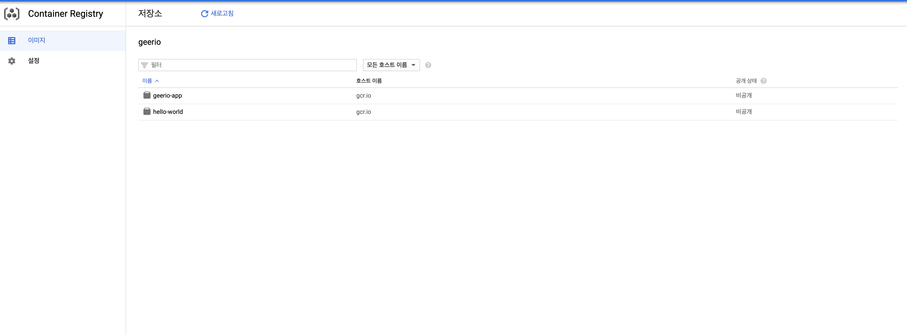
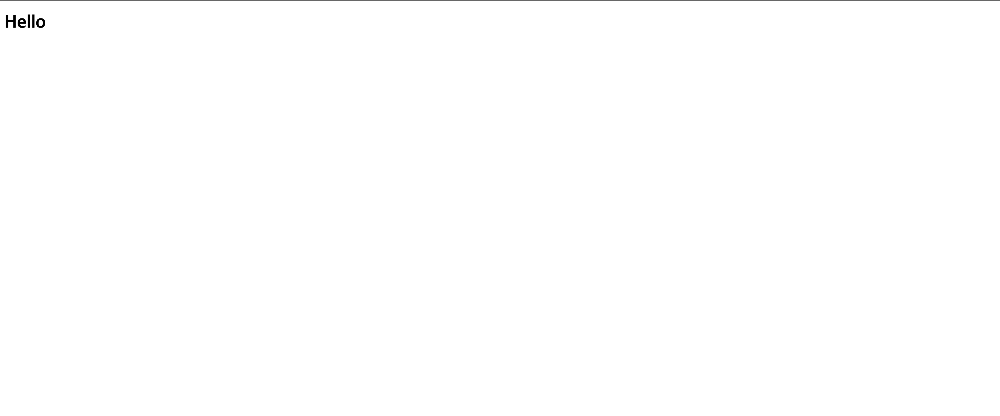

# 지리오 서비스 구축기 (1) 0차 배포


> 실제 개인 서비스 "지리오"를 만들면서 한 일을 기록한 문서입니다. 이 문서는 스프링 부트 앱을 도커 컨테이너로 만들어서 GCE에 배포하는 내용을 담고 있습니다.


## 요구 사항

먼저, 필자는 이 문서를 읽는 여러분이 `스프링 부트`를 이용해 간단하게 웹 서비스를 만들 수 있다고 가정한다. 또한, `Docker`와 `docker-compose`에 대한 내용을 알고 있다고 가정한다. 이 문서의 큰 순서는 다음과 같다.

1. 스프링 부트 앱 도커 이미지 만들기
2. 도커 이미지 개인 도커 레지스트리에 Push
3. 실제 GCE 인스턴스에 스프링 부트 앱 배포

따라서, 이 문서를 기반으로 따라하기 위해서는 다음이 필요하다.

1. `Gradle` 기반의 스프링 부트 앱
2. 개인 도커 레지스트리
3. GCP의 GCE, AWS의 EC2 같은 클라우드 서버 인스턴스 1개 

**참고**

* [Spring Boot Quick Start](https://spring.io/quickstart)
* [GCE 인스턴스 생성 및 설정하기](https://gurumee92.github.io/2020/09/gce-%EC%9D%B8%EC%8A%A4%ED%84%B4%EC%8A%A4-%EC%83%9D%EC%84%B1-%EB%B0%8F-%EC%84%A4%EC%A0%95%ED%95%98%EA%B8%B0/)
* [GCE 인스턴스에 개인 도커 레지스트리 구축하기](https://gurumee92.github.io/2020/09/gce-%EC%9D%B8%EC%8A%A4%ED%84%B4%EC%8A%A4%EC%97%90-%EA%B0%9C%EC%9D%B8-%EB%8F%84%EC%BB%A4-%EB%A0%88%EC%A7%80%EC%8A%A4%ED%8A%B8%EB%A6%AC-%EA%B5%AC%EC%B6%95%ED%95%98%EA%B8%B0/)


## 스프링 부트 앱 도커 이미지 만들기

스프링 부트 앱을 도커 이미지로 만든다. 내가 알아본 바로는 2가지 방법이 있다. 

1. `Dockerfile`로 이미지 생성
2. `jib` + 빌드 툴 플러그인을 이용하여 이미지 생성

일단 나는 첫 번째 방식을 선택했다. 왜냐하면 내가 아는 지식으로, 빠르게 진행할 수 있기 때문이었다. 프로젝트 루트에 `Dockerfile`을 다음과 같이 작성하였다.

```Dockerfile
# Docker Hub에서 java 8 기반의 도커 이미지를 pull
FROM openjdk:8-jdk-alpine

# 현재 프로젝트 루트 디렉토리를, 도커 이미지 "/app"에 복사
COPY . /app
# 도커 이미지에서, 해당 명령어 실행
# /app 이동 후, gradlew 실행 권한 생성 그 후 "gradlew build" 실행
# 컨테이너에서 프로젝트 빌드가 일어남.
RUN cd /app && chmod +x gradlew && ./gradlew build

# 빌드된 실행 가능한 jar를, 컨테이너 "/"에 "application.jar"라는 이름으로 복사
RUN cp /app/build/libs/*.jar /application.jar

# 포트 노출
EXPOSE 8080

# 컨테이너 실행 시, "java -jar /application.jar"로 실행
ENTRYPOINT ["java", "-jar", "/application.jar"]
```

그리고 로컬에서, 이미지가 잘 작동하는지 테스트하기 위해서, `docker-compose.yml`을 작성했다.

```yml
version: '3.1'
services:
  geerio-app:
    # 빌드할 Dockerfile 경로
    build: ./
    # 포트 매핑 로컬 포트:컨테이너 포트
    ports:
        - "8080:8080"
```

따라서 프로젝트 루트 디렉토리의 구조는 다음과 같아진다.

```
├── Dockerfile
├── README.md
├── build
├── build.gradle
├── docker-compose.yml
├── gradle
├── gradlew
├── gradlew.bat
├── settings.gradle
└── src
```

이제 로컬 환경에서, 도커 이미지가 잘 동작하는지 확인해보자.

```bash
$ pwd
# 프로젝트 루트 디렉토리
/Users/gurumee/Workspaces/geerio

# 이미지 빌드 및 컨테이너 실행
$ docker-compose up --build
...
```

이후 다른 터미널을 열어 다음을 입력해본다.

```bash
$ curl -XGET http://localhost:8080
<!DOCTYPE html>
<html lang="en">
<head>
    <meta charset="UTF-8">
    <title>지리는 당신의 이야기! Geerio</title>
</head>
<body>
<h1>Hello</h1>
</body>
</html>%
``` 
잘 동작한다. 이 방법은 내가 아는 한 가장 손쉽게 `Gradle` 환경에서의 자바 애플리케이션을 도커 이미지를 만드는 방법이었다. 

두 번째 방법인 `jib`은 `Dockerfile` 작성을 하지 않아도 됨은 물론, 터미널 명령어로 레지스트리에 이미지를 푸시할 수도 있다. 이는 나중에 기회가 되면, 따로 포스팅을 작성해볼까 한다. `jib`에 대한 자세한 내용은 [여기](https://github.com/GoogleContainerTools/jib/tree/master/jib-gradle-plugin#quickstart)를 참고하라.


## 도커 이미지 개인 도커 레지스트리에 Push

이제 터미널에 다음을 입력해보자.

```bash
$ docker images
REPOSITORY          TAG                 IMAGE ID            CREATED             SIZE
geerio_geerio-app   latest              cf5734ae3bdf        32 seconds ago      717MB
openjdk             8-jdk-alpine        a3562aa0b991        17 months ago       105MB
```

자, 이제 개인 레지스트리에 이미지를 올려보자. 먼저 도커 레지스트리에 이미지를 푸쉬하기 위해선 태그 작업이 필요하다.

```bash
# docker tag <로컬이미지:태그> <레지스트리/이미지이름:태그>
$ docker tag geerio_geerio-app:latest geerio-registry.io/geerio-app:0.1
```

다시 이미지 목록을 확인해보자.

```bash
$ docker images
REPOSITORY                       TAG                 IMAGE ID            CREATED             SIZE
geerio_geerio-app                latest              cf5734ae3bdf        4 minutes ago       717MB
geerio-registry.io/geerio-app    0.1                 cf5734ae3bdf        4 minutes ago       717MB
openjdk                          8-jdk-alpine        a3562aa0b991        17 months ago       105MB
```

자 이제 이미지를 Push 한다.

```bash
$ docker push geerio-registry.io/geerio-app:0.1 
```

이제 이미지가 레지스트리에 잘 저장되었는지 확인하기 위해서 로컬의 도커 이미지를 모두 삭제한 뒤, 해당 레지스트리의 이미지를 기반으로 컨테이너를 실행해보겠다.

```bash
# 로컬 도컬 이미지 모두 삭제
$ docker rmi -f $(docker images -q)

# 레지스트리에서 이미지 pull한 후 컨테이너 실행
$ docker run -p 8080:8080 geerio-registry.io/geerio-app:0.1
```

마지막으로 `레지스트리 웹 UI`에서 그 결과를 확인해보자.

> 웹 UI를 함께 구축하신 분들만 확인할 수 있습니다.




## GCE에 docker-compose 구성 및 서버 배포

자 이제 `GCE` 인스턴스에 접속해서 스프링 부트 앱을 배포해보자.

> GCE가 아닌 분들, gcloud 도구를 설치 안 한 분들은 ssh 접속을 사용하시길 바랍니다.

먼저 서버에 접속해보자.

```bash
# gcloud compute ssh <앱을 배포할 인스턴스 이름>
$ gcloud compute ssh geerio-instance-01
```

그 후, 서버에서, 다음 명령어를 실행해보도록 한다.

```bash
# docker run -p <개방된 포트:컨테이너 포트> <레지스트리/이미지:태그>
$ docker run -p 80:8080 geerio-registry.io/geerio-app:0.1
```

일단, 내 `GCE` 인스턴스는 "80"번 포트가 열려있다. 따라서, 80번 포트에 아까 만든 이미지 안에서 EXPOSE 한 "8080"번 포트를 매핑시켰다. 실제 `geerio-instance-01`의 공개 DNS인 "http://www.geerio.p-e.kr/"를 접속해보면 다음 화면이 뜨는 것을 알 수 있다.



실제 앱은 URL "/"에 접속하면, "Hello"라는 문자열이 있는 html 문서를 매핑하고 있다. 여기서 끝내도 되지만, 조금 더 해보자. 이제 `docker-compose`를 이용해서, `nginx`와 스프링 부트 앱 2개를 연결해서 띄어놓을 것이다.

먼저, `GCE` 내에서, `docker-compose.yml`을 작성할 디렉토리를 만든다.

```bash
$ pwd
# 실제 인스턴스에 user에게 할당된 디렉토리
# 보통 팀 환경에서는 su 혹은 다른 권한을 줘서 하는게 좋음.
/home/gurumee

# 디렉토리 생성 및, 이동
$ mkdir geerio-app && cd geerio-app
```

그 후, `nginx` 디렉토리를 만들고 해당 디렉토리에 `nginx.conf`를 다음과 같이 만든다.

```bash
$ mkdir nginx

$ cat >> nginx/nginx.conf <<'EOF' 
user  nginx;
worker_processes  5;
error_log  /var/log/nginx/error.log warn;
pid        /var/run/nginx.pid;

events {                     
    worker_connections  1024;
}

http {
    ##
    upstream geerio-app {
        # least_conn, ip_hash;
        ip_hash;

        # 서버 주소 나열
        server app-01:8080;
        server app-02:8080;
    }

     server {
        listen 80;
        location / {
            proxy_pass http://geerio-app;
        }
    }
}
EOF
```

간단하게 내용을 살펴보자면, `nginx`를 app 2개의 부하를 분산시켜줄 로드 밴런서로 설정한 파일이다. `upstream`에 작성된 규칙에 따라, 클라이언트가 "/" 이하의 경로를 접속할 때마다 2개의 `app`이 번갈아가면서 그 요청을 응답한다.

이때 `app-01`, `app-02`는 각각의 도커 컨테이너 이름이며, `docker-compose.yml`에 묶인 컨테이너들은 네트워크를 공유하기 때문에, 해당 포트로 바로 접근할 수 있다.

이제, `docker-compose.yml`을 다음과 같이 작성한다.

```yml
version: '3.1'
services:
    nginx: 
        container_name: nginx
        volumes: 
            - ./nginx/nginx.conf:/etc/nginx/nginx.conf
        image: "nginx:alpine" 
        ports: 
            - 80:80
            - 443:443
    app-01: 
        container_name: app-01
        image: "geerio-registry.io/geerio-app:0.1" 
        ports: 
            - 8080:8080
    app-02: 
        container_name: app-02
        image: "geerio-registry.io/geerio-app:0.1" 
        ports: 
            - 8081:8080
```

그 후 터미널에 다음을 입력한다.

```bash
# 이미지 빌드 후 컨테이너 백그라운드로 실행
$ docker-compose up --build -d

$ docker ps
CONTAINER ID        IMAGE                               COMMAND                  CREATED             STATUS              PORTS                                      NAMES
dcae59158cff        geerio-registry.io/geerio-app:0.1   "java -jar /applicat…"   11 minutes ago      Up 11 minutes       0.0.0.0:8081->8080/tcp                     app-02
9a06053fbc48        geerio-registry.io/geerio-app:0.1   "java -jar /applicat…"   11 minutes ago      Up 11 minutes       0.0.0.0:8080->8080/tcp                     app-01
b284d25dc935        nginx:alpine                        "/docker-entrypoint.…"   11 minutes ago      Up 11 minutes       0.0.0.0:80->80/tcp, 0.0.0.0:443->443/tcp   nginx
```

자 이제 다시 "http://www.geerio.p-e.kr/"로 접속해보자. 역시 다음 화면이 뜬다.


이제 로드 밸런서가 잘 동작하는지 확인해보자. 앱 이미지를 만들었을 때 접속 시마다 로그를 출력시켰으면 좋았겠지만.. 그 작업은 안했다. 따라서 직접 컨테이너를 내려서 확인해본다.

```bash
$ docker-compose stop app-01
```

몇 초 후 실행해본다. 아직 접속이 가능하다. 이제 다음 명령어를 입력한다.

```bash
$ docker-compose stop app-02
```

이제 다음 화면처럼 접속이 되지 않는다. 


`nginx`가 연결시켜줄 컨테이너를 찾지 못하기 때문이다. 이제 다시 컨테이너를 실행한다.

```bash
$ docker-compose start app-01 app-02
```

몇 초 후 다시 브라우저로 접속하면, 다시 "Hello"가 우리를 반겨준다.


