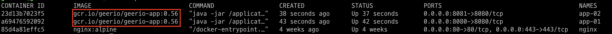

# 지리오 서비스 구축기 (3) Github Actions, Slack으로 CI/CD 구축하기


> 실제 개인 서비스 "지리오"를 만들면서 한 일을 기록한 문서입니다. 이 문서는 Github Actions와 Slack을 이용해서, CI/CD 환경을 구축하는 것에 대하여 다루고 있습니다.


## CI/CD 시나리오

내가 구성한 CI/CD 시나리오는 다음과 같다.


설명하자면, 개발자가 `Github` 레포지토리 마스터 브랜치에 코드 푸쉬 혹은 풀 리퀘스트를 머지했을 때, `Github Actions`가 정의된 워크플로우에 따라 CI/CD 작업을 진행한다. 작업 내용은 다음과 같다.

1. `Gradle`을 이용해서, 자바 코드를 테스트한 후 빌드하여, 실행 가능한 jar파일을 만든다.
2. jar파일 기반으로 도커 이미지를 빌드한다. 
3. 도커 레지스트리 `GCR`에 해당 이미지를 푸쉬한다.
4. SSH 연결 후, 서버인 `GCE`에 접속하여, 배포를 진행한다. 

그리고 이 과정들의 결과를 슬랙에 전송한다. (성공/실패와 상관 없이)


## Github Actions 워크플로우

`Github Actions` 워크 플로우를 정의한 파일은 다음과 같다.

```yml
name: Geeio CI-CD

# 마스터 브랜치에 푸쉬 혹은 풀리퀘스트가 요청되면, CI/CD 작업을 진행한다.
on:
  push:
    branches: [ master ]
  pull_request:
    branches: [ master ]

# 이 작업에 대한 환경 변수이다. project > settings 에서 만든 secrets 들을 참조한다.
env:
  PROJECT_ID: ${{ secrets.GCP_PROJECT_ID }}
  GCE_INSTANCE: ${{ secrets.GCE_INSTANCE_NAME }}
  GCE_INSTANCE_ZONE: ${{ secrets.GCE_INSTANCE_ZONE }}	
  GITHUB_TOKEN: ${{ secrets.GITHUB_TOKEN }} 
  SLACK_WEBHOOK_URL: ${{ secrets.SLACK_WEBHOOK_URL }} 

# 작업의 명세이다.
jobs:
  build:
    # 우분투 환경에서 이를 실행한다.
    runs-on: ubuntu-latest

    steps:
    # 현재 레포지토리 "master"를 체크아웃한다.
    - name: Checkout
      uses: actions/checkout@v2
    
    # Gcloud를 세팅한다.
    - name: Set up Gcloud
      uses: GoogleCloudPlatform/github-actions/setup-gcloud@master
      with:
          service_account_key: ${{ secrets.GCP_SA_KEY }}
          project_id: ${{ secrets.GCP_PROJECT_ID }}
          export_default_credentials: true
    
    # GCR 연결을 위해, 인증 작업을 실행한다.
    - name: Set Auth GCR 
      run: gcloud --quiet auth configure-docker
    
    # Java + Gradle 기반의 앱을 테스트 및 빌드한다. (=ci.sh)
    - name: Set up JDK 1.8
      uses: actions/setup-java@v1
      with:
        java-version: 1.8
         
    - name: Source Code Test And Build
      run: |
        chmod +x gradlew
        ./gradlew build
    
    # GCR에서 이전 버전을 참고하여 다음 버전을 만든 후, 이미지 빌드 및 푸쉬한다. (=cd-1.sh)
    - name: Build Docker Image And Delivery To GCR
      run: |
        IMAGE=${{ secrets.IMAGE }}
        INPUT=$(gcloud container images list-tags --format='get(tags)' ${IMAGE})
        TAGS=$(echo ${INPUT[0]} | awk -F ' ' '{print $1}')
        LATEST_TAG=$(echo ${TAGS[0]} | awk -F ';' '{print $1}')
        ADD=0.01
        VERSION=$(echo "${LATEST_TAG} $ADD" | awk '{print $1 + $2}')
        NEW_VERSION=$(printf "%.2g\n" "${VERSION}")
        echo ${NEW_VERSION}
        docker build --tag ${IMAGE}:${NEW_VERSION} .
        docker push ${IMAGE}:${NEW_VERSION}
        docker tag ${IMAGE}:${NEW_VERSION} ${IMAGE}:latest
        docker push ${IMAGE}:latest
    
    # SSH 접속을 통하여, 직접 배포를 실행한다. (=cd-2.sh)
    - name: Deploy to GCE
      uses: appleboy/ssh-action@master
      with:
        host: ${{ secrets.HOST }}
        username: ${{ secrets.USERNAME }}
        password: ${{ secrets.PASSWORD }}
        script: cd geerio-app && source deploy.sh
    
    # 작업의 결과를 슬랙에 전송한다.
    - name: Result to Slack
      uses: 8398a7/action-slack@v3
      with:
        status: ${{job.status}}
        fields: repo,message,commit,author,action,eventName,ref,workflow,job,took
        author_name: Geerio CI
      if: always()
```

위 워크플로우는 모든 것이 담겨져 있다. 각각의 작업마다 필요한 주석을 달아 놓았다. `Github Actions`에서 Java + Gradle 세팅, Gcloud 세팅, SSH 세팅, Slack 세팅, 각각의 세팅 방법은 참고 절에 나열된 문서들을 확인하길 바란다.

이 작업 이전에, `GCR`에 저장된 내 스프링 부트 앱의 도커 컨테이너의 버전(0.55)은 다음과 같다.


CI/CD 작업의 결과는 다음과 같다. (0.56)



사실, 베스트 프랙티스는 아니라서 많이 아쉽긴 하다. 하지만 나의 역량으론 이게 현재 최대치인거 같다. 돈이 많아서, GKE를 쓸 수 있었다면 훨씬 편했을텐데... 라는 생각이 들었다. 뭐 어찌됐건 이제 CI/CD 환경 구축이 끝났으니 본격적으로 개발을 시작하면 될 것 같다.


## 참고

참고 문헌이 많은 이유는 이걸 만들기 위해서 엄청난 삽질을 했기 때문이다. 진짜 어후... 다음은 그 삽질들을 길고한 문서들이다.

- Github Actions
  - [Java + Gradle](https://gurumee92.github.io/2020/10/github-actions-%EB%8B%AC%EA%B8%B0-java-gradle/)
  - [Gcloud](https://gurumee92.github.io/2020/10/github-actions-%EB%8B%AC%EA%B8%B0-google-compute-engine/)
  - [Slack](https://gurumee92.github.io/2020/10/github-actions-%EB%8B%AC%EA%B8%B0-slack/)
  - [SSH (문서 작성 중)]()
- GCP
  - [서비스 계정 생성](https://gurumee92.github.io/2020/10/gcp-%ED%94%84%EB%A1%9C%EC%A0%9D%ED%8A%B8%EC%97%90-%EC%84%9C%EB%B9%84%EC%8A%A4-%EA%B3%84%EC%A0%95-%EC%83%9D%EC%84%B1%ED%95%98%EA%B8%B0/)
  - [서비스 계정 키 생성](https://gurumee92.github.io/2020/10/gcp-%ED%94%84%EB%A1%9C%EC%A0%9D%ED%8A%B8%EC%97%90-service-account-key-%EC%83%9D%EC%84%B1%ED%95%98%EA%B8%B0/)
  - [SSH 방식으로 연결 (문서 작성 중)]()
