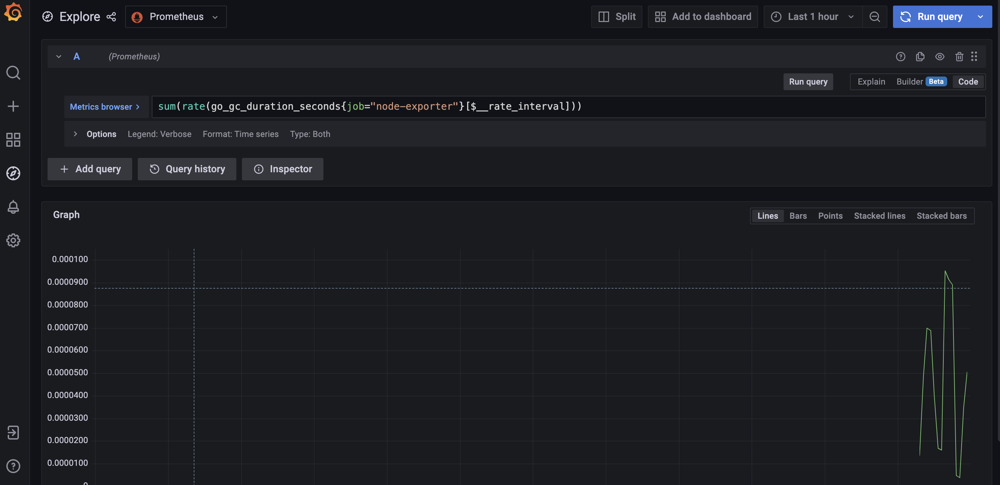
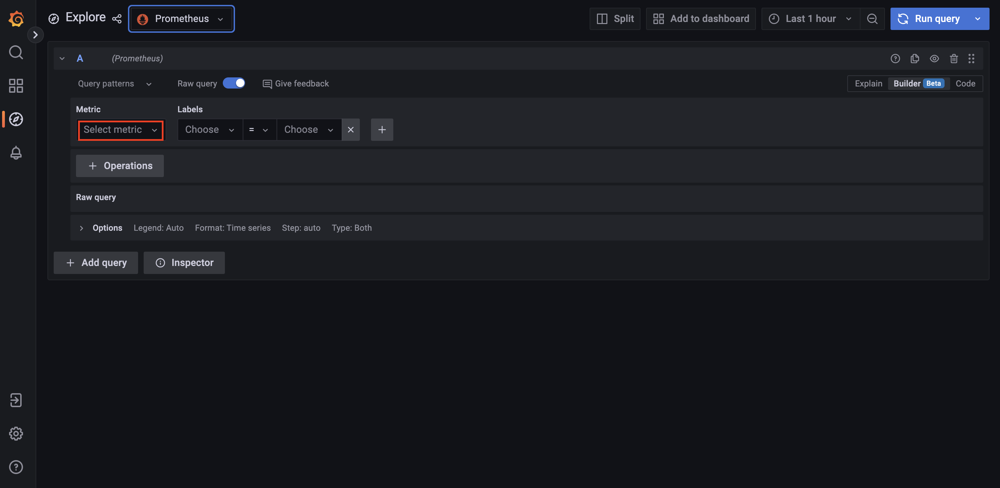
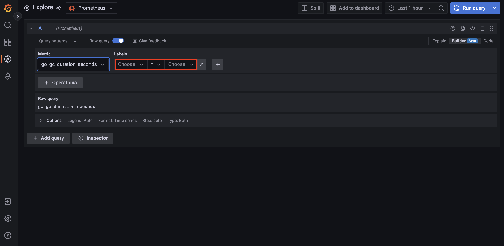
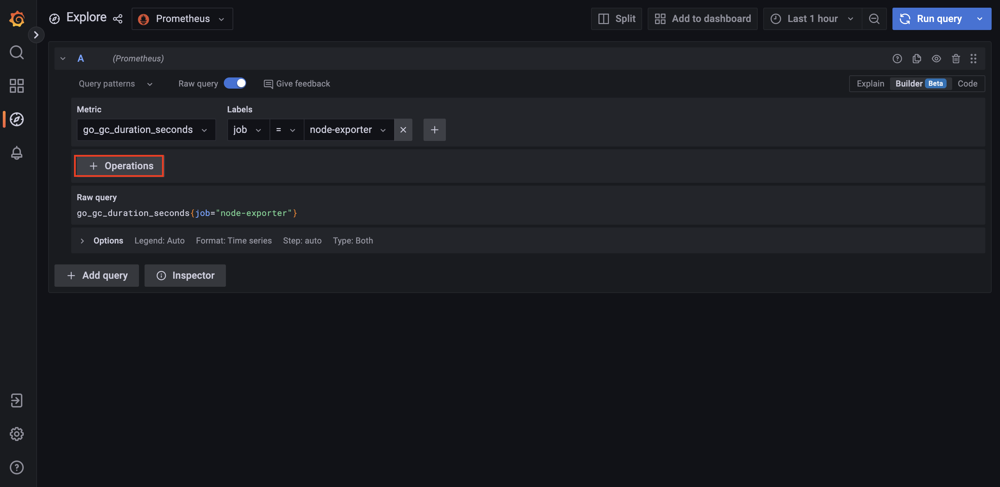
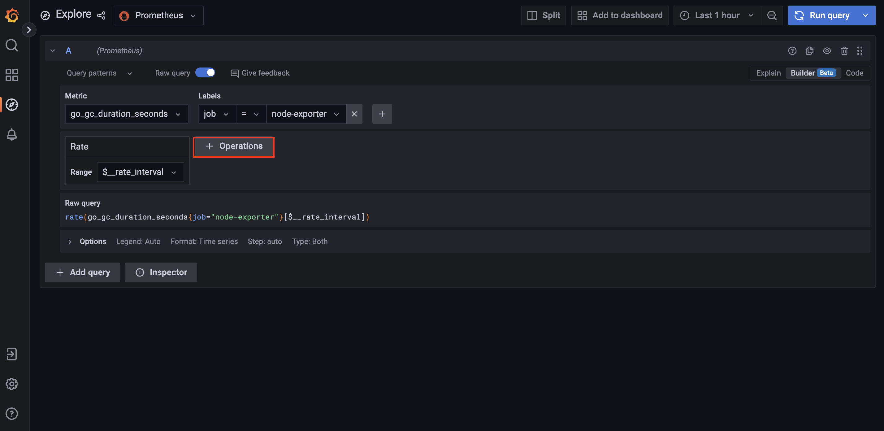
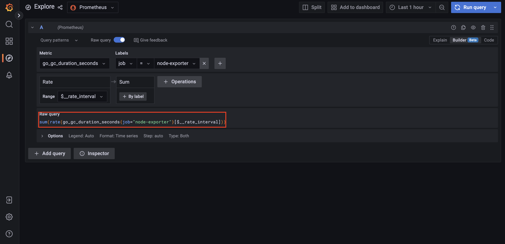
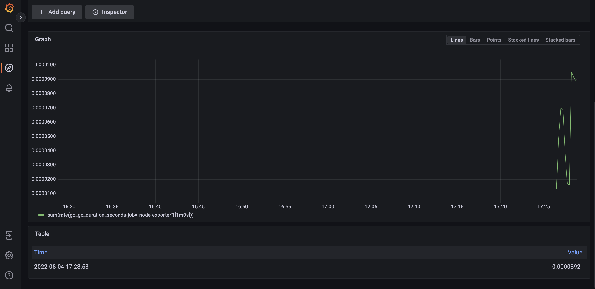
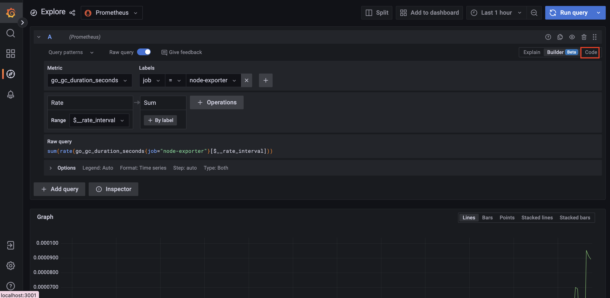
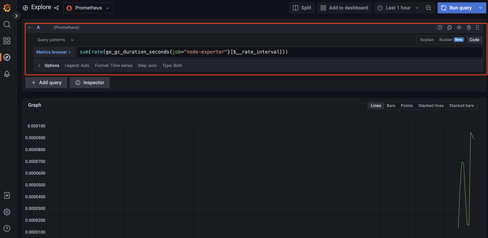

# 그라파나 9 새로운 기능 (1) Query Builder


최근 `Grafana 9` 버전이 출시되었습니다. 사용자들의 편의성을 위한 많은 기능들이 업데이트 및 생성되었습니다. 이 문서에서는 새로운 기능 중 하나인 **Query Builder**에 대해서 간단하게 알아보겠습니다.

## 그라파나 9 이전에 쿼리하는 방법

예를 들어서 다음 쿼리를 `Grafana`를 통해서 조회한다고 해봅시다.

```
sum(rate(go_gc_duration_seconds{job="node-exporter"}[$__rate_interval]))
```

`Grafana 9` 이전 버전에서는 "Explore"를 탭에서 쿼리를 하는 UI는 다음과 같습니다.



기존 `Grafana 8`에서는 사용자가 하나 하나 쿼리를 모두 입력해야하는 불편함이 있었습니다.(물론 자동 완성 기능으로 어느 정도 커버가 가능합니다.) 

## 그라파나 9 에서 쿼리하는 방법 (1) Query Builder 

`Grafana 9` 버전부터는 `Query Builder`를 통해서 보다 쉽고 정확하게 그라파나를 통해서 데이터를 쿼리할 수 있습니다. (아직 "베타" 기능인게 함정.)  지금부터 `Grafana 9`에서 제공하는 `Query Builder`를 통해서 데이터를 조회하는 방법에 대해서 차근 차근 살펴보도록 하죠.

이제 "Explore" 탭으로 이동합니다. 그 후 아래 그림처럼 "Metric" 아래 드랍다운 UI에서 원하는 메트릭을 지정합니다.



그 후 필터링이 필요하다면 "Labels"에서 원하는 레이블과 값을 지정하면 됩니다. 이 문서에서는 1개만 지정하지만, 여러 개를 지정해줄 수 있습니다.



그 다음 집계 및 연산을 원한다면 "+ Operations"를 클릭합니다. 첫 연산 식으로는 "Range functions"의 "Rate"를 선택했습니다. 



두번째 연산 식으로는 "Aggregate"의 "Sum"을 선택했습니다. 



짜잔! 이렇게 조회하고 싶은 쿼리를 손쉽게 만들었습니다.



쿼리의 결과는 이전 UI와 마찬가지로 아래 그림처럼 나타납니다.



## 그라파나 9 에서 쿼리하는 방법 (2) 기존 방식 그대로

물론 직접 쿼리를 작성하는게 편하시다면 왼쪽 상단에 "Code"를 클릭하여 기존 방식처럼 쿼리할 수 있습니다.



그럼 이전 `Grafana 9` 이전 방식에서 쿼리를 작성했던 것처럼 직접 작성할 수 있는 UI를 확인할 수 있습니다.



## 참고

* [그라파나 공식 문서 - "Que (1)ry management in Explore"](https://grafana.com/docs/grafana/latest/explore/query-management/#query-management-in-explore)
* [그라파나 공식 블로그 문서 -  (1)"Grafana 9.0: Prometheus and Grafana Loki visual query builders, new navigation, improved workflows, heatmap panels, and more!"](https://grafana.com/blog/2022/06/14/grafana-9.0-release-oss-and-cloud-features/)