# 그라파나의 새로운 기능 (2) Unified Alerting

최근 `Grafana 9` 버전이 출시되었습니다. 사용자들의 편의성을 위한 많은 기능들이 업데이트 및 생성되었습니다. 특히 알람 설정 관련해서 많은 것들이 업데이트가 되었습니다. 원래는 `ngalert(new generation alert)`라는 이름의 실험적인 기능이었으나 9버전 부터는 `unified alerting`이라는 이름으로 정식 기능으로 추가되었습니다. 이 문서에서는 새로운 알람 기능인 **unified alerting**에 대해서 간단하게 알아보겠습니다.

## 알람 상황

먼저 다음 그림의 인프라가 구성되었다고 가정하겠습니다.

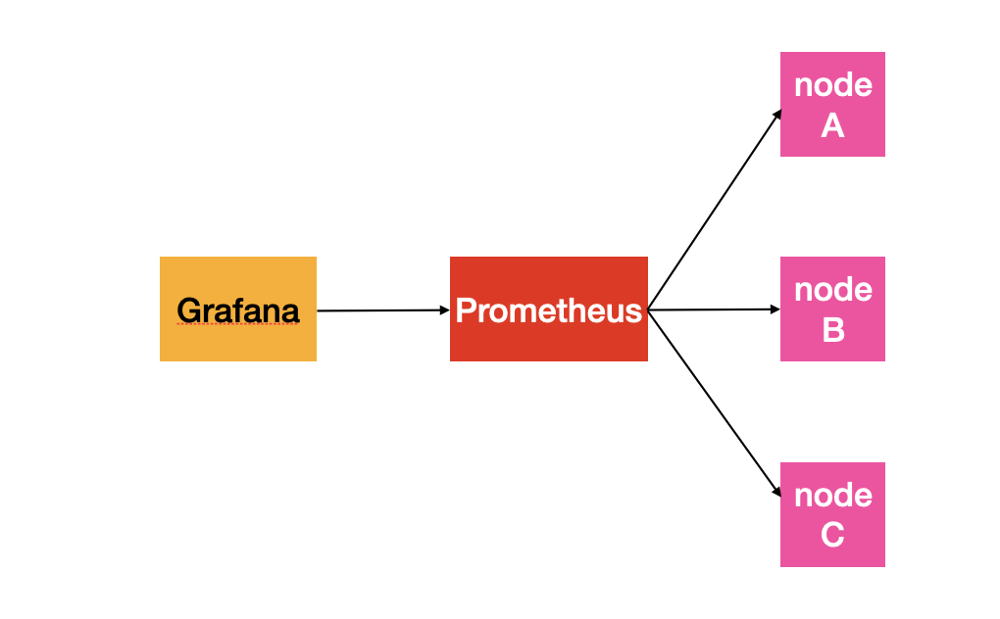

각 노드에는 노드의 상태를 나타내는 메트릭을 수집하기 위해서 `node-exporter`가 설치되어 있고 `prometheus`에 그 메트릭들이 저장됩니다. 그리고 `grafana`를 통해서 메트릭을 조회할 수 있죠.

이 때, 각 노드 중 1대라도 다운이 됐을 때, 슬랙 채널을 통해서 알람을 받고 싶은 상황입니다. 이전 그라파나 버전에서는 `contact point`와 대시보드를 생성한 후, 대시보드 안에서 패널을 만들어서 해당 패널에서 알람을 설정하고 `contact point`를 연결해주어야 했습니다. 지금부터는 새로운 알람 기능인 `unified alerting`을 이용하여 알람을 설정해보겠습니다.

## contact point 정의

`contact point`란 사용자가 발생된 알람을 확인할 수 있는 "목적지"라고 생각하면 됩니다. 예를 들어서, 사용자의 메일, 옵스지니, 슬랙 등이 있습니다. 이 문서에서는 슬랙 채널에 알람을 보낼 수 있게끔 `contact point`를 생성해보도록 하겠습니다.

먼저 왼쪽 탭에서 알람 모양의 아이콘을 클릭해줍니다.

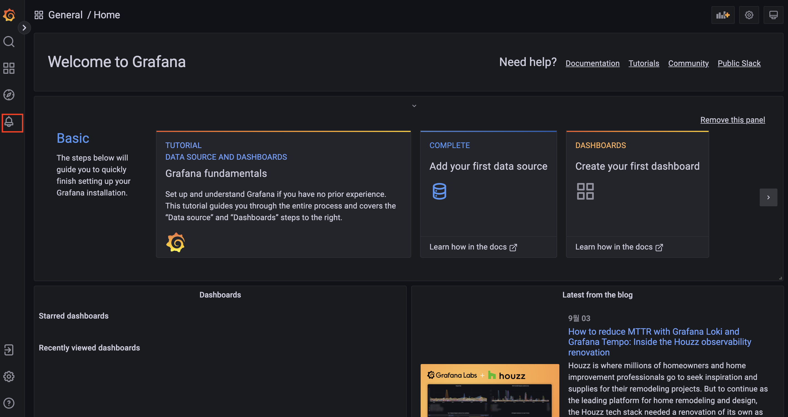

그 후 두 번째 항목인 "Contact points"를 클릭합니다.

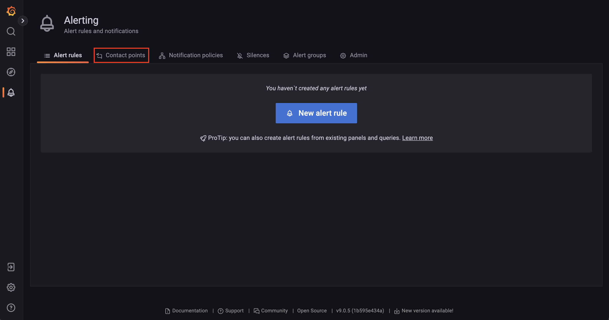

이제 "New Contact point"를 클릭합니다.

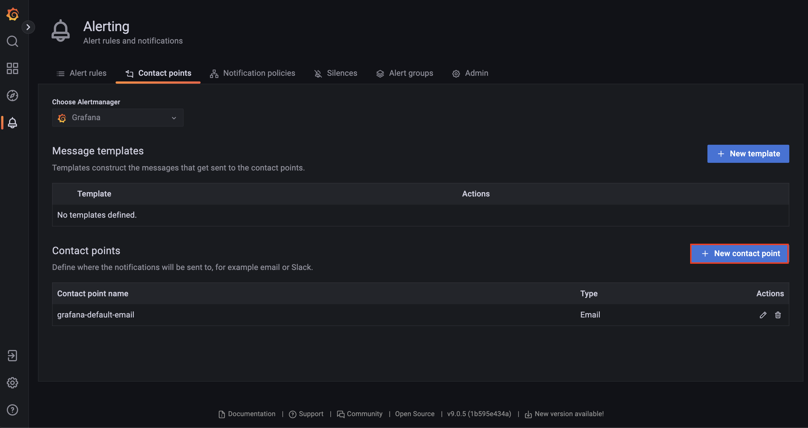

그 후 "Name" 밑에 이름을 설정하고, "Contact point type"에서 "Slack"을 설정합니다. 그 후, "Webhook URL"에 자신의 슬랙앱의 웹훅 URL을 설정해줍니다. 아래 그림처럼 입력 값을 모두 채웠다면 하단에 "Save contact point"를 클릭합니다.

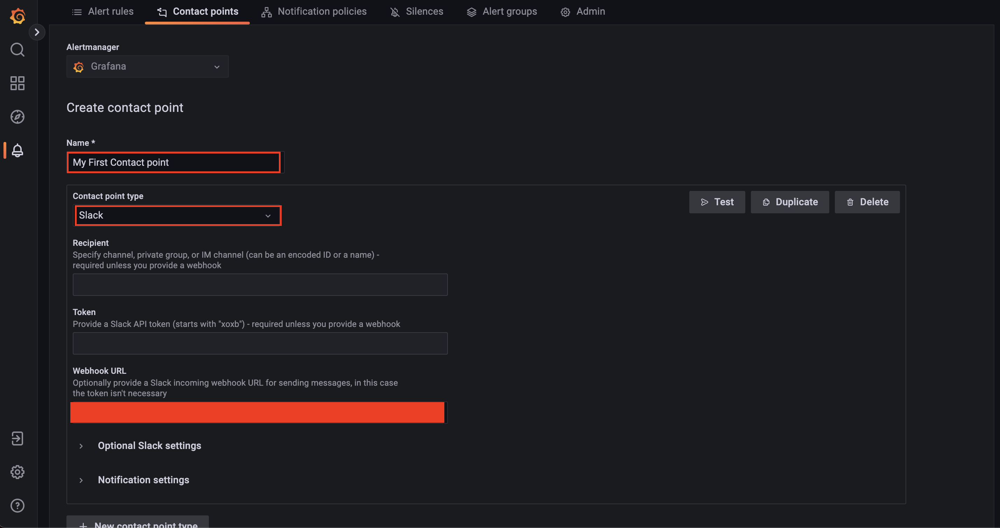

그러면 우리가 생성한 `contact point`가 잘 보일 것입니다.

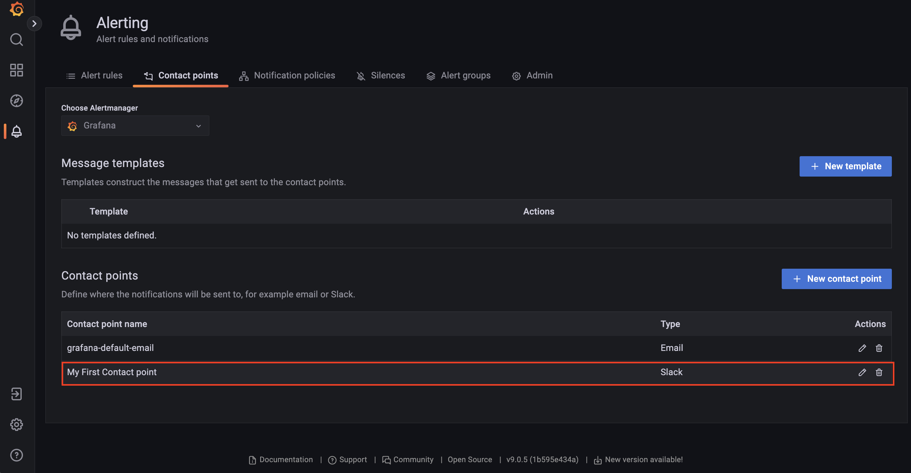

## notification policy 정의

`notification policy`란 일종의 분기점으로 생각하면 됩니다. 알람 객체가 생성되면, 사용자가 설정한 `labels` 키-값 쌍으로 필터링된 객체를 `contact point`에게 전달하는 역할을 합니다. 

먼저 왼쪽 탭에서 알람 모양의 아이콘을 클릭해줍니다.

그 후 세 번째 항목인 "Notification policies"를 클릭합니다.

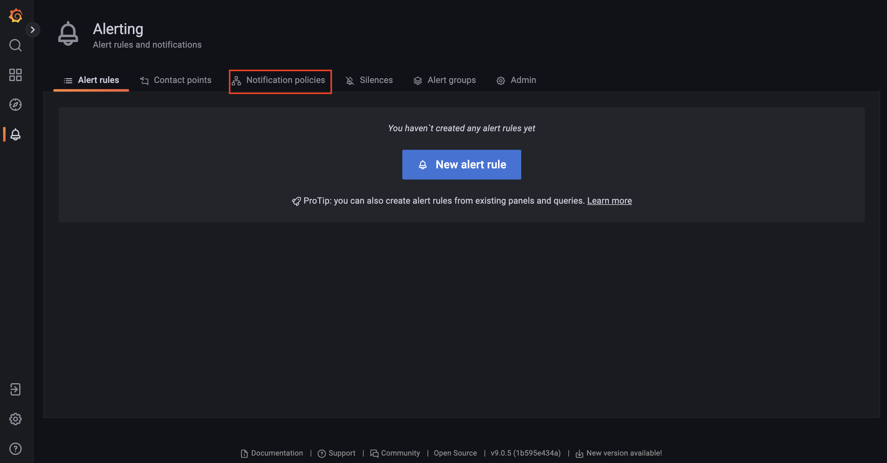

하단의 "New specific policy"를 클릭합니다. 

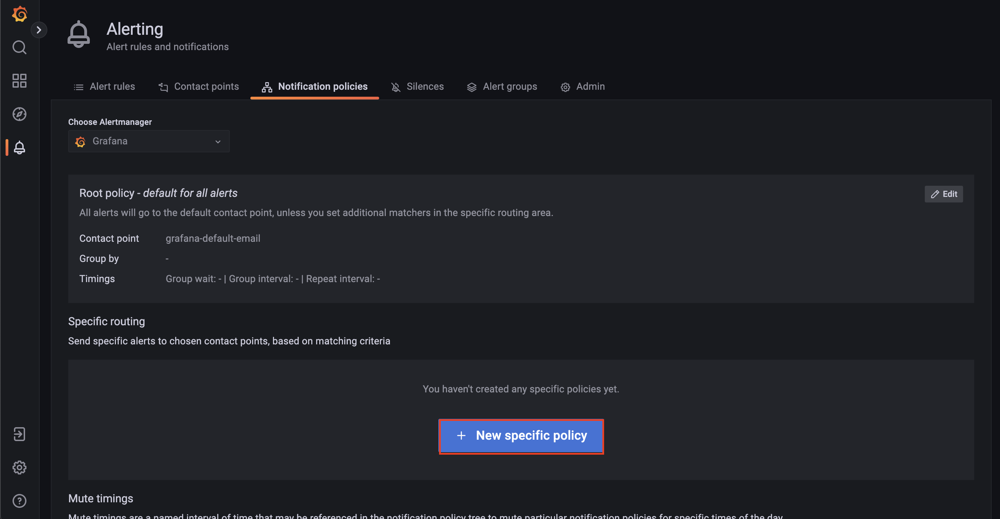

그 후 "Add matcher"를 클릭합니다.

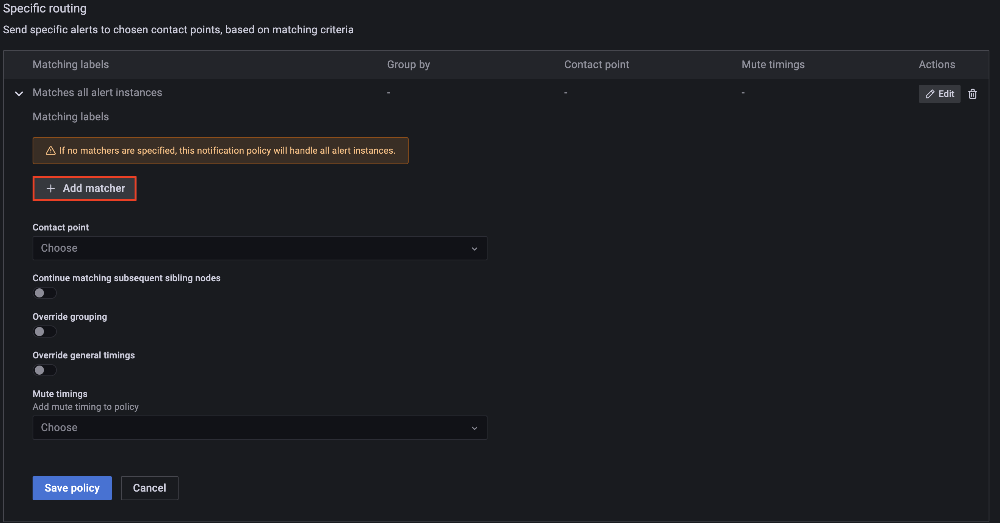

원하는 레이블들을 설정합니다. 여기서는 `environment=test`, `job=node-exporter`를 설정해주었습니다.

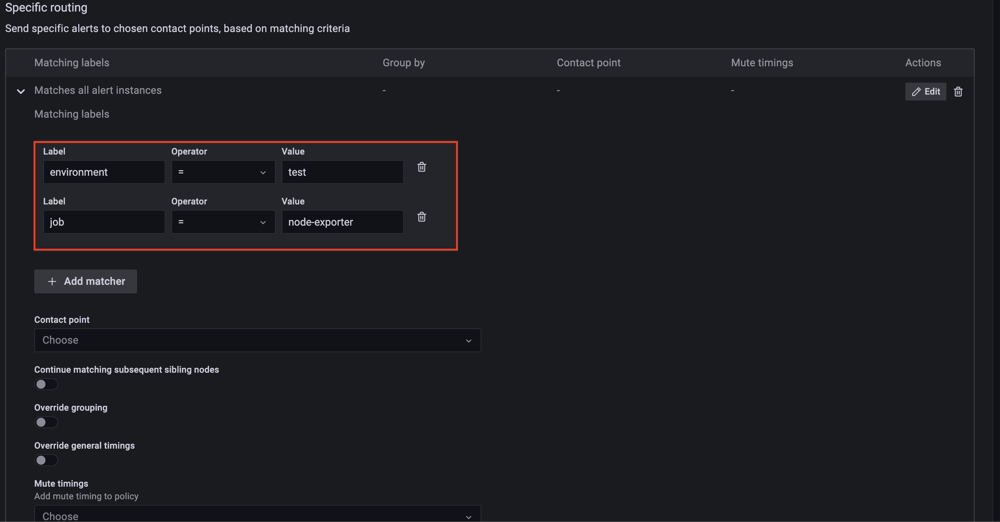

그 후 이전 절에서 생성한 `contact point`를 지정해준 후 "Save policy"를 클릭합니다.

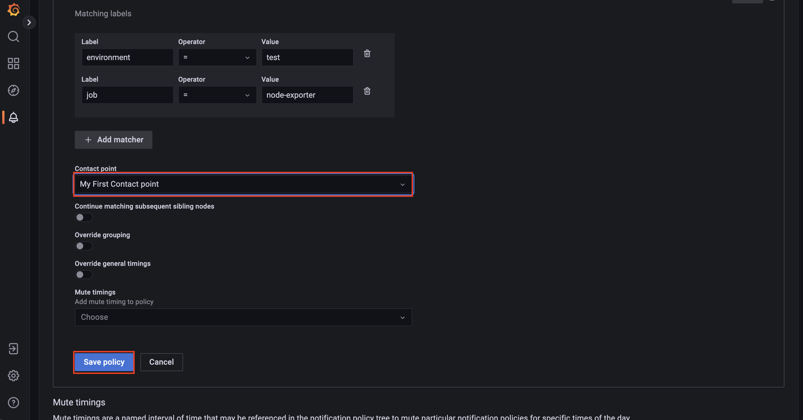

그러면 생성한 `notification policy`를 확인할 수 있습니다.

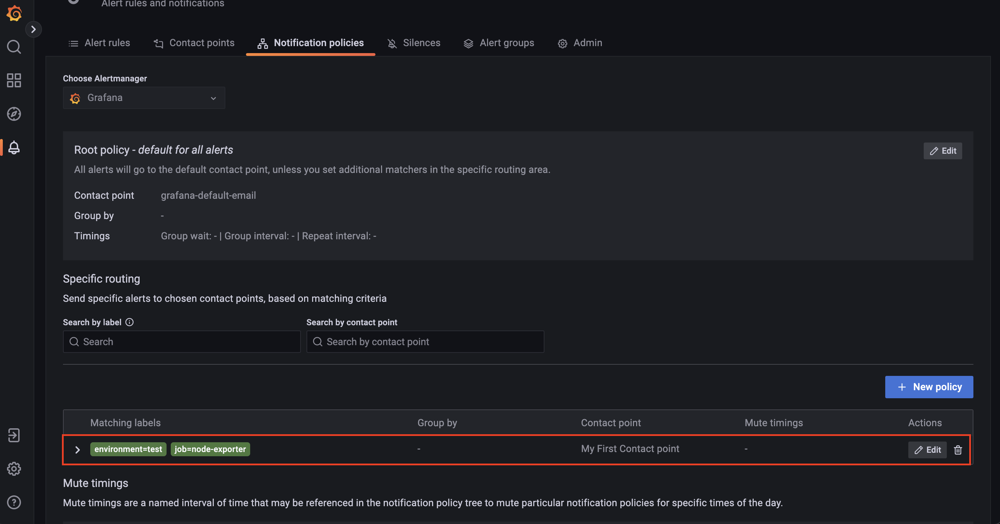

참고로 이미 "Root policy"가 설정된 것이 보이는데, 알람 객체에서 사용자가 생성한 `notification policy`들 중 일치하는 레이블이 없다면 모든 알람 객체들은 이 `notification policy`를 거치게 됩니다. 

## alert rule 정의

먼저 왼쪽 탭에서 알람 모양의 아이콘을 클릭해줍니다.

## 참고

* [그라파나 공식 블로그 - "Grafana Alerting: Explore our latest updates in Grafana 9"](https://grafana.com/blog/2022/06/14/grafana-alerting-explore-our-latest-updates-in-grafana-9/)
* [그라파나 공식 문서 - alerting](https://grafana.com/docs/grafana/latest/alerting/)