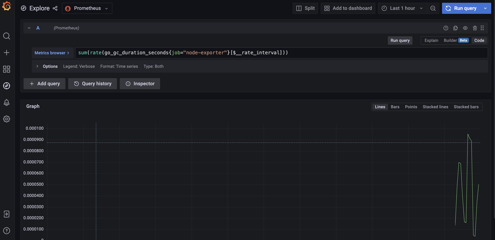
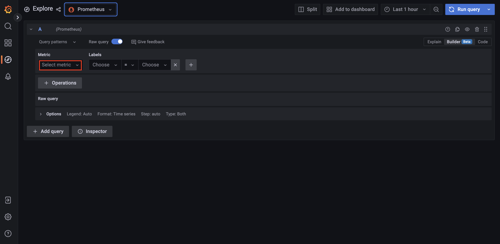
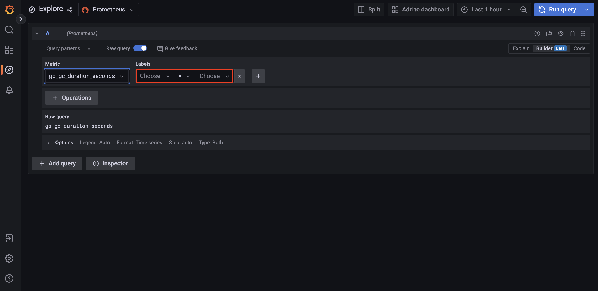
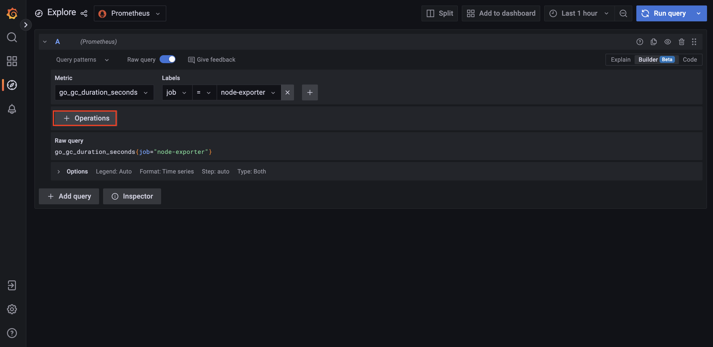
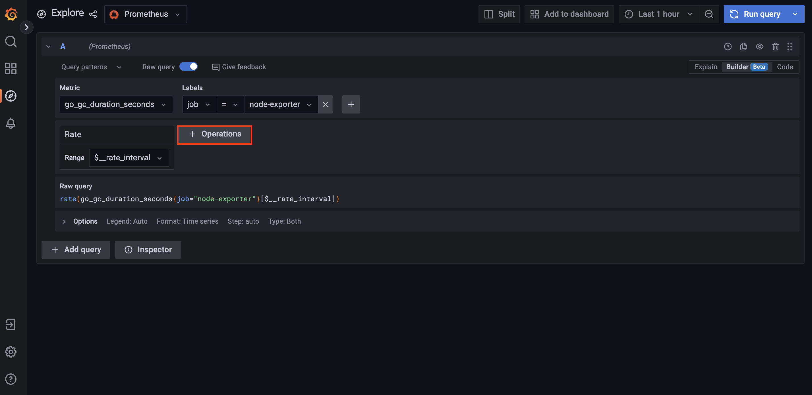
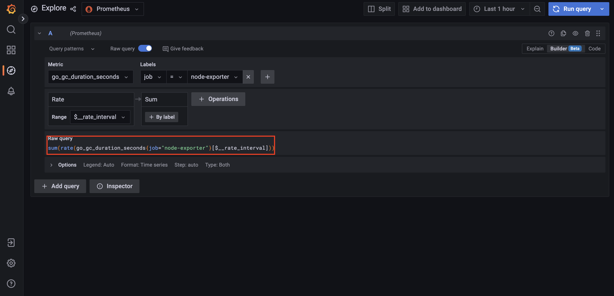
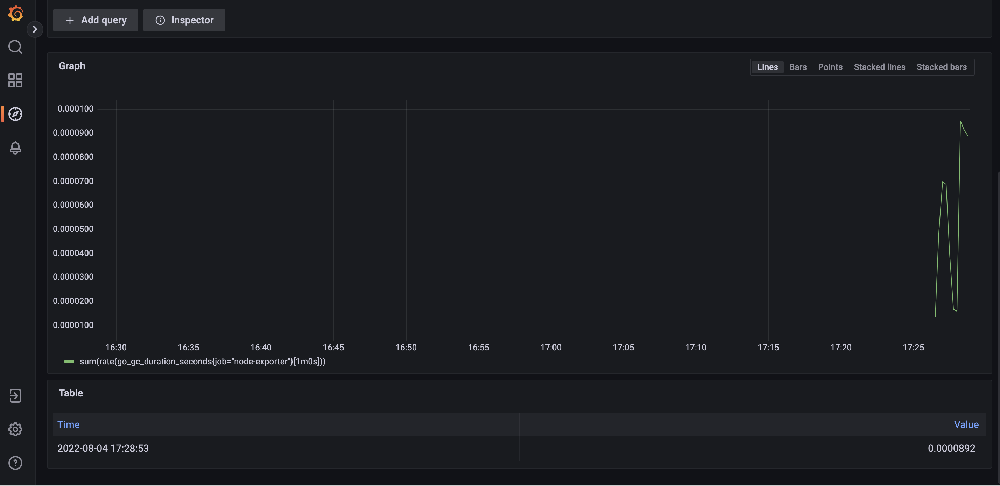
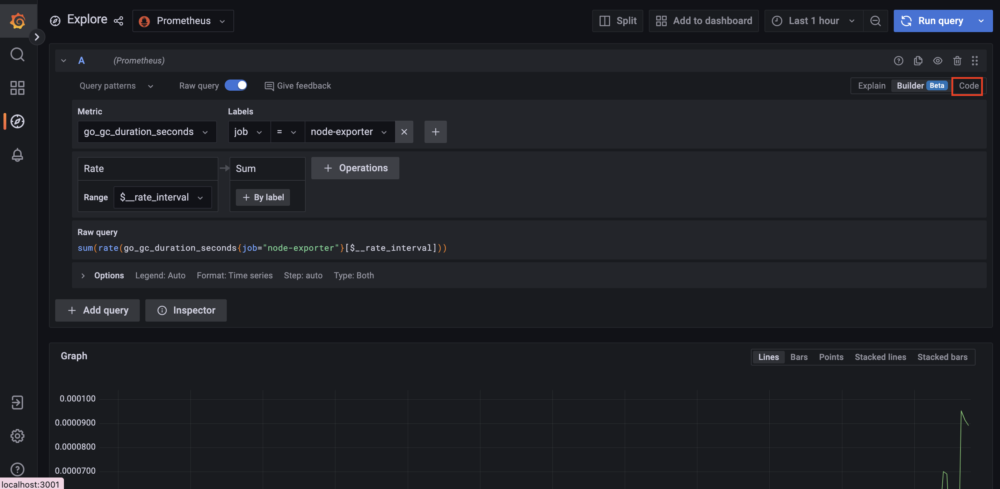
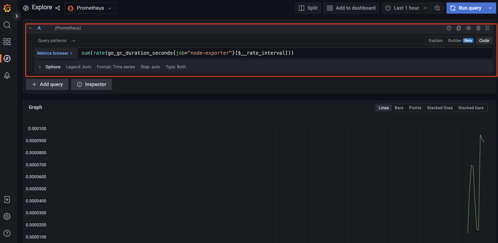

# 그라파나 9 새로운 기능


최근 `Grafana 9` 버전이 출시되었습니다. 많은 기능들이 업데이트 되었지만, 여기서는 크게 바뀐 2가지 기능을 살펴봅니다.

  - [Query Builder](#query-builder)
  - [Unified Alerting](#unified-alerting)
  - [참고](#참고)

## Query Builder

`Query Builder`는 보다 쉽게 그라파나를 통해서 데이터를 쿼리할 수 있는 새로운 기능입니다. 예를 들어 다음 쿼리를 `Grafana`를 통해서 조회한다고 해봅시다.

```
sum(rate(go_gc_duration_seconds{job="node-exporter"}[$__rate_interval]))
```

`Grafana 8`에서는 "Explore"를 탭에서 쿼리를 하는 UI는 다음과 같습니다.



기존 `Grafana 8`에서는 사용자가 하나 하나 쿼리를 모두 입력해야 했습니다. 이제 `Grafana 9`에서 제공하는 `Query Builder`를 통해서 데이터를 조회해보곘습니다. 

동일하게 "Explore" 탭으로 이동합니다. 그 후 아래 그림처럼 "Metric" 아래 드랍다운 UI에서 원하는 메트릭을 지정합니다.



그 후 필터링이 필요하다면 "Labels"에서 원하는 레이블과 값을 지정하면 됩니다. 이 문서에서는 1개만 지정하지만, 여러 개를 지정해줄 수 있습니다.



그 다음 집계 및 연산을 원한다면 "+ Operations"를 클릭합니다. 첫 연산 식으로는 "Range functions"의 "Rate"를 선택했습니다. 



두번째 연산 식으로는 "Aggregate"의 "Sum"을 선택했습니다. 



짜잔! 이렇게 조회하고 싶은 쿼리를 손쉽게 만들었습니다.



쿼리의 결과는 이전 UI와 마찬가지로 아래 그림처럼 나타납니다.



물론 직접 쿼리를 작성하는게 편하시다면 왼쪽 상단에 "Code"를 클릭하면 됩니다.



그럼 이전 `Grafana 8`처럼 직접 작성할 수 있는 UI를 확인할 수 있습니다.



## Unified Alerting

## 참고