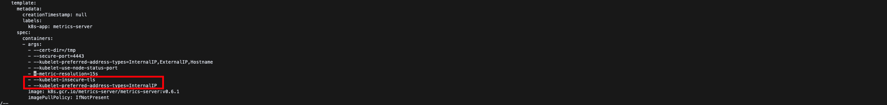

# 쿠버네티스에서 metrics-server 구성하기


## 개요

쿠버네티스 클러스터를 운영하다보면 파드, 노드들의 리소스들을 확인해야 할 때가 정말 빈번하게 일어납니다. 이럴 때, 유용한 명령어로 `kubectl top` 명령어가 있습니다. 한, 번 명령어를 입력해볼까요?
```bash
$ kubectl top po
error: Metrics API not available
```

위 로그를 확인할 수 있듯이 아쉽게도 기본적으로 제공되는 것은 아닙니다. 쿠버네티스 클러스터에 `metrics-server`라는 컴포넌트를 추가적으로 설치해주어야 합니다. 이 문서에서는 쿠버네티스 클러스터 `minikube` 환경에서 `metrics-server`를 구성하는 것에 대하여 다룹니다.

## metrics-server 구성하기

먼저 다음 명령어를 이용하여 `metrics-server`를 설치할 수 있습니다.
```bash
$ kubectl apply -f https://github.com/kubernetes-sigs/metrics-server/releases/latest/download/components.yaml
serviceaccount/metrics-server created
clusterrole.rbac.authorization.k8s.io/system:aggregated-metrics-reader created
clusterrole.rbac.authorization.k8s.io/system:metrics-server created
rolebinding.rbac.authorization.k8s.io/metrics-server-auth-reader created
clusterrolebinding.rbac.authorization.k8s.io/metrics-server:system:auth-delegator created
clusterrolebinding.rbac.authorization.k8s.io/system:metrics-server created
service/metrics-server created
deployment.apps/metrics-server created
apiservice.apiregistration.k8s.io/v1beta1.metrics.k8s.io created
```

설치가 됐으니 한 번 `kubectl top` 명령어를 사용해볼까요?
```bash
$ kubectl top po
Error from server (ServiceUnavailable): the server is currently unable to handle the request (get pods.metrics.k8s.io)

$ kubectl top no
Error from server (ServiceUnavailable): the server is currently unable to handle the request (get nodes.metrics.k8s.io)
```

이런.. 아직도 정상적으로 실행이 안됩니다. 왜 그런 것일까요? 한 번 로그를 살펴봅시다.  
```bash
$ kubectl logs -n kube-system metrics-server-64cf6869bd-l9lmp
...
I0825 12:20:36.015508       1 server.go:187] "Failed probe" probe="metric-storage-ready" err="no metrics to serve"
I0825 12:20:38.629536       1 server.go:187] "Failed probe" probe="metric-storage-ready" err="no metrics to serve"
```

`metrics-server`는 기본적으로 `kube-api-server`와 https 통신을 통하여 노드/파드의 리소스들을 얻습니다. 하지만 `minikube`로 구성된 쿠버네티스 클러스터는 `kube-api-server`가 https 통신을 지원하지 않는 것으로 추정됩니다. 

따라서 `metrics-server` 역시 https 통신을 하지 않도록 구성을 해주면 됩니다. 다음 명령어를 통해서, `metrics-server`에 전달하는 args를 수정합니다. 
```bash
$ kubectl edit deployments.apps -n kube-system metrics-server 
```

아래 그림처럼 다음 옵션들을 추가해줍니다.

* --kubelet-insecure-tls
* --kubelet-preferred-address-types=InternalIP



## kubectl top 명령어 사용해보기

`metrics-server`가 쿠버네티스 클러스터에 정상적으로 설치가 되었다면 `kubectl top` 명령어가 활성화가 됩니다. 파드 단위의 리소스들을 모니터링하고 싶다면 `kubectl top po`를 이용하면 됩니다. 다만 네임스페이스 단위로 리소스들을 확인할 수 있습니다.
```bash
$ kubectl top po -n kube-system
NAME                               CPU(cores)   MEMORY(bytes)
coredns-78fcd69978-s5l6w           3m           11Mi
etcd-minikube                      30m          29Mi
kube-apiserver-minikube            126m         292Mi
kube-controller-manager-minikube   41m          43Mi
kube-proxy-2bzll                   2m           10Mi
kube-scheduler-minikube            5m           14Mi
metrics-server-7f6fdd8fc5-wzq5v    5m           13Mi
storage-provisioner                3m           8Mi
```

또한, `kubectl top no` 명령어를 사용하여 노드 단위의 리소스들을 확인할 수 있습니다.
```bash
$ kubectl top no
NAME       CPU(cores)   CPU%   MEMORY(bytes)   MEMORY%
minikube   275m         6%     610Mi           3%
```

## 참고

* [metrics-server Github Repository](https://github.com/kubernetes-sigs/metrics-server)
* [삵 블로그 - minikube에 metrics-server 설치](https://sarc.io/index.php/forum/tips/6747-minikube-metrics-server)