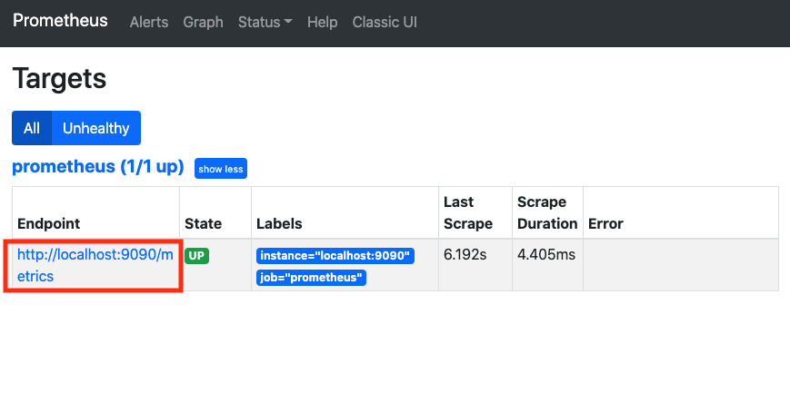

# 프로메테우스 시작하기


> 책 "프로메테우스 오픈소스 모니터링 시스템"을 읽고 정리한 문서입니다.

## 요구 사항

이번 문서를 진행하기 위한 나의 환경은 다음과 같다.

- RedHat/CentOS 기반 운영체제
- 포트 9090에, http 접근 허용

레드햇 계열 리눅스와 `CentOS`는 이 문서가 `Prometheus`를 포함한 모니터링 시스템을 구축하는데 도움이 될 것이다. (아마 다른 운영체제도 비슷할 것이다.) 자 시작해보자.


## 프로메테우스 설치

`Promethues`는 [이 곳](https://prometheus.io/download/)에서 단일 파일로 설치할 수 있다. 터미널에 다음을 입력한다.

```bash
$ pwd
/home/ec2-user

# 나는 설치한 앱들을 이 곳에서 관리한다.
$ cd apps

# 프로메테우스 바이너리 파일이 들어 있는 압축 파일 설치
$ wget https://github.com/prometheus/prometheus/releases/download/v2.22.0/prometheus-2.22.0.linux-amd64.tar.gz

# 압축 파일 해제
$ tar zxvf prometheus-2.22.0.linux-amd64.tar.gz

# 프로메테우스 디렉토리 간소화
$ mv prometheus-2.22.0.linux-amd64 prometheus

# 프로젝트 디렉토리 이동
$ cd prometheus

# 프로메테우스 실행
$ ./prometheus
```

이제 `서버 IP 주소:포트`로 이동하면, 다음 화면을 확인할 수 있다.


이제 프로메테우스를 서비스로 등록해보자. 먼저 `vim` 에디터로 다음 파일을 만든다.

```bash
$ sudo vim /etc/systemd/system/prometheus.service
```

이제 "i"를 누르고 다음을 입력한다.

```service
[Unit]
Description=Prometheus Server

[Service]
Restart=on-failure

#Change this line if you download the
#Prometheus on different path user
ExecStart=/home/ec2-user/apps/prometheus/prometheus \
  --config.file=/home/ec2-user/apps/prometheus/prometheus.yml \
  --storage.tsdb.path=/home/ec2-user/apps/prometheus/data

[Install]
WantedBy=multi-user.target
```

이제 "esc"를 누르고 ":wq!"를 입력한다. 그 후 터미널에 다음을 입력한다.

```bash
# 서비스 데몬 리로딩
$ sudo systemctl daemon-reload

# prometheus 서비스 시작
$ sudo systemctl start prometheus

# prometheus 서비스 상태 확인
$ sudo systemctl status prometheus
● prometheus.service - Prometheus Server
   Loaded: loaded (/etc/systemd/system/prometheus.service; disabled; vendor preset: disabled)
   Active: active (running) since 수 2020-11-04 09:04:14 UTC; 4s ago
...
```

다시 `서버 IP 주소:포트`로 이동하면, 다음 화면을 확인할 수 있다.


`Prometheus` 서버는 지정한 `prometheus.yml`을 참조하여, 기본 값들을 설정하고 서버를 실행시킨다. 기본 설정값은 다음과 같다.

```yml
# my global config
global:
  scrape_interval:     15s 
  evaluation_interval: 15s 

# Alertmanager configuration
alerting:
  alertmanagers:
  - static_configs:
    - targets:
      # - alertmanager:9093

rule_files:
  # - "first_rules.yml"
  # - "second_rules.yml"


scrape_configs:
  - job_name: 'prometheus'
    static_configs:
    - targets: ['localhost:9090']
```

이는 15초에 1번씩 프로메테우스의 상태 데이터를 수집한다는 뜻과 같다.


실제로 이를 확인하기 위헤서 위 그림과 같이 웹 브라우저 상에서 Status > Targets를 클릭해보자.



그럼 위의 그림과 같은 화면을 확인할 수 있다. 이번에는 "Endpoint"를 클릭해보자. (안된다면, "IP 주소:port/metrics"로 이동하면 된다.)


그럼 위의 화면을 확인할 수 있다. 이제 다시 메인페이지로 돌아와서 입력 창에 "up"을 쳐보자.


이런 식으로 수식 브라우저를 통해서 몇 개의 메트릭들의 값을 확인할 수 있다. 또한, "Table" 오른쪽에 "Graph"를 눌러보면, 해당 메트릭에 대한 그래프를 확인할 수 있다.

`Prometheus`는 자체적으로 UI를 제공하긴 하지만, `Grafana`
를 연동하면, 더 멋진 대시보드를 꾸밀 수 있다. 그래서 애는 이 정도로만 알고 가자.


## 노드 익스포터 설치 및 프로메테우스 연동

## 알림 매니저 설치 및 프로메테우스, 슬랙 연동