# Github Actions 달기 (Slack)

<center>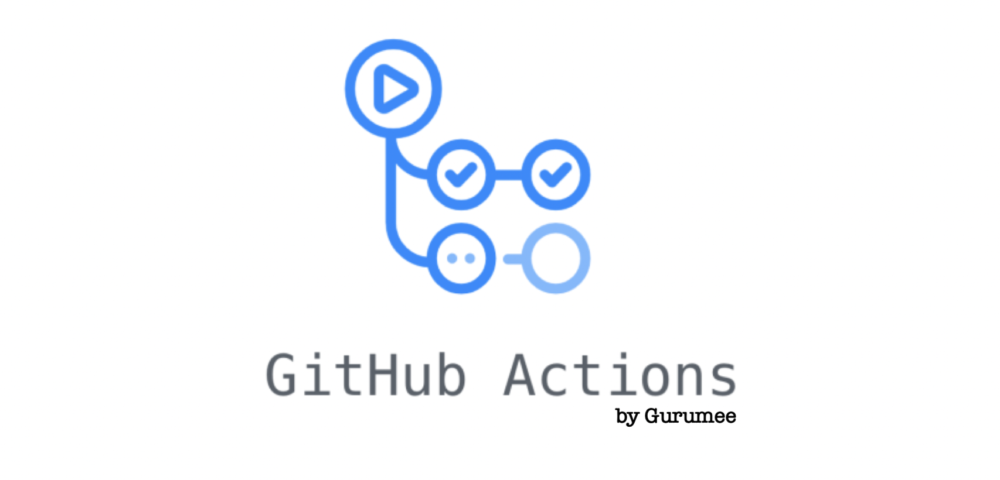</center>

> Github Actions를 사용하면서 정리한 문서입니다. 이 문서는 Java + Gradle 테스트 및 빌드 후 결과를 "Slack"으로 보내주는 것에 대하여 다루고 있습니다.

## 요구 사항

먼저, `Java + Gradle` 기반의 프로젝트가 필요하다. 또한, 슬랙에 가입되어 있고 워크스페이스 및 결과를 전송할 채널이 있어야 한다. 다음을 참고하라.

* [Github Actions 달기 (Java + Gradle)](https://gurumee92.github.io/2020/10/github-actions-%EB%8B%AC%EA%B8%B0-java-gradle/)
* [슬랙 공식 홈페이지](https://slack.com/intl/ko-kr/)


## 슬랙 앱 만들기

먼저, 다음이 되어 있다고 가정한다.

* 슬랙에 가입되어 있다.
* 자신이 속한 슬랙 워크스페이스가 있다.
* 자신이 결과를 전송할 채널이 있다.

일단 결과를 보내게 하기 위해서는, 해당 채널에 APP이 생성되어야 한다. [다음](https://api.slack.com/apps)으로 이동한다.

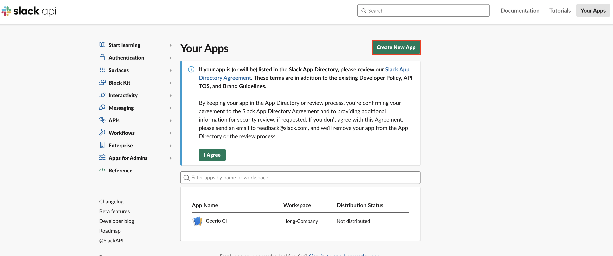

그럼 다음 화면이 뜨는데 오른쪽 상단에 "Create New App"을 누른다.

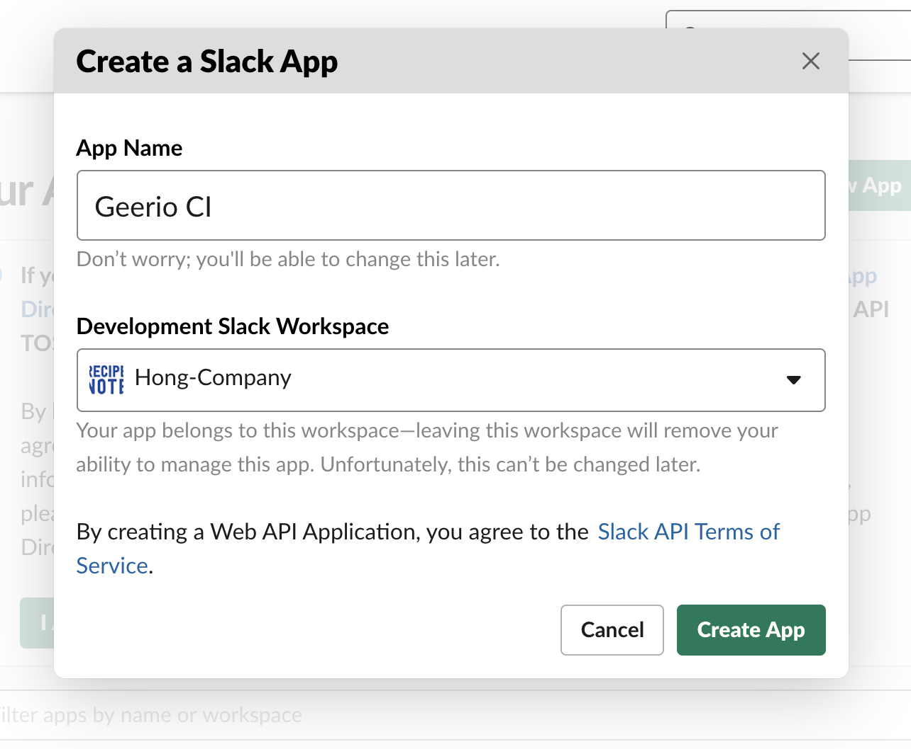

그럼 다음 팝업 창이 뜨는데, "App Name" 밑에는 원하는 이름 쓰고, "Development Slack Workspace"에는 연결할 워크페이스를 선택한다.

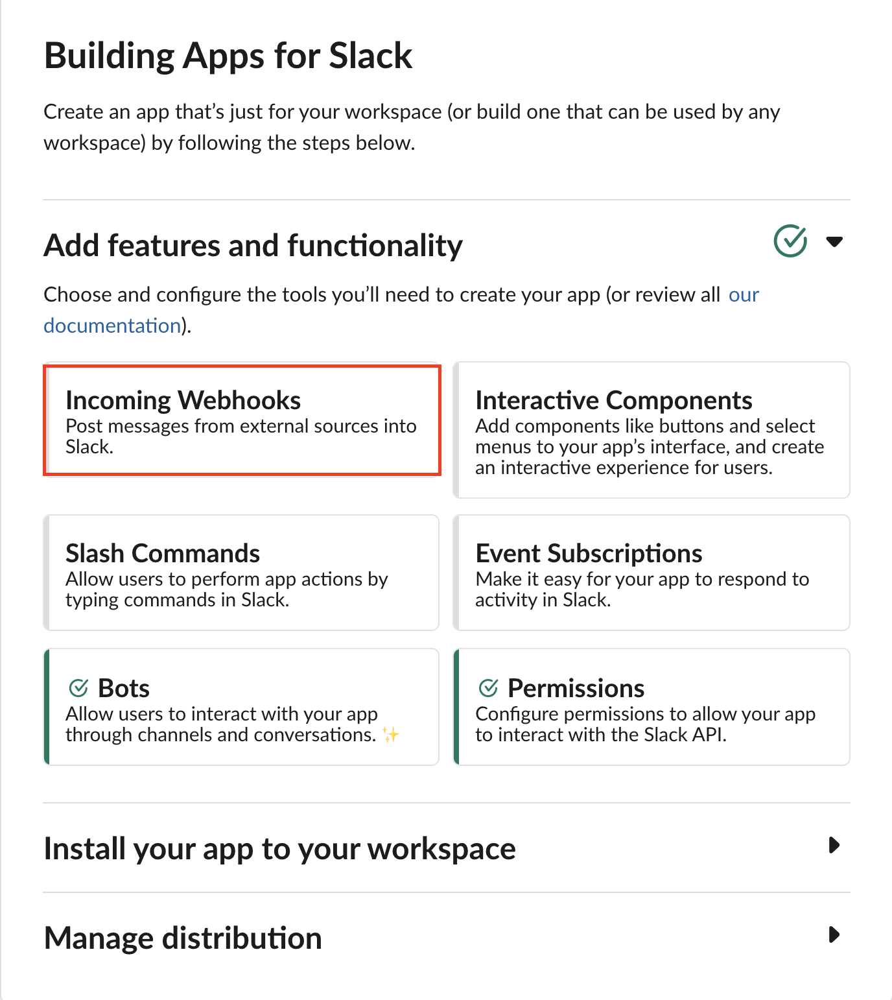

그 다음, "Incoming Webhooks"를 누른다. 이 과정에 대해서 조금 짚고 넘어가자면, 생성하는 앱에 웹 훅을 추가하면, 해당 슬랙 채널에 결과를 던질 수 있는 API URL이 생성된다. 추후, `Github Actions`가 이 URL을 이용하는 것이다.

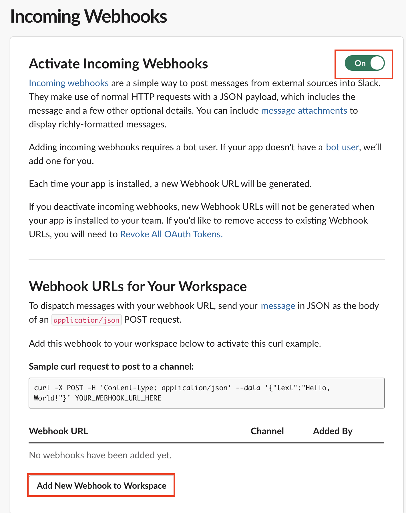

그 다음, 우측 상단에 토글 창을 눌러 위와 같이 "On"으로 바꿔준 후 "Add New Webhook to Workspace"를 눌러준다.

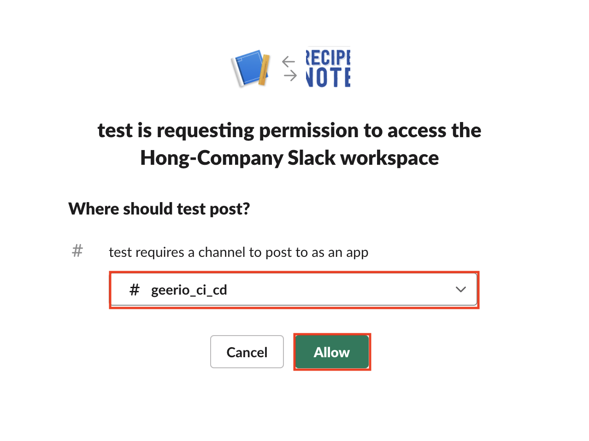

그러면 결과를 전달할 채널들을 선택할 수 있는 창이 나온다. 선택한 후 "Allow" 버튼을 눌러준다.

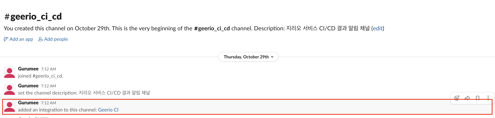

그럼 해당 채널로 이동하면, 내가 만든 APP 이름이 추가된 것을 확인할 수 있다.


## 슬랙 연동을 위한 Github Repository 설정

이전 절에서 얘기했 듯이, `Github Actions`는 위에서 만든 앱의 웹 훅 URL로, 빌드/테스트 결과를 전송한다. 그렇게하기 위해서는 해당 레포지토리에, 웹 훅 URL을 키/값 형태로 저장해야 한다. 먼저 URL을 가져와보자.

다시 [여기](https://api.slack.com/apps)로 이동한다.

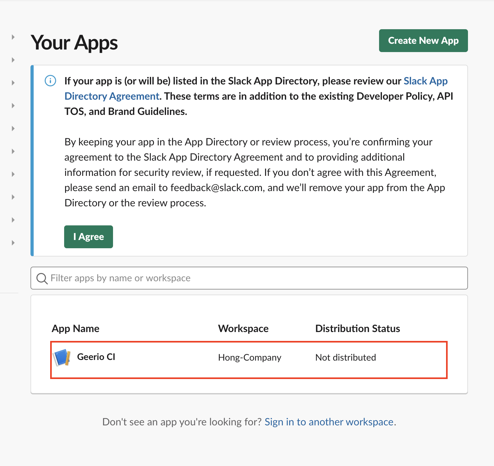

다음처럼, 만든 APP 목록이 뜨는데, 우리가 설정한 APP을 클릭한다.

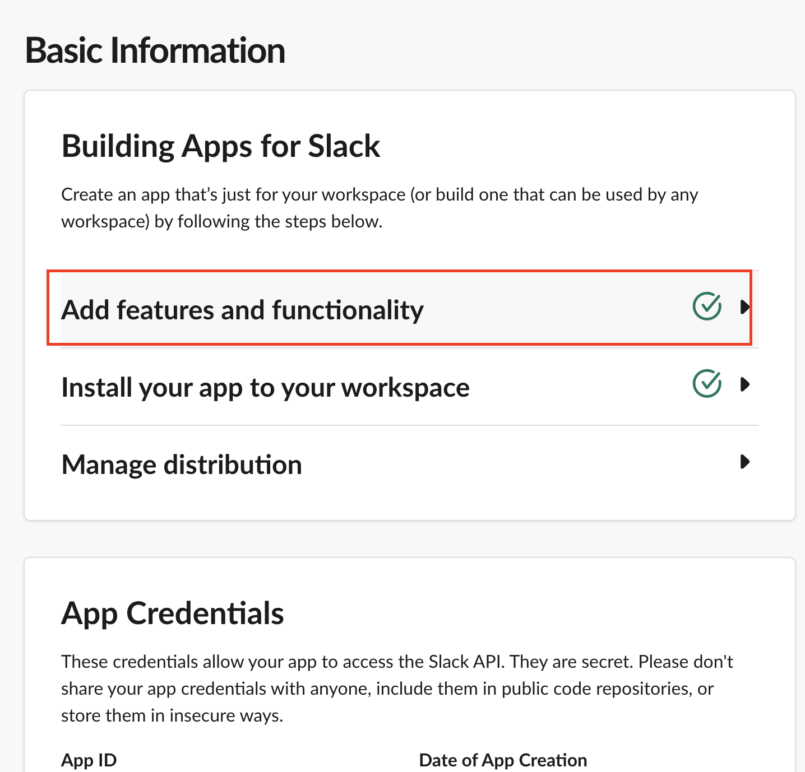

그 다음 "Add features and functionality"를 클릭한다.

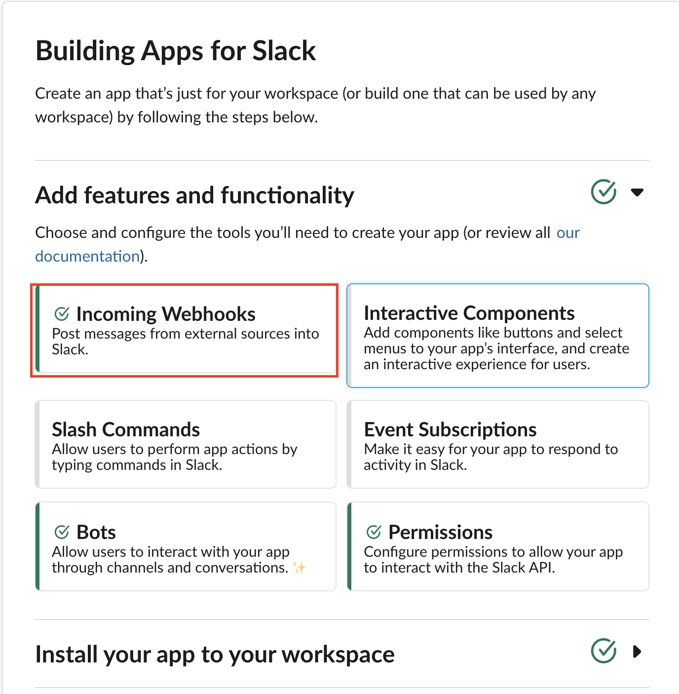

다시 "Incoming Webhooks"를 누른다.

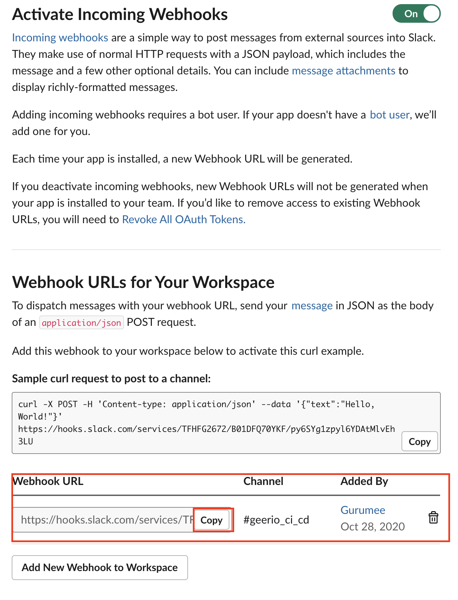

그럼 아래쪽에, Webhook URL이 있다. "Copy"를 눌러서 복사하자. 이제 `Github Actions`를 설정해야 하는 레포지토리로 이동한다.

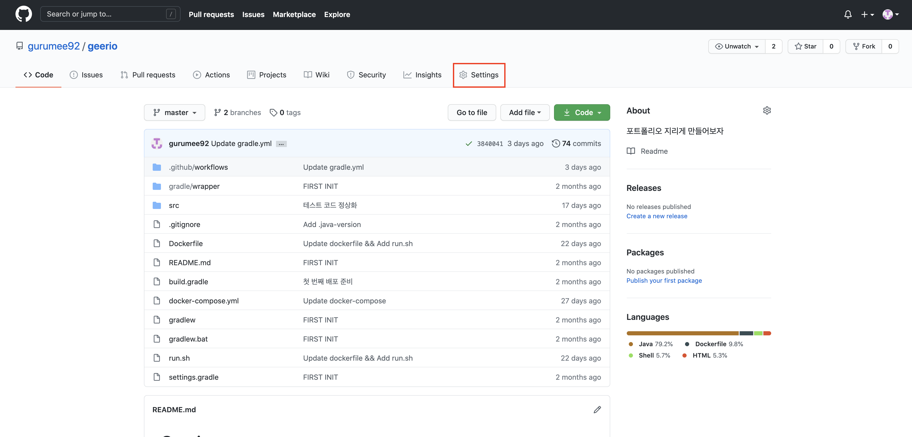

키/값으로 Secrets로 설정하기 위해서 "settings"를 누른다.

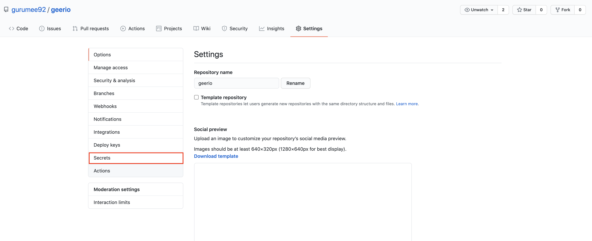

왼쪽 탭에 "Secrets"를 누른다.

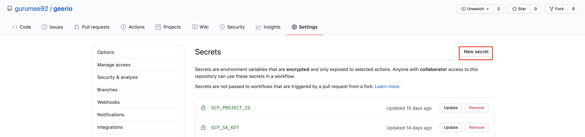

이제 오른쪽 "New secret"을 누른다.

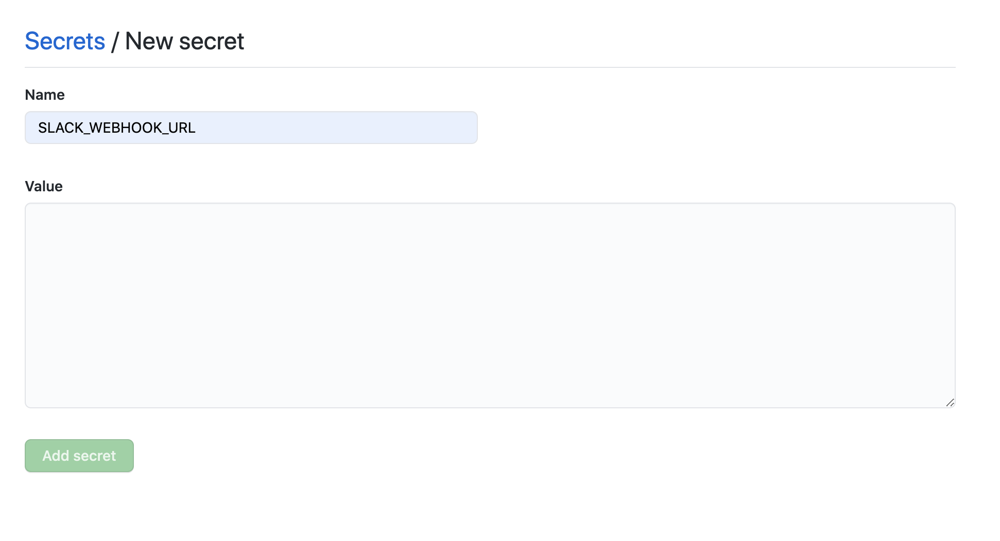

이제 키에 "SLACK_WEBHOOK_URL"을 값에 복사해온, 슬랙 웹훅 URL을 넣어준다.

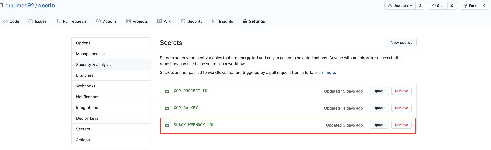

이제 `Github Actions`를 위한 모든 설정을 완료했다.


## Github Actions 적용하기

이제 기존에 작성했던, "Workflow file"을 다음과 같이 수정한다.

```yml
name: Java CI with Gradle

on:
  push:
    branches: [ master ]
  pull_request:
    branches: [ master ]

jobs:
  build:

    runs-on: ubuntu-latest

    steps:
    - uses: actions/checkout@v2
    - name: Set up JDK 1.8
      uses: actions/setup-java@v1
      with:
        java-version: 1.8
    - name: Grant execute permission for gradlew
      run: chmod +x gradlew
    - name: Build with Gradle
      run: ./gradlew build
    
    # 여기서부터 추가 코드
    - name: build result to slack
      uses: 8398a7/action-slack@v3
      with:
        status: ${{job.status}}
        fields: repo,message,commit,author,action,eventName,ref,workflow,job,took
        author_name: Geerio CI

      env:
        GITHUB_TOKEN: ${{ secrets.GITHUB_TOKEN }} # required
        SLACK_WEBHOOK_URL: ${{ secrets.SLACK_WEBHOOK_URL }} # required
```

추가된 코드만 살짝 살펴보자.

```yml
- name: build result to slack
  uses: 8398a7/action-slack@v3
  with:
    status: ${{job.status}}
    fields: repo,message,commit,author,action,eventName,ref,workflow,job,took
    author_name: Geerio CI

  env:
    GITHUB_TOKEN: ${{ secrets.GITHUB_TOKEN }} # required
    SLACK_WEBHOOK_URL: ${{ secrets.SLACK_WEBHOOK_URL }} # required
```

먼저 `env`의 `GITHUB_TOKEN`, `SLACK_WEBHOOK_URL`이 있다. 이 둘은 필수 설정 값이라고 한다. 좀 신기한 것은, `secrets.GITHUB_TOKEN`이 없음에도 잘 동작한다. 

그리고, `8398a7/action-slack@v3` 서드 파티 액션을 쓴다. 이 액션은 "status", "fields" 등 여러 개를 선택해서 사용할 수 있고 커스터마이징도 가능하다. 조금 더 메세지를 커스텀하고 싶다면, [여기](https://github.com/marketplace/actions/action-slack)를 참고하라.

나는 공식 문서의 설정은 따른다. "job.status"는 빌드 결과를 나타낸다. 그리고 `fields`는 슬랙 메세지에서 보여야 할 정보들이다. 자 끝이다. 이렇게 "Workflow file"을 수정하고 마스터 브랜치에 커밋해보자. 그럼 `Github Actions`가 동작해서, 자바 코드를 빌드/테스트 후 슬랙으로 그 결과를 보낸다.

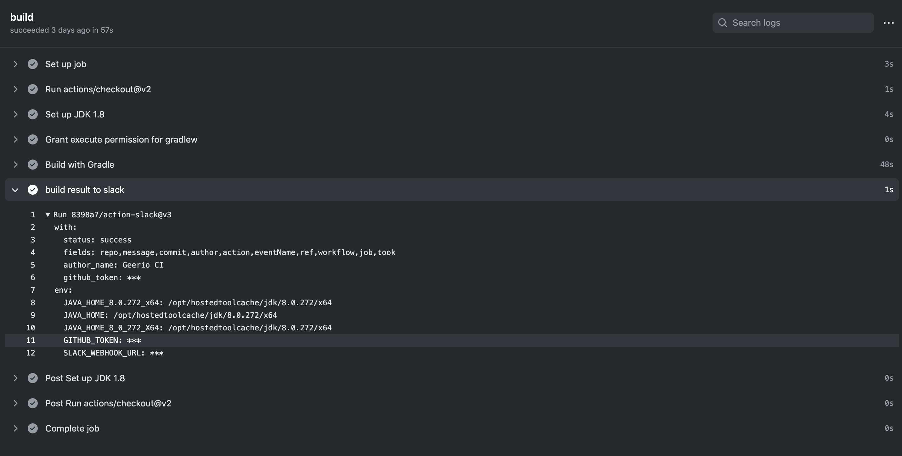

"Actions" 탭을 눌러서 위와 같이 `Github Actions`가 잘 동작하는지 확인해본다. 빌드가 끝났으면, Slack을 확인해보자.

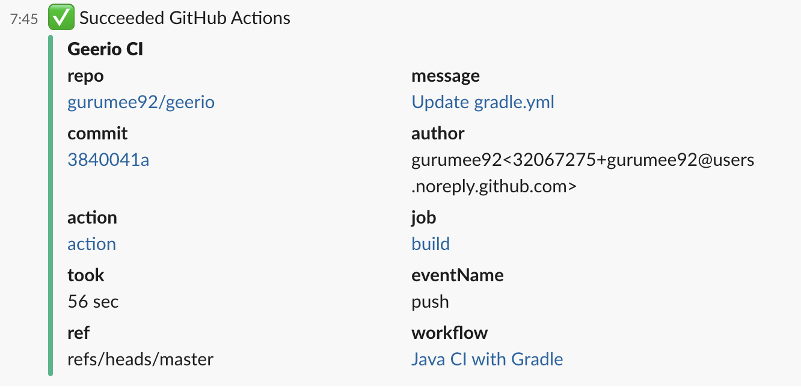

그럼 내가 설정한 채널에 빌드된 결과가 이렇게 딱 전송된다.


## 참고

* [Github Actions, Slack 연동하여 Gradle 빌드 결과받기](https://codeac.tistory.com/112)