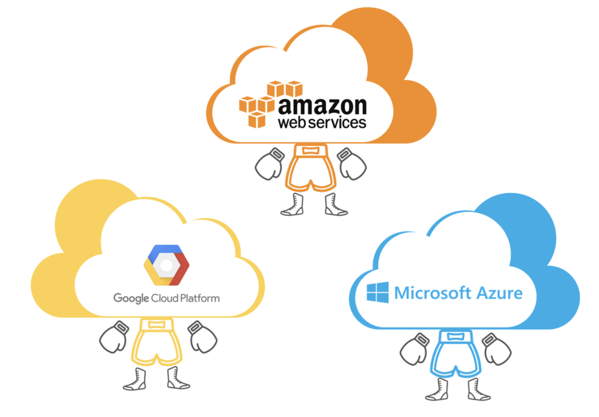

# GCP 가입하기

> 실제 GCP를 이용하면서 정리한 내용입니다.

## 목차
  - [GCP란 무엇인가?](#gcp란-무엇인가)
  - [GCP 가입하기](#gcp-가입하기-1)

## GCP란 무엇인가?

`GCP`는 `Google Cloud Platform`의 약자이다. 이것을 알아보기 전에 `클라우드`가 무엇인지 알아야 한다.

> 클라우드란? 
> 소비자와 기업/기관들이 인터넷을 통해 접속할 수 있는 회사의 데이터센터 서버 네트워크를 말한다. 아마존은 자체 클라우드를 갖추고 있고, 애플과 구글 그리고 수많은 다른 회사들도 클라우드가 있다. ‘클라우드’는 사용자가 접속하는 기업의 서버 네트워크를 설명하는 일반적인 용어다. [> 원문](http://www.ciokorea.com/news/22138#csidx5d76ac07fd7cf7291f489f94d84c97d )

그냥 간단하게 말해서 누군가 서버 및 인프라 쪽을 제공해주는 것이라고 생각하면 된다. 최근 클라우드 3대장은 다음과 같다.

* 아마존 AWS
* 구글 GCP
* 마이크로소프트 MS Azure

이름에서 알 수 있듯이 아마존, 구글, 마이크로소프트가 제공해주는 클라우드 서비스이다. 기본적으로 서버 인스턴스, DB 서버 인스턴스, 스토리지 서버 인스턴스, 라우팅, 등 클라우드 인프라를 제공하고 있다. 심지어 AI, Big Data 기술들 역시 제공하고 있다.

이 3대장 중 1등은 아마존의 `AWS`이다. 사용자 수가 많다는 것은 그만큼 참고할 문서가 많다는 것이다. 나는 나의 시간을 줄이기 위해서 사용자가 많고 문서가 많은 기술들을 채택하는 편인데 이번에는 `GCP`를 선택해서 집중적으로 살펴보게 되었다. 왜 이런 선택을 했을까?

제일 큰 이유는, 회사 외부 교육으로 `AWS` 과련 교육을 들었는데, 어떤 서비스에 대한 교육이었는데 나의 실수이긴 하나 과금이 나가게 되었다. 어지간하면 다 돌려주는데 70% 정도만 돌려주더라.. 그 때부터 반발심이 생겨서 안쓰게 되었다.

`GCP` 또한 착한 가격과 더불어서, `AWS`에서 제공하는 서비스들을 거의 다 제공하고 있다. 사실 3대장은 어떤 것은 A가 좋고 어떤 것은 B가 좋고 어떤 것은 C가 좋기 때문에 뭐가 더 좋다라고 말할 순 없다. 그냥 다 비슷하기 때문에 나에게 참고할 수 있는 리소스가 더 많은 것이 `Azure`보단 `GCP`였다. 이것이 두 번째 이유이다. 

`GCP`를 시작하기 위해서는 먼저 가입 절차가 필요하다. 카드를 요구하긴 하는데 일단 90일 간 사용할 수 있는 무료 크레딧을 나눠주고 자동 결제 옵션을 바꾸지 않는 한 과금이 나가는 것을 방지할 수 있다고 한다. 이는 공부하면서 알아보겠다.

## GCP 가입하기

먼저, 이 가입하기 절차는 2020년 09월에 밝힌다. 이후에 UI가 바뀌었을 수 있다. 그래도 기본 틀은 비슷할 것이다.

`Google Cloud Platform` 페이지를 접속한다. [이곳](https://cloud.google.com/gcp)을 클릭하면, 다음 화면이 나온다.

여기서 "무료로 시작하기" 버튼을 클릭한다. 그럼 다음 화면이 나온다.

서비스 약관에 동의한 후 "계속" 버튼을 누른다. 그럼 "결제 옵션"이 다음과 같이 뜬다. (사실 위에 몇 가지 옵션들이 있긴 하지만 자동 설정을 따르면 된다. 민감 정보라 이미지에서 제외했다.)

이제 자신의 이름, 주민등록번호, 핸드폰 정보를 입력한 후, "코드 전송"을 클릭한다. 그럼 메세지로 코드가 온다 그 코드를 입력하고 "계속" 버튼을 누른다. 그럼 다음 "결제 수단"을 설정하는 화면으로 바뀐다. 

카드 번호 입력하면, 그 후 카드 비밀번호, 유효 날짜를 입력하는 창이 뜬다 기입하고 "무료 평가판 시작하기" 버튼을 클릭한다.

끝이다!! 이제 구글 클라우드 플랫폼을 이용할 수 있다.