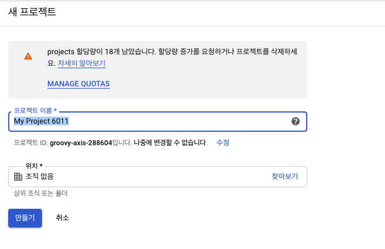
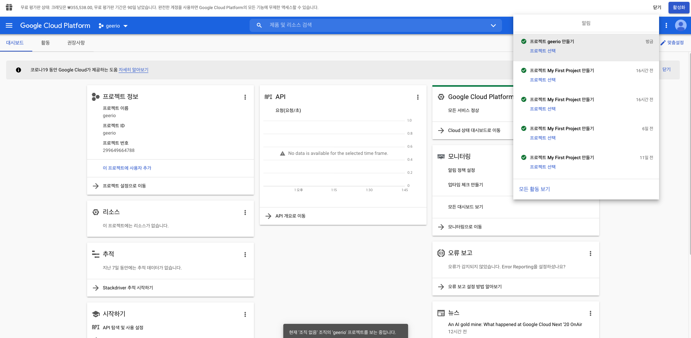
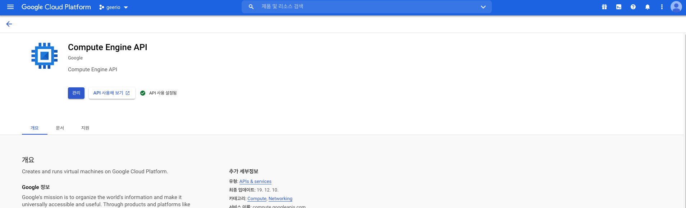
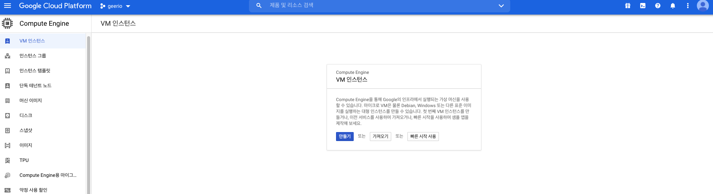
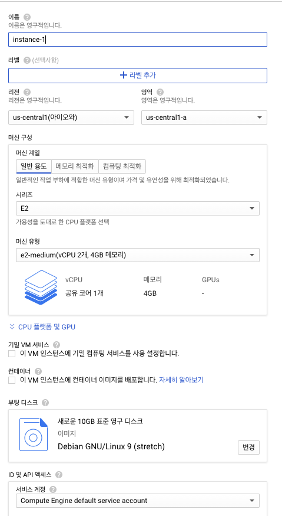
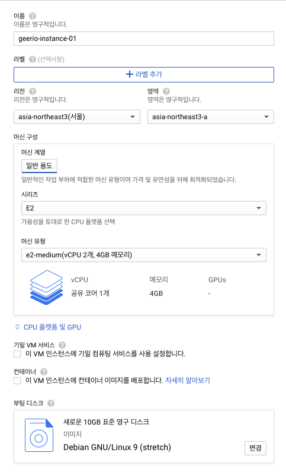
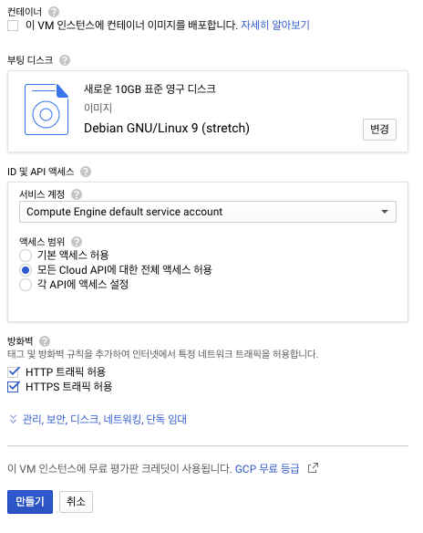
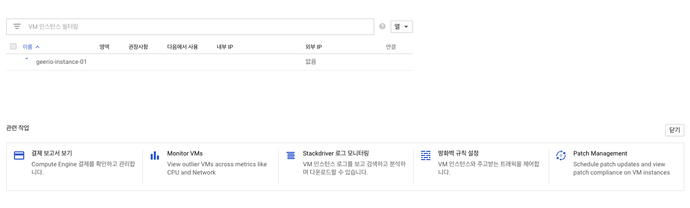
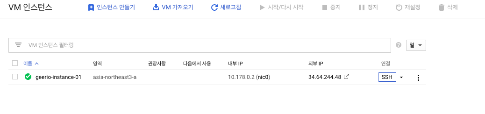
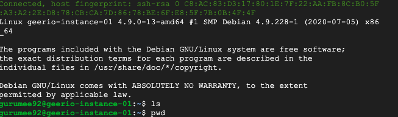

# GCE 인스턴스 생성 및 설정하기

> 실제 GCP를 이용하면서 정리한 내용입니다. 이 문서는 Google Compute Engine에 VM을 생성하고, gcloud와 연결하는 내용을 다루고 있습니다.

## GCE란?

`GCE`란 `Google Compute Engine`에 줄임말로, `GCP`에서 제공하는 가상 인스턴스(VM)이다. 쉽게 말해서, 구글이 서버 1대를 제공해준다고 생각하면 된다. 서버는 크게 분류하여 리눅스 서버와, 윈도우 서버를 제공해준다. 바로 리눅스 서버를 생성해보자.

## GCE 인스턴스 생성하기

> 먼저 `GCP`에 가입 후 결제 계좌 정보를 설정해야 합니다. 설정하지 않았다면 [이 문서](../01-join-gcp/01-join-gcp.md)를 먼저 살펴보고 와주세요.  

먼저 프로젝트를 생성해야 한다. `GCP` "프로젝트 선태기" 페이지로 이동한다. [페이지로 이동](https://console.cloud.google.com/projectselector2/home) 

그럼 다음 화면이 뜬다. 화면에서 "프로젝트 만들기"를 누른다.

그럼 다음 화면이 뜬다. "프로젝트 이름"을 설정하고 "만들기" 버튼을 누른다.

그럼 GCP 콘솔로 이동하게 된다. 다음 화면처럼 대략적인 프로젝트의 정보가 보인다. 

그 다음에 "Compute Engine API" 사용 설정을 해야 한다. [이 곳](https://console.cloud.google.com/apis/api/compute.googleapis.com/)을 클릭하여 다음 페이지로 넘어간다. "사용 설정"(파란색 버튼)을 누른다.

그 후 "VM 인스턴스 생성" 페이지로 이동한다. [이 곳](https://console.cloud.google.com/compute/)을 클릭한다. 그럼 다음 화면이 보인다. "만들기" 버튼을 클릭한다. 

그럼 다음 화면이 뜬다. 인스턴스 이름을 설정하고, 리전 및 영역을 설정한다.

대략적인 예시는 다음과 같다. 나는 서울지역에 리전을 잡았다.

그 다음에 "기본 액세스 허용"으로 해도 되지만 나는 모든 "Cloud API에 대한 전체 액세스 허용"을 선택하고, 방화벽에 대해서 HTTP, HTTPS 모두 허용하게 해주었다. 그 후 "만들기" 버튼을 누른다.

그럼 인스턴스가 다음 화면처럼 생성된 것을 볼 수 있다.

이제 "SSH"를 통해서 서버 인스턴스에 접속해보자. 밑에처럴 "SSH"를 클릭한다.

그럼 다음 화면으로 이동된다. 리눅스 VM이기 때문에 다음 명령어들이 먹힌다. 

끌 때는 "exit"를 누르고 나오면 된다. 요약하면 다음과 같다.

1. GCP 가입
2. 프로젝트 선택기 페이지 > 프로젝트 생성
3. Compute Engine API 설정
4. VM 인스턴스 생성
   1. 인스턴스 만들기
   2. 부팅 디스크 이미지 설정
   3. API 설정
   4. 방화벽 설정
   5. 만들기

## Google Cloud SDK란?

## Google Cloud SDK 설치

## gcloud로 GCE 인스턴스 접속하기

