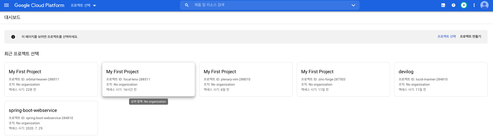

# GCE 인스턴스 생성 및 설정하기


> 실제 GCP를 이용하면서 정리한 내용입니다. 이 문서는 Google Compute Engine에 VM을 생성하고, gcloud와 연결하는 내용을 다루고 있습니다.


## GCE란?

`GCE`란 `Google Compute Engine`에 줄임말로, `GCP`에서 제공하는 가상 인스턴스(VM)이다. 쉽게 말해서, 구글이 서버 1대를 제공해준다고 생각하면 된다. 서버는 크게 분류하여 리눅스 서버와, 윈도우 서버를 제공해준다. 바로 리눅스 서버를 생성해보자.

## GCE 인스턴스 생성하기

> 먼저 `GCP`에 가입 후 결제 계좌 정보를 설정해야 합니다. 설정하지 않았다면 [이 문서](../01-join-gcp/01-join-gcp.md)를 먼저 살펴보고 와주세요.  

먼저 프로젝트를 생성해야 한다. `GCP` "프로젝트 선태기" 페이지로 이동한다. [페이지로 이동](https://console.cloud.google.com/projectselector2/home) 

그럼 다음 화면이 뜬다. 화면에서 "프로젝트 만들기"를 누른다.



그럼 다음 화면이 뜬다. "프로젝트 이름"을 설정하고 "만들기" 버튼을 누른다.


그럼 GCP 콘솔로 이동하게 된다. 다음 화면처럼 대략적인 프로젝트의 정보가 보인다. 


그 다음에 "Compute Engine API" 사용 설정을 해야 한다. [이 곳](https://console.cloud.google.com/apis/api/compute.googleapis.com/)을 클릭하여 다음 페이지로 넘어간다. "사용 설정"(파란색 버튼)을 누른다.


그 후 "VM 인스턴스 생성" 페이지로 이동한다. [이 곳](https://console.cloud.google.com/compute/)을 클릭한다. 그럼 다음 화면이 보인다. "만들기" 버튼을 클릭한다. 


그럼 다음 화면이 뜬다. 인스턴스 이름을 설정하고, 리전 및 영역을 설정한다.


대략적인 예시는 다음과 같다. 나는 서울지역에 리전을 잡았다.


그 다음에 "기본 액세스 허용"으로 해도 되지만 나는 모든 "Cloud API에 대한 전체 액세스 허용"을 선택하고, 방화벽에 대해서 HTTP, HTTPS 모두 허용하게 해주었다. 그 후 "만들기" 버튼을 누른다.


그럼 인스턴스가 다음 화면처럼 생성된 것을 볼 수 있다.


이제 "SSH"를 통해서 서버 인스턴스에 접속해보자. 밑에처럴 "SSH"를 클릭한다.


그럼 다음 화면으로 이동된다. 리눅스 VM이기 때문에 다음 명령어들이 먹힌다. 


끌 때는 "exit"를 누르고 나오면 된다. 요약하면 다음과 같다.

1. GCP 가입
2. 프로젝트 선택기 페이지 > 프로젝트 생성
3. Compute Engine API 설정
4. VM 인스턴스 생성
   1. 인스턴스 만들기
   2. 부팅 디스크 이미지 설정
   3. API 설정
   4. 방화벽 설정
   5. 만들기


## Google Cloud SDK란?

`Google Cloud SDK`란 Google Cloud 제품 및 서비스와 상호작용하기 위한 도구 및 라이브러리이다. 여기에는 `gcloud`, `bq` 등의 커맨드라인 도구가 들어있다. 자세한 내용은 [이곳](https://cloud.google.com/sdk/docs?hl=ko)에서 확인할 수 있다.

이제 설치를 해보자. 설치는 [이곳](https://cloud.google.com/sdk/docs/quickstart-macos?hl=ko)을 들어가면 각 OS에 맞는 SDK 설치 파일들이 있다. 내 컴퓨터는 맥북이기 때문에, 맥북 설명이 따른다.


이걸 다운 받고 적당한 위치에 푼다. 나 같은 경우 웹에서 다운 받으면 "Downloads" 디렉토리에 저장된다. 해당 디렉토리에서 터미널을 열어 다음 명령어를 친다.

```bash
# 현재 위치 
$ pwd
/Users/gurumee/Downloads

$ tar -zxvf google-cloud-sdk-305.0.0-darwin-x86_64.tar.gz
```

그 다음 압축 해제된 디렉토리를 적절한 위치에 옮겨둔다. 나는 "Settings"라는 디렉토리에 저장했다. 그 후 그 디렉토리를 이동해서, `install.sh`를 실행한다.

```bash
# 현재 위치 
$ pwd
/Users/gurumee/Settings/google-cloud-sdk

$ ./install.sh
```

여기서 설정을 위해서, 입력하라는 문구가 나오는데, 그냥 추천하는대로 한다. 나는 n -> Y -> 엔터를 차례대로 입력했다.

그 후 터미널을 다시 열어 다음 명령어를 쳤을 때, 다음이 출력된다면 잘 설치 된 것이다.

```bash
$ gcloud --version
Google Cloud SDK 305.0.0
bq 2.0.58
core 2020.08.07
gsutil 4.52
```


## glcoud로 인스턴스 접속

이제 `gcloud`로 인스턴스 접속을 해보자. 공식 문서에 따르면 다음 명령어로 인스턴스 접속을 할 수 있다고 한다.

```
gcloud compute ssh <instance name>
```

터미널에 자신이 만든 GCE 인스턴스 이름을 쳐보자.

```bash
# gcloud compute ssh <자신 인스턴스>
$ gcloud compute ssh geerio-instance-01
WARNING: Could not open the configuration file: [/Users/gurumee/.config/gcloud/configurations/config_default].
ERROR: (gcloud.compute.ssh) You do not currently have an active account selected.
Please run:

  $ gcloud auth login

to obtain new credentials.

If you have already logged in with a different account:

    $ gcloud config set account ACCOUNT

to select an already authenticated account to use.
```

아직 계정 연결이 안되어있어서 에러가 나타난다. 계정 설정을 하자. 터미널에 다음을 입력한다.

```bash
$ gcloud auth login
```

그럼 웹 브라우저가 켜지면서 구글 로그인 페이지가 나타난다. `GCP`에 연결된 계정으로 로그인한다. 잘 되었는지 터미널에 다음을 입력해보자.

```bash
$ gcloud projects list
PROJECT_ID                     NAME                    PROJECT_NUMBER
geerio                         geerio                  299649664788
lucid-mariner-284810           devilog                 88045153621
spring-boot-webservice-284810  spring-boot-webservice  943681427891
zinc-forge-287503              My First Project        91200101907
```

그 다음 자신이 접속할 인스턴스의 프로젝트를 세팅한다. 터미널에 다음을 입력한다.

```bash
# gcloud config set project <프로젝트 이름>
$ gcloud config set project geerio
```

이제 프로젝트 밑에 실행되는 인스턴스를 확인한다. 터미널에 다음을 입력한다.

```bash
$ gcloud compute instances list
NAME                ZONE               MACHINE_TYPE  PREEMPTIBLE  INTERNAL_IP  EXTERNAL_IP   STATUS
geerio-instance-01  asia-northeast3-a  e2-medium                  10.178.0.2   34.64.244.48  RUNNING
```

자 이제 다시 연결해보자. 터미널에 다음을 입력한다.

```bash
# gcloud compute ssh <instance name>
$ gcloud compute ssh geerio-instance-01
# 출력 문구
No zone specified. Using zone [asia-northeast3-a] for instance: [geerio-instance-01].
Linux geerio-instance-01 4.9.0-13-amd64 #1 SMP Debian 4.9.228-1 (2020-07-05) x86_64

The programs included with the Debian GNU/Linux system are free software;
the exact distribution terms for each program are described in the
individual files in /usr/share/doc/*/copyright.

Debian GNU/Linux comes with ABSOLUTELY NO WARRANTY, to the extent
permitted by applicable law.
Last login: Sat Sep  5 07:14:55 2020 from 59.7.201.51
gurumee@geerio-instance-01:~$ 
```

나는 한 번 접속했었기 때문에, ssh 키는 생성하지 않는다. 하지만 처음 접속 시엔, ssh 키를 생성하기 때문에 조금 더 걸릴 수 있다. 역시 접속을 끊으려면 "exit" 명령어를 입력하면 된다.

요약하자면 다음과 같다.

1. Google Cloud SDK 설치
2. `gcloud auth login` 명령어로 계정 연결
3. `gcloud config set project <project name>`으로 프로젝트 설정
4. `gcloud compute ssh <instance name>` 인스턴스 연결
