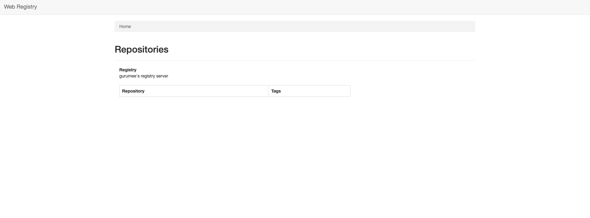
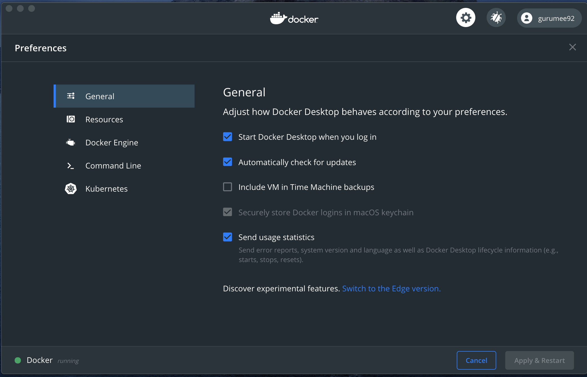
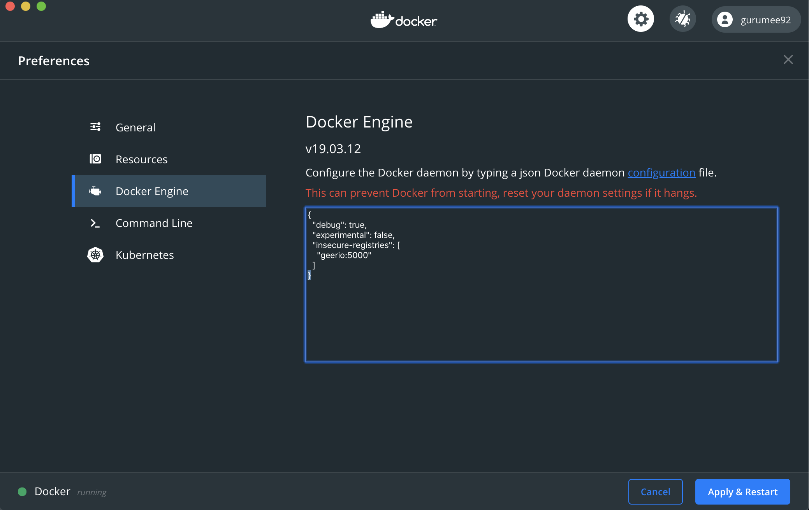
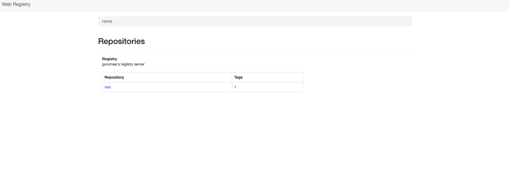

# GCE에 개인 도커 레지스트리 구축하기


> 실제 GCP를 이용하면서 정리한 내용입니다. 이 문서는 Google Compute Engine에 도커, docker-compose를 설치하고, 개인 레지스트리 서버를 구축합니다. 또한, 유저 접근을 허용하기 위해 gcloud로 인스턴스의 포트를 개방합니다.

이 문서와 같은 방식으로 `GCE`에 `개인 도커 레지스트리`를 구축하려면 다음이 필요하다.

* GCE 인스턴스 1개
* 인스턴스에 접근 가능한 gcloud 도구  

둘 중 하나라도 없다면, 다음 문서를 참고하라.

* [구르미의 GCE 인스턴스 생성 및 설정하기](https://gurumee92.github.io/2020/09/gce-%EC%9D%B8%EC%8A%A4%ED%84%B4%EC%8A%A4-%EC%83%9D%EC%84%B1-%EB%B0%8F-%EC%84%A4%EC%A0%95%ED%95%98%EA%B8%B0/)


## 도커 레지스트리란?

먼저 `도커 레지스트리`가 무엇인지 알아 볼 필요가 있다. `도커 레지스트리`란 **도커 이미지들을 저장하는 저장소**라 보면 된다. 쉽게 생각하면 `Docker Hub`이 있다. `Docker Hub`는 도커 팀에서 공식적으로 관리하는 `도커 레지스트리`이다. 사용자들을 자신의 도커 이미지를 이 곳에 올릴 수 있다. 마치 코드를 올리는 `Github`과 비슷하다.

그렇다면, `Github`에서 가장 큰 문제가 무엇인가? **API Key, 데이터베이스 비밀번호 같은 보안 관련된 코드가 외부에 공개적으로 유출된다는 것**이다. 물론 이제 거의 모든 `Github`, `Bitbucket` 같은 SVN 서비스들은 개인 레포지토리를 제공하여 보안 코드를 유출하지 않게 할 수 있다. 

`Dokcer Hub`도 이와 같은 이슈가 있다. 도커 이미지를 배포하면, 이미지를 풀한 유저가 해당 이미지의 모든 코드를 볼 수 가 있다. 즉, 보안이 필요한 코드가 공유된다는 것이다. 개인적인 도커 이미지 보관을 위해서 도커 팀은 `개인 도커 레지스트리`를 구축할 수 있게 이미지를 제공하고 있다.

이제 `GCE 인스턴스`에 `개인 도커 레지스트리`를 구축해보자. 


## 도커, 도커 컴포즈 설치

> 이 절 부터는 gcloud 혹은 ssh 접근으로 인스턴스에 접속했다고 가정합니다. 여기서 제가 활용한 GCE 인스턴스는 데비안 OS 기반임을 밝힙니다.

`GCE 인스턴스`에 도커를 설치한다. 도커 공식 문서 중 "[Install Docker Engine on Debian](https://docs.docker.com/engine/install/debian/)"를 참조한다. 

먼저, 도커를 설치하기 위한 컴포넌트들을 설치하기 위해 터미널에 다음을 입력한다.

```bash
$ sudo apt-get update

# 필요 컴포넌트 설치
$ sudo apt-get install \
    apt-transport-https \
    ca-certificates \
    curl \
    gnupg-agent \
    software-properties-common
```

이제 터미널에 다음 명령어들을 입력하여, 도커 패키지를 설치할 수 있는 `apt-get` 레포지토리를 추가한 후 업데이트한다.

```bash
# apt-key 획득
$ curl -fsSL https://download.docker.com/linux/debian/gpg | sudo apt-key add -

# apt-get에 레포지토리 추가
$ sudo add-apt-repository \
   "deb [arch=amd64] https://download.docker.com/linux/debian \
   $(lsb_release -cs) \
   stable"

# apt-get 업데이트
$ sudo apt-get update
```

이제 도커를 설치한다.

```bash
$ sudo apt-get install docker-ce docker-ce-cli containerd.io
```

설치가 완료된 후, 제대로 설치가 되었는지 확인하기 위해 터미널에 다음 명령어를 입력한다.

```bash
$ sudo docker version
Client: Docker Engine - Community
 Version:           19.03.13
 API version:       1.40
 Go version:        go1.13.15
 Git commit:        4484c46d9d
 Built:             Wed Sep 16 17:03:03 2020
 OS/Arch:           linux/amd64
 Experimental:      false

Server: Docker Engine - Community
 Engine:
  Version:          19.03.13
  API version:      1.40 (minimum version 1.12)
  Go version:       go1.13.15
  Git commit:       4484c46d9d
  Built:            Wed Sep 16 17:01:33 2020
  OS/Arch:          linux/amd64
  Experimental:     false
 containerd:
  Version:          1.3.7
  GitCommit:        8fba4e9a7d01810a393d5d25a3621dc101981175
 runc:
  Version:          1.0.0-rc10
  GitCommit:        dc9208a3303feef5b3839f4323d9beb36df0a9dd
 docker-init:
  Version:          0.18.0
  GitCommit:        fec3683
```

도커 실행 시, 매번 `sudo`를 치는 것이 귀찮다면, 다음 명령어를 입력해주면 된다.

```bash
# 도커 그룹 생성
$ sudo groupadd docker
# 도커 그룹에 현재 유저 권한 획득
$ sudo usermod -aG docker $USER
```

그 후 터미널을 접속을 해제한 후, 다시 접속해서 `docker version`이란 명령어를 입력하면, 위와 같은 결과를 얻을 수 있다. 여기서 바로, 레지스트리를 구축해도 좋지만, 더 쉬운 작업을 위해 `docker-compose`를 설치한다. 도커 공식 문서 중 "[Install Docker Compose](https://docs.docker.com/compose/install/)"를 참조한다.

터미널에 다음을 입력한다.

```bash
# docker-compose 바이너리 파일 설치
$ sudo curl -L "https://github.com/docker/compose/releases/download/1.27.4/docker-compose-$(uname -s)-$(uname -m)" -o /usr/local/bin/docker-compose

# 바이너리 파일 실행 가능하게 파일 권한 추가
$ sudo chmod +x /usr/local/bin/docker-compose
```

끝이다. `docker-compose` 잘 설치가 되었는지 확인하려면 터미널에 다음 명령어를 입력하면 된다.

```bash
$ docker-compose --version
docker-compose version 1.27.4, build 40524192
```


## 도커 레지스트리 구축

이제 `개인 도커 레지스트리`를 구축해보자. 두 개의 도커 컨테이너를 설치한다.

1. registry:2 
2. hyper/docker-registry-web

첫 번째 `registry:2`는 도커에서 제공하는 레지스트리 공식 이미지이다. 두 번째는 `hyper` 유저가 레지스트리를 웹 UI로 확인할 수 있게 만들어둔 컨테이너 이미지이다. 공식 이미지는 아니다. 원래 `harbor` 같은 것을 써보고 싶었는데 이는 나중에 업그레이드 하기로 하자. 이들을 연결하기 위한 나의 `docker-compose.yml` 파일은 다음과 같다.

```yml
version: '3.1'
services:
  registry:
    container_name: registry
    image: registry:2
    restart: "always"
    ports:
      - "5000:5000"
  registry-ui:
    container_name: registry-ui
    image: hyper/docker-registry-web
    restart: "always"
    ports:
      - "18080:8080"
    depends_on: [registry]
    environment:
      - REGISTRY_URL=http://registry:5000/v2 
      - REGISTRY_NAME=gurumee's registry server
```

해당 파일이 존재하는 곳으로 이동 한 후, 다음을 입력한다.

```bash
# <레지스트리 docker-compomse.yml> 위치로 이동
$ cd registry

# 도커 설치 및 실행
$ docker-compose up --build -d
```

이제 설치 및 실행이 잘되었는지 확인한다.

```bash
$ docker ps
CONTAINER ID        IMAGE                       COMMAND                  CREATED             STATUS              PORTS                     NAMES
c0731ef12c95        hyper/docker-registry-web   "start.sh"               39 seconds ago      Up 38 seconds       0.0.0.0:18080->8080/tcp   registry-ui
cae28ce60b80        registry:2                  "/entrypoint.sh /etc…"   41 seconds ago      Up 39 seconds       0.0.0.0:5000->5000/tcp    registry
```

실행은 되고 있다. 이제 `GCE` 인스턴스 주소와 포트로 접근해보자. 브라우저에서 `http://<gce주소>:18080` 입력한다. 아마 포트 개방 설정이 되어 있지 않다면, 접근이 불가할 것이다. 


## GCE 방화벽 설정

포트를 개방하기 위해 방화벽을 설정해야 한다. `GCP`에서는 크게 3가지 방법이 있다.

1. GCP 콘솔 이용 (웹 UI)
2. gcloud 이용 (터미널)
3. API 이용

세가지 방식의 설명은 GCP 공식 문서 중 "[VPC 방화벽 규칙 사용](https://cloud.google.com/vpc/docs/using-firewalls?hl=ko)"를 참고하자. 여기서는 2번, `gcloud`로 포트를 개방한다. 먼저 터미널에서, 자신의 방화벽 규칙을 확인해보자.

```bash
$ gcloud compute firewall-rules list
NAME                    NETWORK  DIRECTION  PRIORITY  ALLOW                         DENY  DISABLED
default-allow-http      default  INGRESS    1000      tcp:80                              False
default-allow-https     default  INGRESS    1000      tcp:443                             False
default-allow-icmp      default  INGRESS    65534     icmp                                False
default-allow-internal  default  INGRESS    65534     tcp:0-65535,udp:0-65535,icmp        False
default-allow-rdp       default  INGRESS    65534     tcp:3389                            False
default-allow-ssh       default  INGRESS    65534     tcp:22                              False
```

이제 방화벽 규칙을 생성한다.

```bash
# 방화벽 규칙 생성
# gcloud compute firewall-rules create <NAME> --allow tcp:<포트> --source-tags="<태그 원하는 인스턴스 리스트>" --source-ranges=0.0.0.0/0 --description="<원하는 설명>"
$ gcloud compute firewall-rules create test-rule --allow tcp:18080 --source-tags=geerio-instance-01 --source-ranges=0.0.0.0/0 --description="지리오 포트 개방"
```

다시 확인해본다.

```bash
$ gcloud compute firewall-rules list
NAME                    NETWORK  DIRECTION  PRIORITY  ALLOW                         DENY  DISABLED
default-allow-http      default  INGRESS    1000      tcp:80                              False
default-allow-https     default  INGRESS    1000      tcp:443                             False
default-allow-icmp      default  INGRESS    65534     icmp                                False
default-allow-internal  default  INGRESS    65534     tcp:0-65535,udp:0-65535,icmp        False
default-allow-rdp       default  INGRESS    65534     tcp:3389                            False
default-allow-ssh       default  INGRESS    65534     tcp:22                              False
test-rule               default  INGRESS    1000      tcp:18080                           False
```

이제 웹 UI를 접근하기 위해 다시 브라우저에 `http://<gce주소>:18080` 접속해보자. 그럼 다음 화면이 뜰 것이다.




## 도커 레지스트리 활용

이제 구축한 레지스트리에 실제 이미지를 올려보자. 로컬에서 간단한 이미지를 만들고 이를 레지스트리에 구축할 것이다. 로컬 머신의 도커 이미지 목록을 확인한다.

```bash
$ docker images
REPOSITORY          TAG                 IMAGE ID            CREATED             SIZE
```

필자는 이번 구축 테스트를 위해서, 가지고 있는 도커 이미지를 모두 삭제해 두었다. 원래는 자신의 이미지를 만들고 커밋, 태그, 푸쉬 과정을 거여챠 한다. 그러나 나는 귀찮으니까 남이 만든 이미지를 가져와서 태그 후 푸쉬를 할 것이다. 도커 허브에서 간단한 도커 이미지를 다운로드한다.

```bash
$ docker pull hello-world
```

이제 태그를 한다. 이때 규칙은 "`registry 주소`/이름"으로 해야 한다는 것이다.

```bash
# docker tag <레지스트리 주소:포트>/컨테이너 이름
$ docker tag geerio:5000/test
```

그리고 이제 이미지를 푸쉬한다.

```bash
# docker push <태그한 이미지>
$ docker push geerio:5000/test
The push refers to repository [geerio:5000/test]
Get https://geerio:5000/v2/: net/http: request canceled while waiting for connection (Client.Timeout exceeded while awaiting headers)
```

그러나 실패한다. 왜냐하면, 우리는 웹 UI의 포트 18080는 뚫었으나 실제 이미지가 저장되는 레지스트리의 포트 5000를 안뚫었기 때문이다. `gcloud`의 다음 명령어를 활용해서, 5000번도 같이 뚫어주자.

```bash
$ gcloud compute firewall-rules update test-rule --allow tcp:18080,tcp:5000
```

그 후 다시 한 번 푸쉬 명령어를 날려보자.

```bash
$ docker push geerio:5000/test
The push refers to repository [geerio:5000/test]
Get https://geerio:5000/v2/: net/http: request canceled while waiting for connection (Client.Timeout exceeded while awaiting headers)
```

아쉽게도 아직 에러라는 결과가 나온다. 왜냐하면, `도커 레지스트리`는 기본적으로 `HTTP`만 제공한다. 그러나, `도커 클라이언트`는 기본적으로 `HTTPS`로 요청을 보내기 때문이다. 이를 해결하기 위한 2가지 방법이 있다.

1. 서버에 설치된 도커 레지스트리에 HTTPS를 적용한다.
2. 도커 클라이언트에서 해당 레지스트리 서버에 접근할 때 HTTP 요청을 하게 한다. 

필자는 더 쉬운 두 번째 방법을 사용할 것이다. 먼저 도커 환경 설정을 연다.



이제 "Docker Engine" 탭을 클릭한 후, 해당 JSON 파일에서 "insecure-registries" 프로퍼티에 자신의 "레지스트리 서버:포트"를 추가한다.



위 사진을 자세히 보면 다음과 같다.

```json
{
  "debug": true,
  "experimental": false,
  "insecure-registries": [
    "geerio:5000"
  ]
}
```

이제 "Apply & Restart" 버튼을 누른다. 그러면 도커가 재시작되는데, 해당 레지스트리에 이미지를 푸쉬/풀 할 때, HTTP로 접근하게 된다. 이제 다음 명령어를 이용해 푸쉬한다.

```bash
$ docker push geerio:5000/test
The push refers to repository [geerio:5000/test]
9c27e219663c: Pushed
latest: digest: sha256:90659bf80b44ce6be8234e6ff90a1ac34acbeb826903b02cfa0da11c82cbc042 size: 525
```

이제 레지스트리 웹 UI로 이동하면, 내가 푸쉬한 이미지가 존재하는 것을 확인할 수 있다.



이제 이 이미지를 다운로드 해보자. 먼저 테스트를 위해 로컬에 있는 이미지들을 제거한다. 캐시된 이미지까지 모두 제거해버린다.

```bash
$ docker rmi -f $(docker images -q)
$ docker stop $(docker ps -a -q)
$ docker rm $(docker ps -a -q)
```

이제 레지스트리 서버에 있는 이미지를 풀한다.

```bash
$ docker pull geerio:5000/test
Using default tag: latest
latest: Pulling from test
0e03bdcc26d7: Pull complete
Digest: sha256:90659bf80b44ce6be8234e6ff90a1ac34acbeb826903b02cfa0da11c82cbc042
Status: Downloaded newer image for geerio:5000/test:latest
```

풀한 이미지를 확인해보고 실행해본다.

```bash
# 도커 이미지 목록 확인
$ docker images
REPOSITORY               TAG                 IMAGE ID            CREATED             SIZE
geerio:5000/test         latest              bf756fb1ae65        8 months ago        13.3kB

# 도커 이미지 실행
$ docker run geerio:5000/test

Hello from Docker!
This message shows that your installation appears to be working correctly.

To generate this message, Docker took the following steps:
 1. The Docker client contacted the Docker daemon.
 2. The Docker daemon pulled the "hello-world" image from the Docker Hub.
    (amd64)
 3. The Docker daemon created a new container from that image which runs the
    executable that produces the output you are currently reading.
 4. The Docker daemon streamed that output to the Docker client, which sent it
    to your terminal.

To try something more ambitious, you can run an Ubuntu container with:
 $ docker run -it ubuntu bash

Share images, automate workflows, and more with a free Docker ID:
 https://hub.docker.com/

For more examples and ideas, visit:
 https://docs.docker.com/get-started/
```

끝났다. 도커 레지스트리 서버를 구축함으로써 나의 CI/CD 환경 구축의 첫 번째 작업을 끝마쳤다 하하.