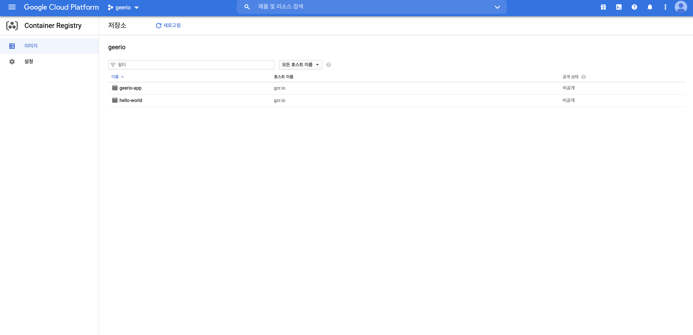
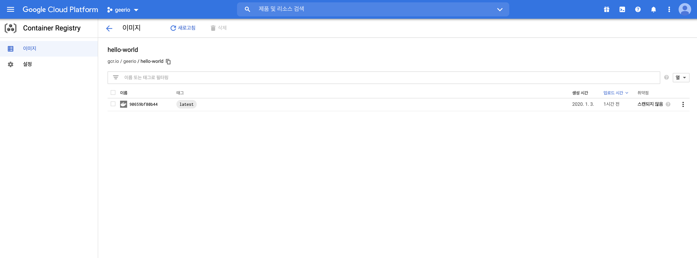
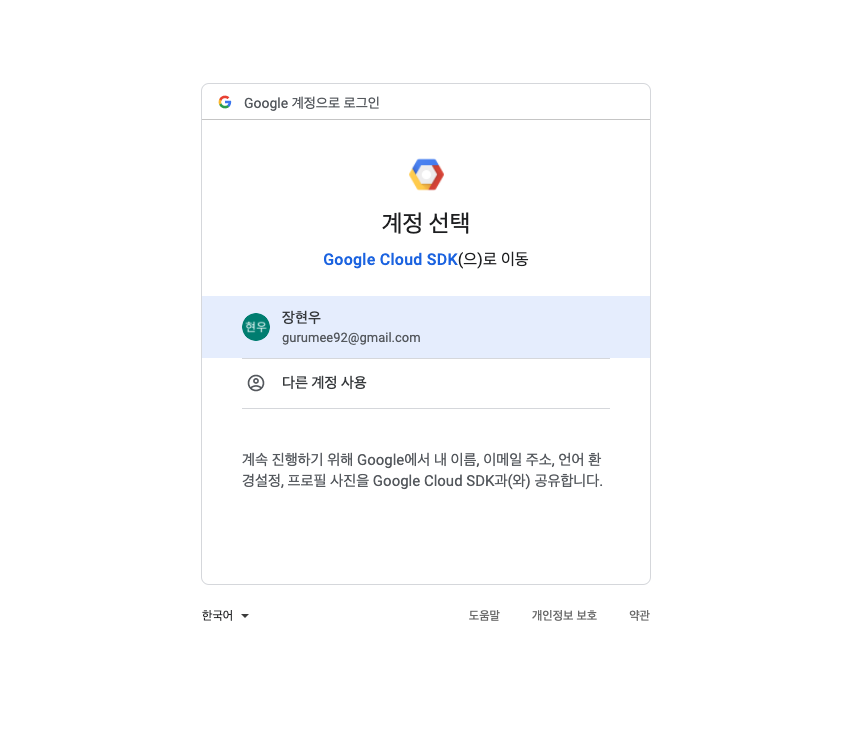
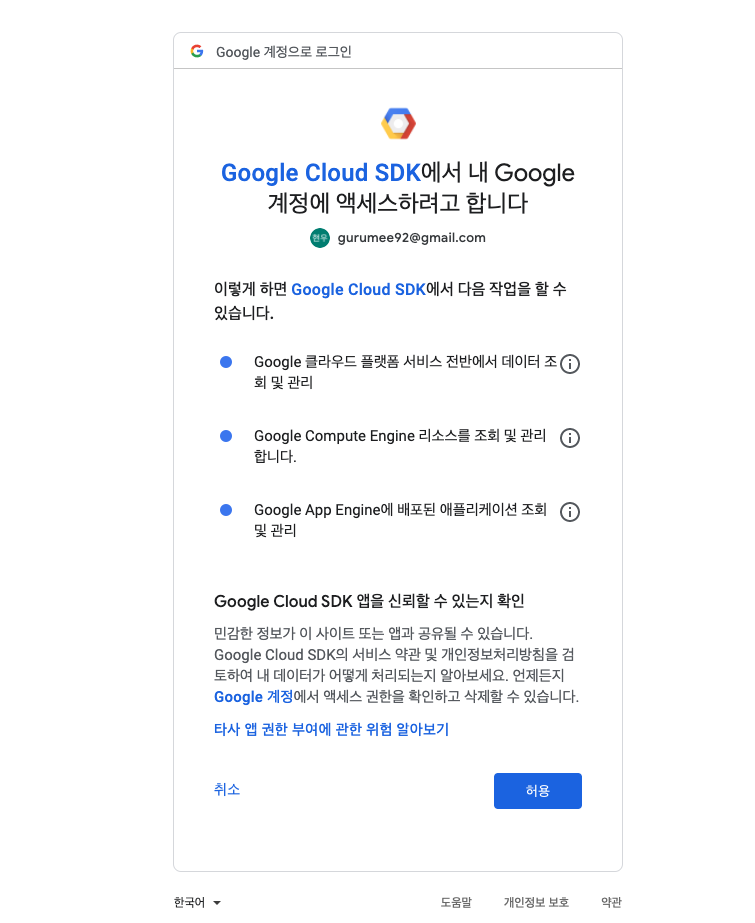
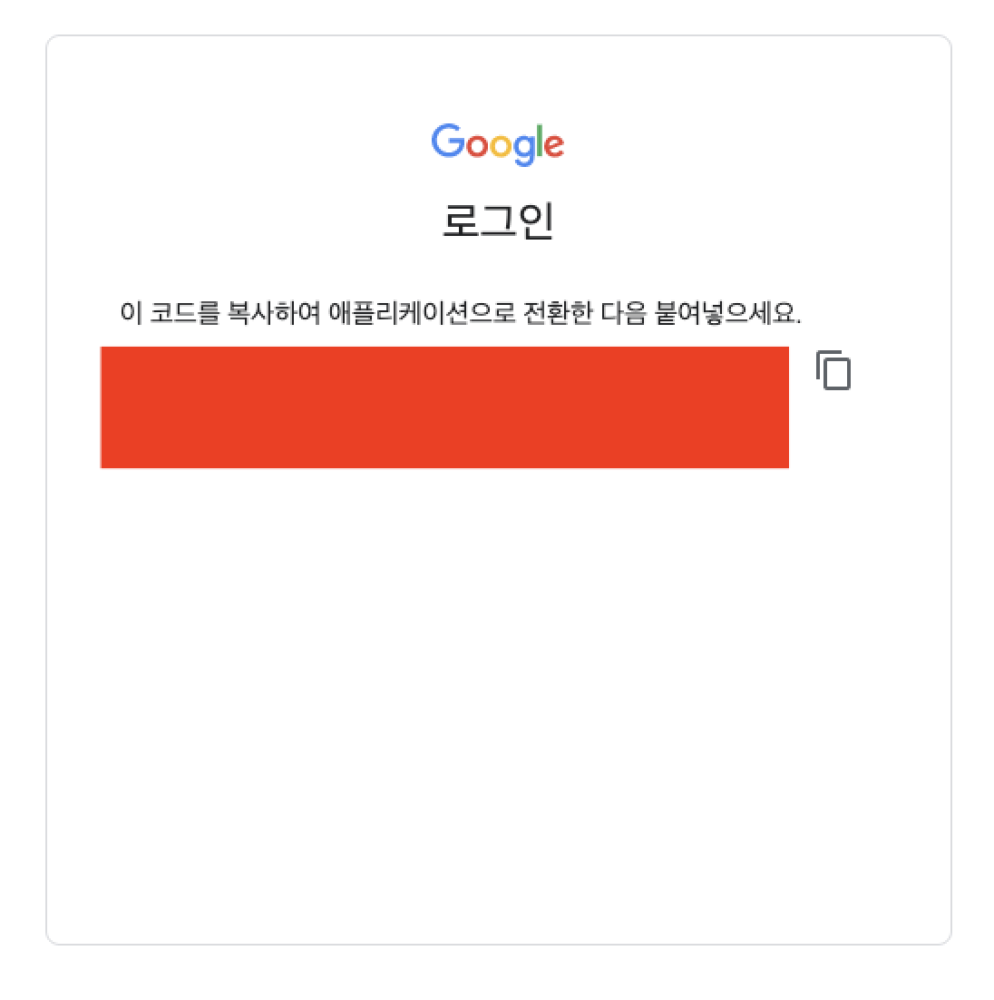

# GCR 사용하기


> 실제 GCP를 이용하면서 정리한 내용입니다. 이 문서는 Google Container Registry를 만들고, 실제 도커 이미지 배포, GCE에서 접속하여, 이미지 배포하는 것에 대한 내용입니다.

## 요구 사항

이 문서처럼, `GCR`을 만들고 테스트하려면 `GCP` 회원 가입과 프로젝트가 생성되어 있어야 하며, 또한 `GCE` 인스턴스와 `gcloud` 설치도 필요하다. 다음을 참고하라.

* [GCP 가입하기](https://gurumee92.github.io/2020/09/gcp-%EA%B0%80%EC%9E%85%ED%95%98%EA%B8%B0/)
* [GCE 인스턴스 생성 및 설정하기](https://gurumee92.github.io/2020/09/gce-%EC%9D%B8%EC%8A%A4%ED%84%B4%EC%8A%A4-%EC%83%9D%EC%84%B1-%EB%B0%8F-%EC%84%A4%EC%A0%95%ED%95%98%EA%B8%B0/)


## GCR

`GCR`이란 `Google Container Registry`의 약자로, `GCP`에서 제공하는 개인 도커 레지스트리 서비스이다. 이것은, `GCE`에 레지스트리를 구축한 후, `Google Cloud Storage (이하 GCS)`에 레지스트리 저장소를 연결한 것을 서비스로 제공하는 것이다. 실제, `GCR`을 구축하면, `GCS`에 `GCR`용의 버킷이 하나 생성된다. `GCS`는 추후에 다루도록 하겠다.

이제 만드는 방법이다. 만드는 방법은 다음과 같다.

1. 프로젝트 선택 > 자신이 원하는 프로젝트 선택
2. API 사용 설정 > [이 곳](https://console.cloud.google.com/apis/library/containerregistry.googleapis.com?q=container%20regis&id=345e3473-111d-4883-bae6-76295c034ed8&project=geerio&hl=ko)을 클릭 > "사용" 버튼 클릭
3. 그럼 해당 페이지로 이동됨.



이게 끝이다. 필자의 경우엔, 이미 이미지를 푸쉬한 상태이기 때문에, 저런 화면이 뜨지만, 아닐 경우는 이미지를 푸쉬하라는 안내문이 제공된다.


## 로컬에서 이미지 생성 후 푸시

먼저 `gcloud`로 로컬 도커 머신이 `GCR`에 접속할 수 있도록 설정해주어야 한다. 터미널에 다음을 입력하라.

```bash
$ gcloud auth configure-docker
```

그러면, `GCR`을 사용할 준비가 끝났다. 나는 간단하게 `hello-world` 도커 이미지로 테스트할 것이다. 터미널에 다음을 입력하자.

```bash
# 로컬에 도커 이미지 모두 삭제
$ docker rmi -f $(docker images -q)

# 이미지 확인
$ docker images
REPOSITORY          TAG                 IMAGE ID            CREATED             SIZE

# 도커 허브에서 hello-world pull
$ docker pull hello-world

# 레지스트리 푸쉬를 위한 태깅
# docker tag <이미지:태그> gcr.io/<프로젝트 id>/<이미지:태그>
# 태그 안 붙이면 latest
$ docker tag hello-world gcr.io/geerio/hello-world

$ docker images
REPOSITORY                  TAG                 IMAGE ID            CREATED             SIZE
hello-world                 latest              bf756fb1ae65        9 months ago        13.3kB
gcr.io/geerio/hello-world   latest              bf756fb1ae65        9 months ago        13.3kB

# 도커 이미지 푸쉬
# docker push gcr.io/<프로젝트 id>/<이미지:태그>
$ docker push gcr.io/geerio/hello-world
```

여기서 `gcr.io`로 하면, `GCR`이 미국 데이터 센터에 있는 `GCS`를 기반으로 만들어진다. 각 지역은 다음과 같다.

| 도메인 | 지역 |
| :-- | :-- |
| gcr.io | 미국(추후 변동 가능성 존재) |
| us.gcr.io | 미국 |
| eu.gcr.io | 유럽 |
| asia.gcr.io | 아시아 |

개인적으로는 아시아로 해봐야 얼마나 빨리지겠어란 생각으로 `gcr.io`로 했다. 조금 더 빠르게 하고 싶다면 `asia.gcr.io`로 하면 된다. 이미지가 푸쉬되면, `GCR`에서 이미지를 확인할 수 있다.




## GCE에서 GCR 접근 권한 획득 및 이미지 풀

이제 `GCE`에 접속해보자. 그 후 다음을 입력한다.

```bash
$ docker pull gcr.io/geerio/hello-world
Using default tag: latest
Error response from daemon: unauthorized: You don't have the needed permissions to perform this operation, and you may have invalid credentials. To authenticate your request, follow the steps in: https://cloud.google.com/container-registry/docs/a
dvanced-authentication
```

이 에러는 `GCR`에 접근 권한이 없기 때문이다. 그럼 `GCE`에 `GCR` 접근 권한을 줄 수 있을까? `GCP`에서 제공하는 방법은 4가지이다.

다음 인증 방법을 사용할 수 있습니다.

1. gcloud를 사용자 인증 정보 도우미로 사용(권장)
2. 독립형 Docker 사용자 인증 정보 도우미
3. 액세스 토큰
4. JSON 키 파일

이 중 나는 `gcloud` 접근 권한 방법을 얻을 것이다. 기본적으로 `GCE` 인스턴스는 모두 `gcloud`가 설치되어 있다. `GCP`가 아닌 다른 클라우드의 인스턴스라면 `gcloud` 설치를 따로 해야 한다.

터미널에 다음을 입력한다.

```bash
$ gcloud auth login
You are running on a Google Compute Engine virtual machine.
It is recommended that you use service accounts for authentication.
You can run:
  $ gcloud config set account `ACCOUNT`
to switch accounts if necessary.
Your credentials may be visible to others with access to this
virtual machine. Are you sure you want to authenticate with
your personal account?
Do you want to continue (Y/n)?  y
Go to the following link in your browser:

    <접근 코드를 얻을 수 있는 URL>

Enter verification code:
```

해당 URL을 접속하면 다음 화면이 뜬다.



`GCP`랑 연결된 이메일을 선택한다.



"허용"을 선택한다.



개인 정보이기 때문에 가려놨는데, 빨간색 네모안에 키가 보인다. 저기 "Enter verification code" 옆에 붙여넣는다. 그럼 다음 결과를 얻을 수 있다.

```bash
You are now logged in as [gurumee92@gmail.com].
Your current project is [geerio].  You can change this setting by running:
  $ gcloud config set project PROJECT_ID
```

접근 권한을 얻었다. 이제, `GCE` 내부 도커가 `GCR`에 접속할 수 있도록 만들어주어야 한다. 터미널에 다음을 입력하자.

```bash
$ gcloud auth configure-docker
Adding credentials for all GCR repositories.
WARNING: A long list of credential helpers may cause delays running 'docker build'. We recommend passing the registry name to configure only the registry you are using.
After update, the following will be written to your Docker config file
 located at [/home/gurumee92/.docker/config.json]:
 {
  "credHelpers": {
    "gcr.io": "gcloud",
    "us.gcr.io": "gcloud",
    "eu.gcr.io": "gcloud",
    "asia.gcr.io": "gcloud",
    "staging-k8s.gcr.io": "gcloud",
    "marketplace.gcr.io": "gcloud"
  }
}
Do you want to continue (Y/n)?  
Docker configuration file updated.
```

다시 한 번 `GCR`에서 이미지를 받아와보자.

```bash
# 이미지 pull
$ docker pull gcr.io/geerio/hello-world
docker pull gcr.io/geerio/hello-world
Using default tag: latest
latest: Pulling from geerio/hello-world
0e03bdcc26d7: Pull complete 
Digest: sha256:90659bf80b44ce6be8234e6ff90a1ac34acbeb826903b02cfa0da11c82cbc042
Status: Downloaded newer image for gcr.io/geerio/hello-world:latest
gcr.io/geerio/hello-world:latest

# 도커 이미지 목록 확인
$ docker images
REPOSITORY                  TAG                 IMAGE ID            CREATED             SIZE
gcr.io/geerio/hello-world   latest              bf756fb1ae65        9 months ago        13.3kB

# 해당 컨테이너 싱행
$ docker run gcr.io/geerio/hello-world
Hello from Docker!
This message shows that your installation appears to be working correctly.
To generate this message, Docker took the following steps:
 1. The Docker client contacted the Docker daemon.
 2. The Docker daemon pulled the "hello-world" image from the Docker Hub.
    (amd64)
 3. The Docker daemon created a new container from that image which runs the
    executable that produces the output you are currently reading.
 4. The Docker daemon streamed that output to the Docker client, which sent it
    to your terminal.
To try something more ambitious, you can run an Ubuntu container with:
 $ docker run -it ubuntu bash
Share images, automate workflows, and more with a free Docker ID:
 https://hub.docker.com/
For more examples and ideas, visit:
 https://docs.docker.com/get-started/
```

크 끝났다. `GCR` 역시 무료이기 때문에(제한은 있지만), 개인 프로젝트할 때 큰 도움이 될 것 같다.