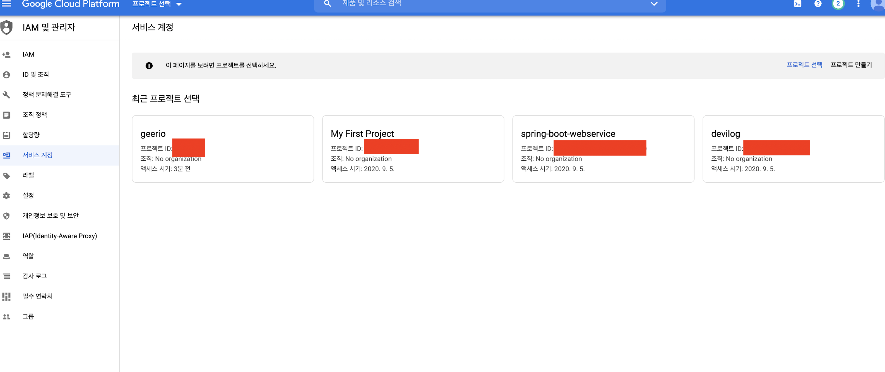
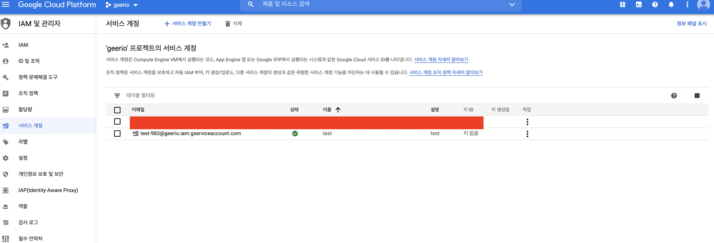
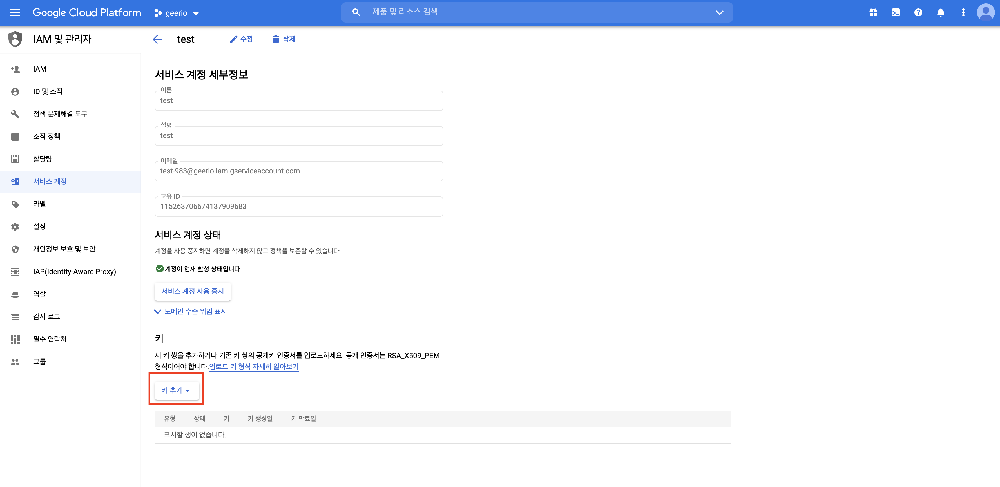
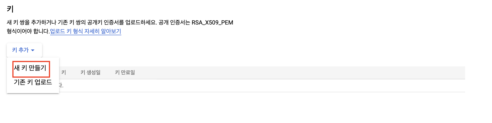
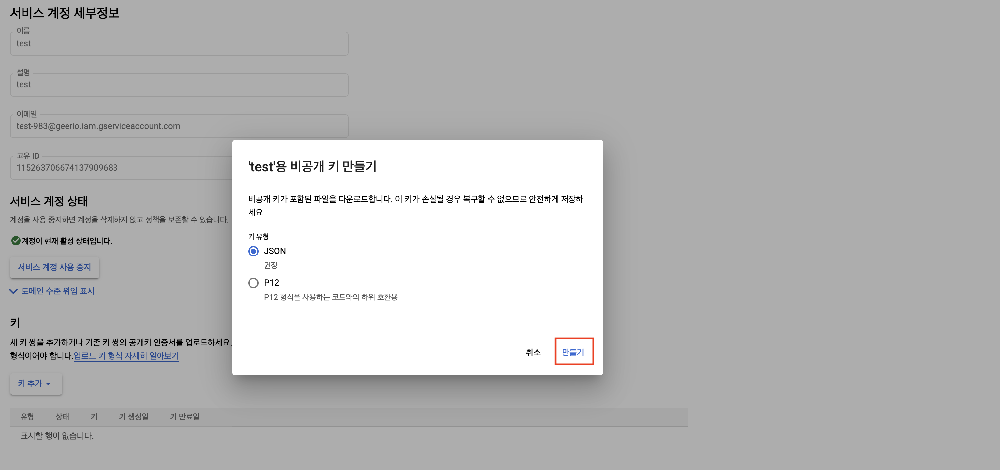
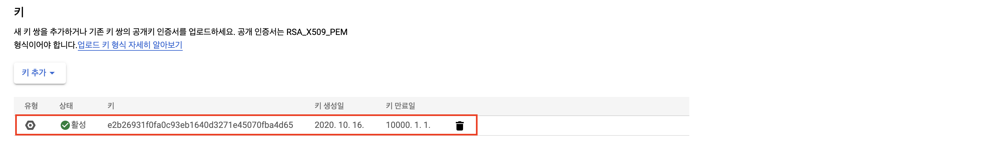
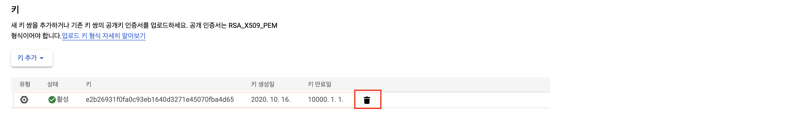
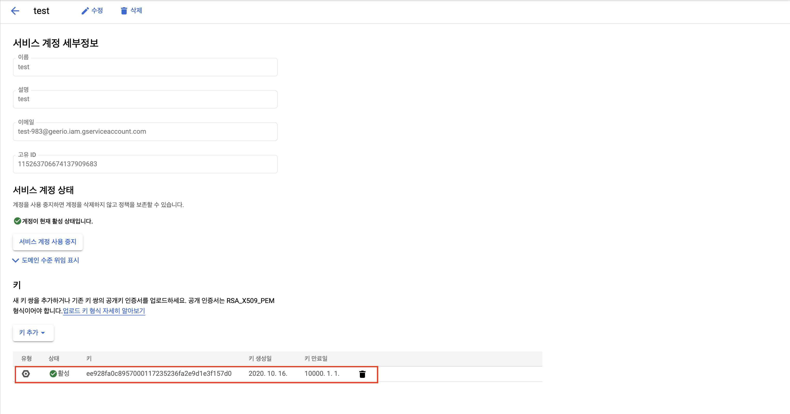

# GCP 프로젝트에 Service Account Key 생성하기


> 실제 GCP를 이용하면서 정리한 내용입니다. 이 문서는 GCP에서 만든 프로젝트의 구성원 외, 다른 사용자가 접속할 수 있도록 "Service Account Key"를 생성하는 방법에 대하여 다루고 있습니다.


## 요구 사항

이 문서를 진행하기 위해서는 적어도 `GCP` 내에서 하나 이상의 프로젝트가 만들어져야 한다. 아직 안 만들었다면, 다음을 참고하라.

* [GCP 가입하기](https://gurumee92.github.io/2020/09/gcp-%EA%B0%80%EC%9E%85%ED%95%98%EA%B8%B0/)
* [GCE 인스턴스 생성 및 설정하기](https://gurumee92.github.io/2020/09/gce-%EC%9D%B8%EC%8A%A4%ED%84%B4%EC%8A%A4-%EC%83%9D%EC%84%B1-%EB%B0%8F-%EC%84%A4%EC%A0%95%ED%95%98%EA%B8%B0/)

자 `GCP` 가입과, 프로젝트 생성을 완료했다면, 시작해보자.


## Service Account Key란?

먼저 `IAM`이란 개념을 알아야 한다. `IAM`이란 `Identity and Access Management`의 약자로 구글 공식 문서에서는 다음과 같이 정의하고 있다.

    IAM을 사용하면 특정 Google Cloud 리소스에 대한 세부적인 액세스 권한을 부여하고 다른 리소스에 대한 액세스를 방지할 수 있습니다. 또한 IAM은 최소 권한의 보안 원칙을 적용하여 특정 리소스에 액세스하는 데 필요한 권한만 부여할 수 있게 해줍니다.

쉽게 말하면, `IAM`이란 `GCP` 리소스에 접근 권한을 부여하는 서비스를 뜻한다. 이 `IAM`이란 서비스를 이용하여, `Service Account Key(이하 SAK)`를 관리할 수 있다. 자세한 내용은 참고 문서 절에 "IAM 개요"를 참고하라. 그렇다면, `SAK`는 무엇일까? 이를 알기 위해선, "서비스 계정"에 대해 알고 있어야 한다. 이는 다음 문서를 참고하라.

* [GCP 프로젝트에 Service Account 생성하기]()

구글 공식 문서에서는 `SAK`를 다음과 같이 정의하고 있다.

    각 서비스 계정은 Google을 인증하는 데 사용되는 두 가지 공개/비공개 RSA 키 쌍 조합인 Google 관리 키 및 사용자 관리 키와 연결되어 있습니다.

뭐 쉽게 말해서, 서비스 계정을 접근하는 키인데, 보통 JSON, P12 이 2가지 방식으로 키를 만들 수 있다. 이 `SAK`만 있으면, 해당 서비스 계정의 액세스할 수 있는 권한을 이용하여, `GCP` 내부 리소스를 액세스할 수 있다. 가령 `Github Actions`에서 `GCE` 내부로 접속하여 터미널 명령어를 내린다든가, `GKE`에 배포 명령을 실행한다든가 이러한 작업들을 할 수 있다. 이제 본격적으로 `SAK`를 만들어보자.


## GCP 웹 콘솔로 SAK 관리하기

`SAK` 생성은 여러가지 방법이 있다. 이 문서에서는 먼저 웹 브라우저를 통해서 UI로 `SAK`를 관리하는 것을 다룬다. 먼저 [이 곳](https://console.cloud.google.com/projectselector2/iam-admin/serviceaccounts)을 클릭하여 이동한다.



그럼 위 화면처럼 프로젝트 목록을 확인할 수 있는 화면이 나온다. 원하는 프로젝트를 클릭한다. 



나는 설명을 위해 가계정을 만들어놨는데, 이미 만들어진 서비스 계정이 있을 것이다. 이를 클릭한다. 

> 참고!
> 
> 저는 문서 작성 후 계정을 삭제해서 해당 정보를 제거하였습니다. 이런 키들은 절대 노출이 되면 안됩니다!! 만약 계정을 만들고 싶다면, "+ 서비스 계정 만들기" 버튼을 클릭하세요. 계정 권한 설정 등은 공식 문서를 확인하고 작업해주어야 합니다.



그리고 "키 추가" 버튼을 누른다. 



그러면 위 화면처럼 드롭다운 UI로 "새 키 만들기", "기존 키 업로드" 가 나오는데 "새 키 만들기"를 클릭한다. 그럼 다음과 같은 팝업이 뜬다.



이제 "만들기" 버튼을 클릭한다. 그럼 다음 화면처럼 키가 생성된 것을 확인할 수 있다.



또한, 다음 삭제 버튼을 누르면, 만든 키를 삭제할 수 있다.




## gcloud 도구로 SAK 관리하기

> 참고!
> 
> 이 절은 로컬 머신에 gcloud 도구가 설치되어 있어야 진행이 가능합니다.

이번에는 `gcloud`도구로 더 쉽게 `SAK`를 생성하고 삭제해보자. 먼저 키를 생성해본다. 터미널을 열고 다음을 입력한다.

```bash
# gcloud iam service-accounts keys create ~/key.json --iam-account <서비스 계정 이름>@<프로젝트 id>.iam.gserviceaccount.com
$ gcloud iam service-accounts keys create ~/key.json --iam-account  test-983@geerio.iam.gserviceaccount.com
```

그럼 local 머신에 `key.json`이 설치된 것을 확인할 수 있다. 또한, UI에서도 확인 가능하다.



아까와 다른 키가 생성된 것을 확인할 수 있다. 이제 키를 삭제해보자.

```bash
# gcloud iam service-accounts keys delete <IAM 키-id> --iam-account <서비스 계정 이름>@<프로젝트 id>.iam.gserviceaccount.com
$ gcloud iam service-accounts keys delete ee928fa0c8957000117235236fa2e9d1e3f157d0 --iam-account test-983@geerio.iam.gserviceaccount.com
ou are about to delete key [ee928fa0c8957000117235236fa2e9d1e3f157d0]
 for service account [test-983@geerio.iam.gserviceaccount.com].

Do you want to continue (Y/n)?  y # y를 입력하셔야 합니다.

deleted key [ee928fa0c8957000117235236fa2e9d1e3f157d0] for service account [test-983@geerio.iam.gserviceaccount.com]
```

끝이다.


> 참고!
> 공개 키 업로드도 가능합니다만, 일단 저는 필요 없기 때문에 이는 따로 설명하지 않겠습니다. 원하신다면, 아래 참고 문서 절의 "서비스 계정 키 생성 및 관리" 링크를 참고하세요.


## 참고 문서

* [GCP 공식 문서 - IAM 개요](https://cloud.google.com/iam/docs/overview?hl=ko)
* [GCP 공식 문서 - 서비스 계정 키 생성 및 관리](https://cloud.google.com/iam/docs/creating-managing-service-account-keys?hl=ko#iam-service-account-keys-create-console)