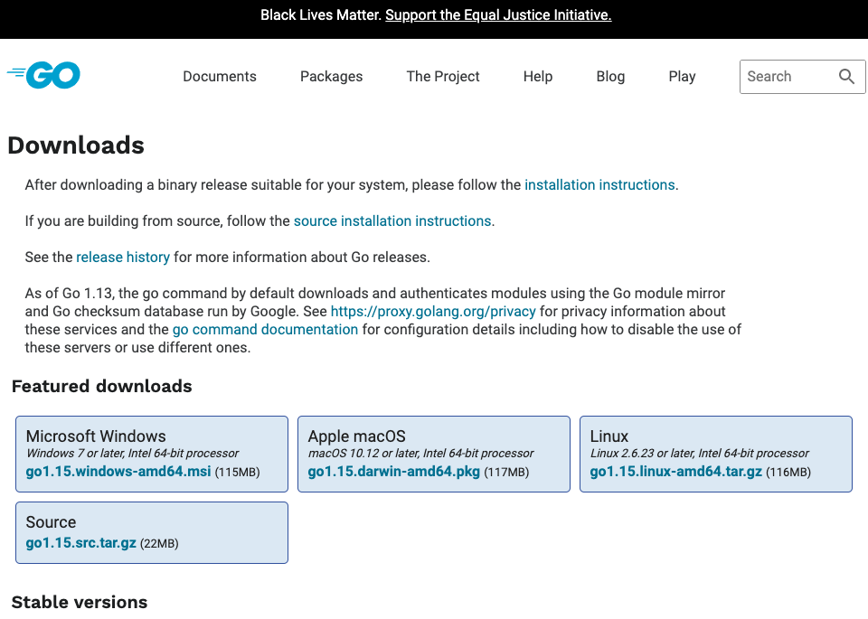
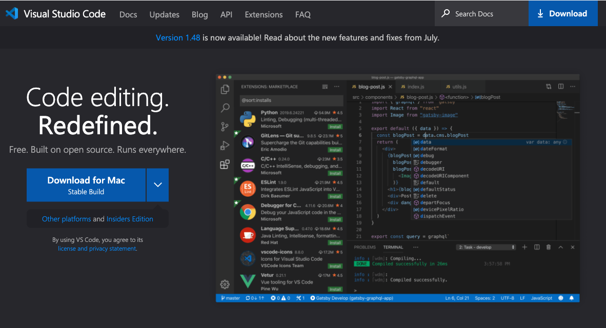

<!--more-->


## 이 시리즈에 대해서

요즘이야말로 `IT 시대`라고 불러도 손색이 없다. 이 시대에 가장 주목 받는 직업은 역시, `개발자`를 포함한 IT 직군일 것이다. 그래서 현재 어린 학생부터 시작해서 많은 사람들의 관심을 받고 있다. 사실, 필자가 프로그래밍을 본격절으로 배울 시점인 2015년에도 양질의 문서들이 무료로 존재했다. 그러나 필자는 전혀 몰랐기 때문에, `렉토피아`라는 프로그래밍 학원에서 기초를 쌓았었다.

2020년 현재에는 이러한 양질의 문서들이 그 때보다 훨씬 더 많다. 이쪽 분야의 특징인 것인지 지금 세대의 특징인 것인지는 모르겠으나 많은 사람들이 자신이 열심히 공부한 지식들을 블로그 혹은 유튜브 등의 미디어 매체를 통해서 공유하고 있다. 즉 검색만 잘 하면 프로그래밍을 배우는데, **돈**이 필요가 없다는 뜻이다. 다만, 그 만큼의 **노력**은 필요하다. 

이 컨텐츠는 프로그래밍이란 무엇인지 간단하게 맛보고 싶은 사람들을 위해서, `Golang`이라는 프로그래밍 언어를 통해서 프로그래밍 지식이 없어도 기본적인 프로그래밍을 배울 수 있도록 제작하였다. 하지만 필자는 아직 많이 부족한 주니어 엔지니어이기 때문에 많은 기대는 하지 않길 바란다 ^^.

이 시리즈는 다음과 같이 구성되었다.

* 1부 이론 기초 프로그래밍(패키지, 변수, 상수, 기본 타입, 복합 타입, 함수, 제어문, 반복문)
* 1부 과제 주소록 만들기
* 2부 이론 객체 지향 프로그래밍(구조체, 메서드, 인터페이스)
* 2부 과제 야구 게임 만들기 
* 3부 이론 동시성 처리하기(고루틴, 채널, 동시성 패턴)
* 3부 과제 웹 크롤러 만들기


## 왜 Golang일까?

필자가 프로그래밍을 처음 배울 때는 무조건 `C`라는 프로그래밍 언어를 배웠었다. 그 다음은 `Java` 최근에는 `Python`, `Javascript`를 처음에 많이 배운다고 한다. 개인적으로 생각할 때, 아직도 모든 개발자가 처음에 접할 때 배워두면 상당한 이점이 있는 좋은 언어들이다. 

#### C

많은 개발자들이 처음에 배울 때 `C`를 배웠었다. 예전에는 `어셈블리 언어`라고 해서 사람이 이해하기 매우 어려운 프로그래밍 언어가 존재하였다. 이 언어를 대체하고 `Unix`라는 시스템을 보다 쉽게 개발하기 위해서 `C`가 개발되었다. 함수 단위의 `절차 지향 프로그래밍`을 통해 구조적으로 프로그래밍을 할 수 있도록 도와준다. 

또한 메모리에 직접 접근할 수 있기 때문에 수 많은 프로그래밍 언어 중 가장 빠르다. 현재까지도 고수준 프로그래밍 언어 중 `C`보다 빠른 프로그래밍 언어는 없다. `C++`, `Rust`만이 `C`만큼의 성능을 낼 수 있다. 또한 언어 자체가 지원하는 기능이 매우 적기 때문에 배우는 것도 좋다. 하지만 메모리를 직접 제어하는 만큼 이를 세심하게 다뤄야 하기 때문에 전문적으로 사용할 때 난이도가 높은 편이라고 할 수 있다. `서버, 네트워크, 시스템 개발자`가 되고 싶다면 배워두는 것을 추천한다.

#### Java

현재 대한민국에서 제일 많은 수요와 공급이 이루어지는 언어라고 생각하면 된다. 객체 지향 프로그래밍을 지원하며, `가비지 컬렉터`라고 해서, 스스로 메모리를 수거해가는 기능을 지원하여 `C`의 골치 아픈 메모리 릭 문제를, 생각하지 않아도 된다.(`Python`, `Javascript` 역시 마찬가지) 

무엇보다, `Spring Framework`라고 해서 웹 서비스 개발 시 많은 회사들이 사용하는 프레임워크인데, 이게 `Java`로 만들어져 있다. 그래서 현재까지, 그리고 앞으로도 대중적으로 많이 쓰일 언어이다. 웹 서비스 특히, `웹 서버 개발자`가 되고 싶다면 배워두는 것을 추천한다.
  
#### Python

현재 가장 핫한 언어들 중 하나이다. 범용 프로그래밍 언어로써, 웹 서비스 개발, 데이터 과학 등 많은 분야에서 쓰이고 있다. 수 많은 프로그래밍 언어 중 배우는데 난이도가 가장 쉽다고 알려져 있으며, 하나만 배워두면 여러 분야에 쓸 수 있기 때문에 사실 필자조차도 주위에서 개발을 배우고 싶다고 할 때 이 언어를 추천한다. 현재 우리 나라는 물론 전 세계에서 수요가 꾸준히 올라가고 있다. `웹 서버 개발자` 혹은 `데이터 분야`에서 일하고 싶다면 배워두는 것을 추천한다.

#### Javascript

웹 서비스를 개발하고 싶다면, `HTML`, `CSS`, `Javascript`는 필수적으로 배워야 한다. 요즘에는 `웹 서버 개발`조차도 `Javascript`로 할 수 있다. 그리고 `웹 클라이언트 개발`은 이 언어를 무조건 사용해야 한다. `Typescript`, `Coffeescript` 등 조차도, 결국 나중에는 `Javascript`로 변환되는 과정을 거친다. 예전에는 제대로 사용하려면 꽤 난이도가 높은 편에 속했지만, 요즘에는 난이도가 매우 쉬워졌다. 다른 언어들에 영향을 받아 여러 기본 기능들이 추가되었기 때문이다. `웹 서비스 개발자`가 되고 싶다면 이 언어를 배워두는 것을 추천한다.

이런 좋은 언어들이 있음에도 왜 `Golang`을 선택했을까? `Golang`은 `Google`이 만든 범용 프로그래밍 언어이다. 많은 사람들이 `C`, `C++`을 대체하기 위한 시스템 프로그래밍 언어라고 오해하는데, 그들이 밝힌 바로는 `Golang`은 시스템 프로그래밍 언어로써 개발 된 적이 없다고 하고 있다. 내가 생각했을 때 `Golang`의 장점은 다음과 같다.

* `C`언어 처럼 언어 자체가 가진 기능이 적어, 배우기 쉽다.
* `C`, `C++`, `Java` 만큼 실행 성능이 빠르다.
* `Python`, `Javascript` 만큼 실행하는데 걸리는 시간이 적다.
* 동시성 처리가 매우 뛰어나다.
* **마스코트가 매우 귀엽다.**


`Golang`은 `C`를 계승했다고 말할 만큼 언어 자체가 가진 기능이 매우 적다. `C`의 경우에는 거대한 서비스는 커녕 간단한 서비스를 개발할 때 조차 매우 부족한 표준 라이브러리를 지녔다. 그래서 외부 라이브러리/프레임워크를 가져와야 하는데 이것이 굉장히 어렵다. 많은 숙련되지 않은 `C`개발자들이 이런 설정 작업에 많은 시간이 걸리기도 한다. 

하지만 `Golang`은 실제로 간단한 서비스를 개발할 때 외부 라이브러리/프레임워크가 없어도 간단하게 개발이 가능할 정도로 표준 패키지가 다양하고 성능도 뛰어나다. 그리고 외부 라이브러리/프레임워크를 가져오는데 별 다른 설정이 필요없다. 그래서 `C`처럼 기능이 적어 배우기도 쉬우면서도 큰 서비스를 개발하는데 전혀 무리가 없다는 뜻이다.

또한, `Golang`은 빌드 속도와 실행 속도가 매우 빠르다. `C`, `C++`, `Java`의 경우, `정적 타입 언어`, `컴파일 언어`로써, `컴파일러`라는 녀석이 실행 전에 작성된 코드를 "컴파일-빌드"란 과정을 거쳐 컴퓨터가 이해할 수 있는 0, 1로 이루어진 명령 집합체로 만든다. 이를 `바이너리 파일`이라고 한다. 이렇게 했을 경우, 실행 속도가 매우 빠르다. 즉 성능이 매우 좋다. 하지만 컴파일-빌드 과정이 프로젝트의 크기가 커지면 커질 수록 매우 오래 걸리게 된다. 

> Java의 경우, 컴파일-빌드 시 "중간 컴파일"이라 하여, 바이너리 파일이 아닌, 바이트 코드가 생성된다. 그리고 "JVM"이란 녀석이, 이 바이트 코드를 각 OS에 맞게 바이너리 파일로 풀어서 실행을 하게 된다.

`Python`, `Javascript`는 `동적 타입 언어`, `인터프리터 언어`로써, 별도의 컴파일-빌드 과정이 필요 없다. `인터프리터`가 실행 도중, 코드를 한 줄 한 줄 해석하여 실행한다. 이 경우, 실행하는데 걸리는 시간은 매우 짧다. 즉, 빌드 속도가 매우 빠르다. 반면에 성능이 매우 떨어진다.

`Golang`은 `정적 타입 언어`, `컴파일 언어`이다. 그러나 `컴파일러`의 성능이 매우 우수해서 컴파일-빌드 과정이 매우 빠르다. 그래서 바이너리 파일로 풀리기 때문에 성능 역시 매우 좋다. 실제 실행하는데 걸리는 시간, 실행 성능 모두 상위권에 속한다. 

또한, 현세대의 많은 컴퓨터들이 CPU가 여러 개를 탑재하고 있다. 이러한 구조의 컴퓨터 성능을 최대한 끌어올리기 위해서 `동시성 프로그래밍`을 많이 사용한다. 그러나 이러한 방식은 기존 프로그래밍 언어로 처리하기에 매우 어렵다. 하지만 `Golang`의 고루틴, 채널 등은 이러한 문제를 간단하고도 훌륭하게 처리한다. 이는 수 많은 개발자들이 `Golang`에 열광하는 큰 이유이다.

무엇보다 `Golang`의 마스코트는 매우 귀엽다. **이는 중요하다.** 검색할 때마다 귀여운 이미지가 보이기 때문에 개발 스트레스를 줄여준다. 우리가 `Golang`을 배우는데 이만한 이유는 없다.


## Golang 설치와 개발 환경 구성

[이 곳](https://golang.org/dl/)을 클릭하여 `Golang` 다운로드 페이지로 이동한다. 그 후 자신에게 맞는 운영 체제에 맞게 `Golang`을 설치한다. 필자의 경우는 `Apple macOS`를 선택하였다.



설치가 완료되면, 터미널에 다음을 입력해서 정상적으로 설치가 되었는지 확인해보자.

```bash
# go version 출력
$ go version
go version go1.14 darwin/amd64
```

설치가 완료되면 `go` 도구 역시 설치가 된다. 이 녀석은 컴파일, 실행, 테스트, 포맷팅 등 개발하는데 도움을 주는 많은 기능을 가지고 있다. 이로써, `Golang`을 개발하는데 최소 환경을 갖추었다. 보다 더 빠른 개발을 위해서, `VSCode`를 설치하자. [이 곳](https://code.visualstudio.com/)으로 이동해서 설치하면 된다.



그 후, `VSCode`를 열어서 `Go` 플러그인을 설치하자. 왼쪽 사이드바를 열어 그림에 나타난 순서대로 진행하면 된다.


1. `Extensions` 아이콘 클릭
2. 검색 창에 "Go" 입력
3. Go 플러그인 설치

이제 `Golang` 개발을 위한 환경을 모두 갖추었다.


## 안녕, 고랭

이제 프로그래밍 언어를 배울 때 가장 많이 쓰이는 예제 프로그램을 한 번 만들어 보도록 하겠다. 바로 "Hello World"인데, 프로그램을 실행하면, "Hello World!"라는 문구를 출력시키는 프로그램이다. 우리는 "안녕, 고랭"이라는 문구를 출력시키는 간단한 프로그램을 작성할 것이다. 먼저 적당한 위치에, `hello.go`라는 파일을 만들고 다음을 작성한다.

hello.go
```go
package main

import "fmt"

func main() {
    fmt.Println("안녕, 고랭")
}
```

이제 `go` 도구를 이용하여 `hello.go`를 컴퓨터가, 이해하여 실행할 수 있는 바이너리 파일을 만들어보자. 터미널에 다음을 입력한다.

```bash
# hello.go 빌드
$ go build hello.go

# 빌드해서 만들어진 바이너리 파일 실행
$ ./hello
안녕, 고랭
```

위의 방법의 경우, 빌드, 실행의 과정을 하나 하나 터미널에 입력해야 한다. `go` 도구는 이 과정을 한 번에 할 수 있다. 터미널에 다음을 입력하자.

```bash
# 이전 빌드 결과물 hello 파일 삭제
$ rm hello

# hello.go 실행
$ go run hello.go
안녕, 고랭
```

이 때, 빌드 결과물은 존재하지 않는다. `go run`은 "**컴파일 -> 빌드 -> 실행 파일 실행 -> 실행 파일 삭제**"의 과정을 거치기 때문이다.

## 참고

다음은 이 문서를 작성할 때, 필자가 참고한 문서 및 서적 리스트이다.

* [A Tour of Go 사이트](https://tour.golang.org/welcome/1)
* 책 "윤성우의 열혈 C 프로그래밍" - 오렌지 미디어

또한, 여러분들에게 무료이면서 필자에게 많은 도움을 주었던 `Golang` 온라인 강좌 링크를 남긴다.

* [Tucker님의 Golang 기초 강좌](https://www.youtube.com/watch?v=Tq3W8UyltFs&list=PLy-g2fnSzUTAaDcLW7hpq0e8Jlt7Zfgd6)
* [노마드 코더의 Golang 강좌](https://nomadcoders.co/go-for-beginners)

개인적으로 기초를 닦고 가는 편이면, Tucker님 강의를, 만들면서 배우는 편이면, 노마드 코더 강의를 듣길 바란다.