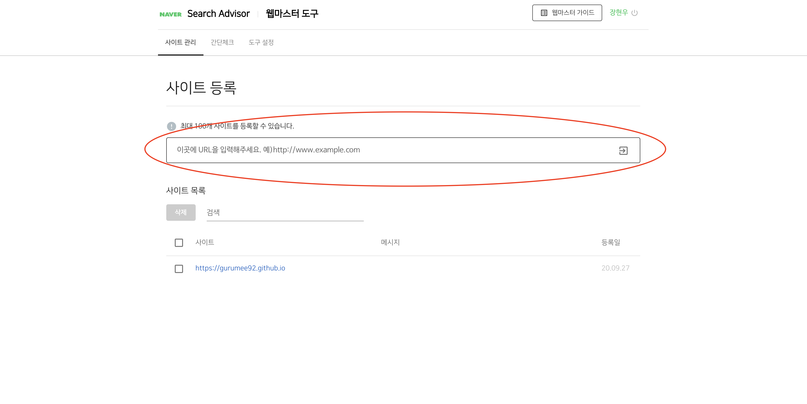
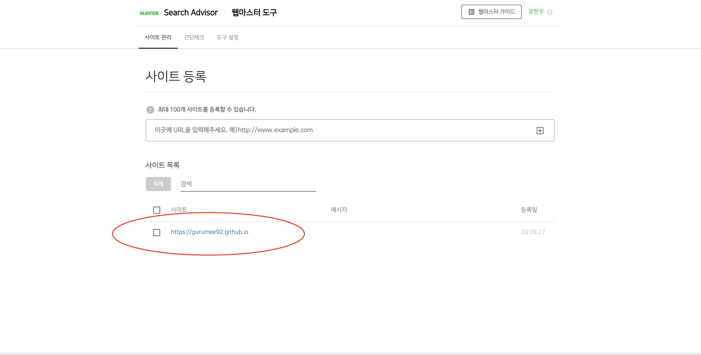

# 블로그 구축기 (2) 검색 엔진에 노출하기

## 개요 

개인 블로그를 만들고 신나게 포스팅을 쓰고 있었는데 친구에게 뜻밖에 소식을 들었다. 너의 블로그가 검색이 되지 않는다고.. 구글 혹은 네이버 등의 검색 포털에 사이트 등록을 했냐고.. 여태까지 네이버 혹은 티스토리에서만 블로그를 작성해서 당연히 검색 엔진에 노출이 될 줄 알았는데 아니었다. 깃헙 혹은 워드 프레스 등의 개인 블로그들은 검색 엔진에 노춣시키기 위해서 별도의 작업이 필요하다라는 것을 알게 되었다.

이제부터 구글, 네이버, 다음 검색 엔진의 내 사이트를 등록해보자.


## 구글 검색 엔진 등록

먼저 구글에 사이트를 등록한다. [Google Search Console](https://search.google.com/search-console/about?hl=ko)로 이동한다.


"시작하기" 버튼을 누른다.


"URL 접두어"를 클릭한 후 자신의 사이트를 입력한다.


다음의 html 파일을 다운로드 받는다. 그 후, 자신의 블로그 디렉토리의 "public" 디렉토리에 넣어준다. 또한, 자신의 "public" 디렉토리에 `sitemap.xml`이 없다면, 만들어주고 다음을 입력해준다.

```xml
<?xml version="1.0" encoding="UTF-8"?>
<urlset xmlns="http://www.sitemaps.org/schemas/sitemap/0.9">
    
    <url>
        <loc>{{ site.url }}{{ post.url | remove: 'index.html' }}</loc>
    </url>
    

    
    
    
    <url>
        <loc>{{ site.url }}{{ page.url | remove: 'index.html' }}</loc>
    </url>
    
    
    
</urlset>  
```

이제 그 상태로 한 번, 블로그를 배포해준다. 그리고 `<자신의 블로그 URL>/sitemap.xml`을 브라우저에 검색했을 때, 결과가 나오면 끝이다.


## 네이버 검색 엔진 등록

이제 네이버를 등록해보자. [네이버 웹 마스터 도구](https://searchadvisor.naver.com/console/board)로 이동한다. 



여기서 자신의 블로그를 입력한 후 엔터를 쳐준다. 그럼 다음 화면이 나온다.


역시, 해당 HTML 파일을 다운 받아 블로그의 "public" 디렉토리에 넣어준다. 그 후, `robots.txt`를 다음과 같이 입력하여, 네이버 및 기타 검색 로봇들이 수집할 수 있게 허용해준다.

```txt
User-agent: *
Allow: /
```

그리고 `rss.xml`을 다음과 같이 만들어준다. 필자의 경우 `index.xml`이 이 역할을 해준다. 이런 것이 있을 경우 생략해도 좋다.

```xml
<rss version="2.0" xmlns:atom="http://www.w3.org/2005/Atom">
  <channel>
    <author>{{.Site.Author.name}}</author>
    <title>{{ if eq  .Title  .Site.Title }}{{ .Site.Title }}{{ else }}{{ with .Title }}{{.}} on {{ end }}{{ .Site.Title }}{{ end }}</title>
    <link>{{ .Permalink }}</link>
    <description>Recent content {{ if ne  .Title  .Site.Title }}{{ with .Title }}in {{.}} {{ end }}{{ end }}on {{ .Site.Title }}</description>
    <generator>Hugo -- gohugo.io</generator>{{ with .Site.LanguageCode }}
    <language>{{.}}</language>{{end}}{{ with .Site.Author.email }}
    <managingEditor>{{.}}{{ with $.Site.Author.name }} ({{.}}){{end}}</managingEditor>{{end}}{{ with .Site.Author.email }}
    <webMaster>{{.}}{{ with $.Site.Author.name }} ({{.}}){{end}}</webMaster>{{end}}{{ with .Site.Copyright }}
    <copyright>{{.}}</copyright>{{end}}{{ if not .Date.IsZero }}
    <lastBuildDate>{{ .Date.Format "Mon, 02 Jan 2006 15:04:05 -0700" | safeHTML }}</lastBuildDate>{{ end }}
    {{ with .OutputFormats.Get "RSS" }}
        {{ printf "<atom:link href="/rss.xml" | prepend: site.baseurl | prepend: site.url }}" rel="self" type="application/rss+xml"/>" .Permalink .MediaType | safeHTML }}
    {{ end }}
    {{ range .Pages }}
    <item>
      <title>{{ .Title }}</title>
      <author>{{.Site.Author.name}}</author>
      <link>{{ .Permalink }}</link>
      <pubDate>{{ .Date.Format "Mon, 02 Jan 2006 15:04:05 -0700" | safeHTML }}</pubDate>
      {{ with .Site.Author.email }}<author>{{.}}{{ with $.Site.Author.name }} ({{.}}){{end}}</author>{{end}}
      <guid>{{ .Permalink }}</guid>
      <description>{{ .Content | html }}</description>
    </item>
    {{ end }}
  </channel>
</rss>
```

그리고 다시 한 번 배포를 진행한다. 그 후 "웹 마스터 도구 > 사이트 관리"로 이동한다. 해당 URL을 클릭하면 된다.



그럼 다음 화면으로 넘어가게 된다.


여기서 "요청 > RSS 제출"로 넘어가서, 자신의 RSS를 제출하자.


이제 "요청 > 사이트맵 제출"로 넘어가서 자신의 사이트맵을 제출하자.


끝이다. 채널 등록도 있는데 이거는 넘어가자.


## 다음 검색 엔진 등록

이제 다음 검색에 사이트를 등록해보자. 먼저 [Daum Search](https://register.search.daum.net/index.daum)로 이동한다.


그 후 자신의 사이트를 등록한다. 그럼 수집 동의 페이지로 이동한다.


모두 동의를 누르고 다음 화면으로 넘어가자.


필요 정보들을 모두 입력한다. 끝이다.

이렇게 해서 구글, 네이버, 다음 검색 엔진에 내 사이트를 등록하였다. 사이트 등록 후 검색에 노출되기까지는 조금의 시간이 걸린다고 한다. 만약 이후에 내 블로그가 네이버, 구글, 다음에서 노출이 된다면 잘 된 것이겠지. 