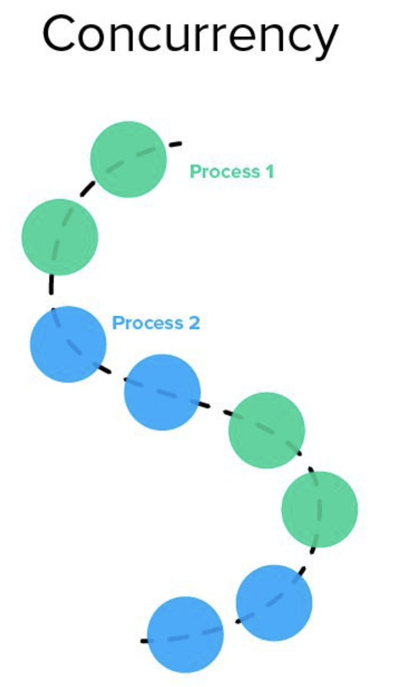

# 자바에서 동시성과 병렬성 

<center></center>
## 개요

금일 친 형의 작업을 도와주게 되면서, 동시성과 병렬성을 다루게 되었다. 이에 대해서 정리하고자 한다. 이 코드를 실행하기 위해서는 다음이 필요하다.

* Java 11
* Maven (이건 선택적으로 Gradle도 가능)
* JUnit 4 (테스트를 위해서)


## 동시성과 병렬성의 차이

먼저 동시성과 병렬성의 차이가 무엇인지 알아야 한다. 프로그래밍 세계에서 **동시성**이란, 한 `CPU`에서 동시에 여러 작업을 하는 것처럼 보이게 만드는 것이다. 다음 그림을 살펴보자.



이렇게 한 `CPU`에서 2개의 프로세스가 있다고 가정해보자. 이 둘은 엄청나게 짧은 시간에 컨텍스트 스위치가 일어나며 번갈아서 실행된다. 다음 그림처럼 말이다.


그래서 사람 눈으로 볼 때, 동시에 동작하는 것처럼 보인다. 이것이 프로그래밍 세계에서의 **동시성**이다. 

**병렬성**은 동시성과는 다르게 여러 `CPU`에서 코드가 병렬적으로 실행되는 것을 말한다. 그림을 살펴보자.


위에 그림은 2개의 `CPU` 에서 작업이 병렬적으로 실행되는 흐름을 나타내고 있다. 이것들은 한 `CPU`당 코드가 실행되는 것을 뜻한다. 다음 그림처럼 말이다.


일반적으로 동시성과 병렬성 중 성능은 동시성이 더 우세한다. 왜냐하면, `CPU`와 하드웨어 등 쓰는 자원이 병렬성에 비해 적기 때문이다.

참고적으로 동기와 비동기의 차이, 블로킹과 논블로킹의 차이를 알면 더 좋다. 이는 내가 존경하는 개발자 중 한 분이신 `하마`님의 블로그에 잘 정리되어 있다. 그 문서를 참고했으면 좋겠다.

* [하마님 블로그 "블럭,논블럭,동기,비동기 이야기"](https://hamait.tistory.com/930)

이제 자바에서 동시성과 병렬성을 어떻게 다루는지 살펴보자. 먼저, 영화 리스트를 제공하는 `API`에서 데이터를 읽어와 그냥 출력하는 `MovieApiFetcher` 코드이다. 이 녀석은, `Java 11`에 만들어진 `HttpClient`를 사용한다.

다음은 API를 콜하는 코드이다.

```java
package components.fetcher;

import java.net.URI;
import java.net.URISyntaxException;
import java.net.http.HttpClient;
import java.net.http.HttpRequest;
import java.net.http.HttpResponse;
import java.time.Duration;
import java.util.concurrent.CompletableFuture;

public class MovieApiFetcher {
    private String URL = "https://yts.mx/api/v2/list_movies.json";
    private final static HttpClient httpClient = HttpClient.newBuilder()
            .connectTimeout(Duration.ofSeconds(30))
            .build();

    public CompletableFuture<String> fetch(int pageId) {
        URI uri = null;
        try {
            uri = new URI(URL + "?page=" + pageId);
            return httpClient.sendAsync(
                    HttpRequest.newBuilder(uri)
                            .GET()
                            .build(),
                    HttpResponse.BodyHandlers.ofString()).thenApply(HttpResponse::body);
        } catch (URISyntaxException e) {
            e.printStackTrace();
            return new CompletableFuture<>();
        }
    }
}
```

이제 이를 활용한다.


## 자바 동시성 코드

먼저 자바에서 동시성을 사용하는 대표적인 수단은 `Thread`이다. 그리고 여러 스레드를 관리하는 `ThreadPool`이 있다. 이를 이용할 것이다. 전체 코드는 다음과 같다.

```java
import components.fetcher.MovieApiFetcher;
import org.junit.Test;

import java.util.concurrent.ExecutorService;
import java.util.concurrent.Executors;

public class ConcurrentTest {
    @Test
    public void test() {
        long beforeTime = System.currentTimeMillis(); // 시작 시간
        final int nThreads = 50;
        final int requestPerThread = 20;
        final ExecutorService executorService = Executors.newFixedThreadPool(nThreads);
        var fetcher = new MovieApiFetcher();

        for(int thread = 1; thread < nThreads + 1; thread++) {
            final int id = thread;
            Runnable task = () -> {
                for (int i=0; i<requestPerThread; i++) {
                    try {
                        int page = (id + i * nThreads);
                        String result = fetcher.fetch(page).get();
                        System.out.println(page + " " + result);
                    } catch (Exception e) {
                        e.printStackTrace();
                    }
                }
            };
            executorService.submit(task);
        }

        executorService.shutdown();

        while (!executorService.isTerminated()) { }

        long afterTime = System.currentTimeMillis();
        double secDiffTime = (afterTime - beforeTime)/1000.0;
        System.out.println("전체 테스트 실행시간 : "+ secDiffTime + "초");
    }
}
```

코드를 하나하나 살펴보자.

```java
long beforeTime = System.currentTimeMillis(); // 시작 시간

// ... 
long afterTime = System.currentTimeMillis();
double secDiffTime = (afterTime - beforeTime)/1000.0;
System.out.println("전체 테스트 실행시간 : "+ secDiffTime + "초");
```

이 코드는 애플리케이션의 실행 결과를 나타내기 위해 사용하였다. 

```java
// ...

final int nThreads = 50;
final int requestPerThread = 20;
final ExecutorService executorService = Executors.newFixedThreadPool(nThreads);

// ...

executorService.shutdown();

while (!executorService.isTerminated()) { }

// ...
```

위 코드는 `ThreadPool`을 생성한다. 최대 스레드를 50개, 스레드 내에서 동기적으로 호출되는 API 요청 개수를 20개로 한다. 즉 1000개의 요청이 이루어진다. 

또한 요청이 끝나면, `ThreadPool`에서 모든 쓰레드가 종료될 때까지 기다린다.

```java
var fetcher = new MovieApiFetcher();

for(int thread = 1; thread < nThreads + 1; thread++) {
    final int id = thread;
    Runnable task = () -> {
        for (int i=0; i<requestPerThread; i++) {
            try {
                int page = (id + i * nThreads);
                String result = fetcher.fetch(page).get();
                System.out.println(page + " " + result);
            } catch (Exception e) {
                e.printStackTrace();
            }
        }
    };
    executorService.submit(task);
}
```

`Runnable` 인터페이스인데, `ThreadPool`에 넣을 때는 `Thread`가 아닌 `Runnable`을 넣으는 것이 좋다. `Thread` 역시 `Runnable`을 구현하고 있다.

`fetcher`를 만들고 `Runnable` 당 20개의 요청을 동기적으로 호출하는 `task`를 만든다. 그리고 이 태스크를 `ThreadPool`에 넣어준다.

> `Callable<T>`로 하면 조금 더 성능 향상이 있을 순 있겠으나.. 귀찮아서 Runnable로 짰다.

이게 코드의 다이다. 결과는 어떠한가?

```bash
...
전체 테스트 실행시간 : 29.142초
```

천개 요청하는데 약 30초가 걸렸다.


## 자바 병렬성 코드

이번엔 병렬성 코드를 보자.

```java
import components.fetcher.MovieApiFetcher;
import org.junit.Test;

import java.util.concurrent.CompletableFuture;
import java.util.stream.IntStream;

public class ParrallelTest {
    @Test
    public void test() {
        long beforeTime = System.currentTimeMillis();
        final int nThreads = 50;
        final int requestPerThread = 20;
        var fetcher = new MovieApiFetcher();

        // 1 ~ 1000 개 변환 과정 int -> Integer -> CompletableFuture<String> -> Void
        IntStream.rangeClosed(1, nThreads * requestPerThread)
                .boxed()
                .map(fetcher::fetch)
                .parallel()
                .map(CompletableFuture::join)
                .forEach(System.out::println);

        long afterTime = System.currentTimeMillis();
        double secDiffTime = (afterTime - beforeTime)/1000.0;
        System.out.println("전체 테스트 실행 시간 : "+ secDiffTime + "초");
    }
}
```

훨씬 깔끔하긴 하다. `Stream API`를 이용해 연산을 해서 그런가. 이것도 코드만 살펴보자. 시간 재는 것은 같다. 제일 중요한 코드만 살펴보자.

```java
IntStream.rangeClosed(1, nThreads * requestPerThread)
    .boxed()
    .map(fetcher::fetch)
    .parallel()
    .map(CompletableFuture::join)
    .forEach(System.out::println);
```

`IntStream.rangeClosed`는 첫 매개 변수부터, 두 번째 매개 변수까지의 숫자를 만들어낸다. 즉 1 ~ 50 * 20(=1000) 의 숫자 스트림을 만든다.

그 후, 박스 타입인 `Stream<Integer>`로 변경하고, 이 스트림의 원소들을 다 `MovieApiFetcher`의 `fetch` 파라미터로 보낸다.

그 후 `CompletableFuture.join`을 통해서 API 요청이 끝날 때까지 기다리고 데이터를 출력하는 코드이다. 이 때, `join`을 하면서 스트림이 동기적인 호출로 변경되기 때문에 성능이 느려진다. 

이는 `parallel`을 사용하여 병렬 스트림으로 스트림을 바꾸면 된다. 그럼 `Java`가 최적화하여 작업들을 고루게 `CPU`에 분배시켜준다.

병렬성 코드의 실행 시간은 다음과 같다.

```
...
전체 테스트 실행시간 : XXX초 
```

