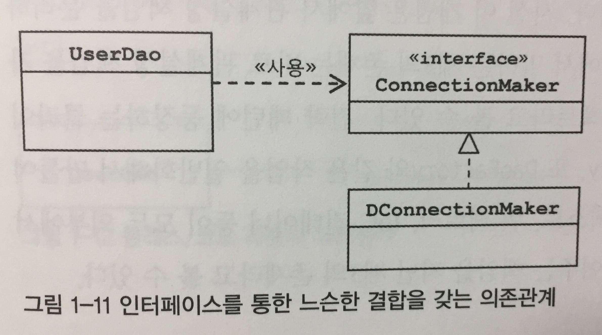

# 1장 오브젝트와 의존관계 (2)


    책장속 먼지털기 스터디 2차
    스터디 날짜 : 2020.11.16 (불참)
    작성 날짜 : 2020.11.14 ~ 15
    페이지 : 102 ~ 143


## 싱글톤 레지스트리? 

우리가 만든 `DaoFactory`를 직접 사용하는 것과, `@Configuration` 애노테이션으로 `ApplicationContext`에 등록해서 사용하는 것에는 어떤 차이가 있을까? 결론부터 말하면 차이는 스프링 빈이냐 아니냐의 차이다. 스프링 빈은 이전에 언급했 듯이, 스프링 IoC 컨테이너가 라이프 사이클을 관리하는 객체들이다. 스프링 빈은 특정 스코프를 가지는데 기본적으로 "싱글톤" 스코프를 가진다. 쉽게 말하면, 애플리케이션에서 딱 1개의 객체만 만들어진다.

이 후 챕터에서 다룰 것이지만 한 발 앞서서 JUnit(나는 JUnit5이다.) 라이브러리를 활용하여, 테스트 코드를 추가해보자. 


```java
// ..

class UserDaoTest {
    // ...

    @Test
    @DisplayName("동등성 테스트 - DaoFactory")
    public void test02() {
        DaoFactory factory = new DaoFactory();
        UserDao dao1 = factory.userDao();
        UserDao dao2 = factory.userDao();
        assertNotSame(dao1, dao2);
    }

    @Test
    @DisplayName("동등성 테스트 - ApplicationContext")
    public void test03() {
        ApplicationContext applicationContext = new AnnotationConfigApplicationContext(DaoFactory.class);
        UserDao dao1 = applicationContext.getBean(UserDao.class);
        UserDao dao2 = applicationContext.getBean(UserDao.class);
        assertSame(dao1, dao2);
    }
}
```

위의 2 테스트는 `DaoFactory`를 직접 사용하는 것과, 스프링 빈으로 등록시켜서 사용할 때의 차이를 명확하게 보여준다. `assertNotSame`은 두 객체의 동일성이 틀린지에 대해 테스트한다.(dao1 != dao2) `assertSame`은 두 객체의 동일성이 같은지에 대해 테스트한다.(dao1 == dao2) 즉, 직접 `DaoFactory`를 만들어서 사용할 때, `userDao` 메소드를 호출할 때마다 새로운 객체를 반환한다. 반면에, 스프링 빈으로 등록했을 경우, `DaoFactory`, `UserDao` 모두 빈으로 등록되기 때문에 같은 객체를 반환하게 된다.

> 참고! 동일성과 동등성
> 
> "오브젝트가 동일하다", "오브젝트가 동등하다"라는 말은 얼핏 들으면 같은 말로 이해할 수 있습니다. 그러나 이들은 서로 다른 말입니다. 동일하다는 같은 객체인지를 판단합니다. 즉, 객체의 참조가 같은지를 따집니다. 자바에서는 "==" 연산자로 이를 확인할 수 있습니다. 반면에, 동등성은 객체에 들어있는 정보가 같은지를 판단합니다. 자바에서는 보통 "equals" 메소드를 호출하여 동등성을 판단하는 것이 관례입니다. 다만, 클래스에 동등성을 판단하는 equals 메소드가 적절하게 오버라이딩 되어 있지 않으면, 동등성이 꺠질 수 있다는 것을 알아두세요.

그렇다면 여기서 의문점이 생긴다. "왜 스프링은 (기본적으로 )싱글톤으로 스프링 빈을 만드는 것인가?" 이는 스프링의 출발이, 자바 엔터프라이즈 기술을 사용하는 서버 환경에서 시작되었기 때문이다. 

스프링이 시작됐던 시기에, 서버 하나 당 최대 초당 수십/수백 번씩 브라우저나 다른 시스템으로부터 요청을 처리할 수 있는 성능이 요구되었다. 이 때 매번 요청 시마다, 그 요청을 처리하는 각 컴포넌트를 매번 생성했다고 가정해보자. 이를 감당할 수 있었겠는가? 요청 1번의 5개의 객체가 만들어지고, 초당 500개 요청이 들어온다고 하면, 초당 2500개의 객체가, 분당은 5만개, 한시간이면 9백만개가 생성된다. GC 성능이 좋아진 지금이라도 부하를 받을 수 밖에 없다. 그래서 이 자원들을 최대한 아끼기 위해서, 하나의 객체를 공유해서 동시에 사용하게 되었다. 이를 디자인 패턴으로 시각으로는 "싱글톤 패턴"이라고 한다. 이 패턴에 대한 자세한 내용은 다음 문서를 참고하자.

* [싱글톤 패턴](https://gmlwjd9405.github.io/2018/07/06/singleton-pattern.html)

그러나 "싱글톤 패턴"은 다음과 같은 한계가 있다.

1. private 생성자를 갖고 있기 때문에 상속할 수 없다.
2. 테스트하기 어렵다.
3. 서버 환경에서 하나만 만들어짐을 보장할 수 없다.
4. 싱글톤은 전역 상태로 만들 수 있기 떄문에 바람직하지 못하다. (정적 메소드로 접근할 수 있다.)

이러한 한계를 극복하기 위해서, 스프링은 "싱글톤 레지스트리"를 사용한다. 쉡게 말해서, 싱글톤 패턴이 적용되지 않은 일반 클래스조차도 싱글톤으로 관리할 수 있게 만드는 기술이다. `ApplicationContext`는 "빈 팩토리"이자, "싱글톤 레지스트리"이기도 하다. 그래서 이전 테스트 코드에서 확인할 수 있듯이 `getBean` 메소드로 스프링 빈을 수 없이 호출하더라도, 딱 하나의 객체만 반환됨을 확인할 수 있다. 물론 아무런 설정한 것이 없다면 말이다. 참고적으로 자주 사용되는 스프링 빈의 스코프는 다음과 같다.

1) 싱글톤 - 기본 스코프, 애플리케이션 전체에서 딱 1개
2) 프로토타입 - 빈을 호출할 때마다, 생성됨.
3) 리퀘스트 - HTTP 요청 시 빈이 생성됨.
4) 세션 - 웹의 세션과 스코프가 유사함.

이러니 저러니 해도, 스프링 빈의 스코프는 아마 싱글톤이 제일 많을 것이다. 왜냐하면 기본 스코프이기도 하고, 앞서 언급했듯 자원을 최소화할 수 있기 떄문이다. 이 때 주의 사항이 있다. 바로 싱글톤 객체가 "상태"를 가져서는 안된다는 것이다. 왜냐하면 상태를 가지게 된다면, 멀티 스레딩 환경에서, 그 상태가 의도치 않게 변할 수 있다. 잘 이해가 안된다면 다음 코드를 보자.

```java
public class UserDao {
    private ConnectionMaker connectionMaker;
    // 추가 필드
    private Connection c;

    public UserDao(ConnectionMaker connectionMaker) {
        this.connectionMaker = connectionMaker;
    }

    public void add(User user) throws ClassNotFoundException, SQLException {
        // 수정
        c = connectionMaker.makeConnection();

        PreparedStatement ps = c.prepareStatement("insert into users(id, name, password) values(?, ?, ?)");
        ps.setString(1, user.getId());
        ps.setString(2, user.getName());
        ps.setString(3, user.getPassword());
        ps.executeUpdate();

        ps.close();
        c.close();
    }

    // ...
}
```

`UserDao`를 살짝 변경한 것인데, 필드로 `Connection`을 가지게 되었다. 이 경우, `add` 메서드를 호출할 때 마다, c가 참조하는 `Connection` 객체가 변경된다. 이는 멀티 스레딩 환경에서 값이 제대로 데이터베이스에 저장되지 않는 심각한 문제를 초래한다. 또한, 이 메소드의 실행 결과가 잘되는 것조차 알 수 없다. 이러한 문제를 제거하기 위해서는 이전 코드처럼 상태가 변경될 수 있는 객체는 메소드 레벨에서 관리하는 것이 좋다. 혹은 필드로 주입하는 객체를 빈으로 만드는 방법도 있지만.. 별로 좋은 생각은 아니라고 본다.


## IoC와 DI

이전에, IoC 컨테이너는 매우 넓은 범위의 개념이라고 언급했었다. 이에 대한 좁은 개념으로써 쓰는 것이 "DI(Dependency Injection)"이다. 직역하면, "의존성 주입"이다. 개인적으로 책에서 나온 설명이 잘 설명해주는 것 같아 긁어왔다. 

> "DI는 오브젝트 래퍼런스를 외부로부터 제공받고 이를 통해, 여타 오브젝트와 다이나믹하게 의존 관계를 만들어지는 것이 핵심이다."

여기서 의존 관계란 무엇일까?


위 UML에서는 A클래스는 B클래스에게 의존 관계에 있다고 말할 수 있다. 바꿔서, A클래스는 B클래스를 사용한다고도 말할 수 있다. 반면, B클래스는 A클래스에 의존하지는 않는다. 여기서 알 수 있는 것은 **의존 관계에는 방향성이 있다.**

이제 그럼 `UserDao`의 의존 관계를 짚어보자.



`UserDao`는 인터페이스인 `ConnectionMaker`를 사용한다. 이 `ConnectionMaker`에만 의존하고 있다. 실제로 `DConnectionMaker`라든지, 내가 이전에 만들었던 `SimpleConnectionMaker`에 대해서 알지도 못 할 뿐더러 내부의 메서드가 변경되더라도 `UserDao`에 영향을 끼치지 않는다. 따라서, 이들은 결합도가 낮다고 볼 수 있다. 

의존관계 주입은 크게 다음의 세 가지 조건을 충족하는 작업을 말한다.

* 클래스 모델이나 코드에는 런타임 시점의 의존 관계가 드러나지 않는다. (즉, 인터페이스에만 의존하고 있어야 한다.)
* 런타임 시점의 의존 관계는 컨테이너나 팩토리 같은 제 3의 존재가 결정한다.
* 의존 관계는 사용할 오브젝트에 대한 래퍼런스를 외부에서 제공해줌으로써 만들어진다.

`UserDao`의 런타임 의존 관계는 다음과 같아진다.


`DaoFactory`가 `ConnectionMaker`를 결정해서 넘겨주게 된다. 그림에서는 `DConnectionMaker`이지만, 내 코드에서는 `SimpleConnectionMaker`로 보면 된다. `UserDao` 입장에서는 `DaoFactory`에 의해서, `ConnectionMaker`의 참조를 전달 받는다. 그래서 인터페이스인 `ConnectionMaker`를 구현하는 어떤 클래스든 영향을 받지 않고 쉽게 쓸 수 있다.

정리하면, `DI`는 자신이 사용할 오브젝트에 대한 선택과 생성 제어권을 외부로 넘기고 수동적으로 주입받은 오브젝트를 사용한다. 스프링 IoC 컨테이너는 이 DI에 초점이 맞춰져 있다는 것을 알아두자.

IoC는 DI외에, "의존 관계 검색"이란 개념도 있다. 자신이 필요로 하는 의존 오브젝트를 능동적으로 찾는다. 물론 자신이 어떤 클래스의 오브젝트를 사용하는 것을 결정하지는 않는다. 쉽게, 오브젝트를 결정하고 생성하는 것은 IoC 컨테이너가 맡고, 이를 가져올 때 메서드는 생성자를 통한 주입 대신 스스로 컨테이너를 요청할 수 가 있다. 

```java
public UserDao() {
    DaoFactory factory = new DaoFactory();
    this.connectionMaker = factory.connectionMaker();
}
```

위 코드가 그 예시에 해당한다. `UserDao`는 여전히, `ConnectionMaker`의 구현 클래스 오븍젝트를 알 지 못한다. 런타임 시, `DaoFactory`가 동적으로 그 의존관계를 맺어주는 것이다. `ApplicationContext`를 사용한다면, 이렇게도 쓸 수 있을 것이다.

```java
public UserDao() {
    ApplicationContext applicationContext = new AnnotationConfigApplicationContext(DaoFactory.class);
    this.connectionMaker = applicationContext.getBean("connectionMaker", ConnectionMaker.class);
}
```

의존 관계 검색은 DI와 비슷하다. 다만 방법이 조금 다를뿐이다. 하지만, DI가 조금 더 단순하고 깔끔하기 때문에, DI를 많이 쓴다. 의존 관계 검색이 DI보다 좋은 점은 딱 한 가지, 검색하는 오브젝트가 꼭 스프링 빈일 필요가 없다는 것이다. 물론 의존 오브젝트는 스프링 빈이어야 하지만..

여기서 DI의 장점을 알고 가자. 책에서는 다음을 장점으로 소개하고 있다.

> 코드에는 런타임 클래스에 대한 의존 관계가 나타나지 않고, 인터페이스를 통해 결합도가 낮은 코드를 만든다. 따라서, 다른 책임을 가진 의존 관계에 있는 클래스가 변경되더라도 자신은 영향을 받지 않으며 변경을 통한 다양한 확장 방법을 제공한다.

쉽게 말하면 다음의 장점이 생긴다. 

1) 기능 구현의 교환이 쉽다.
2) 부가 기능 추가가 쉽다.

첫 번째 장점의 대표적인 예는 로컬 운영 DB, 실제 DB를 빈을 통해서 바꿔서 주입할 수 있다. 

```java
@Configuration
public class DaoFactory {
    @Bean
    public UserDao userDao() {
        UserDao userDao = new UserDao(connectionMaker());
        return userDao;
    }

    @Bean
    public ConnectionMaker connectionMaker() {
        return new LocalDBConnectionMaker();
    }
}
```

로컬 머신에서 이렇게 의존관계가 되어 있다고 해보자. 코드를 올릴 때는 다음과 같이 1줄만 변경하면 된다.

```java
@Configuration
public class DaoFactory {
    @Bean
    public UserDao userDao() {
        UserDao userDao = new UserDao(connectionMaker());
        return userDao;
    }

    @Bean
    public ConnectionMaker connectionMaker() {
        return new ProductionDBConnectionMaker();
    }
}
```

최근에는 이런 코드보다는 `appliaction.properties`, `application.yml` 등 설정 파일에서, 프로파일을 분리해서 데이터 소스를 설정을 많이 하는 편이다. 또한 두 번째 장점은 부가 기능 추가가 쉽다는 것이다. 만약, 데이터 베이스를 연결하는 횟수를 만들고 싶다면, 다음과 같이 변경하면 된다.

```java
@Configuration
public class DaoFactory {
    @Bean
    public UserDao userDao() {
        UserDao userDao = new UserDao(connectionMaker());
        return userDao;
    }

    // 부가 기능을 추가한 ConnectionMaker
    @Bean
    public ConnectionMaker connectionMaker() {
        return new CountingConnectionMaker(realConnectionMaker());
    }

    // 이전 ConnectionMaker
    @Bean
    public ConnectionMaker realConnectionMaker() {
        return new ProductionDBConnectionMaker();
    }
}
```

참고적으로 의존 관계 주입은 여러 방법이 있다. 이들은 다음과 같다.

1) 생성자 주입
2) 필드 주입
3) 세터 주입
4) 메서드 주입

책에서는 전통적으로 세터 주입을 많이 사용된다고 적혀 있지만, 스프링 부트 세대인 나한테는 오히려, 생성자 주입이나 테스트 코드에서 필드 주입을 많이 썼던 것 같다.


## Xml 기반 설정

현재는 자바 코드 기반, 애노테이션 기반으로 의존성 주입을 하지만, 그 이전에는 xml 기반으로 설정하는 방식을 많이 사용했다. 간단하게 살펴보자. 원래 `DaoFactory`의 코드를 살펴보자.

```java
@Configuration
public class DaoFactory {
    @Bean
    public UserDao userDao() {
        ConnectionMaker connectionMaker = new SimpleConnectionMaker();
        UserDao userDao = new UserDao(connectionMaker);
        return userDao;
    }
}
```

이를 xml로 표현하면, 다음과 같아진다.

```xml
<beans xmlns="http://www.springframework.org/schema/beans"
       xmlns:xsi="http://www.w3.org/2001/XMLSchema-instance"
       xsi:schemaLocation="http://www.springframework.org/schema/beans
       http://www.springframework.org/schema/beans/spring-beans.xsd">
    <bean id="connectionMaker" class="com.gurumee.chonangam.user.dao.SimpleConnectionMaker"/>
    <bean id="userDao" class="com.gurumee.chonangam.user.dao.UserDao">
        <property name="connectionMaker" ref="connectionMaker"></property>
    </bean>
</beans>
```

이 때, `UserDao`는 자바 빈이어야 한다. 즉 디폴트 생성자와, 필드에 대한 세터는 반드시 필요하다.(게터는 없어도 되긴 하다.)

```java
package com.gurumee.chonangam.user.dao;

import com.gurumee.chonangam.user.domain.User;

import java.sql.*;

public class UserDao {
    private ConnectionMaker connectionMaker;
    
    // 디폴트 생성자
    public UserDao() {}

    // connectionMaker에 대한 세터
    public void setConnectionMaker(ConnectionMaker connectionMaker) {
        this.connectionMaker = connectionMaker;
    }

    // ...
}
```

실제로 위의 xml 파일은 `DaoFactory` 뿐 아니라 `ApplicationContext`까지 합친 설정 파일로 보면 된다. 이를 이용하는 것은 `GenericXmlApplicationContext`이다. 실제 테스트 코드는 다음과 같다.

```java
class UserDaoTest {
    // ...
    public static void main(String[] args) {
        ApplicationContext applicationContext = new GenericXmlApplicationContext("applicationContext.xml");
        String id = "gurumee";
        String name = "hyunwoo";
        String password = "ilovespring";

        User user = new User(id, name, password);
        dao.add(user);
        System.out.println(user.getId() + " register success");

        User user2 = dao.get(id);
        System.out.println(user2.getId() + " " user2.getName());
    }
}
```

이런 식으로 설정해서 코드를 돌리면 된다. 실제 등록할 빈이 수없이 많아질 때는 분리 기준을 정하고 (레이어 별로 혹은 도메인 별로) xml을 여러 개 만들면 된다. 개인적으로 레거시를 수정할 때 말고는 별로 쓰진 않을 것 같다.


## DataSource로 전환하자.

여태까지 IoC와 DI를 위해서, `ConnectionMaker` 등의 클래스를 만들었다. 실제 스프링 프레임워크는 `ConnectionMaker`처럼 DB 커넥션해주는 인터페이스가 존재한다. 바로 `DataSource`이다. 이제 `UserDao`를 `DataSource`를 의존하게끔 바꿔보자. `org.springframework.jdbc` 의존성이 필요하다. 이를 설치하고 코드를 다음과 같이 바꾼다.

먼저 `UserDao` 클래스이다.

```java
public class UserDao {
    private DataSource dataSource;
    public UserDao() {

    }

    public UserDao(DataSource dataSource) {
        this.dataSource = dataSource;
    }

    public void setDataSource(DataSource dataSource) {
        this.dataSource = dataSource;
    }

    public void add(User user) throws SQLException {
        Connection c = dataSource.getConnection();
        //...
    }

    public User get(String id) throws SQLException {
        Connection c = dataSource.getConnection();
        //...
    }
}
```

그리고, `DaoFactory`를 다음과 같이 변경하자.

```java
@Configuration
public class DaoFactory {
    @Bean
    public UserDao userDao() {
        UserDao userDao = new UserDao(dataSource());
        return userDao;
    }

    @Bean
    public DataSource dataSource() {
        SimpleDriverDataSource dataSource = new SimpleDriverDataSource();
        dataSource.setDriverClass(com.mysql.jdbc.Driver.class);
        dataSource.setUrl("jdbc:mysql://localhost/springbook");
        dataSource.setUsername("spring");
        dataSource.setPassword("book");
        return dataSource;
    }
}
```

테스트 코드는 다음과 같이 실행하면 된다.

```java
class UserDaoTest {
    public static void main(String[] args)  throws SQLException {
        ApplicationContext applicationContext = new AnnotationConfigApplicationContext(DaoFactory.class);
        UserDao dao = applicationContext.getBean(UserDao.class);
        String id = "gurumee";
        String name = "hyunwoo";
        String password = "ilovespring";

        User user = new User(id, name, password);
        dao.add(user);
        System.out.println(user.getId() + " register success");

        User user2 = dao.get(id);
        System.out.println(user2.getName() + " " + user2.getPassword);
    }
}
```

만약, xml 설정으로 실행해보고 싶으면, `applicationContext.xml`을 다음과 같이 변경하고, 테스트 메인 메소드에 `AnnotationConfigApplicationContext`가 아니라 `GenericXmlApplicationContext`를 사용하면 된다.

```xml
<?xml version="1.0" encoding="UTF-8"?>
<beans xmlns="http://www.springframework.org/schema/beans"
       xmlns:xsi="http://www.w3.org/2001/XMLSchema-instance"
       xsi:schemaLocation="http://www.springframework.org/schema/beans
       http://www.springframework.org/schema/beans/spring-beans.xsd">
    <bean id="dataSource" class="org.springframework.jdbc.datasource.SimpleDriverDataSource">
        <property name="driverClass" value="com.mysql.jdbc.Driver"/>
        <property name="url" value="jdbc:mysql://localhost/springbook"/>
        <property name="username" value="spring"/>
        <property name="password" value="book"/>
    </bean>
    <bean id="userDao" class="com.gurumee.chonangam.user.dao.UserDao">
        <property name="dataSource" ref="dataSource"/>
    </bean>
</beans>
```

후 1장 끝~!


## 스터디원들의 생각 공유

### 나의 질문과 답

1) 세터 주입의 예? 실제로 많이 쓰이는가?
2) xml 기반 레거시에만 많이 쓰일 것 같은데 자바 코드 기반 설정에 비해서 편리한 점과 불편한 점은?


### 스터디원들의 질문과 답

- 불참

### 면접 질문으로 생각해볼 것?

- 불참