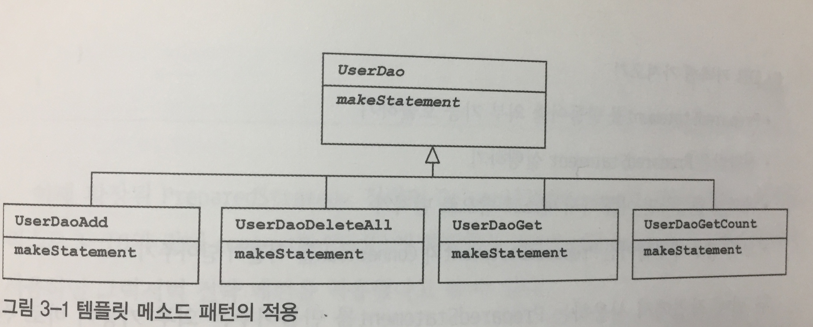
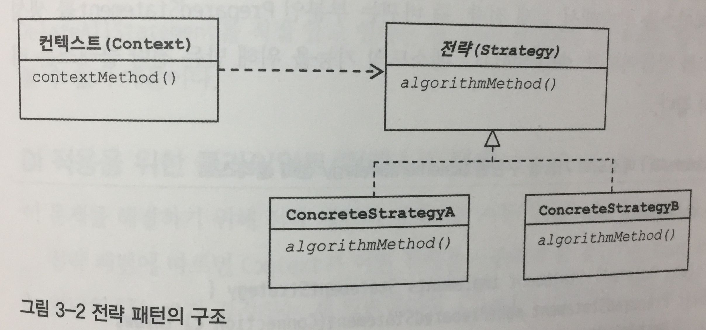
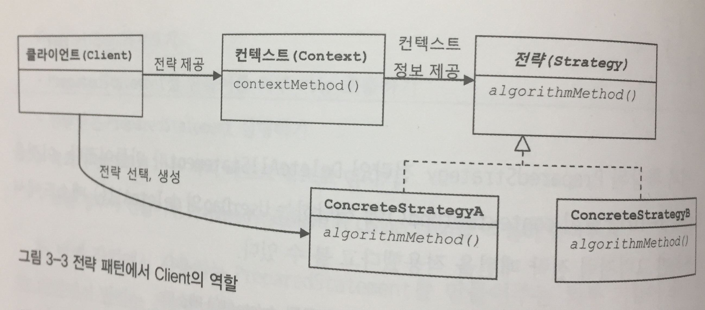
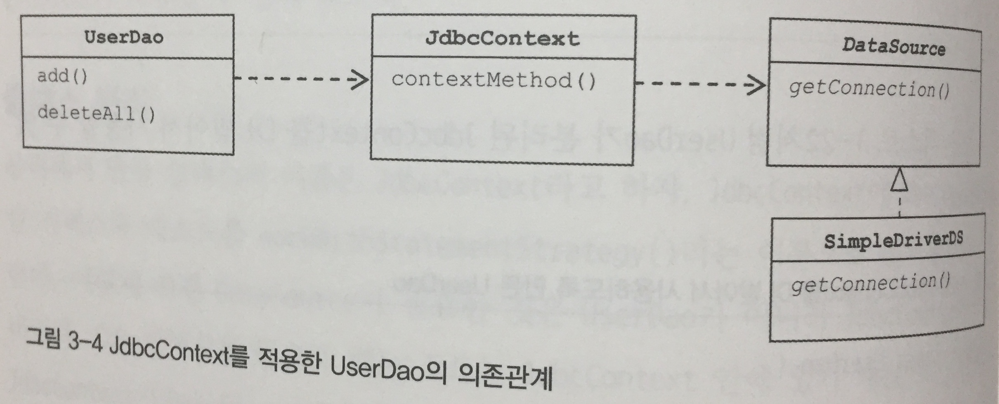
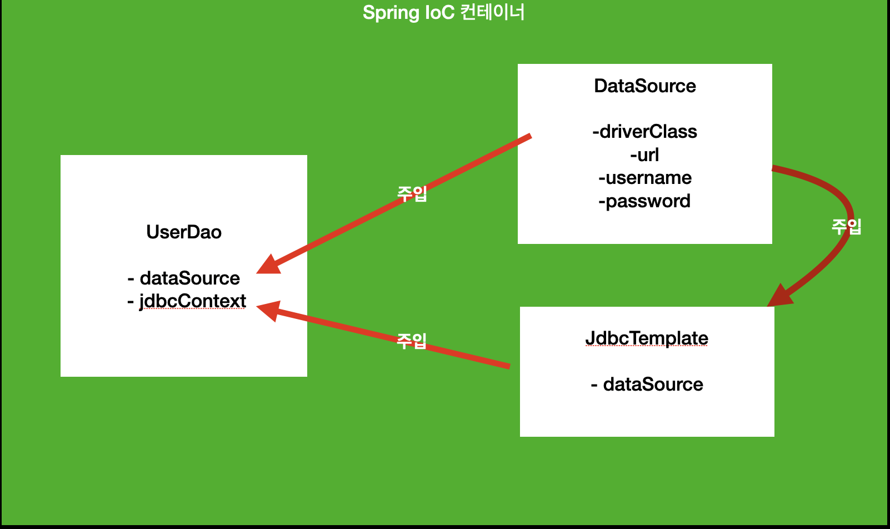

# 3장 템플릿 (1)


    책장속 먼지털기 스터디 4차
    스터디 날짜 : 2020.11.30 (불참)
    작성 날짜 : 2020.11.29 
    페이지 : 209 ~ 240


## 템플릿이란?

책에서 "템플릿"의 정의는 다음과 같다.

바뀌는 성질이 다른 코드 중에서 변경이 겅의 일어나지 않으며 일정한 패턴으로 유지되는 특성을 가진 부분을 자유롭게 변경되는 성질을 가진 부분으로부터 독립시켜서 효과적으로 활용할 수 있는 있도록 하는 방법이다.

쉽게 말하면 변경되지 않는 부분을 남겨두고(템플릿) 변경되는 코드 부분을 독립시키는 것이다.


## UserDao의 문제점?

지난 장들을 거쳐 관심사를 분리하고 의존성 주입 같은 기술들을 적용했음에도 불구하고 `UserDao`는 아직 고쳐야할 점이 남아있다. 바로 "예외 처리"이다.

```java
public class UserDao {
    // ...

    public void deleteAll() throws SQLException {
        Connection c = dataSource.getConnection();

        PreparedStatement ps = c.prepareStatement("delete from users");
        ps.executeUpdate();

        ps.close();
        c.close();
    }

    // ...
}
```

현재 `UserDao`의 `deleteAll` 메소드인데, 무엇인 문제일까? 만약 쿼리를 처리 도중에 오류가 발생하여, `ps.close()`에 도달하기도 전에 종료되었다고 가정하자. 그럼 리소스를 반환하지 않았기 때문에, `PreparedStatement`풀이나, `Connection`풀의 리소스가 남아서 추후에는 리소스가 모자라는 상황이 발생할 수 있다. 

이런 상황을 피하기 위해서 `try-catch-finally` 구문을 사용할 수 있다. 현재 자바에서는 `try-with-resource` 구문을 사용하는 것이 보다 깔끔하게 코드를 처리할 수 있다.

```java
public class UserDao {
    // ...

    public void deleteAll() throws SQLException {
        try(Connection c = dataSource.getConnection();
            PreparedStatement ps = c.prepareStatement("delete from users")) {
            ps.executeUpdate();
        } catch(SQLException e) {
            throw e;
        }
    } 

    // ...
}
```

그러나 "학습"이 목적이므로 `try-catch-finally` 구문으로 한 번 변경해보자.

```java
public class UserDao {
    // ...
    public void deleteAll() throws SQLException {
        Connection c = null;
        PreparedStatement ps = null;
        
        try {
            c = dataSource.getConnection();
            ps = c.prepareStatement("delete from users");
            ps.executeUpdate();
        } catch (SQLException e) {
            throw e;
        } finally {
            if (ps != null) {
                try {
                    ps.close();
                } catch (SQLException e) {
                    
                }
            }
            
            if (c != null) {
                try {
                    c.close();    
                } catch (SQLException e) {
                    
                }
            }
        }
    }
    // ...
}
```

`try-with-resource`구문보다 확실히 코드가 복잡하다. `finally` 블록에서 `ps`와 `c`의 리소스를 반환한다. 이 때 중요한 점은 각각 null인지 여부를 체크하고, `close`메소드 역시 `SQLException`이 발생할 수 있으므로 꼭 `try-catch`로 묶어주어야 한다는 점이다. 이제 조회 기능인 `getCount` 메소드에 예외 처리 구문을 추가해보자.

```java
public class UserDao {
    // ...
    public int getCount() throws SQLException {
        Connection c = dataSource.getConnection();

        PreparedStatement ps = c.prepareStatement("select count(*) from users");

        ResultSet rs = ps.executeQuery();
        rs.next();
        int count = rs.getInt(1);

        rs.close();
        ps.close();
        c.close();

        return count;
    }
}
```

`Connection`, `PreparedStatement`외에 `ResultSet` 객체를 추가적으로 더 반환해야 한다. 코드는 다음과 같이 변경된다.

```java
public class UserDao {
    // ...
    public int getCount() throws SQLException {
        Connection c = null;
        PreparedStatement ps = null;
        ResultSet rs = null;

        try {
            c = dataSource.getConnection();
            ps = c.prepareStatement("select count(*) from users");
            rs = ps.executeQuery();
            rs.next();
            int count = rs.getInt(1);
            return count;
        } catch (SQLException e) {
            throw e;
        } finally {
            if (rs != null) {
                try {
                    rs.close();
                } catch (SQLException e) {

                }
            }

            if (ps != null) {
                try {
                    ps.close();
                } catch (SQLException e) {

                }
            }

            if (c != null) {
                try {
                    c.close();
                } catch (SQLException e) {

                }
            }
        }
    }
}
```

더 복잡한 코드가 되었다... 만일 `UserDao`같은 클래스가 수 십개, 수 백개 있다고 해보자. 일일이 `try-catch-finally` 구문으로 다 바꿔줘야 함은 물론 `finally` 블록에서 리소스 반환을 빼먹지 않고 코드를 적었음을 보장해야 한다. 굉장히 고된 작업이 될 것이다. 이를 어떻게 하면 조금 더 깔끔하게, 효율적으로 해결할 수 있을까?


## 템플릿 메소드 패턴을 적용해볼까?

여기서 문제의 핵심은 "많은 곳에서 중복되는 코드와 로직에 따라 자꾸 확장되고 자주 변하는 코드를 잘 분리하는 것"이다. 다시 `deleteAll`을 보자.

```java
public class UserDao {
    // ...
    public void deleteAll() throws SQLException {
        Connection c = null;
        PreparedStatement ps = null;
        
        try {
            c = dataSource.getConnection();
            ps = c.prepareStatement("delete from users");
            ps.executeUpdate();
        } catch (SQLException e) {
            throw e;
        } finally {
            if (ps != null) {
                try {
                    ps.close();
                } catch (SQLException e) {
                    
                }
            }
            
            if (c != null) {
                try {
                    c.close();    
                } catch (SQLException e) {
                    
                }
            }
        }
    }
    // ...
}
```

데이터를 조회하는 쿼리를 제외한 나머지 부분은 이와 비슷할 것이다. 다만 `ps = c.prepareStatement("delete from users");` 이 구문만 변경이 될 것이다. 한 번 이 부분에 대해서 메소드를 추출해보자.

```java
public class UserDao {
    // ...
    private PreparedStatement makeStatement(Connection c) throws SQLException {
        PreparedStatement ps;
        ps = c.prepareStatement("delete from users");
        return ps;
    }

    public void deleteAll() throws SQLException {
        Connection c = null;
        PreparedStatement ps = null;

        try {
            c = dataSource.getConnection();
            ps = makeStatement(c);
            ps.executeUpdate();
        } catch (SQLException e) {
            throw e;
        } finally {
            if (ps != null) {
                try {
                    ps.close();
                } catch (SQLException e) {

                }
            }

            if (c != null) {
                try {
                    c.close();
                } catch (SQLException e) {

                }
            }
        }
    }
    // ... 
}
```

별로 좋을 것이 없어 보인다. 하지만, 이런 구조를 "템플릿 메소드 패턴"으로 변경해보면 어떨까? `UserDao`의 `makeStatement`를 `abstract protected`로 변경한다. 그럼 `UserDao`도 `abstract` 레벨로 내려간다. 

```java
public abstract class UserDao {
    // ...

    abstract protected PreparedStatement makeStatement(Connection c) throws SQLException;

    // ...
}
```

그리고, 삭제를 위한 `UserDaoDeleteAll`을 다음과 같이 만들어준다.

```java
public class UserDaoDeleteAll extends UserDao {
    protected PreparedStatement makeStatement(Connection c) throws SQLException {
        PreparedStatement ps;
        ps = c.prepareStatement("delete from users");
        return ps;
    }
}
```

이런 식으로 `UserDaoAdd`, `UserDaoGet` 등을 만들어낸다. 템플릿 메소드 패턴을 적용한 후, 클래스 관계도는 이렇게 된다.


출처 "에이콘 - 토비의 스프링"

훌륭하게 변하는 부분을 독립시켰지만 여기서 또 다음과 같은 문제점을 갖게 된다. 

1. 사용하는 쿼리 개수만큼 서브 클래스 개수가 늘어난다.
2. 확장 구조가 설계 시점에 고정되어 버린다.

이를 어떻게 해결할 수 있을까?


## 전략 패턴을 적용해보자.

OCP 원칙을 잘 지키면서 템플릿 메소드 패턴보다 유연하고 확장성이 뛰어난 것이 있을까? 있다! 바로 "전략 패턴"이다. 오브젝트를 아예 둘로 분리하고 클래스 레벨에서는 인터페이스를 통해서만 의존하게끔 만드는 것이다. 다음 그림처럼 말이다.


출처 "에이콘 - 토비의 스프링"

여기서 `deleteAll`이 `contextMethod`가 된다. 전략 패턴을 적용할 수 있도록 `StatementStrategy` 인터페이스를 생성한다.

```java
public interface StatementStrategy {
    PreparedStatement makePreparedStatement(Connection c) throws SQLException;
}
```

그리고 모든 유저를 삭제하는 `DeleteAllStatement`를 추가한다.

```java
public class DeleteAllStatement implements StatementStrategy {
    @Override
    public PreparedStatement makePreparedStatement(Connection c) throws SQLException {
        PreparedStatement ps = c.prepareStatement("delete from users");
        return ps;
    }
}
```

이제 `UserDao`의 `deleteAll` 메소드에서 `DeleteAllStatement`를 사용해보자. 이전에 만들었던 `makeStatement` 메소드를 제거하고 다시 abstract에서 concrete 레벨로 변경한다. 그 후 컨텍스트인 `deleteAll`에서, `DeleteAllStatement` 생성해서 사용하면 된다.

```java
public class UserDao {
    // ...
    public void deleteAll() throws SQLException {
        Connection c = null;
        PreparedStatement ps = null;

        try {
            c = dataSource.getConnection();

            StatementStrategy strategy = new DeleteAllStatement();
            ps = strategy.makePreparedStatement(c);

            ps.executeUpdate();
        } 
        // ...
    }
    // ...
}
```

근데 위 코드는 두 가지 문제점이 있다.

1. "전략 패턴"이 적용되지 않았다.
2. UserDao와 DeleteAllStatement가 강하게 결합되어 있다.

전략 패턴이란 `Context`가 어떤 전략을 쓰는가는 전적으로 클라이언트가 결정한다.


출처 "에이콘 - 토비의 스프링"

하지만, 현재 우리 코드는 그렇지 않다. 이를 위해서 코드 구조를 변경해보자.

```java
public class UserDao {
    // ...
    public void jdbcContextWithStatementStrategy(StatementStrategy stmt) throws SQLException {
        Connection c = null;
        PreparedStatement ps = null;

        try {
            c = dataSource.getConnection();
            ps = stmt.makePreparedStatement(c);
            ps.executeUpdate();
        } catch (SQLException e) {
            throw e;
        } finally {
            if (ps != null) {
                try {
                    ps.close();
                } catch (SQLException e) {

                }
            }

            if (c != null) {
                try {
                    c.close();
                } catch (SQLException e) {

                }
            }
        }
    }
    // ...
}
```

그 후 `deleteAll`을 다음과 같이 변경한다.

```java
public class UserDao {
    // ...
    public void deleteAll() throws SQLException {
        StatementStrategy stmt = new DeleteAllStatement();
        jdbcContextWithStatementStrategy(stmt);
    }
    // ...
}
```

하지만 아직도 `UserDao`와 `DeleteAllStatement`가 강하게 결합되어 있다. 가장 큰 문제는 쿼리 개수가 늘어날수록 `DeleteAllStatement` 같은 클래스들을 추가해야 한다는 점이다. 강결합을 푼다라고 보기엔 애매하지만, 이는 익명 클래스로 훌륭하게 해결할 수 있다.

```java
public class UserDao {
    // ...
    public void deleteAll() throws SQLException {
        StatementStrategy stmt = c -> {
            PreparedStatement ps = c.prepareStatement("delete from users");
            return ps;
        };
        jdbcContextWithStatementStrategy(stmt);
    }
    // ...
}
```


## 분리 또 분리! 스프링 스럽게 분리해보자.

조금 더 개선해보자. `jdbcContextWithStatementStrategy`메소드를 `JdbcContext`클래스로 분리할 것이다. 여기선 통합 개념이 크니 `try-with-resource`로 코드를 더 깔끔하게 만들어보겠다.

```java
@NoArgsConstructor @AllArgsConstructor
@Getter @Setter
public class JdbcContext {
    private DataSource dataSource;

    public void workWithStatementStrategy(StatementStrategy stmt) throws SQLException {
        try (Connection c = dataSource.getConnection();
             PreparedStatement ps = stmt.makePreparedStatement(c);
        ) {
            ps.executeUpdate();
        } catch (SQLException e) {
            throw e;
        }
    }
}
```

빈 설정을 위해서 `DaoFactory`를 변경한다. (테스트 코드를 위해 같은 방법으로 `TestDaoFactory`도 변경하라.)

```java
@Configuration
public class DaoFactory {
    @Bean
    public UserDao userDao() {
        UserDao userDao = new UserDao(dataSource(), jdbcContext());
        return userDao;
    }

    @Bean
    public DataSource dataSource() {
        SimpleDriverDataSource dataSource = new SimpleDriverDataSource();
        dataSource.setDriverClass(com.mysql.jdbc.Driver.class);
        dataSource.setUrl("jdbc:mysql://localhost/springbook");
        dataSource.setUsername("spring");
        dataSource.setPassword("book");
        return dataSource;
    }

    @Bean
    public JdbcContext jdbcContext() {
        JdbcContext context = new JdbcContext(dataSource());
        return context;
    }
}
```

이제 `UserDao`를 다음과 같이 변경한다.

```java
@NoArgsConstructor @AllArgsConstructor
@Getter @Setter
public class UserDao {
    private DataSource dataSource;
    private JdbcContext jdbcContext;

    public void add(User user) throws SQLException {
        StatementStrategy stmt = c -> {
            PreparedStatement ps = c.prepareStatement("insert into users(id, name, password) values(?, ?, ?)");
            ps.setString(1, user.getId());
            ps.setString(2, user.getName());
            ps.setString(3, user.getPassword());
            return ps;
        };
        jdbcContext.workWithStatementStrategy(stmt);
    }

    public void deleteAll() throws SQLException {
        StatementStrategy stmt = c -> {
            PreparedStatement ps = c.prepareStatement("delete from users");
            return ps;
        };
        jdbcContext.workWithStatementStrategy(stmt);
    }

    // ...
}
```

위 코드 구조의 의존 관계는 다음과 같다.


출처 "에이콘 - 토비의 스프링"

빈 오브젝트 관계는 다음과 같다.


출처 "에이콘 - 토비의 스프링"


## 스터디원들의 생각 공유

### 나의 질문과 답

1. 첫 주차에 질문이었던 " UserDao에서, DB 연결에 대한 관심을 분리할 수 있었다. 그럼 Statement를 실행시키거나, 리소스들을 해제하는 것은 어떻게 분리할 수 있을까?"에 대한 답변을 찾은 것 같아서 매우 인상적인 챕터였다. `UserDao`에서 추가, 삭제, 수정 쿼리를 날릴 때 어떻게 깔끔하게 처리할 수 있는지에 대한 해답을 찾은 것 같다.
2. 다만 추가적으로 조회에 대한 부분은 어떻게 처리할 지 의문이다.
   
### 스터디원들의 질문과 답


### 면접 질문으로 생각해볼 것?

