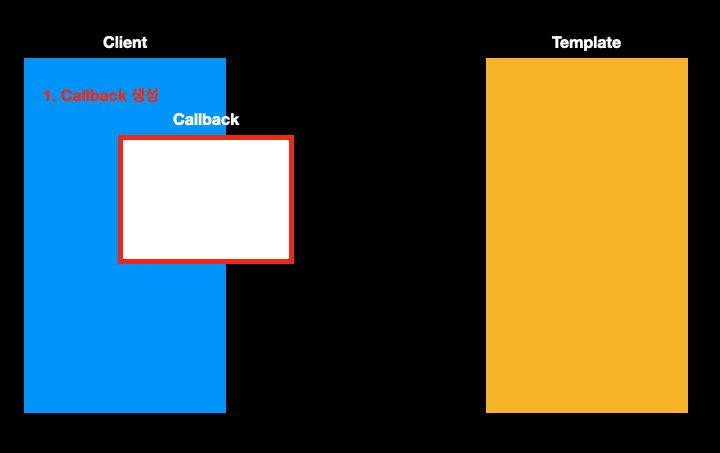
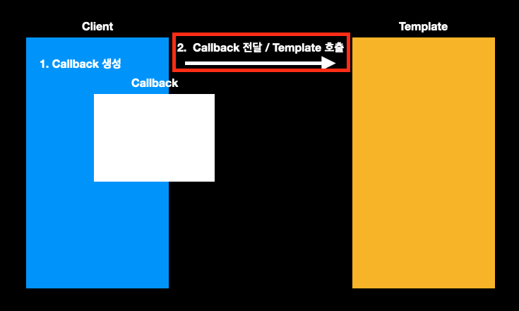
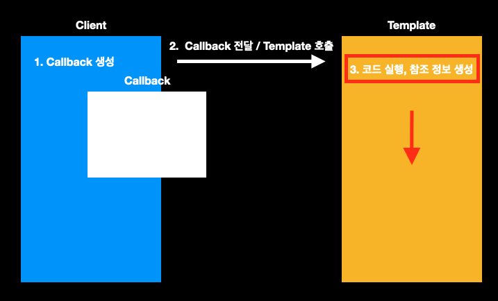
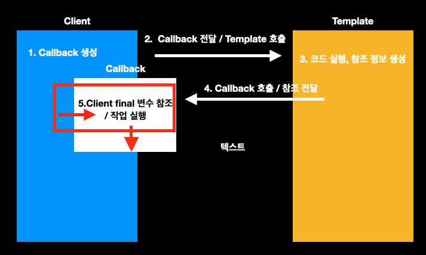
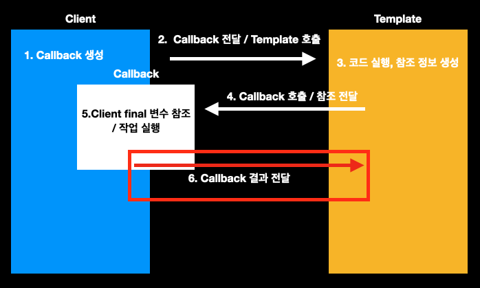
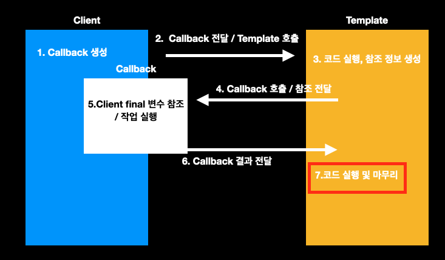
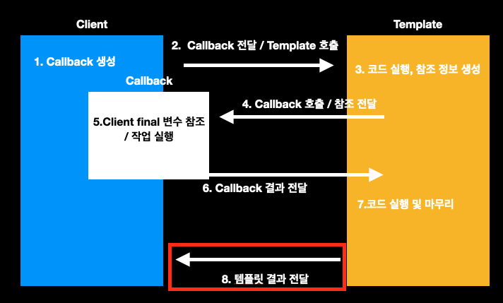
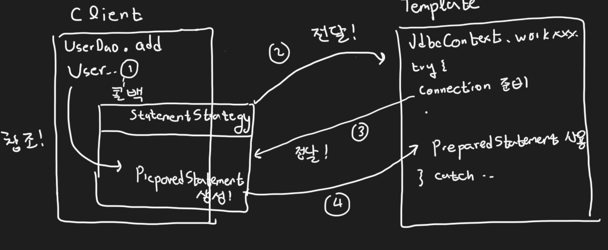
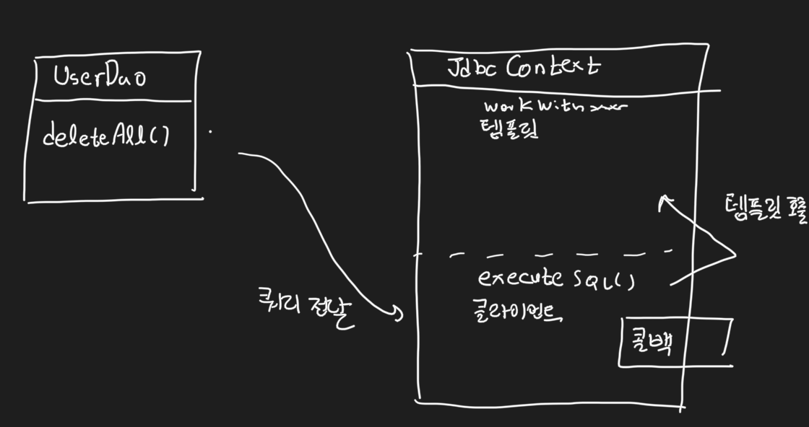

# 3장 템플릿 (2)


    책장속 먼지털기 스터디 5차
    스터디 날짜 : 2020.12.07
    작성 날짜 : 2020.12.06
    페이지 : 240 ~ 277


## 템플릿과 콜백

잠깐 책에 나온 정의를 살펴보자.

템플릿이란?
템플릿은 어떤 목적을 위해 미리 만들어둔 모양이 있는 틀을 말한다. (=`JdbcContext`)

콜백이란?
콜백은 실행되는 것을 목적으로 다른 오브젝트의 메소드에 전달되는 오브젝트를 말한다. (=`StatementStrategy`를 구현한 익명 클래스)

템플릿/콜백 패턴의 일반적인 흐름은 다음과 같다.



먼저 클라이언트에서 콜백 객체를 생성한다. `UserDao`의 `deleteAll` 메소드를 보자.

```java
public void deleteAll() throws SQLException {
    StatementStrategy stmt = c -> {
        PreparedStatement ps = c.prepareStatement("delete from users");
        return ps;
    };
    // ...
}
```

위의 코드에서 `deleteAll`은 클라이언트이다. 그리고 콜백인 `StatementStrategy`를 익명 클래스를 생성하는 것을 확인할 수 있다.



그 후, 템플릿을 호출하면서 콜백 객체의 참조를 전달한다.

`UserDao`의 `deleteAll`에서 다음 부분이다.

```java
public void deleteAll() throws SQLException {
    StatementStrategy stmt = //..;
    jdbcContext.workWithStatementStrategy(stmt);
}
```

이제 템플릿인 `jdbcContext.workWithStatementStrategy`를 호출한다. 이 때 콜백의 참조 `stmt`를 전달해준다.



템플릿은 자신의 코드 동작하면서 필요한 참조 정보들을 만든다. 템플릿인 `JdbcContext` 코드를 살펴보자.

```java
public void workWithStatementStrategy(StatementStrategy stmt) throws SQLException {
    try (Connection c = dataSource.getConnection();
         // ....
    ) {
        // ...
    } catch (SQLException e) {
        throw e;
    }
}
```

이 때 `Connection` 객체를 생성해낸다. 콜백에 필요한 참조를 생성해내고 있다. 


그 후, 실행되어야 할 콜백을 호출한다. 계속해서 `JdbcContext`를 보자.

```java
public void workWithStatementStrategy(StatementStrategy stmt) throws SQLException {
    try (// ...
        PreparedStatement ps = stmt.makePreparedStatement(c)
    ) {
        // ...
    } catch (SQLException e) {
        throw e;
    }
}
```

이 떄, `stmt.makePreparedStatement(c)`에서 알 수 있듯이 콜백을 다시 호출한다. 이 때 아까 생성해둔 `Connection` 참조를 전달한다.



콜백이 호출되면, 클라이언트 내부의 변수를 직접 참조하면서 작업을 실행한다.

`UserDao.deleteAll`에서는 참조하는 객체가 없다. 바로 다음 단계로 넘어간다. "delete from users" 쿼리를 실행하는 `PreparedStatement`를 생성하고 반환한다.



그 결과를 다시 템플릿을 전달한다. 위에서 만든 `PreparedStatement`가 전달된다. 



콜백의 결과를 토대로 템플릿은 코드 실행을 계속해서 진행한다. `JdbcContext`에서 다음 부분이다.

```java
public void workWithStatementStrategy(StatementStrategy stmt) throws SQLException {
    try (/* .... */) {
        ps.executeUpdate();
    } catch (SQLException e) {
        throw e;
    }
}
```

콜백의 결과로 전달받은 `PreparedStatement`를 실행하는 것을 볼 수 있다.



템플릿 코드가 끝나면 그 결과를 다시 클라이언트에게 전달한다. 이제 템플릿의 결과를 받은 `UserDao.deleteAll`도 마무리가 된다.


## 한 단계 더 나아가서...

`UserDao.deleteAll`은 "delete from users" 쿼리를 전달하고 나머지는 콜백에게 맡긴다. 분면 위 쿼리 말고도 이런 단순 쿼리만을 전달하는 경우가 왕왕 있을 것이다. 이를 위해서 콜백을 다음과 같이 분리해보자. 

```java
@NoArgsConstructor @AllArgsConstructor
@Getter @Setter
public class UserDao {
    // ...
    private void executeSql(final String query) throws SQLException {
        jdbcContext.workWithStatementStrategy(c -> {
            PreparedStatement ps = c.prepareStatement(query);
            return ps;
        });
    }

    public void deleteAll() throws SQLException {
        final String query = "delete from users";
        executeSql(query);
    }

    // ...
}
```

이제 단순 쿼리 전달은 클라이언트 코드에서 쿼리를 생성한 후 `executeSql` 메소드에 전달만 하면 된다. 여기서 더 개선될 점이 있다. 현재 `executeSql`은 `UserDao`만 사용할 수 있다. 아깝지 않은가? 이 콜백을 이용하는 메소드를 조금 더 확장성 있게 사용하기 위해서, 템플릿과 결합하자.

`JdbcContext`을 다음과 같이 수정하자.

```java
@NoArgsConstructor @AllArgsConstructor
@Getter @Setter
public class JdbcContext {
    // ...

    public void executeSql(final String query) throws SQLException {
        workWithStatementStrategy(c -> {
            PreparedStatement ps = c.prepareStatement(query);
            return ps;
        });
    }
}
```

이제 다시 클라이언트인 `UserDao.deleteAll`을 다음과 같이 수정한다.

```java
@NoArgsConstructor @AllArgsConstructor
@Getter @Setter
public class UserDao {
    // ...
    // executeSql 제거 

    public void deleteAll() throws SQLException {
        final String query = "delete from users";
        jdbcContext.executeSql(query);
    }

    // ...
}
```

코드를 수정했으니 테스트 코드를 돌려보자. 잘 돌아갈 것이다. 구조적으로 살펴보면 원래는 다음과 같은 구조였다.



클라이언트 내에 콜백이 있었다. 하지만 이제는 콜백이 템플릿과 결합되면서 다음과 같은 구조가 되었다.



보다 응집력이 있는 코드가 만들어졌다. "응집력이 있다"라는 말은 비슷한 일을 하는 코드들이 뭉쳐있다는 뜻이다.


## JdbcTemplate 적용

`Spring Data JDBC`에서는 이미 템플릿/콜백 패턴을 적용한 것이 있다. 바로 `JdbcTemplate`이다. 이제 `JdbcContext`를 `JdbcTemplate`으로 변경해보자. 먼저 `UserDao`에 `JdbcTemplate`을 주입 받는 코드를 만들어둔다.

```java
@NoArgsConstructor @AllArgsConstructor
@Getter @Setter
public class UserDao {
    private DataSource dataSource;   // 제거될 것이다.
    private JdbcContext jdbcContext; // 제거될 것이다.
    private JdbcTemplate jdbcTemplate;

    // ...
}
```

그리고 설정 빈들(`DaoFactory`, `TestDaoFactory`)에서 `UserDao`에 `JdbcTemplate`을 주입한다.

```java
@Configuration
public class DaoFactory {
    @Bean
    public UserDao userDao() {
        UserDao userDao = new UserDao(dataSource(), jdbcContext(), jdbcTemplate());
        return userDao;
    }

    // ...

    @Bean
    public JdbcTemplate jdbcTemplate() {
        JdbcTemplate jdbcTemplate = new JdbcTemplate(dataSource());
        return jdbcTemplate;
    }
}
```

코드 수정 후에는 반드시 테스트 코드를 돌려봐야 한다. 무사히 통과할 것이다. 이제 메소드들을 차례차례 변경해보자. 먼저 `deleteAll`이다.

```java
@NoArgsConstructor @AllArgsConstructor
@Getter @Setter
public class UserDao {
    // ...

    public void deleteAll() {
        final String query = "delete from users";
        jdbcTemplate.update(query);
    }

    // ...
}
```

에이 콜백 패턴이 아니잖아? 할 수 있다. 이는 `JdbcTemplate` 메소드 내부를 살펴보면 알 수 있다.

```java
@Override
public int update(final String sql) throws DataAccessException {
    // ...
    // 내부의 콜백 객체가 정의되어 있다.
    class UpdateStatementCallback implements StatementCallback<Integer>, SqlProvider {
        @Override
        public Integer doInStatement(Statement stmt) throws SQLException {
            int rows = stmt.executeUpdate(sql);
            if (logger.isTraceEnabled()) {
                logger.trace("SQL update affected " + rows + " rows");
            }
            return rows;
        }
        @Override
        public String getSql() {
            return sql;
        }
    }

    // 템플릿 메소드 파라미터로, 이 콜백 객체를 전달한다.
    return updateCount(execute(new UpdateStatementCallback()));
}
```

이제 `add` 메소드를 바꿔보자. 역시 `JdbcTemplate.update` 메소드를 이용할 것이다.

```java
@NoArgsConstructor @AllArgsConstructor
@Getter @Setter
public class UserDao {
    // ...

    public void add(User user) {
        String query = "insert into users(id, name, password) values(?, ?, ?)";
        jdbcTemplate.update(query, user.getId(), user.getName(), user.getPassword());
    }

    // ...
}
```

이전에 "add failed test"를 작성했는데, 그 때는 `SQLException`이 발생했다. 그러나 `JdbcTemplate`으로 변경한 지금 `DuplicateKeyException`이 발생한다. 테스트 코드를 다음과 같이 수정한다.

```java
@SpringBootTest
@Import(value = {TestDaoFactory.class})
class UserDaoTest {
    // ...

    @Test
    @DisplayName("UserDao add failed test")
    public void test04() throws SQLException {
        User user = new User("test", "test", "test");

        Assertions.assertThrows(DuplicateKeyException.class, () -> {
            userDao.add(user);
        });

        int count = userDao.getCount();
        assertEquals(1, count);
    }
}
```

이제 `getCount`를 변경한다. `JdbcTemplate.queryForObject`를 이용할 것이다.

```java
@NoArgsConstructor @AllArgsConstructor
@Getter @Setter
public class UserDao {
    // ...

    public int getCount() {
        String query = "select count(*) from users";
        return jdbcTemplate.queryForObject(query, Integer.class);
    }
}
```

> 참고!
> 
> 책에서는 queryForInt를 사용한다. 하지만 현재 버전에서는 deprecated가 되었다. queryForObject에 Integer 클래스를 매핑시켰다.

이제 `get` 메소드를 변경해보자. 역시 `JdbcTemplate.queryForObject`를 이용하는데 `User` 클래스를 어떻게 매핑시키는지 중점적으로 볼 것이다.

```java
@NoArgsConstructor @AllArgsConstructor
@Getter @Setter
public class UserDao {
    // ...

    public User get(String id) {
        String query = "select * from users where id = ?";
        Object[] args = {id};
        return jdbcTemplate.queryForObject(query, args, (rs, rowNum) -> {
            User user = new User();
            user.setId(rs.getString("id"));
            user.setName(rs.getString("name"));
            user.setPassword(rs.getString("password"));
            return user;
        });
    }
}
```

`queryForObject`는 여러 메소드가 오버로딩되어 있는데 위에 쓴 메소드는 첫 번째 인수는 쿼리, 두 번째 인수는 쿼리에 쓸 아규먼트, 세 번째 인수는 해당 쿼리의 결과와 객체를 매핑시키는 `RowMapper<T>` 콜백 객체이다.

`RowMapper<T>`를 구현하는 클래스는 `mapRow` 메소드를 구현해야만 한다. 위의 람다식이 그 `mapRow`를 구현한 코드이다. `ResultSet` 객체에서 쿼리 결과를 뽑아서 `User` 객체로 전달하여 만들고 이를 반환하는 것을 볼 수 있다.

이번엔 모든 유저를 `id`별로 정렬된 목록을 가져올 수 있는 `getAll` 메소드를 추가해볼 것이다. 이 때 `JdbcTemplate.query` 메소드를 이용한다. 다음 처럼 작성하면 된다.

```java
@NoArgsConstructor @AllArgsConstructor
@Getter @Setter
public class UserDao {
    // ...

    public List<User> getAll() {
        String query = "select * from users order by id";
        return jdbcTemplate.query(query, (rs, rowNum) -> {
            User user = new User();
            user.setId(rs.getString("id"));
            user.setName(rs.getString("name"));
            user.setPassword(rs.getString("password"));
            return user;
        });
    }
}
```

테스트 코드는 다음과 같으면 적당할 것이다.

```java
@SpringBootTest
@Import(value = {TestDaoFactory.class})
class UserDaoTest {
    // ...

    @Test
    @DisplayName("UserDao getAll test")
    public void test05() {
        List<User> list = userDao.getAll();
        assertEquals(1, list.size());

        User user = list.get(0);
        assertEquals("test", user.getId());
        assertEquals("test", user.getName());
        assertEquals("test", user.getPassword());

        for (int i=2; i<=5; i++) {
            String msg = "test" + i;
            User tmp = new User(msg, msg, msg);
            userDao.add(tmp);
        }

        list = userDao.getAll();
        assertEquals(5, list.size());

        for (int i=1; i<5; i++) {
            String expected = "test" + (i+1);
            User tmp = list.get(i);
            assertEquals(expected, tmp.getId());
            assertEquals(expected, tmp.getName());
            assertEquals(expected, tmp.getPassword());
        }
    }
}
```

테스트가 통과하는 것을 반드시 확인하길 바란다. 이제 중복 부분과 안쓰는 부분을 제거해보자. `UserDao`를 다음과 같이 변경한다.

```java
@NoArgsConstructor @AllArgsConstructor
@Getter @Setter
public class UserDao {
    private JdbcTemplate jdbcTemplate;
    private final RowMapper<User> rowMapper = (rs, rowNum) -> {
        User user = new User();
        user.setId(rs.getString("id"));
        user.setName(rs.getString("name"));
        user.setPassword(rs.getString("password"));
        return user;
    };

    public void add(User user) {
        String query = "insert into users(id, name, password) values(?, ?, ?)";
        jdbcTemplate.update(query, user.getId(), user.getName(), user.getPassword());
    }

    public User get(String id) {
        String query = "select * from users where id = ?";
        Object[] args = {id};
        return jdbcTemplate.queryForObject(query, args, rowMapper);
    }

    public List<User> getAll() {
        String query = "select * from users order by id";
        return jdbcTemplate.query(query, rowMapper);
    }


    public void deleteAll() {
        final String query = "delete from users";
        jdbcTemplate.update(query);
    }

    public int getCount() {
        String query = "select count(*) from users";
        return jdbcTemplate.queryForObject(query, Integer.class);
    }
}
```

그리고 설정 빈인 `DaoFactory`를 다음과 같이 변경한다.(`TestDaoFactory`도 요령은 같다.)

```java
@Configuration
public class DaoFactory {
    @Bean
    public UserDao userDao() {
        UserDao userDao = new UserDao(jdbcTemplate());
        return userDao;
    }

    @Bean
    public DataSource dataSource() {
        SimpleDriverDataSource dataSource = new SimpleDriverDataSource();
        dataSource.setDriverClass(com.mysql.jdbc.Driver.class);
        dataSource.setUrl("jdbc:mysql://localhost/springbook");
        dataSource.setUsername("spring");
        dataSource.setPassword("book");
        return dataSource;
    }

    @Bean
    public JdbcTemplate jdbcTemplate() {
        JdbcTemplate jdbcTemplate = new JdbcTemplate(dataSource());
        return jdbcTemplate;
    }
}
```

이제 필요 없는 부분을 제거하고, 중복되는 `RowMapper<User>` 익명 객체를 클래스의 final 인스턴스 필드로 변경하였다. 끝!!


## 스터디원들의 생각 공유

### 나의 질문과 답

1. 단순히 "프레임워크에서 제공하는 거 하라는 대로 쓰면 되지"라고 생각하는 나에게 영감을 준 챕터가 아닐까 싶다. 템플릿과 콜백이 예시이긴 했지만 `JdbcTemplate`의 전반적인 개념들을 직접 구현해보고, 프레임워크에서 제공하는 것을 써보니 "이래서 이것이 있구나"라는 생각이 들었다.
2. 템플릿/콜백 패턴을 실제로 많이 쓰는지 알고 싶다. (구현된 기술 외에..? 개인적으로는 FE 말고는 콜백 객체를 써본적이 없어서...)  

### 스터디원들의 질문과 답

### 면접 질문으로 생각해볼 것?


