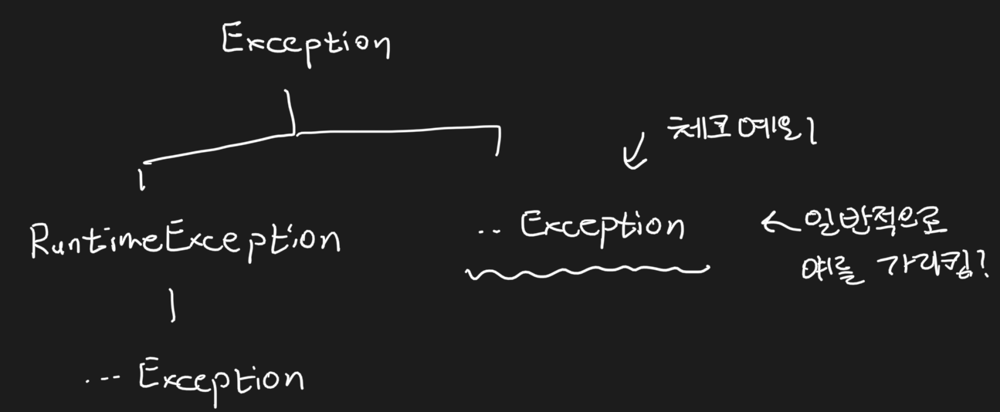

# 4장 예외


    책장속 먼지털기 스터디 6차
    스터디 날짜 : 2020.12.14
    작성 날짜 : 2020.12.20
    페이지 : 279 - 315


## 사라진 SQLException

현재, `JdbcContext`에서 `JdbcTemplate`으로 전환하면서, 한 가지 특이점이 발생했다. 바로, 메소드 시그니처에 `throws SQLException`이 사라진 것이다.

JdbcContext 버전
```java
public void deleteAll() throws SQLException {
    final String query = "delete from users";
    this.jdbcContext.executeSql(query);
}
```

JdbcTemplate 버전
```java
public void deleteAll() {
    final String query = "delete from users";
    jdbcTemplate.update(query);
}
```

어디로 사라진 것일까? 본격적으로 알기 전에, 자바의 예외 처리에 대한 간단한 내용을 짚고 가자. 먼저 예외에 대해서 알아보자. 먼저 예외에는 크게 3가지 분류로 나눌 수 있다. 

* Error
* CheckException
* RuntimeException

`Error`는 시스템에서 비정상적인 상황 발생 시 나타난다. 보통 개발자의 코드보단 VM이 발생시키는 예외들이기 때문에, 애플리케이션 단에서 처리하면 안된다. 대표적인 예로 `OutOfMemoryError` 혹은 `ThreadDeath` 같은 에러들이 있다. 



그리고 나머지는 위의 그림처럼 `Exception`을 상속 하여 만들어진다. 이들은 애플리케이션 단에서 발생하는 비정상적인 상황을 나타낸다.

`CheckException`은 개발자가 소스 코드 상에서 만들어진 예외를 나타낸다. `try-catch`로 처리하거나 혹은 `throws`로 예외를 던지지 않으면, 컴파일 오류를 발생시킨다. 반면 `RuntimeException`은 `try-catch`나 `throws`로 쓰지 않아도 컴파일 오류는 발생하지 않는다. 즉 예외 처리를 강제하지 않는다는 것이다. 보통 체크 예외는 일반적인 예외를, 런타임 예외는 시스템 장애 혹은 프로그램 상 오류를 처리할 때 사용된다.

만약 이런 **예외들을 무시하게 되면** 어떻게 될까?

```java
try {
    //예외 발생 코드
} catch(Exception e) {
    // 빈 블록으로 만듬.
}
```

이렇게 하면 간단하게 예외를 무시할 수 있다. 위 코드는 굉장히 위험한 코드이다. 왜냐하면 애플리케이션에서 예외가 발생하더라도 무시하고 진행되기 때문에, 비정상적인 동작, 메모리 리소스 소진 등의 문제를 야기할 뿐더러 어떤 오류로 인해 애플리케이션이 죽는지 알 방법이 없기 때문이다. 

> 예외를 무시하면, 애플리케이션이 왜 죽는지 알 수 없고, 비정상 동작을 초래한다!

그렇다면 일반 예제에서 많이 만날 수 있는 **예외들을 출력**하는 방법은 어떨까?

```java
try {
    //예외 발생 코드
} catch(Exception e) {
   e.printStackTrace();
}
```

예외를 무시하는 것보다는 낫지만 이것도 아까보단 조금 더 괜찮다 뿐이지 좋은 코드가 아니다. 왜냐하면, 서버 상황으로 가정해보자. 해당 메소드 말고도 엄청나게 많은 메소드들이 상호작용하며 유기적으로 동작한다. 만약 예외가 발생하더라도, 다른 메소드들의 로그로 인해 묻힐 가능성도 크고 언제 터질지 모르기 떄문에 계속 모니터링해야 할 것이다.

> 예외를 출력하면 다른 로그에 묻힐 가능성이 있고 그 로그가 뜨는지 계속 확인해봐야하는 수고로움이 생긴다.

차라리 예외를 출력하고 시스템을 종료시키는 방법이 더 좋을 것이다. 다음처럼 말이다.

```java
try {
    //예외 발생 코드
} catch(Exception e) {
   e.printStackTrace();
   System.exit(1);
}
```

그렇다면 어떻게 처리해야 할까? 예외 처리 방법은 대표적으로 다음의 3가지가 있다.

1. 예외 복구
2. 예외 처리 회피
3. 예외 전환

**예외 복구**의 쉬운 예는 파일을 읽다가, 파일이 없어 `IOException`이 발생했을 때 파일이 없다고 알려준 후, 다른 파일로 연결할 것을 사용자에게 권하는 것 같은 것이다.

**예외 처리 회피**는 `throws` 혹은 `throw`를 통해서 자신이 처리하는 것이 아닌 출력 후 자신을 호출한 메소드에게 처리를 위임하는 것이다. 다음 코드처럼 말이다.

```java
public void add(User user) throws SQLException {
    try {
        // code
    } catch(SQLException e) {
        e.printStackTrace();
        throw e;    //예외를 다시 던짐.
    }
}
```

이러면 `add`를 호출하는 곳에서 이 예외를 처리하게 된다.

**예외 전환**은 예외 처리 회피와 비슷하다. 하지만 제일 중요한 것은 예외 전환은 에러가 발생했을 때 그 예외를 잘 나타내는 예외로 변경하는데 있다. 다음 코드를 보자.

```java
public void add(User user) throws DuplicatedUserIdExeption, SQLException {
    try {
        // code        
    } catch(SQLException e) {
        if (e.getErrorCode() == MysqlErrorNumbers.ER_DUP_ENTRY)
            throw DuplicatedUserIdExeption();
        else 
            throw e;
    }
}
```

만약 중복되는 ID일 경우 `DuplicatedUserIdExeption`이라는 명확한 에러를 알려준다. 그리고 다른 오류라면 `SQLException`을 발생시키는 것이다. 그럼 사용자는 이 메소드에서 어떤 오류가 나는지 더 명확히 알 수가 있다. 예외 전략은 다음의 목적으로 많이 쓰인다.

1. 내부에서 발생한 예외를 그대로 던지는 것이 무의미할 때, 의미를 분명하게 전달하기 위해서
2. 예뢰를 처리하기 쉽게 Wrapping하기 위해서

책에서 강조하는 예외 처리 전략은 다음과 같다.

1. 런타임 예외 보편화
2. 애플리케이션 예외 처리

서버 환경에서는 예외 상황을 파악하고 발생하지 않도록 미리 차단하는 것이 중요하다. 때문에 체크 예외보다 런타임 예외를 던지는 것이 일반화되고 있다. 또한 각 예외 상황에 맞게 다른 종류값으로 리턴시키거나 비지니스적인 의미를 띄는 예외를 던지게 하여, 애플리케이션 예외를 처리한다.

이제 사라진 `SQLException`의 출처를 알아보자. 다음은 `JdbcTemplate`의 `update` 메소드의 일부이다.

```java
@Override
public int update(final String sql) throws DataAccessException {
    Assert.notNull(sql, "SQL must not be null");
    // code
}
```

시그니처를 보면 `DataAccessException`을 던지는 것을 확인할 수 있다. `DataAccessException`은 `NestedRuntimeException`을 상속하고 있다.

```java
public abstract class DataAccessException extends NestedRuntimeException {
    // ...
}
```

`NestedRuntimeException`은 `RuntimeException`을 상속한다.

```java
public abstract class NestedRuntimeException extends RuntimeException {
    // ...
}
```

즉 `SQLException` 발생하는 부분을 `RuntimeException`으로 래핑하는 것을 확인할 수 있다. 왜 래핑할까? 대부분의 `SQLException`은 애플리케이션 단에서 예외를 처리할 수 없기 때문이다. 그래서 발생 가능한 예외가 있다고 하더라도 이를 처리하는 것을 강제하지 않는다.

> 참고!
> 
> SQLException은 체크 예외입니다. 따라서 코드 레벨에서 try-catch나 throws를 통해 처리함을 강제합니다.


## UserDao를 통해 알아보는 예외 전환

이제 `UserDao`에 "예외 전환" 전략을 적용해보도록 하겠다. 왜 예외 전환 전략을 적용해야 할까? 앞서 언급했듯이, 예외 전환의 목적은 크게 2가지이다.

1. 굳이 필요하지 않은 `try-catch` 혹은 `throws`를 줄여주는 것
2. 로우 레벨 예외를 좀 더 의미 있고 추상화된 예외로 바꾸는 것

`UserDao`는 태생적으로 큰 한계를 가지고 있다. 바로 `JDBC`를 가지고 있어서 생기는 문제인데, 크게 다음과 같다.

1. 비표준 SQL
2. 호환성 없는 SQLException의 DB 에러 정보

최근의 `SQL`은 그래도 표준에 따라 만들어지지만, 각 데이터베이스마다 부가적인 기능을 다루는 `SQL`들이 존재한다. 따라서, `MySQL`에서는 정상 동작하더라도 `PostgreSQL`에서는 동작을 하지 않을 수 있다. 예외 코드도 마찬가지이다. 표준을 지키는 예외 코드들도 있지만 표준을 지키지 않는 예외 코드들도 적지 않다. 따라서 현재 `UserDao`를 그대로 쓰면 데이터베이스에 종속적인 애플리케이션이 된다.

또한 스프링 프레임워크에서 데이터 액세스 기술의 집합체인 `Spring Data`에는 ORM 기술인 `JPA`부터, 쿼리 매퍼 `Mybatis` 그리고 비동기적으로 데이터 액세스를 할 수 있는 `R2DBC` 등 이 밖에 여러 기술들이 있다. 마찬가지로 현재는 `Spring Data JDBC`의 종속적인 애플리케이션이 된다.

이를 벗어나기 위해서 `UserDao`를 인터페이스를 생성하고 이전에 `UserDao`는 `UserDaoJdbc`로 변경 후, `UserDao` 인터페이스를 구현하도록 하자.

UserDao.java
```java
public interface UserDao {
    void add(User user);
    User get(String id);
    List<User> getAll();
    void deleteAll();
    int getCount();
}
```

UserDaoJdbc.java
```java
public class UserDaoJdbc implements UserDao {
    // 이전과 동일
}
```

그리고, 빈 설정 파일인 `DaoFactory` 그리고 `TestDaoFactory`에서 `UserDao`를 반환하는 코드륻 다음과 같이 바꾼다.

```java
@Configuration
public class DaoFactory {
    @Bean
    public UserDao userDao() {
        UserDaoJdbc userDao = new UserDaoJdbc(jdbcTemplate());
        return userDao;
    }

    // 이전과 동일
}
```

소스코드가 변경되었으니 테스트를 진행하자. 다 통과할 것이다. 실제로, 키가 중복되는 에러인 `DuplicateKeyException`은 `DataAccessException`의 하위 클래스이다. 따라서 코드가 변경되어 잘 동작하지만 "예외 전략"은 아직 적용되지 않았다. 이제 `UserDaoJdbc.add`를 다음과 같이 바꿔보자.

```java
public void add(User user) throws DataAccessException {
    try {
        String query = "insert into users(id, name, password) values(?, ?, ?)";
        jdbcTemplate.update(query, user.getId(), user.getName(), user.getPassword());
    } catch (DataAccessException e) {
        throw new DuplicateKeyException("id is duplicated");
    }
}
```

`DataAccessException`이 발생할 때, 만약 ID가 중복될 경우 `DuplicateKeyException`으로 변환되어 예외가 발생할 것이다. 이를 확인하기 위해 테스트를 꼭 돌려보길 바란다. 

> 참고!
> 
> 책에서는 학습 테스트를 만들어서 확인해보라고 권하고 있습니다만 현재 버전에서는 동작하지 않습니다.

