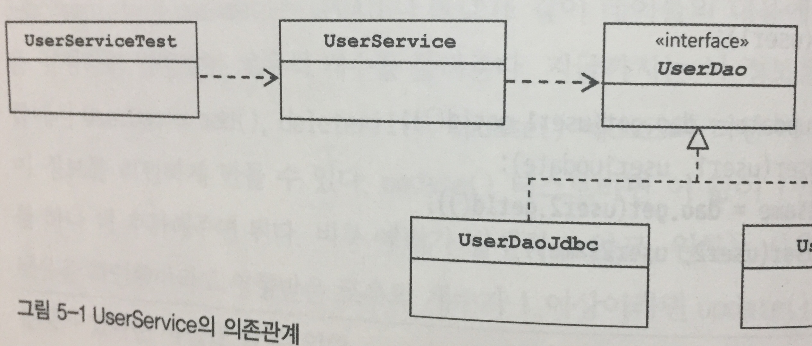
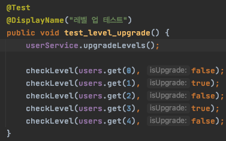

# 5장 서비스 추상화 (1)


    책장속 먼지털기 스터디 7차
    스터디 날짜 : 2020.12.21
    작성 날짜 : 2020.12.20-21
    페이지 : 317 - 348


## 개요

책에서 나오는 "서비스 추상화"란 성격이 비슷한 여러 종류의 기술을 추샇와하고 이를 일관된 방법으로 사용할 수 있도록 하는 것이다. 5장 전체에서는 `DAO`에 트랜잭션을 적용하면서 어떻게 서비스를 추상화할 수 있는지 알아보지만, 이번 주차 스터디 범위에서는 그 이전 단계까지의 코드를 작성한다.


## 사용자 레벨 관리 기능 추가

### 기능을 위한 필드 추가 및 테스트 코드 수정

현재 `UserDao`는 "CRUD" 기능 외에 어떠한 기능도 가지고 있지 않다. 여기에 다음 비지니스 로직을 추가한다.

* 사용자 레벨은 BASIC, SILVER, GOLD 중 하나이다.
* 처음 가입하면 BASIC이다.
* 가입 후 50회 이상 로그인을 하면 BASIC -> SILVER
* SILVER 레벨이면서 추천 수 30회 이상이면 SILVER -> GOLD
* 사용자 레벨의 변경 작업은 일정한 주기를 가지고 일괄적으로 진행된다.

이제 `User` 객체에 필드를 추가한다. 

* 사용자 레벨 Enum Level 
* 로그인 횟수 login
* 추천 횟수 recommend

해당 테이블을 다음과 같이 변경하도록 한다.

```sql
drop table if exists users;
create table users (
    id varchar(10) primary key,
    name varchar(20) not null,
    password varchar(20) not null,
    level int not null,
    login int not null,
    recommend int not null
);


create database testdb;
use testdb;
drop table if exists users;
grant all privileges on testdb.* to spring@'%';


create table users (
    id varchar(10) primary key,
    name varchar(20) not null,
    password varchar(20) not null,
    level int not null,
    login int not null,
    recommend int not null
);
```

이제 코드를 수정해보자. 먼저 레벨을 표현하는 Enum 클래스이다.

Level.java
```java
@Getter
public enum Level {
    BASIC(1), SILVER(2), GOLD(3);

    private final int value;

    Level(int value) {
        this.value = value;
    }

    public static Level valueOf(int value) {
        switch (value) {
            case 1: return BASIC;
            case 2: return SILVER;
            case 3: return GOLD;
            default: throw new AssertionError("Unknown value: " + value);
        }
    }
}
```

`User`를 다음과 같이 변경한다.

```java
@NoArgsConstructor @AllArgsConstructor
@Getter @Setter @ToString @EqualsAndHashCode
// 추가 애노테이션
@Builder
public class User {
    private String id;
    private String name;
    private String password;

    // 추가 필드
    private Level level;
    private int login;
    private int recommend;
}
```

이제 `UserDaoTest`를 수정하자.

```java
@SpringBootTest
@Import(value = {TestDaoFactory.class})
class UserDaoTest {
    @Autowired
    private UserDao userDao;

    private User user;

    @BeforeEach
    public void setUp() {
        user = User.builder()
                .id("test1")
                .name("test1")
                .password("test1")
                .level(Level.BASIC)
                .login(1)
                .recommend(0)
                .build();
        userDao.add(user);
        User tmp = User.builder()
                .id("test2")
                .name("test2")
                .password("test2")
                .level(Level.SILVER)
                .login(55)
                .recommend(10)
                .build();
        userDao.add(tmp);
        tmp = User.builder()
                .id("test3")
                .name("test3")
                .password("test3")
                .level(Level.GOLD)
                .login(100)
                .recommend(40)
                .build();
        userDao.add(tmp);
    }

    @AfterEach
    public void tearDown() {
        userDao.deleteAll();
    }

    @Test
    @DisplayName("UserDao get success test")
    public void test01() {
        User findUser = userDao.get("test1");
        assertEquals(user.getName(), findUser.getName());
        assertEquals(user.getPassword(), findUser.getPassword());
        assertEquals(user.getLevel(), findUser.getLevel());
        assertEquals(user.getLogin(), findUser.getLogin());
        assertEquals(user.getRecommend(), findUser.getRecommend());
    }

    @Test
    @DisplayName("UserDao get failed test")
    public void test02() {
        String value = "test4";
        Assertions.assertThrows(EmptyResultDataAccessException.class, () -> userDao.get(value));
    }

    @Test
    @DisplayName("UserDao add success test")
    public void test03() {
        User user = User.builder()
                .id("test4")
                .name("test4")
                .password("test4")
                .level(Level.BASIC)
                .login(0)
                .recommend(0)
                .build();
        userDao.add(user);
        int count = userDao.getCount();
        assertEquals(4, count);
    }

    @Test
    @DisplayName("UserDao add failed test")
    public void test04() {
        User user = User.builder()
                .id("test1")
                .name("test1")
                .password("test1")
                .level(Level.BASIC)
                .login(0)
                .recommend(0)
                .build();
        Assertions.assertThrows(DuplicateKeyException.class, () -> userDao.add(user));

        int count = userDao.getCount();
        assertEquals(3, count);
    }

    @Test
    @DisplayName("UserDao getAll test")
    public void test05() {
        List<User> list = userDao.getAll();
        assertEquals(3, list.size());

        User user = list.get(0);
        assertEquals("test1", user.getId());
        assertEquals("test1", user.getName());
        assertEquals("test1", user.getPassword());

        for (int i=4; i<=8; i++) {
            String msg = "test" + i;
            User tmp = User.builder()
                    .id(msg)
                    .name(msg)
                    .password(msg)
                    .level(Level.BASIC)
                    .login(0)
                    .recommend(0)
                    .build();
            userDao.add(tmp);
        }

        list = userDao.getAll();
        assertEquals(8, list.size());

        for (int i=1; i<5; i++) {
            String expected = "test" + (i+1);
            User tmp = list.get(i);
            assertEquals(expected, tmp.getId());
            assertEquals(expected, tmp.getName());
            assertEquals(expected, tmp.getPassword());
        }
    }
}
```

다른 부분은 `User`의 필드가 바뀌는 것에 대해 변경된 테스트 코드이다. 중요한 부분은 픽스처가 추가되고 빌더로 추가된 필드까지 모두 저장하는 부분이다.

UserDaoTest.java
```java
private User user;

@BeforeEach
public void setUp() {
    //픽스처 설정
    User user = User.builder()
            .id("test1")
            .name("test1")
            .password("test1")
            .level(Level.BASIC)
            .login(1)
            .recommend(0)
            .build();
    userDao.add(user);

    다른 데이터 저장
    user = User.builder()
            .id("test2")
            .name("test2")
            .password("test2")
            .level(Level.SILVER)
            .login(55)
            .recommend(10)
            .build();
    userDao.add(user);
    user = User.builder()
            .id("test3")
            .name("test3")
            .password("test3")
            .level(Level.GOLD)
            .login(100)
            .recommend(40)
            .build();
    userDao.add(user);
}
```

이제 테스트 `getTest`를 한 번 다음과 같이 수정해보자.

UserDaoTest.java
```java
@Test
@DisplayName("UserDao get success test")
public void test01() {
    User findUser = userDao.get("test1");
    assertEquals(user.getName(), findUser.getName());
    assertEquals(user.getPassword(), findUser.getPassword());
    assertEquals(user.getLevel(), findUser.getLevel());
    assertEquals(user.getLogin(), findUser.getLogin());
    assertEquals(user.getRecommend(), findUser.getRecommend());
}
```

실패한다. 왜 실패할까. 현재 `UserDaoJdbc`는 추가된 필드를 파싱해서 값을 불러오는 코드와 저장하는 코드가 없기 때문이다. `UserDaoJdbc`를 다음과 같이 변경한다.

```java
@NoArgsConstructor @AllArgsConstructor
@Getter @Setter
public class UserDaoJdbc implements UserDao {
    private JdbcTemplate jdbcTemplate;
    private final RowMapper<User> rowMapper = (rs, rowNum) -> {
        User user = new User();
        user.setId(rs.getString("id"));
        user.setName(rs.getString("name"));
        user.setPassword(rs.getString("password"));
        user.setLevel(Level.valueOf(rs.getInt("level")));
        user.setLogin(rs.getInt("login"));
        user.setRecommend(rs.getInt("recommend"));
        return user;
    };

    public void add(User user) throws DataAccessException {
        String query = "insert into users(id, name, password, level, login, recommend) values(?, ?, ?, ?, ?, ?)";
        jdbcTemplate.update(query, user.getId(), user.getName(), user.getPassword(), user.getLevel().getValue(), user.getLogin(), user.getRecommend());
    }

    // ...
}
```

자 이제 테스트를 돌려보면 잘 통과하는 것을 확인할 수 있다.

### 수정 기능 추가

이제 업데이트를 해보자. 테스트 코드를 먼저 작성한다.

UserDaoTest.java
```java
@Test
@DisplayName("update test")
public void test06() {
    user.setLevel(Level.SILVER);
    user.setLogin(50);
    userDao.update(user);

    User updated = userDao.get(user.getId());
    assertEquals(user.getLevel(), updated.getLevel());
    assertEquals(user.getLogin(), updated.getLogin());
}
```

테스트를 돌려보면 컴파일 에러가 난다. `UserDao`는 `update`메소드가 없기 때문이다. 이제 `update` 메소드를 작성하자. 먼저 인터페이스인 `UserDao`에 메소드 시그니처를 추가한다.

```java
public interface UserDao {
    void add(User user);
    User get(String id);
    List<User> getAll();
    void deleteAll();
    int getCount();
    void update(User input);
}
```

그리고 그 구현체인 `UserDaoJdbc`에도 `update`메소드를 다음과 같이 추가한다.

UserDaoJdbc.java
```java
@Override
public void update(User user) {
    this.jdbcTemplate.update("update users set name=?, password=?, level=?, login=?, recommend=? where id=?",
            user.getName(), user.getPassword(), user.getLevel().getValue(), user.getLogin(), user.getRecommend(), user.getId());
}
```

이제 테스트를 돌려보자. 무사히 통과한다. 이제 `update`가 정확히 잘 이루어졌는지 테스트를 보강한다. `update`문은 `where id=?`라는 구문에 영향을 받는다. 만약 잘 작성되지 않을 경우 모든 유저가 변경되는 초유의 사태가 벌어질 수 있다. 이를 테스트하기 위해 다음과 같이 테스트 코드를 수정한다.

UserDaoTest.java
```java
private User user1;
private User user2;

@BeforeEach
public void setUp() {
    user1 = User.builder()
            .id("test1")
            .name("test1")
            .password("test1")
            .level(Level.BASIC)
            .login(1)
            .recommend(0)
            .build();
    userDao.add(user1);
    user2 = User.builder()
            .id("test2")
            .name("test2")
            .password("test2")
            .level(Level.SILVER)
            .login(55)
            .recommend(10)
            .build();
    userDao.add(user2);
    User tmp = User.builder()
            .id("test3")
            .name("test3")
            .password("test3")
            .level(Level.GOLD)
            .login(100)
            .recommend(40)
            .build();
    userDao.add(tmp);
}

// ...

@Test
@DisplayName("update test")
public void test06() {
    user1.setLevel(Level.SILVER);
    user1.setLogin(50);
    userDao.update(user1);

    User updated = userDao.get(user1.getId());
    assertEquals(user1.getLevel(), updated.getLevel());
    assertEquals(user1.getLogin(), updated.getLogin());

    User findUser = userDao.get(user2.getId());
    assertEquals(user2.getName(), findUser.getName());
    assertEquals(user2.getPassword(), findUser.getPassword());
    assertEquals(user2.getLevel(), findUser.getLevel());
    assertEquals(user2.getLogin(), findUser.getLogin());
    assertEquals(user2.getRecommend(), findUser.getRecommend());
}
```

다른 유저가 변경되는지 보기 위해서 `user2` 픽스처가 추가되었다. 그 후 `user1` 업데이트 이후, `user2`를 데이터베이스에서 찾아서 변경되었는지 테스트하는 것이다. 테스트를 돌려보면 무사히 통과한다.

### 서비스 코드의 등장! 레벨 관리 기능의 구현.

자 이제 비지니스 로직인 레벨 관리 기능을 만든다. 비지니스 로직을 어디다 저장을 해야 할까? 데이터를 액세스하는 `UserDao`는 적절하지 않아 보인다. 이 때는 비지니스 로직만을 다루는 하나의 계층을 더 만드는 것이 옳다. 이제 이런 의존 관계를 맺는 클래스들을 만들어보자.


출처: 책 토비의 스프링 - 에이콘

먼저 `UserService` 클래스이다.

```java
@RequiredArgsConstructor
@Getter
public class UserService {
    private final UserDao userDao;
}
```

그리고, `xml`이든 자바든 빈 설정 파일에서 `UserDao`를 주입시켜준다.

```java
@Configuration
public class BeanFactory {
    @Bean
    public UserService userService(){
        UserService userService = new UserService(userDao());
        return userService;
    }
    // ...
}
```

물론 테스트 코드에서도 사용할 수 있게 `TestBeanFactory`에서도 `UserService`를 설정해주어야 한다. 이제 다음과 같은 테스트 코드를 만든다. 

```java
@SpringBootTest
@Import(TestBeanFactory.class)
class UserServiceTest {
    @Autowired
    private UserService userService;

    @Test
    @DisplayName("컨테스트 로드 테스트")
    public void bean() {
        assertNotNull(userService);
    }
}
```

테스트용 설정 빈인 `TestBeanFactory`를 참조하여, `UserService`를 주입하고 있다. 테스트 메소드에서는 주입 받은 `userService`가 null이 아닌지 여부를 테스트 하는 것이다. 알맞게 설정했다면, 테스트가 정상적으로 통과할 것이다. 이제 레벨 관리 메소드인 `upgradeLevels`를 `UserService` 클래스에 추가한다.

```java
@RequiredArgsConstructor
@Getter
public class UserService {
    private final UserDao userDao;

    public void upgradeLevels() {
        List<User> users = userDao.getAll();

        for (User user : users) {
            boolean changed = false;
            
            // BASIC -> SILVER : BASIC이면서 로그인 횟수 50회 이상
            if (user.getLevel() == Level.BASIC && user.getLogin() >= 50) {
                user.setLevel(Level.SILVER);
                changed = true;
            } 
            // SILVER -> GOLD : SILVER이면서 추천 횟수 30회 이상
            else if (user.getLevel() == Level.SILVER && user.getRecommend() >= 30) {
                user.setLevel(Level.GOLD);
                changed = true;
            }

            if (changed) {
                userDao.update(user);
            }
        }
    }
}
```

이제 테스트 코드를 만들어보자. 먼저 원할한 테스트를 위해 데이터들을 미리 셋업해두자. `UserServiceTest`에 다음을 추가한다.

UserServiceTest.java
```java
// 데이터 저장
@Autowired
private UserDao userDao;

// 픽스처
private List<User> users;

@BeforeEach
public void setUp() {
    userDao.deleteAll();

    List<User> users = Arrays.asList(
            new User("test1", "test1", "test1", Level.BASIC, 49, 0),
            new User("test2", "test2", "test2", Level.BASIC, 50, 0),
            new User("test3", "test3", "test3", Level.SILVER, 60, 29),
            new User("test4", "test4", "test4", Level.SILVER, 60, 30),
            new User("test5", "test5", "test5", Level.GOLD, 100, 100)
    );

    for (User user : users) {
        userDao.add(user);
    }

    this.users = userDao.getAll();
}

@Test
@DisplayName("컨테스트 로드 테스트")
public void bean() {
    assertNotNull(userService);
}
```

이제 픽스처인 `users`에 저장된 유저 목록을 잠시 살펴보자.

```java
new User("test1", "test1", "test1", Level.BASIC, 49, 0),
new User("test2", "test2", "test2", Level.BASIC, 50, 0),
new User("test3", "test3", "test3", Level.SILVER, 60, 29),
new User("test4", "test4", "test4", Level.SILVER, 60, 30),
new User("test5", "test5", "test5", Level.GOLD, 100, 100)
```

먼저 "test2"는 레벨이 BASIC이면서, login 횟수가 50회 이상이다. 추후 SILVER로 변경되어야 한다. "test4"는 SILVER이면서, recommend 횟수가 30회이다. 추후 GOLD로 변경되어야 한다. 이를 명심하면서 테스트 메소드를 다음과 같이 추가한다.

UserServiceTest.java
```java
private void checkLevel(User user, Level expectedLevel) {
    User update = userDao.get(user.getId());
    assertEquals(expectedLevel, update.getLevel());
}

@Test
@DisplayName("레벨 업 테스트")
public void test_level_upgrade() {
    userService.upgradeLevels();

    checkLevel(users.get(0), Level.BASIC);
    checkLevel(users.get(1), Level.SILVER);
    checkLevel(users.get(2), Level.SILVER);
    checkLevel(users.get(3), Level.GOLD);
    checkLevel(users.get(4), Level.GOLD);
}
```

테스트가 무사히 통과한다. 레벨 역시 의도한대로 업그레이드 되는 것을 확인할 수 있다. 이제 사용자를 추가하는 `add` 메소드를 작성한다. 그 전에 왜 서비스 코드에서 `add`를 또 작성하는지 의문이 들 수 있다. 처음 비지니스 로직을 세울 때 조건들을 다시 돌이켜보자.

> 처음 가입하면 BASIC이다.

그렇다. 이런 조건이 있었다. 그럼 `UserDao.add`에 이 로직을 넣으면 어떨까? 나쁘진 않으나 처음 가입 시를 제외하고는 무의미한 정보인데 이를 데이터 액세스하는 부분에서 처리하는 것이 옳은 것일까?

역시 "처음 가입하면 BASIC이다." 조건도 비지니스 로직이기 때문에 `UserService`가 처리하는 것이 옳다. 먼저 테스트 코드를 작성하자.

UserServiceTest.java
```java
@Test
@DisplayName("생성 테스트")
public void test_add() {
    User existLevelUser = User.builder()
            .id("test6")
            .name("test6")
            .password("test6")
            .level(Level.GOLD)
            .login(60)
            .recommend(31)
            .build();
    userService.add(existLevelUser);
    User saved = userDao.get(existLevelUser.getId());
    assertEquals(existLevelUser.getLevel(), saved.getLevel());

    User notExistLevelUser = User.builder()
            .id("test7")
            .name("test7")
            .password("test7")
            .build();
    userService.add(notExistLevelUser);
    saved = userDao.get(notExistLevelUser.getId());
    assertEquals(Level.BASIC, saved.getLevel());
}
```

위 테스트는 두 가지 케이스를 테스트한다. 먼저 레벨이 존재하는 유저를 저장할 때, 나머지는 레벨이 존재하지 않는 유저를 저장할 때이다. 레벨이 존재하는 유저는 저장했던 레벨이, 존재하지 않는 유저는 BASIC 레벨이 나와야 한다. 이제 `UserService`에 `add`를 추가한다.

UserService.java
```java
public void add(User user) {
    if (user.getLevel() == null) {
        user.setLevel(Level.BASIC);
    }
    userDao.add(user);
}
```

`login`, `recommend` 필드도 0으로 초기화해야 하는거 아닌가 싶을 수도 있다. 하지만 그럴 필요는 없다. 자바 기본 값으로 초기화가 이루어지기 때문에. 이제 테스트를 돌려보자. 무사히 통과하는 것을 확인할 수 있다.

### 리팩토링 리팩토링!

여기서 마무리해도 좋지만 우리는 훌륭한 개발자이니 조금 더 리팩토링을 해보자. 우리 코드에 이런 질문을 던져 볼 필요가 있다.

* 코드에 중복된 부분은 없는가
* 코드가 무엇을 하는 것인지 이해하기 편한가
* 코드가 자신이 있어야 할 자리에 있는가
* 변경이 일어난다면, 쉽게 대응할 수 있는가

이를 명심하면서 리팩토링을 진행시켜보자. 먼저 제일 걸리는 것은 `UserService.upgradeLevels`의 if문이다. 이는 `Level`의 단계가 많아질 수록 점점 복잡해질 것이다.**코드가 무엇을 하는 것인지 이해하기 불편해진다.** 이를 메소드 단계로 추출해보자. 먼저 유저가 다음 레벨로 업그레이드 할 수 있는지 조건들을 검사하는 `canUpgradeLevel` 메소드를 만든다.

UserService.java
```java
private boolean canUpgradeLevel(User user) {
    Level currentLevel = user.getLevel();
    switch (currentLevel) {
        case BASIC: return (user.getLogin() >= 50);
        case SILVER: return (user.getRecommend() >= 30);
        case GOLD: return false;
        default: throw new IllegalArgumentException("Unknown Level:" + currentLevel);
    }
}
```

그 후, 유저의 레벨을 업그레이드 시키는 `upgradeLevel` 메소드를 추가한다.

UserService.java
```java
private void upgradeLevel(User user) {
    if (user.getLevel() == Level.BASIC) {
        user.setLevel(Level.SILVER);
    } else if (user.getLevel() == Level.SILVER) {
        user.setLevel(Level.GOLD);
    }
    userDao.update(user);
}
```

그 다음 `upgradeLevels`를 다음과 같이 수정한다.

UserService.java
```java
public void upgradeLevels() {
    List<User> users = userDao.getAll();

    for (User user : users) {
        if (canUpgradeLevel(user)) {
            upgradeLevel(user);
        }
    }
}
```

깔끔하다! 이제 테스트를 돌려서 잘 동작하는지 확인하자. 정상적으로 동작하면 더 고칠 것이 없나 확인해보자. 이번엔 추가한 `upgradeLevel` 메소드가 걸린다. 과연 **유저의 레벨을 변경하는 코드가 여기에 있어야 하는 것일까?** 필드가 너무 노골적으로 변경되고 있다. 이를 변경해보자. 먼저 `Level`을 다음과 같이 변경한다.

```java
@Getter
public enum Level {
    GOLD(3, null), SILVER(2, GOLD) , BASIC(1, SILVER);

    private final int value;
    private final Level next;

    Level(int value, Level next) {
        this.value = value;
        this.next = next;
    }

    public static Level valueOf(int value) {
        switch (value) {
            case 1: return BASIC;
            case 2: return SILVER;
            case 3: return GOLD;
            default: throw new AssertionError("Unknown value: " + value);
        }
    }
}
```

다음 레벨을 표시하는 `next`가 추가되었다. 마지막 단계인 GOLD는 다음 레벨이 없음을 유의하자. 그 후 `User`를 다음과 같이 변경한다.

```java
@NoArgsConstructor @AllArgsConstructor
@Getter @Setter @ToString @EqualsAndHashCode
@Builder
public class User {
    private String id;
    private String name;
    private String password;

    private Level level;
    private int login;
    private int recommend;

    // 추가
    public void upgradeLevel() {
        Level next = this.level.getNext();
        if (next == null) {
            throw new IllegalStateException(this.level + "은 업그레이드가 불가능합니다.");
        }

        this.level = next;
    }
}
```

그럼 `UserService.upgradeLevel`은 다음과 같이 간결하게 변경된다.

UserService.java
```java
private void upgradeLevel(User user) {
    user.upgradeLevel();
    userDao.update(user);
}
```

역시 테스트 코드를 돌려서 확인해보자. 

> 참고!
> 
> 여기서는 다루지 않지만 책에서는 User 역시 테스트하고 있습니다. 간단한 로직이지만, 새로운 기능이나 다른 로직이 추가될 수 있기 때문에 테스트하는 것이 좋습니다.

이제 테스트 코드를 개선시켜보자. `checkLevel`과 `test_level_upgrade`은 의도가 명확하게 들어나 있는가? 개인적으로는 명확해보이나 더 명확하게 바꿀 수 있다. 

UserServiceTest.java
```java
private void checkLevel(User user, boolean isUpgrade) {
    User update = userDao.get(user.getId());
    if (isUpgrade) {
        assertEquals(user.getLevel().getNext(), update.getLevel());
    } else {
        assertEquals(user.getLevel(), update.getLevel());
    }

}

@Test
@DisplayName("레벨 업 테스트")
public void test_level_upgrade() {
    userService.upgradeLevels();

    checkLevel(users.get(0), false);
    checkLevel(users.get(1), true);
    checkLevel(users.get(2), false);
    checkLevel(users.get(3), true);
    checkLevel(users.get(4), false);
}
```

메소드 시그니처가 기대되는 다음 레벨이 아닌, 업그레이드 여부로 바뀐다. IDE에서는 불린 값이 파라미터 이름을 보여주어 조금 더 명확하게 코드를 이해할 수 있다. 



이제 코드에 나타나는 중복을 제거해보자. `UserService`와 `UserServiceTest`에서 전반적으로 로그인 횟수, 추천 횟수에 대한 것들에 중복이 나타난다. 이를 제거한다.

UserService.java
```java
// 필드 추가
public static final int MIN_LOGIN_COUNT_FOR_SILVER = 50;
public static final int MIN_RECOMMEND_COUNT_FOR_GOLD = 30;

private boolean canUpgradeLevel(User user) {
    Level currentLevel = user.getLevel();
    switch (currentLevel) {
        case BASIC: return (user.getLogin() >= MIN_LOGIN_COUNT_FOR_SILVER);
        case SILVER: return (user.getRecommend() >= MIN_RECOMMEND_COUNT_FOR_GOLD);
        case GOLD: return false;
        default: throw new IllegalArgumentException("Unknown Level:" + currentLevel);
    }
}
```

UserServiceTest.java
```java
@BeforeEach
public void setUp() {
    userDao.deleteAll();

    List<User> users = Arrays.asList(
            new User("test1", "test1", "test1", Level.BASIC, UserService.MIN_LOGIN_COUNT_FOR_SILVER-1, 0),
            new User("test2", "test2", "test2", Level.BASIC, UserService.MIN_LOGIN_COUNT_FOR_SILVER, 0),
            new User("test3", "test3", "test3", Level.SILVER, 60, UserService.MIN_RECOMMEND_COUNT_FOR_GOLD-1),
            new User("test4", "test4", "test4", Level.SILVER, 60, UserService.MIN_RECOMMEND_COUNT_FOR_GOLD),
            new User("test5", "test5", "test5", Level.GOLD, 100, 100)
    );

    // ...
}
```

자 이제 코드에 유연성을 더하기 위해서 DI를 적용해보자. 레벨을 업그레이드 정책이 특정 기간에만 변경이 될 때가 있다. 이 때 `UserService`를 직접 수정하는 것은 위험하다. 차라리 인터페이스를 만들고 평소에는 `UserService`를 특정 기간에는 그에 맞는 구현체를 주입해주는 것이 좋다. 먼저 인터페이스인 `UserLevelUpgradePolicy`를 만든다.

```java
public interface UserLevelUpgradePolicy {
    boolean canUpgradeLevel(User user);
    void upgradeLevel(User user);
}
```

그리고 `UserService`에서 이를 구현하게 하면 된다. 위의 메소드들이 public 레벨로 변경된다.

```java
@RequiredArgsConstructor
@Getter
public class UserService implements UserLevelUpgradePolicy {
    // ..
    public boolean canUpgradeLevel(User user) {
        // ..
    }

    public void upgradeLevel(User user) {
        //...
    }
    // ..
}
```

`UserLevelUpgradePolicy` 역시 빈으로 만들어둔다. (테스트 용 빈 설정도 마찬가지)

BeanFactory.java
```java
@Bean
public UserLevelUpgradePolicy userLevelUpgradePolicy(){
    UserLevelUpgradePolicy policy = userService();
    return policy;
}
```

자 이제 테스트 코드를 다음과 같이 만든다.

```java
@SpringBootTest
@Import(TestBeanFactory.class)
class UserLevelUpgradePolicyTest {
    @Autowired
    private UserLevelUpgradePolicy userLevelUpgradePolicy;

    @Autowired
    private UserDao userDao;

    @BeforeEach
    public void setUp() {
        userDao.deleteAll();

        List<User> users = Arrays.asList(
                new User("test1", "test1", "test1", Level.BASIC, UserService.MIN_LOGIN_COUNT_FOR_SILVER-1, 0),
                new User("test2", "test2", "test2", Level.BASIC, UserService.MIN_LOGIN_COUNT_FOR_SILVER, 0),
                new User("test3", "test3", "test3", Level.SILVER, 60, UserService.MIN_RECOMMEND_COUNT_FOR_GOLD-1),
                new User("test4", "test4", "test4", Level.SILVER, 60, UserService.MIN_RECOMMEND_COUNT_FOR_GOLD),
                new User("test5", "test5", "test5", Level.GOLD, 100, 100)
        );

        for (User user : users) {
            userDao.add(user);
        }
    }

    @Test
    @DisplayName("context load")
    public void test_context_load() {
        assertNotNull(userLevelUpgradePolicy);
    }

    @Test
    @DisplayName("can upgrade test")
    public void test_can_upgrade() {
        User user = userDao.get("test2");
        assertTrue(userLevelUpgradePolicy.canUpgradeLevel(user));

        user = userDao.get("test3");
        assertFalse(userLevelUpgradePolicy.canUpgradeLevel(user));
    }

    @Test
    @DisplayName("upgrade test")
    public void test_upgrade() {
        List<User> users = userDao.getAll();
        for (User user : users) {
            if (userLevelUpgradePolicy.canUpgradeLevel(user)) {
                Level currentLevel = user.getLevel();
                userLevelUpgradePolicy.upgradeLevel(user);
                User updated = userDao.get(user.getId());
                assertEquals(currentLevel.getNext(), updated.getLevel());
            }
        }
    }
}
```

음 중복이 되긴 하지만.. 일단 DI가 되는 것은 확인했다. 이번 주차는 비지니스 로직을 어떻게 빼내는지, 리팩토링은 무엇을 중점적으로 보는지 배운 것 같다. 개인적으로 "서비스 추상화"라는 개념이 나오기 전 필요한 작업을 진행하는 내용이라 별 것 없을 줄 알았는데 그래도 배우는 것이 있는게 신기하다.