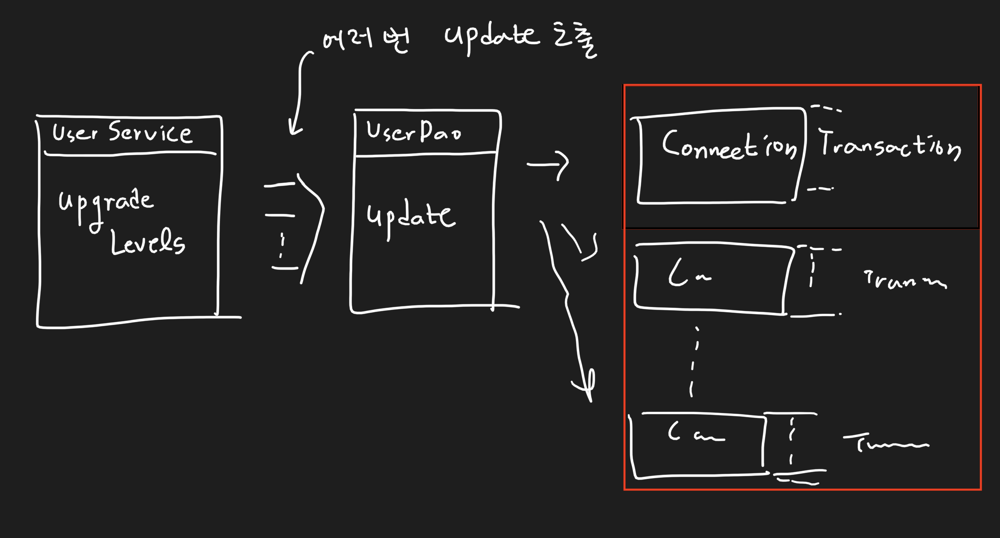
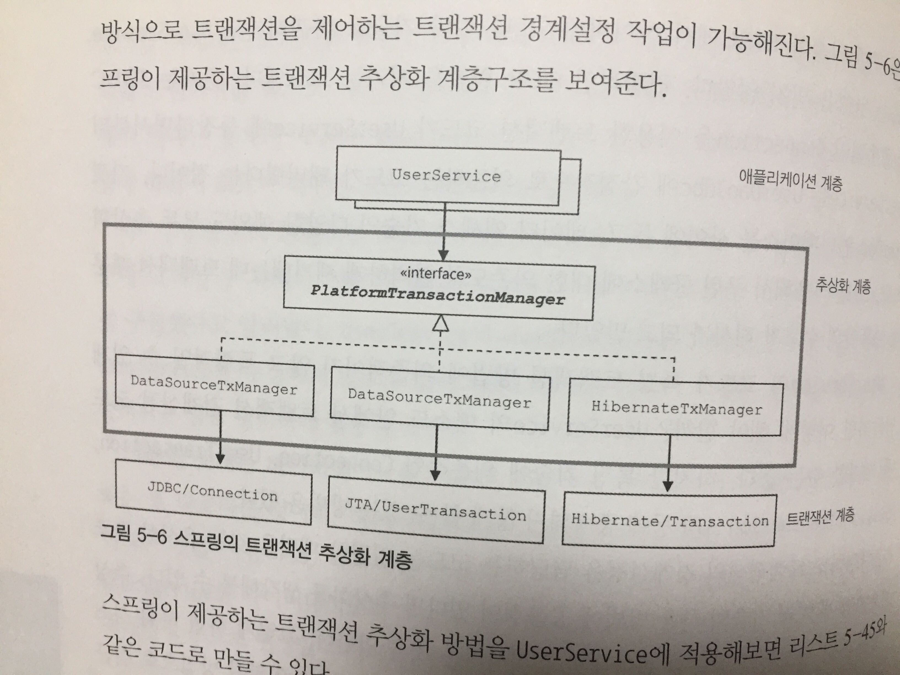
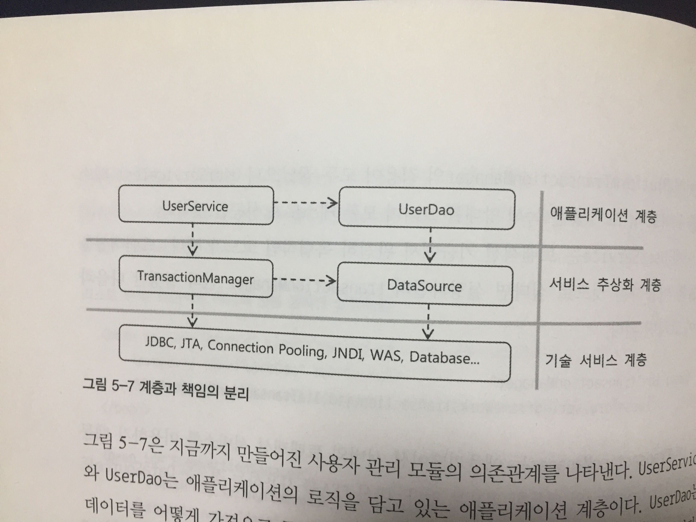

# 5장 서비스 추상화 (2)


    책장속 먼지털기 스터디 8차
    스터디 날짜 : 2021.01.04
    작성 날짜 : 2021.01.03 - 2021.01.04
    페이지 : 349 - 399


## 개요

이번 스터디에서 다룰 목표는 다음과 같다.

* UserService의 DB 트랜잭션 적용
* MailService 적용

각 기술들을 적용하면서 서비스 추상화를 적용하는 내용을 다룰 것이다. 또한 서비스 추상화를 하면서 예외 상황을 발생시키는 테스트를 작성하거나 Mock 객체를 이용한 테스트를 작성하는 방법에 대해서 다룰 것이다. 

## 트랜잭션 서비스 추상화
### 임의로 예외를 어떻게 발생시킬까?

책에서 요구 사항 한 개를 추가하였다. 유저들의 레벨을 업그레이드 하는 도중 어떤 이유로 서버가 다운 됐을 때, 이미 업그레이드 된 유저들의 상태를 돌려놓고, 레벨 변경 작업을 이루지 못했다고 유저들에게 알린다고 한다.

이를 테스트하려면 어떻게 할까? 어떻게 강제로 테스트 코드 내에서 에러를 발생시키는지 알아보자. 책에서는 `UserService`를 확장하여, 에러를 발생시키는 테스트 용 `UserService`를 만들 것을 추천하고 있다. 

TestUserService.java
```java
public class TestUserService extends UserService {
    private String id;

    public TestUserService(String id, UserDao userDao) {
        super(userDao);
        this.id = id;
    }

    public void upgradeLevel(User user) {
        if (user.getId().equals(this.id)) {
            throw new TestUserServiceException();
        }

        super.upgradeLevel(user);
    }
}
```

책과 달리 `UserDao`를 생성자 호출 시 인자로 넣어주어야 한다. 

> 참고!
> 
> 다만 테스트 코드 작성 시 setUserDao를 호출할 필요가 사라집니다. ^^

TestUserServiceException.java
```java
public class TestUserServiceException extends RuntimeException {
}
```

이제 `UserServiceTest.java`를 다음과 같이 테스트 코드를 추가한다.

UserServiceTest.java
```java
// ...
@Test
@DisplayName("예외 발생 시 작업 취소 여부 테스트")
public void test_cancel_when_exception() {
    UserService testUserService = new TestUserService(users.get(3).getId(), userDao);

    assertThrows(TestUserServiceException.class, () -> {
        testUserService.upgradeLevels();
    });

    checkLevel(users.get(1), false);
}
// ...
```

테스트 코드를 돌려보면, 다음과 같이 "테스트 실패"라는 결과를 얻을 수 있다.

```
expected: <BASIC> but was: <SILVER>
org.opentest4j.AssertionFailedError: expected: <BASIC> but was: <SILVER>
...
```

### 트랜잭션이 무엇인가?

위의 테스트 실패는 트랜잭션 문제이다. 트랜잭션이란, DB에서 "더 이상 나눌 수 없는 작업"을 뜻한다. 레벨을 업그레이드하는 로직을 다시 한 번 살펴보자.

UserService.java
```java
// ...
public void upgradeLevels() {
    List<User> users = userDao.getAll();

    for (User user : users) {
        if (canUpgradeLevel(user)) {
            upgradeLevel(user);
        }
    }
}

// ...
```

모든 유저를 순회해서, 업그레이드 가능한 유저는 레벨을 한 단계 업그레이드 시킨다. 만약 이 순회 도중 서버에 에러가 발생해서 기능이 다운된다면 어떻게 될까? 기본적으로 자바 애플리케이션에서는 순회된 유저까지만 업그레이드하고 멈출 것이다. 논리적으로는 업그레이드 도중 멈추기보다, 이전 작업 상태로 돌아가는 것이 맞을 것이다. 이렇게 **DB에 어떤 작업을 논리적으로 묶어 실패했을 때 어떻게 하는가를 정하는 것이 바로 트랜잭션**이다. 일종의 작업 단위의 경계라고 보면 된다.

일반적으로 트랜잭션을 시작하는 방법은 한 가지이지만, 끝내는 방법은 다음과 같이 2가지가 있다.

1. Commit
2. Rollback

첫 번째 `Commit`은 작업이 성공적으로 마무리되었다고 DB에 알려 내용을 수정하는 것이다. 두 번째 `Rollback`은 작업이 실패하였음을 알려 DB 내용을 작업 이전으로 되돌려 놓는다. 이제 `JDBC`에서 어떻게 트랜잭션을 적용하는지 알아보자. 아래는 간단한 트랜잭션 적용하는 코드의 예문이다.

```java
Connection c = dataSource.getConnection();
c.setAutoCommit(false); // 트랜잭션 시작.

try {
    // 트랜잭션 설정하고 싶은 SQL 구문들
    c.commit();     // 성공적이면 트랜잭션 커밋!
} catch(Exception e) {
    c.rollback();   // 도중 실패하면 롤백
} finally {
    c.close();      // 마무리는 Connection 리소스 해제
}
```

이제 본격적으로 트랜잭션이 무엇이고 `JDBC`에서 어떻게 적용하는지 알았으니 `UserService`에 트랜잭션을 적용해보자. 

### UserService에 트랜잭션 적용

트랜잭션 설정은 어디에 두면 좋을까? `UserService`? `UserDao`? 뭔가 DB 레이어와 연관이 깊으니까 `UserDao`라고 생각할 수도 있겠다. 현재 호출 구조는 다음과 같다.


현재는 `UserDao.update`를 할 때마다 커넥션이 생성되고, 트랜잭션은 메소드 시작과 끝이라고 보면 된다. (정확히는 SQL문 실행 시작과 끝) 우리는 이렇게 트랜잭션을 설정하고 싶은 것이다.



이렇게 하기 위해서는 `UserDao.update`가 아닌 `UserService.upgradeLevels`에서 트랜잭션을 걸어야 한다. 가장 쉽게는 이렇게 할 수 있을 것이다.

1. UserDao.update 메소드 파라미터에 Connection을 추가한다. 
   ```java
   public interface UserDao {
        // ...
        void update(Connection c,User user);
    }

   ```
2. UserService.upgradeLevels()를 다음과 같은 구조로 만든다.
   ```java
   public void upgradeLevels() {
        (1) DB Connection 생성
        (2) 트랜잭션 시작
        try {
            // 이는 upgradeLevel 메소드 파라미터에 Connection이 추가되어야 함을 뜻한다.
            (3) userDao.update(c, user); 여러번 호출 
            (4) 트랜잭션 커밋
        } catch(Exception e) {
            (5) 트랜잭션 롤백
            throw e;
        } finally {
            (6) DB Connection 종료
        }
    }
   ```

그런데 이렇게 작성 시 다음의 3가지 문제점을 가지게 된다.

1. `JdbcTemplate`을 더 이상 활용할 수 없다.
2. 비지니스 로직만 담은 `UserService`에서 `Connection`을 처리해야 한다. 즉 DB 레이어와 분리한 이점을 잃어버린다.
3. `UserDao` 인터페이스에 `Connection` 파라미터가 추가되면, 더 이상 기술 독립적으로 만들 수가 없다.

어떻게 이를 해결할 수 있을까? `Connection` 파라미터를 제거를 위해서 `TransactionSynchronization`을 다음과 같이 사용할 수 있다. `UserService`를 다음과 같이 수정한다.

UserService.java
```java
@RequiredArgsConstructor
@Getter
public class UserService implements UserLevelUpgradePolicy {
    // ...
    private final DataSource dataSource;
    private final UserDao userDao;

    // ...
    public void upgradeLevels() throws Exception {
        TransactionSynchronizationManager.initSynchronization();
        Connection c = DataSourceUtils.getConnection(dataSource);
        c.setAutoCommit(false);

        try {
            List<User> users = userDao.getAll();

            for (User user : users) {
                if (canUpgradeLevel(user)) {
                    upgradeLevel(user);
                }
            }
            c.commit();
        } catch (Exception e) {
            c.rollback();
            throw e;
        } finally {
            DataSourceUtils.releaseConnection(c, dataSource);
            TransactionSynchronizationManager.unbindResource(this.dataSource);
            TransactionSynchronizationManager.clearSynchronization();
        }
    }
}
```

`upgradeLevel`에 `Connection`을 전달하지 않고도 트랜잭션을 걸었다. 훌륭하다. 이를 위해서 자바 기반 빈 설정 파일(BeanFactory, TestBeanFactory)들에서 `UserService` 빈 설정 부분과 `TestUserService`에 생성자에서 `DataSource`를 파라미터로 넘겨 주어야 한다.

그런데 어떻게 이것이 가능한 것일까? `JdbcTemplate`은 매우 영리하게 만들어졌다. 만약 미리 생성되어 DB 커넥션이나, 트랜잭션이 없으면 직접 커넥션을 만들고 트랜잭션을 시작하여 JDBC 작업을 진행한다. 반면 작업 전에 커넥션과 트랜잭션이 있으면 그것을 이용한다. 실로 놀라지 않을 수 없다.

현재도 훌륭하지만 아직 개선 사항이 남아있다. `upgradeLevels`에서 `Connection`을 사용하면서 `JDBC` 기술에 종속적인 코드가 되어버렸다. 이를 해결해보자.


출처: 책 토비의 스프링 3.1 - 에이콘

스프링은 여러 기술들을 트랜잭션을 걸 수 있게 위와 같이 이미 구현되어 있다. 따라서 우리는 `PlatformTransactionManager`를 이용하면 기술에 독립적인 코드로 돌아갈 수 있을 것이다. `UserService` 코드를 다음과 같이 변경한다.

UserService.java
```java
@RequiredArgsConstructor
@Getter
public class UserService implements UserLevelUpgradePolicy {
    // ...
    private final PlatformTransactionManager transactionManager;
    private final UserDao userDao;

    // ...
    public void upgradeLevels() {
        TransactionStatus status = transactionManager.getTransaction(new DefaultTransactionDefinition());

        try {
            List<User> users = userDao.getAll();

            for (User user : users) {
                if (canUpgradeLevel(user)) {
                    upgradeLevel(user);
                }
            }
            transactionManager.commit(status);
        } catch (Exception e) {
            transactionManager.rollback(status);
            throw e;
        }
    }
}
```

이제 빈 설정 파일에 `PlatformTransactionManager`를 빈으로 만들고, `UserService`가 이를 참조하게 만들어야 한다. `BeanFactory`를 다음과 같이 수정한다.

BeanFactory.java
```java
@Configuration
public class BeanFactory {
    // ...

    @Bean
    public UserService userService(){
        UserService userService = new UserService(transactionManager(), userDao());
        return userService;
    }

    // ...

    @Bean
    public PlatformTransactionManager transactionManager() {
        return new DataSourceTransactionManager(dataSource());
    }

    // ...
}
```

같은 요령으로 `TestBeanFactory` 역시 수정한다. 물론 `TestUserService` 역시 생성자에서 `DataSource`가 아닌 `PlatformTransactionManager`를 파라미터로 넘겨주어야 한다.

```java
public class TestUserService extends UserService {
    private String id;

    public TestUserService(String id, PlatformTransactionManager transactionManager, UserDao userDao) {
        super(transactionManager, userDao);
        this.id = id;
    }
    // ...
}
```

만약 다른 하이버네이트 기술이나 JTA 기술로 변경해야 한다면, 빈 설정 파일에서 `PlatformTransactionManager`를 설정하는 부분만 변경하면 다른 코드 수정 없이 손쉽게 트랜잭션을 걸 수 있다. 스프링을 통해서 데이터 액세스 기술 독립적으로 트랜잭션 서비스를 추상화하였다. 

## 서비스 추상화와 단일 책임 원칙

스프링 트랜잭션 서비스 추상화 기술을 적용하면서 다양한 트랜잭션 기술을 일관된 방식으로 제어할 수 있게 되었다. 여지까지 했던 서비스 추상화를 간단하게 정리해보자.


출처: 책 토비의 스프링 3.1 - 에이콘

`UserService`, `UserDao`의 분리는 애플리케이션 레벨에서 담당하는 코드의 기능적인 관심에 따라 분리되었다. 또한 서로의 영향도를 낮추어서 독립적으로 확장이 가능하도록 만들어졌다. 이러한 분리를 "수평적인 분리"라고 한다.

트랜잭션 추상화는 애플리케이션에서의 비지니스 로직과 하위에서 그러니까 데이터베이스에서 동작하는 로우레벨의 트랜잭션의 기술을 분리해낸 것이다. 이를 "수직적인 분리"라고 할 수 있다.

위의 그림을 자세히 보면 애플리케이션 계층이나, 서비스 추상화 계층에는 공통점이 있는데, `UserService`는 `UserDao` "인터페이스"를 참조한다. 따라서, `UserDao`의 데이터 액세스 기술이나 로직이 바뀌더라도 `UserService`는 바뀌지 않는다. 이를 **결합도가 낮다**라고 표현한다. `TransactionManager`도 마찬가지이다. 인터페이스를 사용함으로써, 빈 주입 시 각기 원하는 데이터 액세스 기술의 트랜잭션을 지원하는 구현체로 쉽게 변경할 수 있다. 마찬가지로 이를 참조하는 `UserService`의 코드는 변하지 않는다.

이것이 가능한 이유는 `스프링 DI` 덕분이다. DI의 가치는 관심, 책임, 성격이 다른 코드를 깔끔하게 분리하는데 있다고 토비님은 말하고 있다. 

이런 적절한 분리는 "단일 책임 원칙 (Single Responsibility Principle, SRP)"으로 설명할 수 있다. 하나의 모듈은 하나의 책임을 지녀야 한다. 바꿔 말해 하나의 모듈이 바뀌는 이유는 한 가지 이유여야 한다는 뜻이다. 예를 들어서, `UserService`가 직접 트랜잭션을 제어했을 때 `UserService`의 SRP는 무너졌다. 왜냐하면 사용자 관리 로직과 더불어 "데이터 액세스 기술인 트랜잭션을 어떻게 관리할 것인가"라는 관심이 하나 더 생기기 때문이다.

SRP의 장점은 관심사를 적절히 분리해내어, 하위 구현체가 바뀌더라도 상위 구현체의 코드는 변경하지 않는데 있다. `UserDao`가 JDBC기반이 아니라 JPA로 바뀌더라도, 데이터 액세스 기술이 RDB가 아니라 NoSQL 데이터베이일지라도 `UserService`의 코드는 바뀌지 않는다. 이것이 핵심이다. 

어느 개발자의 유튜브에서 본 적이 있다. 스프링 프레임워크의 장점은 코드의 모듈리티가 자연스럽게 뛰어나지는데 있다고.. 책에서는 디자인 패턴, 설계 원칙을 적용하여 코드를 깔끔하게 만드는 것은 매우 어려운 일이라고 말하고 있다. 고작 책을 몇 권 읽는다고 몇 달 노력한다고 쉽게 얻을 수 있는 것이 아니란다. 그래도 독자들에게 1장부터 5장까지 적용해왔던 스프링 DI의 개념들을 잘 활용해서 스프링을 열심히 사용하다보면 자연스레 이런 기술들을 적용할 수 있게 될 것이라고 격려해주고 있다 하하;;

## 메일 서비스 추상화

1. JavaMailService
2. 테스트를 위한 서비스 추상화
3. Mock 객체 생성 및 테스트