# 6장 AOP (1)


    책장속 먼지털기 스터디 9차, 10차
    스터디 날짜 : 2021.01.11, 2021.01.18
    작성 날짜 : 2021.01.10 - 2021.01.18
    페이지 : 401 - 474


## 개요

스프링의 3대 기술은 다음과 같다.

1. IoC/DI (의존성 주입)
2. PSA (서비스 추상화)
3. AOP (관심사의 분리)

이 중 가장 어렵다는 `Aspect Oriented Programming(이하 AOP)`에 대해서 공부한다. 대표적인 예는 이전 장에서 만들었던 "트랜잭션"이다. 따라서 이전 장의 코드를 최대한 활용한다.


## 트랜잭션 코드의 분리

현재 `UserService` 코드의 문제점은 무엇일까? 

    트랜잭션 경계를 담당하는 코드와 비지니스 로직을 담당하는 코드가 뒤섞여 있다.

다음은 위의 문제점을 나타내는 코드의 본문이다.

UserService.java
```java
@RequiredArgsConstructor
@Getter
public class UserService implements UserLevelUpgradePolicy {
    // ...
    public void upgradeLevels() {
        // 트랜잭션을 만든다.
        TransactionStatus status = transactionManager.getTransaction(new DefaultTransactionDefinition());

        try {
            // 비지니스 로직을 처리한다.
            List<User> users = userDao.getAll();

            for (User user : users) {
                if (canUpgradeLevel(user)) {
                    upgradeLevel(user);
                }
            }

            // 트랜잭션을 끝낸다.
            transactionManager.commit(status);
        } catch (Exception e) {
            transactionManager.rollback(status);
            throw e;
        }
    }
}
```

이를 분리할 수 있을까? 가장 쉬운 방법으론 메서드 추출이 있겠다. 하지만 메소드 레벨에서의 분리일뿐 실제적으로 코드가 분리되지는 않는다. 다행히 우리는 여태까지 깔끔하게 코드를 분리하는 방법을 배워왔다. 이를 적용할 수 있지 않을까?

현재 문제점은 클라이언트(`UserServiceTest`)가 `UserService`를 직접 호출함으로써 강하게 결합되어 있다. 다음과 같이 말이다.

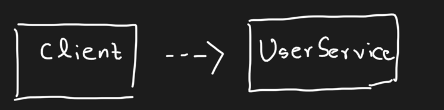

이 상태에서 어떻게 트랜잭션 기능을 밖으로 빼버린다면, 클라이언트는 트랜잭션을 담당하는 코드가 빠진채로, 그 기능을 사용할 수 밖에 없다. 이번에도 인터페이스를 도입해보자.

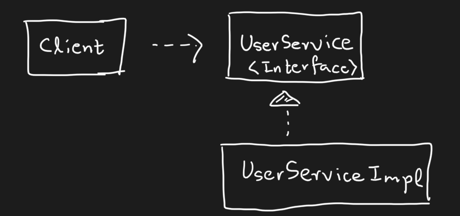

클라이언트와 서비스 코드가 결합이 약해지면서 조금 더 유연하게 확장이 가능하다. 그러나 이 역시도 `UserServiceImpl`에서 트랜잭션과, 비지니스 로직을 담당하는 코드가 뒤섞여 있음이 자명하다. 그렇다면 이런 구조는 어떨까.

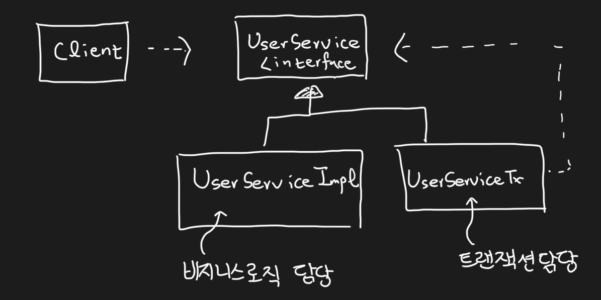

그림으로 보면 분리는 되었지만 어떻게 되어 있을지는 잘 감이 안온다. 결론부터 말하면 다음과 같은 구조가 된다. 

1. 애플리케이션에서 `UserService` 자리에는 `UserServiceTx`를 주입시킨다. 
2. 이 `UserServiceTx`는 `UserService`를 가지며 `UserServiceImpl`을 그 자리에 주입시킨다. 
3. 클라이언트가 `UserService.upgradeLevels`를 호출하면 `UserServiceTx.upgradeLevels`가 호출된다.
4. `UserServiceTx.upgradeLevels`에서는 트랜잭션을 처리하고 그 후 `UserServiceImpl.upgradeLevels`를 호출하여 비지니스 로직을 호출한다.
5. 비지니스 로직이 실행된다.

그렇다! 구조로 보면 클라이언트의 요청을 `UserServiceTx`가 받아 트랜잭션 처리 후 `UserServiceImpl`에 넘겨주는 형식이다. "백문이 불여일타!" 한 번 코드로써 살펴보자. 먼저 `UserService` 인터페이스를 다음과 같이 생성하자.

UserService.java
```java
@Service
public interface UserService {
    void add(User user);
    void upgradeLevels();
}
```

기존 `UserService`코드는 `UserServiceImpl`로 변경하고 트랜잭션 기능을 제거해서 코드를 만들어둔다.

UserServiceImpl.java
```java
@RequiredArgsConstructor
@Getter
public class UserServiceImpl implements UserLevelUpgradePolicy, UserService {
    // ... 
    // TransactionManager 제거
    private final MailSender mailSender;
    private final UserDao userDao;

    // ...

    public void upgradeLevels() {
        List<User> users = userDao.getAll();

        for (User user : users) {
            if (canUpgradeLevel(user)) {
                upgradeLevel(user);
            }
        }
    }

    // ...
}
```

이제 트랜잭션을 담당하는 `UserServiceTx`를 만든다.

UserServiceTx.java
```java
@Service
@RequiredArgsConstructor
public class UserServiceTx implements UserService{
    private final UserService userService;
    private final PlatformTransactionManager transactionManager;
    

    @Override
    public void add(User user) {
        userService.add(user);
    }

    @Override
    public void upgradeLevels() {
        // 트랜잭션 경계 설정
        TransactionStatus status = transactionManager.getTransaction(new DefaultTransactionDefinition());
        try {
            // 비지니스로직 userService에 위임
            userService.upgradeLevels();

            // 트랜잭션 경계 해제
            transactionManager.commit(status);
        } catch (RuntimeException e) {
            transactionManager.rollback(status);
            throw e;
        }
    }
}
```

앞서 말했듯, `UserServiceTx.upgradeLevels`가 호출되면, 트랜잭션을 만들고 실제 비지니스로직은 내부의 `UserService.upgradeLevels`를 호출하여 그 책임을 위임한다. 이제 이를 우리의 의도대로 작동할 수 있게 DI 설정을 한다.

`BeanFactory`는 다음과 같다. (TestBeanFactory도 마찬가지.)

BeanFactory.java
```java
@Configuration
public class BeanFactory {
    // ...

    // Application 전체적으로 주입되는 UserService는 UserServiceTx
    @Bean
    public UserService userService() {
            UserServiceTx userServiceTx = new UserServiceTx(userServiceImpl(), transactionManager());
            return userServiceTx;
    }

    // 이는 UserServiceTx에 넣어주기 위한 비지니스를 가진 UserServiceImpl
    @Bean
    public UserServiceImpl userServiceImpl(){
        UserServiceImpl userServiceImpl = new UserServiceImpl(mailSender(), userDao());
        return userServiceImpl;
    }

    // ...
}
```

이제 실제 클라이언트인 `UserServiceTest`가 동작할 수 있도록 코드를 변경한다. 먼저 목 객체인 `TestUserService`를 다음과 같이 바꾼다.

TestUserService.java
```java
public class TestUserService extends UserServiceImpl {
    private String id;

    public TestUserService(String id, MailSender mailSender, UserDao userDao) {
        super(mailSender, userDao);
        this.id = id;
    }

    public void upgradeLevel(User user) {
        if (user.getId().equals(this.id)) {
            throw new TestUserServiceException();
        }

        super.upgradeLevel(user);
    }
}
```

그 후 이를 참조하는 `UserServiceTest.test_cancel_when_exception`를 다음과 같이 바꾼다.

UserServiceTest.java
```java
@SpringBootTest
@DirtiesContext
@Import(TestBeanFactory.class)
class UserServiceTest {
    // ...
    @Test
    @DisplayName("예외 발생 시 작업 취소 여부 테스트")
    public void test_cancel_when_exception() {
        UserService mock = new TestUserService(users.get(3).getId(), testMailSender, testUserDao);
        UserService userServiceTx = new UserServiceTx(mock, testTransactionManager);

        assertThrows(TestUserServiceException.class, () -> {
            userServiceTx.upgradeLevels();
        });

        checkLevel(users.get(1), false);
    }
}
```

이제 테스트를 돌려보면 정상적으로 동작한다. 후! 우리는 깔끔하게 트랜재션을 담당하는 코드와 비지니스 로직을 담당하는 코드를 분리해내었다. 이 과정을 통해서 우리가 얻는 장점은 다음과 같다.

1. 비지니스 로직을 담당하는 `UserServiceImpl`의 경우 트랜잭션과 같은 부가적인 기능에 대해서 기술적인 내용에 대해 신경쓰지 않아도 된다.
2. 비지니스 로직에 대한 테스트를 더 쉽게 만들 수 있다.


## 고립된 단위 테스트

이제 위에서 언급했던 장점 "비지니스 로직에 대한 테스트를 더 쉽게 만들 수 있다."에 대해서 살펴보자. 먼저 테스트라는 것은 **가능한 작은 단위**로 쪼개서 테스트하는 것이 좋다. 왜냐하면 여러 단위가 뒤섞여 있을 경우 테스트 코드가 어디서 에러가 나는지 한 번에 확인할 수가 없기 때문이다.

트랜잭션 코드를 분리하기 전으로 다시 한 번 돌아가보자. 우리의 구조는 다음과 같다. 

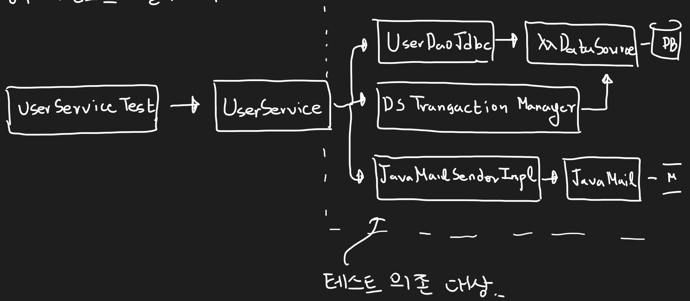

분리하기 전 `UserService`는 비지니스 로직 외에도 검증해야 할 것이 너무 많다. 메일 서버와의 네트워킹, 디비와의 네트워킹 그리고 `UserDao`가 정상 작동하는지 여부 등등... 이러면 테스트가 실패해도 `UserService`의 문제인지 아니면 다른 컴포넌트의 문제인지 정확하게 알기가 힘들어서 굉장히 테스트가 어려울 수 밖에 없다. 그렇다면 어떻게 이런 문제를 해결할 수 있을까?

이전 장에서 했던 `MailSender`를 생각해보자. 목 객체를 만들어서 테스트했었다. 어떻게 보면 목 객체는 "이 코드와, 관련된 컴포넌트는 의도대로 결과 값을 내놓는다"라고 가정하고 테스트를 하는 것이다. 이를 `UserService`의 비지니스 로직 외에 모든 부분으로 적용하는 것이다. 구조는 다음과 같다.

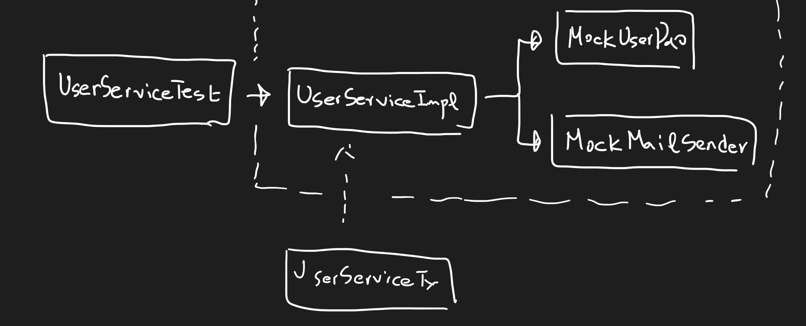

위의 구조처럼 `MockMailSender`, `MockUserDao`를 직접 만들어서 테스트해도 좋다. 그러나 더 편한 방법이 없을까? 자바 진영에서는 이런 테스트를 지원하기 위한 프레임워크로 `Mockito`가 존재한다. 스프링 부트는 다음 의존성을 거의 기본으로 가지고 있다.

build.gradle
```
// ...

dependencies {
    // ...

    testImplementation('org.springframework.boot:spring-boot-starter-test') {
        exclude group: 'org.junit.vintage', module: 'junit-vintage-engine'
    }
}
```

`spring-boot-starter-test`는 이미 `Mockito`에 대한 의존성을 가지고 있는 라이브러리이다. 따라서 이를 설정할 필요는 없다. 테스트 코드는 `UserServiceImplTest`를 만들고 다음과 같이 작성한다.

UserServiceImplTest.java
```java
public class UserServiceImplTest {
    private UserService userService;

    private final List<User> testUsers = Arrays.asList(
            new User("test1", "test1", "test1", "test1@test.com", Level.BASIC, UserServiceImpl.MIN_LOGIN_COUNT_FOR_SILVER-1, 0),
            new User("test2", "test2", "test2", "test2@test.com", Level.BASIC, UserServiceImpl.MIN_LOGIN_COUNT_FOR_SILVER, 0),
            new User("test3", "test3", "test3", "test3@test.com", Level.SILVER, 60, UserServiceImpl.MIN_RECOMMEND_COUNT_FOR_GOLD-1),
            new User("test4", "test4", "test4", "test4@test.com", Level.SILVER, 60, UserServiceImpl.MIN_RECOMMEND_COUNT_FOR_GOLD),
            new User("test5", "test5", "test5", "test5@test.com", Level.GOLD, 100, 100)
    );

    @Test
    @DisplayName("upgrade level test")
    public void upgradeLevelTest(){
        // 1. 목 객체 생성
        MailSender mailSender = mock(MailSender.class);
        UserDao userDao = mock(UserDao.class);

        // 2. 실제 테스트하고 싶은 UserServiceImpl 생성
        userService = new UserServiceImpl(mailSender, userDao);

        // 3. userDao.getAll() 호출 시 결과를 testUsers를 설정
        when(userDao.getAll()).thenReturn(testUsers);  

        // 4. 실제 테스트하고 싶은 메소드 호출
        userService.upgradeLevels();

        // 5. 검증 userDao.update가 몇 번 호출됐는지, 파라미터가 무엇인지 알 수 있다.
        verify(userDao, times(2)).update(any(User.class));
        verify(userDao, times(2)).update(any(User.class));
        verify(userDao).update(testUsers.get(1));
        assertEquals(Level.SILVER, testUsers.get(1).getLevel());
        verify(userDao).update(testUsers.get(3));
        assertEquals(Level.GOLD, testUsers.get(3).getLevel());

        // 6. 5번과 마찬가지로 테스트 검증. 보다 정밀한 테스트를 위해 결과를 캡처한다.
        ArgumentCaptor<SimpleMailMessage> mailMessageArg = ArgumentCaptor.forClass(SimpleMailMessage.class);
        verify(mailSender, times(2)).send(mailMessageArg.capture());
        List<SimpleMailMessage> mailMessages = mailMessageArg.getAllValues();
        assertEquals(testUsers.get(1).getEmail(), mailMessages.get(0).getTo()[0]);
        assertEquals(testUsers.get(3).getEmail(), mailMessages.get(1).getTo()[0]);
    }
}
```

`Mockito`를 이용해서 보다 더 깔끔한 단위 테스트가 가능해졌다. 이렇게 하면 무엇이 좋을까? 장점은 다음과 같다.

1. 테스트 레벨에서 Spring DI를 쓸 필요가 없다.
2. 테스트 실행 속도가 매우 빠르다.

실제 위 코드에서는 Spring DI를 1도 쓰지 않았다. 목객체를 생성하고 그것들을 토대로 `UserServiceImpl`을 생성했을 뿐이다. 따라서 복잡한 설정은 필요 없다. 그리고 컨텍스트가 매우 작기 때문에 실행 속도는 매우 빠르다. 이것이 "단위 테스트"의 최대 장점이다. 여기서 단위 테스트와 통합 테스트를 다시 정의할 필요가 있다. 이 두 용어의 정의는 다음과 같다.

* 단위 테스트 : Mock 객체를 이용하여, 원하는 클래스의 기능만을 테스트하는 것 (UserServiceImplTest)
* 통합 테스트 : 두 개 이상의 성격/레이어들이 참여하거나 혹은 외부 컴포넌트가 추가된 테스트 (UserServiceTest)

책에는 이 두 테스트를 어떨 때 사용할 지 가이드라인을 적어두었지만 나는 생략하겠다. 궁금하면 꼭 한 번 책을 읽어보았으면 좋겠다.


## 다이나믹 프록시와 팩토리 빈

트랜잭션 코드와 비지니스 로직 코드를 분리할 때 사용했던 기법들을 돌아봐보자. 우리는 먼저, 확장성을 위하여 "전략 패턴"을 사용했다. 클라이언트가 바로 서비스 코드를 접근하는 것이 아닌 인터페이스를 이용하여 결합력을 낮춘다. (UserServiceTx 도입 전, UserService-UserServiceImpl)

> 참고!
> 
> 여기서 부가 기능은 트랜잭션, 핵심 기능은 유저의 레벨을 업데이트하는 기능이다.

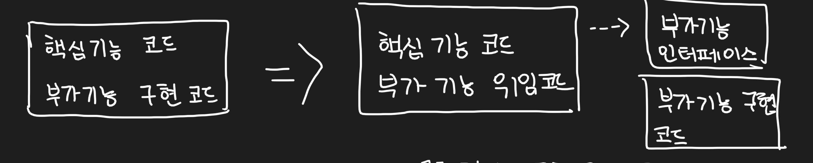

현재는 관심사가 다른 트랜잭션 코드와 비지니스 로직 코드를 완전히 분리한 상태이다.

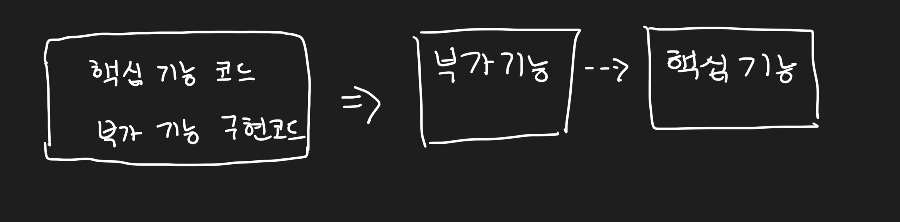

`UserServiceTx`는 오로지 "트랜잭션"이라는 부가 기능만 담당하고 실제 비지니스 로직의 처리는 `UserServiceImpl`에게 위임한다. 이러한 구조의 큰 특징이다. 그러나 이 경우 부가 기능을 무시하고 바로 비지니스 로직에 접근한다면, 부가 기능을 적용할 기회가 사라진다. 따라서, 부가 기능 자신 역시도 핵심 인터페이스를 구현하며, 실제 핵심 코드를 감싸는 형태가 되어야 한다.

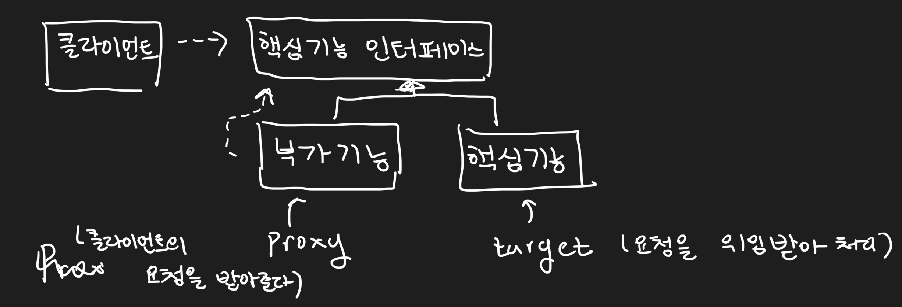

객체로써 살펴보면, 클라이언트는 부가 기능을 수행하는 객체에게 요청을 하게 된다. 부가 기능을 수행하는 객체는 요청이 들어오면 부가 기능 수행 뒤, 핵심 기능을 수행하는 객체에게 그 요청을 위임한다. 이 때 클라이언트의 요청을 핵심 기능을 수행하는 객체로 넘겨주는 객체를 "프록시", 클라이언트 요청을 전달 받아 핵심 기능을 수행하는 객체를 "타겟"이라고 부른다.

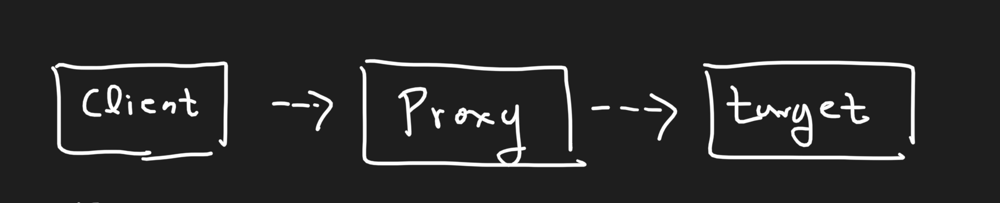

정리하자면, 프록시는 다음의 2가지 목적으로 사용된다.

1. client가 target에 접근하는 것을 제어
2. target에 부가적인 기능 부여

이번에는 2가지 디자인 패턴에 대해 간단하게 알아보자.  

1. `Decorator Pattern` : 이 패턴은 target에 부가적인 기능을 런타임 시에, 동적으로 부여해주기 위해 proxy를 사용하는 패턴 (ex) InputStream, OutputStream) target 코드와, client의 호출하는 방법도 변경하지 않고 확장 기능을 추가할 때 자주 쓰인다.
2. `ProxyPattern` : proxy 사용 방법 중 target에 대한 접근 방법을 제어하려는 목적을 가진 경우 (proxy는 client-target 사이에 대리 역할을 맡은 객체를 두는 방법의 총칭) 주로 target에 확장 기능의 추가보다는 client가 target을 접근하는 방법만 제어한다.

일반적인 프록시는  2가지 단점이 있다.

1. 타깃의 인터페이스를 구현하고 위임하는 코드를 작성하기 번거롭다. (`UserServiceTx`의 경우 `UserService`를 구현하기 때문에, add 메소드를 작성해야 했다.)
2. 부가 기능은 애플리케이션 전반적으로 사용될 가능성이 높다. (`UserService`외 `PostService`도 트랜잭션을 사용한다면?)

이런 단점을 극복하기 위한 것이 Reflection API를 이용하는 JDK의 `Dynamic Proxy`이다. 다음의 테스트 코드를 살펴보자. `String.length`를 호출하는 다른 방법을 살펴볼 수 있다.

ReflectionTest.java
```java
public class ReflectionTest {
    @Test
    @DisplayName("reflection을 이용해서, String.length를 호출")
    public void invokeTest() throws Exception {
        String name = "spring";
        assertEquals(6, name.length());

        Method lengthMethod = String.class.getMethod("length");
        assertEquals(6, (Integer)lengthMethod.invoke(name));
    }
}
```

이런 식으로 `ClassName.class` 혹은 `인스턴스.getClass()`의 형태로 리플렉션 API 메소드들을 이용해서 코드를 조작할 수가 있다. 이제 다이나믹 프록시를 간단하게 한 번 만들어보자. 다음 인터페이스를 작성한다.

Hello.java
```java
public interface Hello {
    String sayHello(String name);
    String sayHi(String name);
    String sayThankU(String name);
}
```

그리고 다음과 같은 타겟 클래스를 만든다.

HelloTarget.java
```java
public class HelloTarget implements Hello {
    @Override
    public String sayHello(String name) {
        return "Hello " + name;
    }

    @Override
    public String sayHi(String name) {
        return "Hi " + name;
    }

    @Override
    public String sayThankU(String name) {
        return "Thank you " + name;
    }
}
```

바로 다이나믹 프록시가 아닌, 간단한 프록시부터 적용해보자. `HelloTarget`의 결과를 모두 대문자로 만들어주는 부가 기능을 해주는 `HelloUpperCaseProxy`를 만든다.

HelloUpperCaseProxy.java
```java
@RequiredArgsConstructor
public class HelloUpperCaseProxy implements Hello {
    private final Hello hello;

    @Override
    public String sayHello(String name) {
        return hello.sayHello(name).toUpperCase();
    }

    @Override
    public String sayHi(String name) {
        return hello.sayHi(name).toUpperCase();
    }

    @Override
    public String sayThankU(String name) {
        return hello.sayThankU(name).toUpperCase();
    }
}
```

타겟과 프록시의 테스트는 다음과 같이 할 수 있다.

DynamicProxyTest.java
```java
public class DynamicProxyTest {
    @Test
    @DisplayName("target test")
    public void test_target() {
        String name = "tobby";
        Hello hello = new HelloTarget();

        assertEquals("Hello " + name, hello.sayHello(name));
        assertEquals("Hi " + name, hello.sayHi(name));
        assertEquals("Thank you " + name, hello.sayThankU(name));
    }

    @Test
    @DisplayName("simple proxy test")
    public void simple_proxy_target() {
        String name = "tobby";
        Hello hello = new HelloUpperCaseProxy(new HelloTarget());

        assertEquals(("Hello " + name).toUpperCase(), hello.sayHello(name));
        assertEquals(("Hi " + name).toUpperCase(), hello.sayHi(name));
        assertEquals(("Thank you " + name).toUpperCase(), hello.sayThankU(name));
    }
}
```

자 이제 진짜로 다이나믹 프록시를 적용해보자. "다이나믹 프록시는" 프록시 팩토리에 의해 다이나믹하게 만들어지는 오브젝트이다. 다음 그림은 다이나믹 프록시의 동작 방식을 나타낸다.

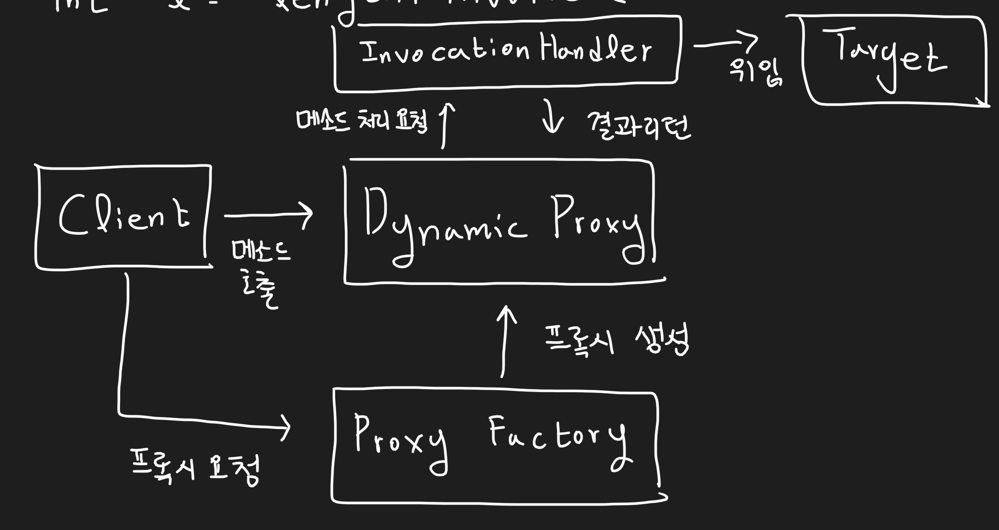

다이나믹 프록시 역시 타깃과 같은 인터페이스로 만들어진다. 동작 방식을 자세히 살펴보면 다이나믹 프록시를 만드려면, 실제 프록시 클래스가 아닌, `InvocationHandler`라는 녀석을 구현하는 클래스를 만들어주어야 한다는 것을 알 수 있다.

바꿔 말하면 다이나믹 프록시는 클라이언트 요청이 들어오면 다음과 같이 `InvocationHandler`를 통해서, 타겟에 그 요청을 위임한다.

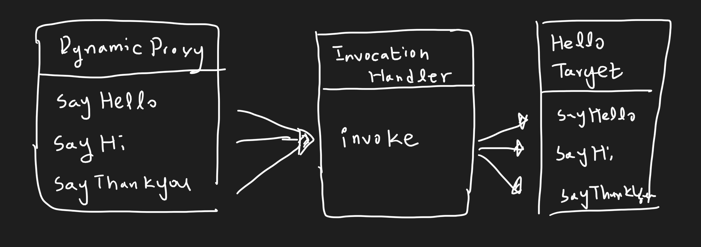

이제 다이나믹 프록시를 적용할 수 있도록 `InvocationHandler` 구현하는 핸들러를 만들어준다.

UpperCaseHandler.java
```java
@RequiredArgsConstructor
public class UpperCaseHandler implements InvocationHandler {
    private final Hello target;
    
    @Override
    public Object invoke(Object proxy, Method method, Object[] args) throws Throwable {
        String ret = (String)method.invoke(target, args);
        return ret.toUpperCase();
    }
}
```

클라이언트의 요청이 들어오면 프록시는 `invoke` 메소드를 호출한다. 이 메소드는 리플렉션 API를 이용해서, 타겟의 메소드를 호출하게 된다. 이제 테스트를 다음과 같이 작성한다.

DynamicProxyTest.java
```java
public class DynamicProxyTest {
    // ...
    @Test
    @DisplayName("dynamic proxy test")
    public void dynamic_proxy_target() {
        String name = "tobby";
        Hello hello = (Hello) Proxy.newProxyInstance(
            getClass().getClassLoader(),
            new Class[] { Hello.class },
            new UpperCaseHandler(new HelloTarget())
        );

        assertEquals(("Hello " + name).toUpperCase(), hello.sayHello(name));
        assertEquals(("Hi " + name).toUpperCase(), hello.sayHi(name));
        assertEquals(("Thank you " + name).toUpperCase(), hello.sayThankU(name));
    }
}
```

코드로 보면 뭔가 복잡하다. `Proxy.newProxyInstance` 이 녀석 때문이다. 이 메소드를 통해서 다이나믹 프록시가 만들어지는데 첫 번째 인자는 해당 호출 클래스의 클래스로더, 두번 째 인자로는 타겟이 구현하는 인터페이스, 세 번째 인자는 `InvocationHandler`를 구현하는 핸들러이다. 

근데 이러면 장점이 있을까? `Hello` 인터페이스 외에 여전히 다른 인터페이스는 적용할 수가 없다. 리플렉션 유연하고 강력하다며? 사실, `InvocationHandler`는 실제로 타깃 종류에 상관없이 적용이 가능하다. 그러니까 굳이 target이 `Hello` 타입일 필요는 없다. 따라서 어떤 타입도 타깃이 될 수 있다. 

UpperCaseHandler.java
```java
@RequiredArgsConstructor
public class UpperCaseHandler implements InvocationHandler {
    private final Object target;

    @Override
    public Object invoke(Object proxy, Method method, Object[] args) throws Throwable {
        Object ret = method.invoke(target, args);
        
        if (ret instanceof String) {
            return ((String) ret).toUpperCase();
        } else {
            return ret;
        }
    }
}
```

리플렉션은 매우 유연하고 강력하다. 실제 타깃이 어떤 타입도 가능하기 때문에 종종 타입이 맞지 않아 런타임시 오류를 발생시킬 수 있다. 그래서, invoke 결과가 String(타켓 인터페이스 타입)인지 확인하는 작업이 필요하다. 리플렉션의 장점은 또 있다. 어떤 메소드가 호출되었을 때 다이나믹 프록시를 생성하는지도 결정할 수 있다. 다음 처럼 말이다.

UpperCaseHandler.java
```java
@RequiredArgsConstructor
public class UpperCaseHandler implements InvocationHandler {
    private final Object target;

    @Override
    public Object invoke(Object proxy, Method method, Object[] args) throws Throwable {
        Object ret = method.invoke(target, args);

        if (ret instanceof String && method.getName().startsWith("say")) {
            return ((String) ret).toUpperCase();
        } else {
            return ret;
        }
    }
}
```

위 코드의 경우 타겟의 "say"로 시작하는 메소드 호출 시 다이나믹 프록시를 생성할 수 있다. 이제 다시 프로젝트로 돌아가서 트랜잭션 코드를 처리하는 다이나믹 프록시를 만들어보자.

TransactionHandler.java
```java
@RequiredArgsConstructor
public class TransactionHandler implements InvocationHandler {
    private final Object target;
    private final PlatformTransactionManager transactionManager;
    private final String pattern;
    
    @Override
    public Object invoke(Object proxy, Method method, Object[] args) throws Throwable {
        if (method.getName().startsWith(pattern)) {
            return invokeTransaction(method, args);
        } else {
            return method.invoke(target, args);
        }
    }

    private Object invokeTransaction(Method method, Object[] args) throws Throwable {
        TransactionStatus status = transactionManager.getTransaction(new DefaultTransactionDefinition());
        try {
            Object ret = method.invoke(target, args);
            transactionManager.commit(status);
            return ret;
        } catch (InvocationTargetException e) {
            transactionManager.rollback(status);
            throw e;
        }
    }
}
```

이제 이를 테스트 코드에 적용해본다.

UserServiceTest.java
```java
@SpringBootTest
@DirtiesContext
@Import(TestBeanFactory.class)
class UserServiceTest {
    // ...
    @Test
    @DisplayName("예외 발생 시 작업 취소 여부 테스트")
    public void test_cancel_when_exception() {
        UserService mock = new TestUserService(users.get(3).getId(), testMailSender, testUserDao);
        TransactionHandler handler = new TransactionHandler(mock, testTransactionManager, "upgradeLevels");
        UserService userServiceTx = (UserService) Proxy.newProxyInstance(
                getClass().getClassLoader(),
                new Class[] { UserService.class },
                handler
        );

        assertThrows(Exception.class, () -> {
            userServiceTx.upgradeLevels();
        });

        checkLevel(users.get(1), false);
    }
}
```

테스트를 돌려보면 무사히 테스트가 통과되는 것을 확인할 수 있다. 이제 `TransactionHandler`를 빈으로 만드려면 어떻게 해야 할까? 일반적으로 다이나믹 프록시를 빈으로 만드려면 `FactoryBean`을 이용해야 한다. `TransactionHandler`를 등록하기 위한 `FactoryBean`을 만들어보자.

```java
@RequiredArgsConstructor
public class TxFactoryBean implements FactoryBean<Object> {
    private final Object target;
    private final PlatformTransactionManager transactionManager;
    private final String pattern;
    private final Class<?> serviceInterface;

    @Override
    public Object getObject() {
        TransactionHandler handler = new TransactionHandler(target, transactionManager, pattern);
        return Proxy.newProxyInstance(
                getClass().getClassLoader(),
                new Class[] { serviceInterface },
                handler
        );
    }

    @Override
    public Class<?> getObjectType() {
        return serviceInterface;
    }

    @Override
    public boolean isSingleton() {
        return false;
    }
}
```

`TransactionHandler`와 거의 비슷하다. `target`, `transactionManager`, `pattern`으로 `TransactionHandler`를 생성하고, `@Service` 즉, 서비스 인터페이스에 대한 빈들을 모두 적용시킬 수 있도록 `serviceInterface`를 가진다. 이제 빈 설정을 해보자. 기존 `UserServiceTx`를 반환헀던 `UserService` 빈을 이 팩토리 빈을 이용해서 만들면 된다. 

BeanFactory.java(TestBeanFactory.java 도 동일 적용)
```java
@Configuration
public class BeanFactory {
    // ...

    @Bean
    public UserService userService() {
        TxFactoryBean bean = new TxFactoryBean(userServiceImpl(), transactionManager(), "upgradeLevels", UserService.class);
        return (UserService) bean.getObject();
    }
    
    // ...
}
```

이제 테스트 코드를 돌려보자. 무사히 통과함을 확인할 수 있다. 정말로 트랜잭션 코드가 작동하는지 보려면 `TransactionHandler.invoke` 메소드 호출이 이루어지는지 디버깅을 하거나 로깅으로 확인해보자.

팩토리빈의 장점은 명확하다. **다이나믹 프록시의 단점**을 제거할 수 있다. 그러나 한계도 다음과 같이 존재한다.

1. 한 번에 여러 개의 클래스에 공통 부가 기능을 제공할 수 없다. (PostService, 등의 트랜잭셔을 이용하는 서비스 코드가 만들어진다면, 이에 대한 설정이 반드시 필요하다. = 설정 코드가 무거워진다.)
2. 한 번에 하나의 타겟에 여러 부가 기능을 적용할 수 없다.


## 스프링의 프록시 팩토리 빈

팩토리 빈의 한계를 극복하기 위해 만들어진 것이 스프링의 `ProxyFactoryBean`이다.