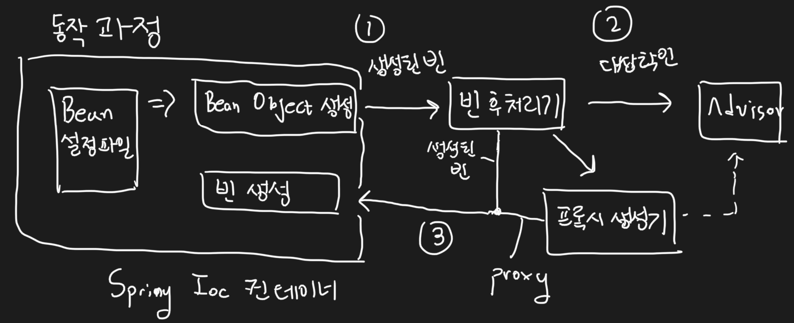

# 6장 AOP (2)


    책장속 먼지털기 스터디 11차
    스터디 날짜 : 2021.01.25
    작성 날짜 : 2021.01.24 - 2021.01.25
    페이지 : 475 - 512


## 개요

이전 장을 통해서 우리는 `ProxyFactoryBean`과 `Advise`, `Pointcut`을 적용하여, 핵심 기능에서 분리하여 부가 기능을 따로 깔끔하게 적용할 수 있도록 만들었다. 이번 장에서는 우리가 여태까지 해온 작업들을 돌아보고 `Spring AOP`를 이용해서 조금 더 "투명한 부가기능 형태"로 제공해보자. 여기서 투명하다라는 뜻은, 부가 기능을 적용한 후에도 기존, 설계와 코드에 영향을 주지 않는다는 뜻이다.

## 프록시 팩토리 빈의 한계와 극복 방법

지난 장에서 언급했던 프록시 팩토리 빈의 두 가지 한계를 다시 한 번 톺아보자. (여기서 프록시 팩토리 빈은 스프링의 `ProxyFactoryBean`을 말하는 것이 아니다.)

1. 부가 기능이 다깃 오브젝트마다 새로 만들어진다.
2. 한 번에 여러 개의 클래스에 공통 부가 기능을 제공할 수 없다.

첫 번째 문제는 스프링에서 제공하는 `ProxyFactoryBean`의 어드바이스를 해결할 수 있었다. 하지만 여전히, 공통적으로 부가 기능이 필요한 객체마다 `ProxyFactoryBean`의 설정을 추가해주어야 한다는 문제는 여전히 남아 있다. 이를 어떻게 극복할 수 있을까?

이렇게 코드가 중복되었을 때 우리는 어떤 방식으로 해결했었는지 잠깐 살펴보자.

1. 전략 패턴과 DI를 이용하여 템플릿과 콜백, 클라이언트를 분리 (ex) UserDao )
2. `Dynamic Proxy`와 `Dynamic Proxy` 생성 팩토리를 DI (ex) 이전 장에서 한 작업들)

위 방법들 중 한 번에 여러 개의 빈에 프록시를 적용할 수 때 설정 코드의 중복을 제거할 수 있는 방법은 아쉽게도 없다. 어떻게 해결할 수 있을까? 

정답부터 말하자면, 스프링 컨테이너는 다양하게 확장할 수 있는 방법이 존재한다. 이 중 `BeanPostProcessor`를 이용해서 빈 객체가 만들어진 후에 그 객체를 개발자 입맛에 맞게 다시 가공할 수 있다. 이 `BeanPostProcessor`와 더불어서, `DefaultAdvisorAutoProxyCreator`를 이용해서, 빈 객체 생성 후에, 어드바이저 적용 여부에 따라 프록시를 자동으로 설정해주면 위의 문제를 해결할 수 있다.


## Pointcut 더, 자세히!

여기서 한 가지 짚고 가자. 사실 `Pointcut`은 크게 2가지 기능이 있다. 다음은 실제 `Pointcut` 인터페이스의 코드이다.

```java
public interface Pointcut {
	ClassFilter getClassFilter();
	MethodMatcher getMethodMatcher();
	// ...
}
```

이전 장에서 우리가 사용했던 것은 `getMethodMatcher`이다. 메소드 이름 별로 어드바이스를 적용할 지 여부를 판단하는 메소드이다. `getClassFilter`는 클래스 이름으로 어드바이스를 적용할 지 여부를 판단한다. `DefaultAdvisorAutoProxyCreator`와 결합되어 사용될 때, 클래스와 메소드 선정 알고리즘을 모두 갖게끔 만들어서 이전 절에서 얘기했던 문제를 해결할 수 있는 것이다. 

이제 `Pointcut`에 대하여 학습 테스트를 작성해보자.

```java
public class PointcutStudyTest {
    @Test
    @DisplayName("포인트 컷 확장 테스트")
    public void test_point_cut() {
        NameMatchMethodPointcut classMethodPointcut = new NameMatchMethodPointcut(){
            @Override
            public ClassFilter getClassFilter() {
                return clazz -> isStartedWithHelloT(clazz);
            }
        };
        classMethodPointcut.setMappedName("sayH*");

        checkAdvised(new HelloTarget(), classMethodPointcut, HelloTarget.class);

        class HelloWorld extends HelloTarget {}
        checkAdvised(new HelloWorld(), classMethodPointcut, HelloWorld.class);

        class HelloToby extends HelloTarget {}
        checkAdvised(new HelloToby(), classMethodPointcut, HelloToby.class);
    }

    private boolean isStartedWithHelloT (Class<?> clazz) {
        return clazz.getSimpleName().startsWith("HelloT");
    }

    private void checkAdvised(Object target, Pointcut pointcut, Class<?> clazz) {
        ProxyFactoryBean pfBean = new ProxyFactoryBean();
        pfBean.setTarget(target);
        pfBean.addAdvisor(new DefaultPointcutAdvisor(pointcut, new UpperCaseAdvise()));
        Hello proxy = (Hello) pfBean.getObject();

        if (isStartedWithHelloT(clazz)) {
            assertEquals(("Hello Toby").toUpperCase(), proxy.sayHello("Toby"));
            assertEquals(("Hi Toby").toUpperCase(), proxy.sayHi("Toby"));
            assertEquals("Thank you Toby", proxy.sayThankU("Toby"));
        } else {
            assertEquals("Hello Toby", proxy.sayHello("Toby"));
            assertEquals("Hi Toby", proxy.sayHi("Toby"));
            assertEquals("Thank you Toby", proxy.sayThankU("Toby"));
        }

    }
}
```

테스트를 돌려보면 무사히 통과한다. 어떤 테스트냐면, `NameMatchMethodPointcut`을 생성하는데, `getClassFilter`를 커스터마이징해서 만든다. 클래스 이름이 "HelloT"로 시작해야 어드바이스를 적용한다. 그 후 적용 여부에 따라 적정 결과 값을 내놓는지 `checkAdvised`를 호출하여 확인한다. 이제 `Pointcut`을 이용해서 클래스, 메소드 이름 별로 어드바이스를 적용할 수 있다는 확신이 생겼다. 다음 절에서 프록시 팩토리 빈의 한계를 완벽하게 극복해보자.

## DefaultAdvisorAutoProxyCreator 적용과 테스트

## Pointcut 표현식과 테스트

## AOP 재 정리