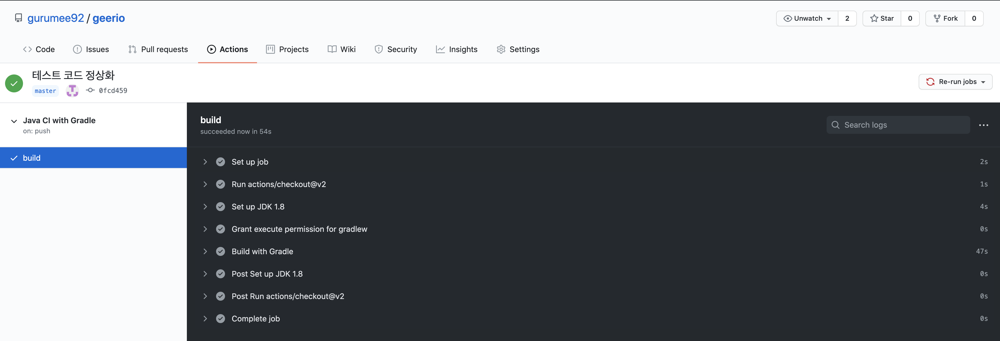

# Github Actions 달기 (Java + Gradle)

<center></center>

> Github Actions 공식 문서를 공부하고 정리한 문서입니다. 이 문서는 Gradle 기반에 Java 프로젝트의 Github Actions를 추가하는 방법에 대하여 다루고 있습니다.


## 요구 사항

먼저, `Gradle`기반의 자바 프로젝트가 존재해야 한다. 나의 환경은 다음과 같다.

* Java 1.8
* Gradle

이거면 충분하다. 이제 프로젝트에 `Github Actions`를 달아서 `CI`를 구축해보자.


## Github Actions 달기

먼저 `Github` 레포지토리에서, `Actions` 탭을 클릭한다.


`Github Ations`를 달지 않았다면, 다음 화면이 뜬다. `Java with Gradle > Set up this workflow`를 클릭하자.


그럼 다음 화면이 뜬다. 일단은 건드릴 것 없이 `Start Commit`을 누른다. `yml` 파일은 추후에 설명한다.


> 참고!
>
> 현재 제 프로젝트에는 "Hello World" 수준의 스프링 부트 앱이기 때문에 수정이 필요 없습니다. 
> 
> 만약, 데이터베이스 연결이 필요하거나 jib 같이 도커 이미지 빌드 같은 작업이 필요하다면, 수정이 필요합니다.

그럼 커밋 제목과 내용을 추가하라는 UI가 나온다. 적절히 입력하고 다시 `Actions` 탭을 누른다. 그럼 다음 화면이 나온다.


아마 빌드를 눌러야 할 것이다. 빌드를 누르면, `./github/workflows/gradle.yml`에 작성된 스크립트에 따라 단계별로 진행이 된다.

이쯤에서, `gradle.yml`을 살펴보자.

project/./github/workflows/gradle.yml
```yml
# This workflow will build a Java project with Gradle
# For more information see: https://help.github.com/actions/language-and-framework-guides/building-and-testing-java-with-gradle

name: Java CI with Gradle

on:
  push:
    branches: [ master ]
  pull_request:
    branches: [ master ]

jobs:
  build:

    runs-on: ubuntu-latest

    steps:
    - uses: actions/checkout@v2
    - name: Set up JDK 1.8
      uses: actions/setup-java@v1
      with:
        java-version: 1.8
    - name: Grant execute permission for gradlew
      run: chmod +x gradlew
    - name: Build with Gradle
      run: ./gradlew build
```

하나 하나 뜯어보자.

```yml
name: Java CI with Gradle
```

이것은 `Action`의 이름이다.

```yml
on:
  push:
    branches: [ master ]
  pull_request:
    branches: [ master ]
```

이 코드는 `master` 브랜치에, "push"가 일어나거나, "pull request"가 일어나면, `Action`을 실행시키라는 것이다.

```yml
jobs:
  build:

    runs-on: ubuntu-latest

    steps:
    - uses: actions/checkout@v2

    - name: Set up JDK 1.8
      uses: actions/setup-java@v1
      with:
        java-version: 1.8

    - name: Grant execute permission for gradlew
      run: chmod +x gradlew

    - name: Build with Gradle
      run: ./gradlew build
```

`jobs`는 `Actions`에 잡을 의미한다. `runs-on`은 Actions가 실행될 환경을 뜻한다. 여기서 빌드는 `ubuntu-latest` 컨테이너 내에서 실행이 된다.

`steps`는 잡의 단계 단계를 나타낸다. 

```yml
    steps:
    - uses: actions/checkout@v2
```

이것은 기본적으로 설정된다. 기본 브랜치로 checkout 하는 것 같다.

```yml
    - name: Set up JDK 1.8
      uses: actions/setup-java@v1
      with:
        java-version: 1.8
```

이것은 `java` 버전을 설정한다. market place에 있는 플러그인인데, `ubuntu-latest` 컨테이너에 자바 설치를 하는 것 같다.

```yml
    - name: Grant execute permission for gradlew
      run: chmod +x gradlew
```

이것은 쉘 스크립트 구문이다. 레포지토리 내의 `gradlew` 실행 파일에 실행 권한을 주는 것이다.

```yml
    - name: Build with Gradle
      run: ./gradlew build
```

역시 쉘 스크립트 구문이다. `gradlew`에 `build` 명령을 실행한다. 

> 참고!
> 
> graldew는 Gradle의 실행 파일 버전이며, build 명령을 실행하면, 테스트 > 빌드 작업이 일어나서 후에는 build/libs/${project_name}-0.0.1-SNAPSHOT.jar 파일이 만들어집니다.


## CI 구축해보기 

이제 `CI`를 구축해보자. 먼저 프로젝트에서 무조건 실패하는 테스트 코드를 작성한다. 그리고 `master` 브랜치에 푸쉬를 한다. 그 후, `Actions` 탭을 누르면 다음 화면이 뜬다.


빌드 작업이 일어나고 있다는 뜻이다. 클릭해서 들어가보자. 어느 정도 시간을 기다리면 다음 화면이 뜬다.


테스트가 실패해서 설정한 `Github Actions`가 깨진 것이다. 이제 다시 `Actions` 탭을 눌러보자. 액션이 실패한 것을 UI로 확인할 수 있다.


이제 다시 테스트를 정상화해서 다시 마스터 브랜치에 푸쉬한다. 그럼 역시 다음 화면을 확인할 수 있다.


클릭해서 들어가본다. 역시 조금 시간을 기다리면, 통과하는 것을 확인할 수 있다.



이제 다시 `Actions` 탭을 눌러보면, UI에서 통과함을 확인할 수 있다.


이 과정이 `CI` 작업이다. 코드의 병합 과정이 일어나면, 해당 코드가 잘 동작하는지 테스트하는 것까지. 이렇게 해서 `Gradle` 기반의 자바 프로젝트를 `Github Actions`를 이용해서 `CI`를 구축해보았다. 

프로젝트에 써먹을 생각하니 기분이 좋다. 하하.