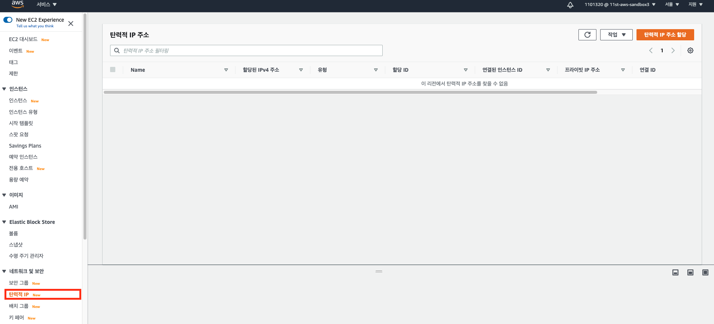
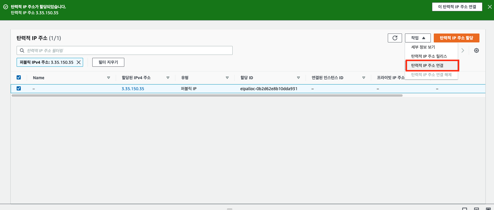

# EC2 인스턴스에 탄력적 IP 주소 할당하기

> AWS의 컴퓨팅 서비스 "EC2" 인스턴스에 고정된 Public IP 주소를 할당하는 방법에 대한 문서입니다.

## 요구 사항

* EC2 인스턴스 1개

## 탄력적 IP 주소 할당하기

먼저 AWS Console에 접속한 후 왼쪽 탭의 "탄력적 IP"를 누른다.

그 후 우상단에 "탄력적 IP 주소 할당" 버튼을 누른다.

그 다음 "할당" 버튼을 누른다. 

> 참고!
> 
> 별 설정이 없을 경우, 첫 번째 메뉴만 활성화가 될 것입니다.

이제 우 상단에 "작업"을 누른다. 그러면 "탄력적 IP 주소 연결" 메뉴가 보인다. 이를 클릭한다.

인스턴스와 Private IP주소를 선택하고 "연결"을 누른다.

그럼 목록에 "연결된 인스턴스 ID"에 인스턴스 id가 나타난다. 

이제 EC2 대시보드로 가 보자. 연결한 인스턴스를 클릭하면 밑에 상세 정보가 뜨는데 우리가 연결해준 탄력적 IP 주소가 연결된 것을 확인할 수 있다.

## 주의할 점

이것은 경험담인데.. 탄력적 IP 주소를 할당하면, 꼭 인스턴스와 연결을 해야 한다. 안그러면 엄청난 과금이 나온다. 연결할 인스턴스가 없다면, 꼭 주소를 "릴리즈"(삭제)해야 한다.