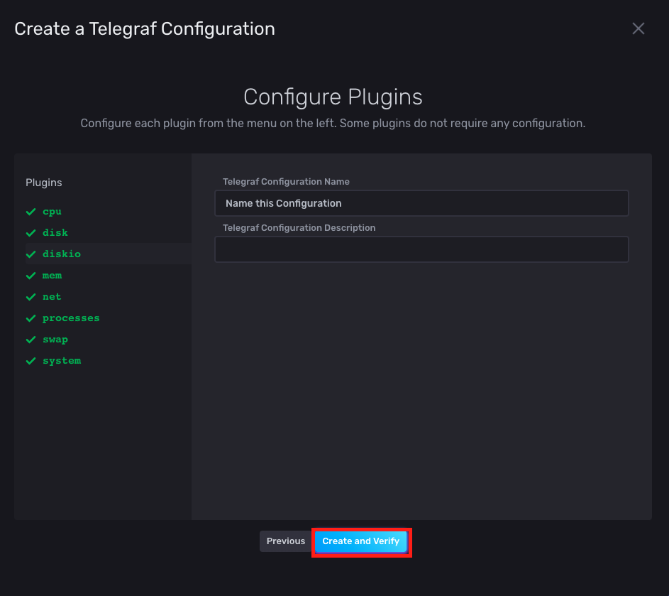

# 시스템 메트릭 모니터링 (With Telegraf)


> Telegraf 설치 및 InfluxDB 2.0과 연동하여, 시스템 메트릭을 수집하여 모니터링 대시보드를 만드는 것에 대한 문서입니다.

## Telegraf 설치

`Telegraf`를 설치한다. 이번엔 패키지 매니저 기반으로 설치한다. 이 때, 패키지 매니저가 최신 `telegraf`를 설치할 수 있도록, `/etc/yum.repos.d/` 밑에 `influxdb.repo`를 만들어주어야 한다. 터미널에 다음을 입력한다.

```bash
# /etc/yum.repos.d/ 밑에 influxdb.repo 생성
$ cat << EOF | sudo tee /etc/yum.repos.d/influxdb.repo
[influxdb]
name = InfluxDB Repository - RHEL $releasever
baseurl = https://repos.influxdata.com/rhel/7/\$basearch/stable
enabled = 1
gpgcheck = 1
gpgkey = https://repos.influxdata.com/influxdb.key
retries = 7
skip_if_unavailable = 1
keepcache = 0
timeout = 5.0
EOF

# telegraf 설치
$ sudo yum install telegraf
...

# telegraf 실행
$ sudo systemctl start telegraf

# telegraf 상태 확인
$ sudo systemctl status telegraf
● telegraf.service - The plugin-driven server agent for reporting metrics into InfluxDB
   Loaded: loaded (/usr/lib/systemd/system/telegraf.service; enabled; vendor preset: disabled)
   Active: active (running) since 화 2020-11-03 06:51:45 UTC; 7s ago
     Docs: https://github.com/influxdata/telegraf
 Main PID: 16687 (telegraf)
   CGroup: /system.slice/telegraf.service
           └─16687 /usr/bin/telegraf -config /etc/telegraf/telegraf.conf -config-directory /etc/telegraf/telegraf.d
...
```


## InfluxDB 2.0 - Telegraf 연동

이제 `InfluxDB 2.0`과 `Telegraf`를 연동시켜보자. `InfluxDB 2.0`을 웹 브라우저를 통해서 접속한다. 


로그인하게 되면, 첫 화면인데, "Load your data"를 클릭한다.


그 다음, "Telegraf"를 클릭한다.


위의 화면에서, "Create Configuration"을 클릭한다.


그럼 위의 모달 창이 뜬다. 그러면, "System"을 클릭한다. 그럼 하단에 "Continue" 버튼이 활성화된다. 이 버튼을 클릭한다.



위의 화면에서 입력 창에 적절한 값을 주고 "Create and Verify" 버튼을 클릭한다.


이 때 첫 칸에 입력되어 있는 토큰 값을 기억해두자. 이제 하단에 "Finish" 버튼을 누른다. 


이제 "Data" > "Telegraf"에 위와 같이 설정 목록이 추가된 것을 확인할 수 있다. 이를 클릭하면 `Telegraf`에 수정할 설정들을 확인할 수 있다.


또한 "Data" > "Tokens"로 이동해보면, `Telegraf`용 토큰이 생긴 것을 확인할 수 있다. 아까 기억하지 못했다면, 여기서 토큰 값을 기억하면 된다.

이제 "sudo"권한으로 `/etc/telegraf/telegraf.conf`를 다음과 같이 수정한다.


```conf
[agent]
  interval = "10s"
  round_interval = true
  metric_batch_size = 1000
  metric_buffer_limit = 10000
  collection_jitter = "0s"
  flush_interval = "10s"
  flush_jitter = "0s"
  precision = ""
  debug = false
  quiet = false
  logfile = ""
  hostname = ""
  omit_hostname = false
[[outputs.influxdb_v2]]	
  urls = ["http://localhost:8086"]

  ## Token for authentication.
  # 이것은 "Data > TOKENS"에서 확인했던 토큰으로 업데이트 해준다.
  token = "<아까 받았던 토큰>"
  organization = "11st-team-infra-platform"
  bucket = "data"
[[inputs.cpu]]
  percpu = true
  totalcpu = true
  collect_cpu_time = false
  report_active = false
[[inputs.disk]]
  ignore_fs = ["tmpfs", "devtmpfs", "devfs", "overlay", "aufs", "squashfs"]
[[inputs.diskio]]
[[inputs.mem]]
[[inputs.net]]
[[inputs.processes]]
[[inputs.swap]]
[[inputs.system]]
```

그 후 `Telegraf`를 재실행하면 된다.

```bash
$ sudo systemctl restart telegraf
```

이제 몇 초 후 웹 페이지에서 "Boards" > "System"를 누른다.


다음 대시보드가 보이면 성공이다.


끝났다. `EC2` 인스턴스 시스템 메트릭을 확인할 수 있는 모니터링 시스템을 성공적으로 구축하였다. 


## 참고

- [InfluxDB 2.0 공식 문서 - Automatically configure Telegraf](https://docs.influxdata.com/influxdb/v2.0/write-data/no-code/use-telegraf/auto-config/)
- [jsf3rd 님의 AWS Amazon Linux에 InfluxDB 설치](http://blog.naver.com/PostView.nhn?blogId=jsf3rd&logNo=220719782584)