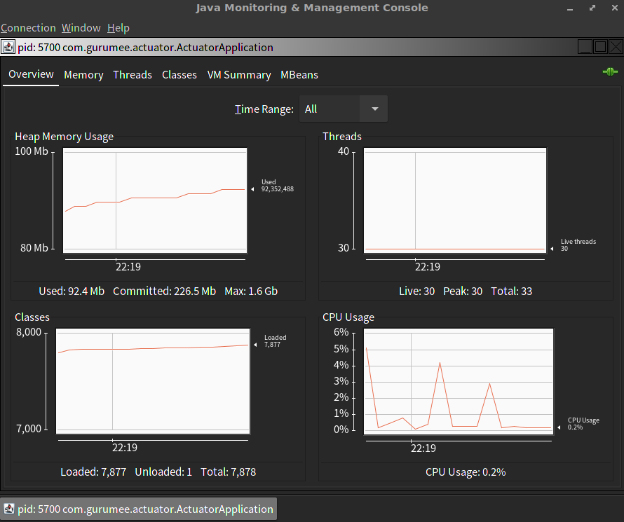

스프링 부트 운영
==============

> 인프런 강좌 "백기선의 스프링 부트"와 책 "스프링 철저 입문"을 보고 스프링 부트에 대해 정리한 내용입니다. 

Contents
---------------

1. 시작하며..
2. JMX와 HTTP
3. 스프링 부트 어드민
4. 마치며..


## 시작하며..

이번 장에서는 스프링 액추에이터 모듈, 그러니까 애플리케이션 운영 측면에서 많은 도움을 주는 모듈에 대해서 살펴보도록 하겠습니다. 스프링 액추에이터는 다양한 Endpoint를 통해서 유효한 정보들을 제공합니다.

* auditevents
* caches
* health
* conditions
* configprops
* 기타 등등..

등등의 여러 엔드포인트를 제공합니다. 먼저 `actuator` 모듈을 만들겠습니다. 그 후 pom.xml에 스프링 의존성을 추가해주세요.

actuator/pom.xml
```xml
<?xml version="1.0" encoding="UTF-8"?>
<project xmlns="http://maven.apache.org/POM/4.0.0"
         xmlns:xsi="http://www.w3.org/2001/XMLSchema-instance"
         xsi:schemaLocation="http://maven.apache.org/POM/4.0.0 http://maven.apache.org/xsd/maven-4.0.0.xsd">
    <parent>
        <artifactId>demo</artifactId>
        <groupId>com.gurumee</groupId>
        <version>0.0.1-SNAPSHOT</version>
    </parent>
    <modelVersion>4.0.0</modelVersion>

    <artifactId>actuator</artifactId>
    <dependencies>
        <dependency>
            <groupId>org.springframework.boot</groupId>
            <artifactId>spring-boot-starter-web</artifactId>
        </dependency>
        <dependency>
            <groupId>org.projectlombok</groupId>
            <artifactId>lombok</artifactId>
        </dependency>
        <dependency>
            <groupId>org.springframework.boot</groupId>
            <artifactId>spring-boot-starter-actuator</artifactId>
        </dependency>
        <dependency>
            <groupId>org.springframework.boot</groupId>
            <artifactId>spring-boot-starter-test</artifactId>
            <scope>test</scope>
        </dependency>
    </dependencies>
    <build>
        <plugins>
            <plugin>
                <groupId>org.springframework.boot</groupId>
                <artifactId>spring-boot-maven-plugin</artifactId>
            </plugin>
        </plugins>
    </build>

</project>
```

그 후, `ActuatorApplication`을 만들고 다음 코드를 입력해주세요.

actuator/src/main/java/com/gurumee/actuator/ActuatorApplication.java
```java
package com.gurumee.actuator;

import org.springframework.boot.SpringApplication;
import org.springframework.boot.autoconfigure.SpringBootApplication;
import org.springframework.web.bind.annotation.GetMapping;
import org.springframework.web.bind.annotation.RestController;

@SpringBootApplication
@RestController
public class ActuatorApplication {

    @GetMapping("/hello")
    public String hello() {
        return "hello";
    }

    public static void main(String[] args) {
        SpringApplication.run(ActuatorApplication.class, args);
    }
}
```

이제 프로젝트가 잘 설정되었는지 확인하기 위해서 테스트 코드를 작성하도록 하겠습니다.

actuator/src/test/java/com/gurumee/actuator/ActuatorApplicationTest.java
```java
package com.gurumee.actuator;

import org.junit.Test;
import org.junit.runner.RunWith;
import org.springframework.boot.test.context.SpringBootTest;
import org.springframework.test.context.junit4.SpringRunner;

@RunWith(SpringRunner.class)
@SpringBootTest
public class ActuatorApplicationTest {
    @Test
    public void contextLoad() {

    }
}
```

테스트가 성공적으로, 동작하면, 잘 설정이 된것입니다. 이제 애플리케이션을 실제 켜보세요. 그 후, "/actuator" 요청해보세요. 그러면 다음 정보들, 엔드포인트 정보를 HATEOAS 방식으로 제공하고 있습니다. 

* health
* info

근데 아까 많은 엔드포인트가 존재한다고 했죠? 기본적으로 JMX로 엔드포인트가 활성화 되어있는데, HTTP로는 노출이 되어 있지 않습니다.


## JMX와 HTTP

이제 JMX로 활성화된 엔드포인트를 한 번 보도록 하겠습니다. 크게 2가지 방식이 있는데 visualVM은 좋은 UI를 제공하나 설치가 필요하니 살펴보지는 않겠습니다. 우리는 `JConsole`만 살펴보죠. 터미널에 다음을 입력하세요.

```bash
$ jconsole
```

`JConsole`은 연결된 애플리케이션에 대해서 힙메모리, 스레드 ,클래스, CPU 사용량 보여줍니다.



또한, 애플리케이션에서 활성화된 엔드포인트를 살펴볼 수 있습니다.


이제 활성화된 엔드포인트를 HTTP 방식으로 제공해보겠습니다. `application.properties`에 다음 프로퍼티들을 설정해주세요.

actuator/src/main/resources/application.properties
```
# 모든 엔드포인트 노출
management.endpoints.web.exposure.include=*
# env, beans 엔드포인트 제외
management.endpoints.web.exposure.exclude=env,beans
```

이렇게 하면, `Jconsole`에서 살펴봤던 엔드포인트들을 "/actuator"로 접속하면, 볼 수 있습니다.


## 스프링 부트 어드민

스프링 부트 어드민은 여러 애플리케이션 운영 데이터들을 볼 수 있는 서드 파트 라이브러리입니다. (장고 어드민과는 다르네요..) 먼저, 애플리케이션이 2개가 필요합니다. 굉장히 귀찮으니 설정하는 방법만 살펴보겠습니다.

먼저, 애플리케이션을 하나 만들고, web 의존성과 함께 다음 의존성을 추가해주세요.

```xml
    <dependency>
        <groupId>de.codecentric</groupId>
        <artifactId>spring-boot-admin-starter-server</artifactId>
        <version>2.0.1</version>
    </dependency>
```
그 후 스프링 애플리케이션 위의 다음 애노테이션을 붙여주세요.

@EnableAdminServer

그럼 어드민 애플리케이션의 설정은 끝났습니다. 이제 클라이언트를 설정하도록 하겠습니다. 클라이언트는 웹, 액추에이터 의존성이 꼭 있어야 합니다. 다음 그 후 다음 의존성을 추가해주세요.

```xml
    <dependency>
        <groupId>de.codecentric</groupId>
        <artifactId>spring-boot-admin-starter-client</artifactId>
        <version>2.0.1</version>
    </dependency>
```

그리고 `application.properties` 에 다음 프로퍼티를 설정해주세요.

```
# 어드민 서버의 url
spring.boot.admin.client.url=http://localhost:8080 
management.endpoints.web.exposure.include=*
```

그럼 어드민 서버 애플리케이션을 접속하면, 액추에이터 클라이언트들의 정보가 잘 보입니다. 나중에 운영을 할 때, 유용한 도구이니 한 번 살펴보면 좋을 것 같습니다. 


## 마치며..

으아 드디어 스프링 부트가 끝이 났습니다. 흑흑 너무 오래 걸렸다. 이제부터는 지금까지 배운 스프링 부트를 기반으로 백기선님들의 다른 강좌들을 순서대로 공부할 예정입니다.

1. 예제로 보는 스프링 프레임워크
2. 스프링 코어
3. 스프링 MVC
4. 스프링 Data JPA
5. 스프링 시큐리티
6. 스프링 REST API

이게 끝나면, 그동안 쌓아놨던 책 공부들도 할겁니다. ㅎㅎ

1. 스프링 철저 입문
2. 자바 ORM 표준 JPA
3. 스프링 부트를 활용한 마이크로 서비스 개발
4. 마스터링 스프링 클라우드
5. 클라우드 네이티브 자바
6. 실전! 스프링5를 활용한 리액티브 프로그래밍

우와.. 많다. 시간이 되면 토비의 스프링까지. 자 열심히 합시당!