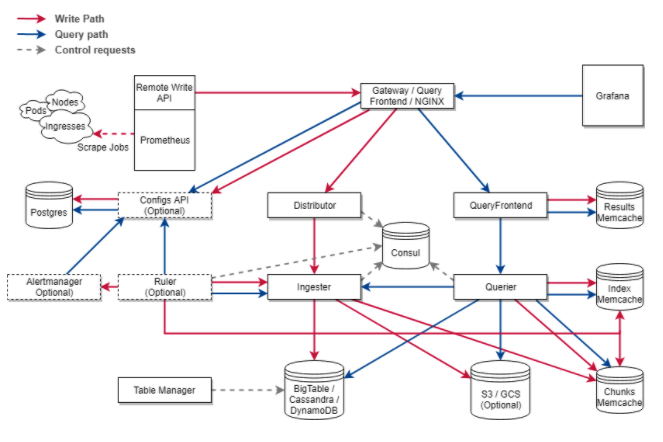
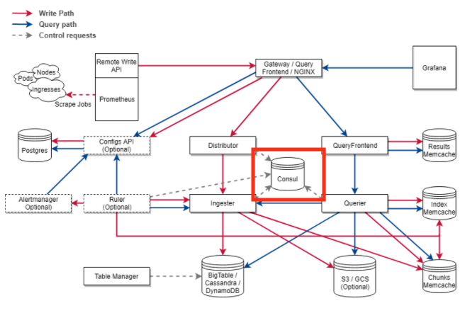
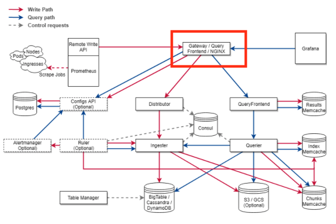
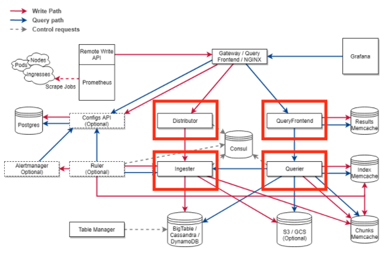
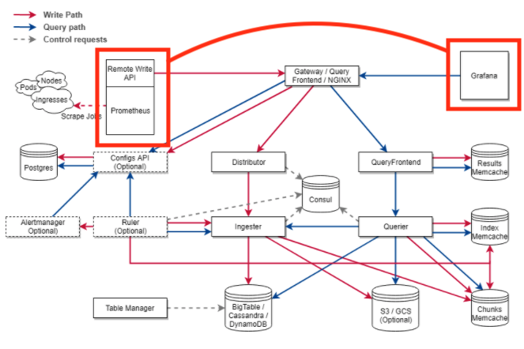

# 03장. 우리는 Packer로 무엇을 만들 것인가?

## Cortex와 구성할 머신 이미지들

개인적으로 어떤 기술을 공부할 때 제일 좋은 방법은 그 기술을 이용해서 한 번 무엇인가를 만들어보는 것이다. 근데 또 문제가 생긴다. 무엇을 만들 것인가? 자신이 만들 머신 이미지들이 있다면, 이 책을 참고해서 만들면 된다. 

하지만 대부분이 없을 것으로 예상된다. 그렇다면 필자가가 만들고 싶은 머신 이미지들을 `Packer`로 구성하는 것을 같이 진행하면서 `Packer`를 익혀보도록 하자. 이제부터 우리는 `Cortex`라는 오프소스에서 필요한 컴포넌트들에 대한 머신 이미지들을 만들어 볼 예정이다.

잡담을 하자면, 현재 나는 이커머스 회사에서 `Devops 엔지니어`로 일하고 있다. 우리 팀은 모니터링 시스템을 구축 및 운영하는 팀인데, 현재 팀에서 유의 깊게 보는 기술 중 하나가 바로 `Cortex`이다. 

이미 IT 업계 전반적으로 유명한 오픈소스 모니터링 시스템으로는 `Prometheus`가 있다. `Prometheus` 그 자체로 훌륭한 모니터링 시스템이지만, `scale-out`구조를 지원하게끔 설계되어 있지 않아서 거대한 시스템을 통합적으로 모니터링 해야할 때 굉장히 큰 어려움을 겪는다.

`Cortex`는 이 어려움을 해결하기 위해서 `Grafana Labs`에서 관리하고 있는 오픈소스로써 수평적인 `scale-out`과 `HA(High Availability) 구조`를 지원하는 `Prometheus`의 원격 저장소 역할을 한다. 

하나 하나 살펴보자.

### Consul

`Consul`은 `Packer`를 만든 `Hashicorp`에서 관리하고 있는 서비스 디스커버리 솔루션이다. 원래 `Cortex` 클러스터에서는 정확히 KV Store로써 각 노드를 연결해주는 역할만 한다. 

여기에 우리는 우리가 생성할 모든 이미지에 `Consul`을 설치하여 agent로써 동작하게 하여 `Consul` 서비스 디스커버리에 등록을 할 것이다. 이렇게 함으로써 모니터링 서버에서 모든 노드들을 모니터링할 수 있게 만들 것이다.

### NGINX

그리고 클러스터의 게이트웨이는 `NGINX` 웹 서버로 구성할 것이다. 이 이미지에는 `prometheus-nginxlog-exporter`라는 일종의 수집기를 설치되서, 모니터링 서버에서 `NGINX` 관련 모니터링할 수 있게 만들 것이다.

### Cortex

이 녀석들은 모두 `Cortex`이다 `Cortex`는 하는 역할에 따라서 여러 가지로 분류할 수 있다. 실제 상용 환경에서는 역할을 분류해서 실행하는 것이 일반적이다. 하지만, 우리가 깊이 다룰 내용은 아니기 때문에 역할을 나누지 않고 `Cortex`를 실행할 수 있도록 설치 및 설정된 머신 이미지를 만든다. 

### 모니터링 서버

또한 모니터링 서버에 대한 머신 이미지도 만든다. `Prometheus`와 `Grafana`가 설치되어 있으며 `Cortex` 클러스터에 포함된 노드들을 모니터링을 할 수 있도록 만들 것이다.

## 이후 실습 과정

이어지는 2부/3부에서는 `Packer`를 통해서 로컬환경에서는 도커 이미지를, AWS 환경에서는 AMI를 만들 것이다. 결국 진행하는 환경만 다를 뿐, 위 시나리오를 토대로 머신 이미지를 구성하기 때문에 반드시 2부, 3부 순으로 진행할 필요는 없다. 머신 이미지를 생성하는 순서는 다음과 같다.

* 기본 이미지 (node-exporter, consul 설치)
* consul 이미지 (node-exporter, consul 설치)
* cortex 이미지 (node-exporter, consul, cortex 설치)
* nginx 이미지 (node-exporter, consul, nginx, prometheus-nginxlog-exporter 설치)
* monitoring 이미지 (node-exporter, consul, prometheus, grafana 설치)

각 머신 이미지는 `node-exporter`와 `consul`이 공통적으로 설치되어야 한다. 기본 이미지를 만든 후, 그것을 토대로 각기 다른 이미지를 생성할 것이다. 참고적으로 `consul` 이미지는 서버로써의 역할을 한다. 이외에는 `consul`이 설치되지만 agent로써 동작한다. 추후 진행되는 장에서 자세히 다루도록 하겠다.

2부/3부를 마치면 4부에서는 `Packer`와 같이 활용될 수 있는 IaC 도구들을 살펴본다. 프로비저닝에 `Ansible`, 후처리에 `Vagrant`, 인프라스트럭처링에 `Terraform`을 살펴본다. 이후 진행되는 장을 모두 마치게 되면 적어도 공식문서와 함께라면, 어떤 머신 이미지라도 어렵지 않게 만들 수 있게 되길 소망한다.

