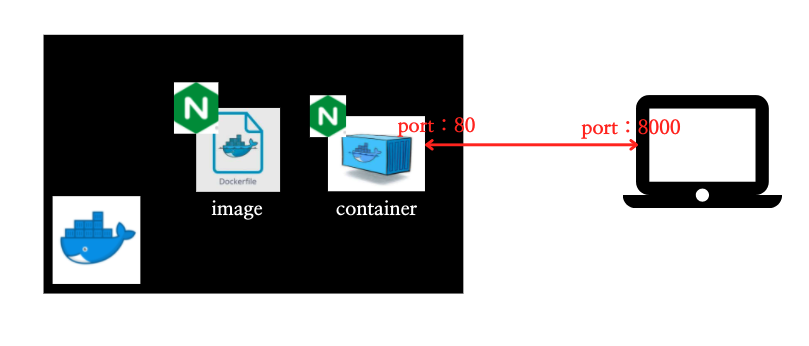

# 2장 Terraform 튜토리얼

이번 장에서는 `Terraform`으로 `Docker` 기반의 인프라스트럭처를 구성한다. 먼저 이전 장에서 `Terraform`을 설치를 진행했다고 가정하고 진행할 것이며, `Docker`를 설치한 후, `Terraform`으로 다음 인프라스트럭처를 구성한다.



참고로 이 장에서 쓰이는 전체 코드는 다음 경로에 존재한다.

* 2장 코드 : [https://github.com/gurumee92/gurumee-terraform-code/tree/master/part1/ch02](https://github.com/gurumee92/gurumee-terraform-code/tree/master/part1/ch02)

자 이제 시작해보자.

## Docker 설치하기

이 장의 실습을 진행하기 위해서는 `Docker`가 설치되어 있어야 한다. 여기서는 `Mac OS`와 `AWS Linux` 상에서 `Docker`를 설치하는 방법을 알아본다.

### Mac OS에서 Docker 설치

먼저 `Mac OS`의 경우에는 다음 문서에서 다운로드할 수 있다.

* [도커 공식 문서 - 다운로드](https://docs.docker.com/docker-for-mac/install/)

만일 `Home Brew` 패키지 매니저가 있다면, 다음 명령어로 간단하게 설치할 수 있다.

```bash
# 도커 설치
$ brew cask install docker

# 도커 설치 확인
$ docker --version
Docker version 20.10.2, build 2291f61
```

### AWS Linux에서 Docker 설치

`AWS Linux`에 먼저 접속한 후, 터미널에 다음을 입력한다.

```bash
# yum 패키지 업데이트
$ sudo yum -y upgrade

# 도커 설치
$ sudo yum -y install docker
```

이제 `Docker`가 잘 설치되었는지 확인한다.

```bash
# 도커 버전 확인
$ docker --version
Docker version 19.03.13-ce, build 4484c46
```

그 후, `Docker`를 서비스 형태로 실행시켜야 한다. 터미널에 다음을 입력한다.

```bash
# 도커 서비스 실행
$ sudo systemctl start docker

# 도커 서비스 실행 상태 확인
$ sudo systemctl status docker
● docker.service - Docker Application Container Engine
   Loaded: loaded (/usr/lib/systemd/system/docker.service; disabled; vendor preset: disabled)
   Active: active (running) since 일 2021-02-21 13:17:26 UTC; 2min 48s ago
     Docs: https://docs.docker.com
     ...
```

근데 설치를 진행한 후, `Docker`를 바로 쓸 수가 없다. 다음 명령어를 쳐보자.

```bash
$ docker ps
docker: Got permission denied while trying to connect to the Docker daemon socket at unix:///var/run/docker.sock: Post http://%2Fvar%2Frun%2Fdocker.sock/v1.38/containers/create: dial unix /var/run/docker.sock: connect:
```

그럼 위와 같은 에러 문구가 뜨는데 `ec2-user`가 도커에 접근할 권한이 없기 때문이다. 권한을 주면 이 문제는 손쉽게 해결된다. 터미널에 다음을 입력한다.

```bash
# ec2-user에 도커 접근 권한 부여
$ sudo usermod -aG docker ec2-user
```

그 후 터미널을 껐다가 다시 접속한다. 그 후 `docker ps` 명령어를 한 번 더 친다.

```bash
$ docker ps
CONTAINER ID        IMAGE               COMMAND             CREATED             STATUS              PORTS               NAMES
```

위와 같이 뜨면, `Docker`를 사용하기 위한 환경 구축이 완료된 것이다.
 
## Terraform으로 Docker 기반의 인프라스트럭처 구성하기

자 이제 적당한 위치에서 다음 `main.tf`를 다음과 같이 만든다. 

gurumee-terraform-code/part1/ch02/main.tf
```tf
terraform {
  required_providers {
    docker = {
      source = "kreuzwerker/docker"
    }
  }
}

provider "docker" {}
```

`provider`는 관리할 인프라스트럭처의 종류를 의미한다. 즉 위의 코드는 `Terraform`으로 `Docker` 환경의 인프라스트럭처를 구성할 것을 명시한다. `provider`의 또 다른 종류로는 `aws`, `gcp` 등이 있다. 이는 2부에서 더 자세하게 다루도록 하겠다. 

이제 `terraform init`이라는 명령어를 통해서 `Terraform` 코드로 인프라스트럭처 구성할 수 있게 환경을 만들어준다. 터미널에 다음을 입력한다.

```bash
# 현재 위치 확인 main.tf 가 있는 경로에서 실행해야 한다.
$ pwd
/Users/gurumee/Workspace/gurumee-terraform-code/part1/ch02

$ terraform init
Initializing the backend...

Initializing provider plugins...
- Finding latest version of kreuzwerker/docker...
- Installing kreuzwerker/docker v2.11.0...
- Installed kreuzwerker/docker v2.11.0 (self-signed, key ID 24E54F214569A8A5)

Partner and community providers are signed by their developers.
If you'd like to know more about provider signing, you can read about it here:
https://www.terraform.io/docs/cli/plugins/signing.html

Terraform has created a lock file .terraform.lock.hcl to record the provider
selections it made above. Include this file in your version control repository
so that Terraform can guarantee to make the same selections by default when
you run "terraform init" in the future.

Terraform has been successfully initialized!

You may now begin working with Terraform. Try running "terraform plan" to see
any changes that are required for your infrastructure. All Terraform commands
should now work.

If you ever set or change modules or backend configuration for Terraform,
rerun this command to reinitialize your working directory. If you forget, other
commands will detect it and remind you to do so if necessary.
```

`terraform init` 명령어를 실행하면, 같은 경로에 `.terraform` 디렉토리와, `.terraform.lock.hcl` 파일이 생성된다. 그냥 인프라스트럭처 구성을 위해서 만들어지는 필수적인 파일이라고 이해하면 된다. 이제 `main.tf`에 다음을 추가한다.
 
gurumee-terraform-code/part1/ch02/main.tf
```tf
# ...

resource "docker_image" "nginx" {
  name         = "nginx:latest"
  keep_locally = false
}
```

먼저 위의 코드에서 `resource`를 주목하자. `resource`는 관리할 인프라스트럭처의 구성 요소를 의미한다. `Docker`의 경우에는 컨테이너를 실행하기 위해서 그 이미지가 꼭 필요하다.

`name`, `keep_locally`는 `Docker Image`의 속성을 의미한다. 이는 필수적일수도 있고, 아닐 수도 있다. 이런 `resource`의 속성들을 어떻게 구성할지 잘 모를 때는 [Terraform 공식 Registry](https://registry.terraform.io/)라는 곳에서 `provider` 및 `resource`에 대한 상세 정보들을 확인할 수 있다.  

위의 코드는 `nginx`의 최신 이미지를 가져오며, `Terraform`으로 인프라스트럭처를 삭제할 때, 이미지까지 모두 삭제함을 의미한다.

이제 터미널에서 `terraform plan`이라는 명령어를 입력해보자.

```bash
$ terraform plan

An execution plan has been generated and is shown below.
Resource actions are indicated with the following symbols:
  + create

Terraform will perform the following actions:

  # docker_image.nginx will be created
  + resource "docker_image" "nginx" {
      + id           = (known after apply)
      + keep_locally = false
      + latest       = (known after apply)
      + name         = "nginx:latest"
      + output       = (known after apply)
    }

Plan: 1 to add, 0 to change, 0 to destroy.

------------------------------------------------------------------------

Note: You didn't specify an "-out" parameter to save this plan, so Terraform
can't guarantee that exactly these actions will be performed if
"terraform apply" is subsequently run.
```

`terraform plan` 명령어는 작성한 코드로 인프라스트럭처를 구성할 수 있는지 구성한다. 프로그래밍 경험이 있다면, 컴파일 작업이라고 생각하면 편하다. 문법 오류 등을 찾아내고 기본적인 구성에 문제가 있는지 확인한다. 

참고로 컴파일이 런타임 오류를 잡을 수 없듯이, `terraform plan` 역시 인프라스트럭처가 실제로 잘 구성될지는 100% 보장하지는 않는다. 그래도 어느 정도 잡아주기도하며, 실제 구성 시에 뭐가 변하는지 대략적으로 알 수 있기 때문에, 구성 전에 꼭 이 명령어를 사용하길 바란다. 

이제 터미널에서 `terraform apply` 명령어를 실행해서 인프라스트럭처를 구성해보자.

```bash
$ terraform apply

An execution plan has been generated and is shown below.
Resource actions are indicated with the following symbols:
  + create

Terraform will perform the following actions:

  # docker_image.nginx will be created
  + resource "docker_image" "nginx" {
      + id           = (known after apply)
      + keep_locally = false
      + latest       = (known after apply)
      + name         = "nginx:latest"
      + output       = (known after apply)
    }

Plan: 1 to add, 0 to change, 0 to destroy.

Do you want to perform these actions?
  Terraform will perform the actions described above.
  Only 'yes' will be accepted to approve.

  # 여기서 yes를 입력해주세요!!
  Enter a value: yes

docker_image.nginx: Creating...
docker_image.nginx: Still creating... [10s elapsed]
docker_image.nginx: Creation complete after 15s [id=sha256:62d49f9bab67f7c70ac3395855bf01389eb3175b374e621f6f191bf31b54cd5bnginx:latest]

Apply complete! Resources: 1 added, 0 changed, 0 destroyed.
```

`terraform apply` 명령어를 실행하면 인프라스트럭처가 구성되고 `.tfstate`라는 파일이 생성된다. 이는 현재 `Terraform`으로 구동된 인프라스트럭처의 상태가 저장된다. 

참고로 혼자 사용할 때는 로컬에 존재하는 것만으로 충분하지만 팀으로 협업할 때는 `DynamoDB/S3` 등의 원격 저장소에 상태 파일을 저장하는 것이 필요하다. 이에 대한 자세한 내용은 3부에서 다루도록 하겠다.

이제 다시 내용으로 돌아와보자. 현재는 `Docker` 기반의 인프라스트럭처가 구성되었지만, `nginx` 이미지 하나만 달랑 설치된 상황이다. 실제로 구성이 가능한지 육안으로 쉽게 확인하기 위해서는 컨테이너 실행이 필요하다. 다음처럼 코드를 추가한다.

gurumee-terraform-code/part1/ch02/main.tf
```tf
# ...

resource "docker_container" "nginx" {
  image = docker_image.nginx.latest
  name  = "tutorial"
  ports {
    internal = 80
    external = 8000
  }
}
```

위 코드는 설치했던 `nginx` 이미지를 기반으로 컨테이너를 8000번 포트에 매핑시켜 실행할 것을 명시한다. 역시 필수 정보들이 있다. 여러 정보들이 있는데, 특히 `image`를 유심히 살펴보자.

```
image = docker_image.nginx.latest
```

이 `docker_image.nginx`는 우리가 정의한 첫 번째 `resource`를 가리킨다. 이런 식으로 선언했던 `resource`의 속성을 다른 `resource`를 생성할 때 값으로 사용할 수 있다. 이제 정말로 `Terraform`으로 도커 컨테이너를 띄어보자. 인프라스트럭처 구성이 변경되었으니 `terraform plan` 명령어를 입력한다.

```bash
$ terraform apply

An execution plan has been generated and is shown below.
Resource actions are indicated with the following symbols:
  + create

Terraform will perform the following actions:

  # docker_image.nginx will be created
  + resource "docker_image" "nginx" {
      + id           = (known after apply)
      + keep_locally = false
      + latest       = (known after apply)
      + name         = "nginx:latest"
      + output       = (known after apply)
    }

Plan: 1 to add, 0 to change, 0 to destroy.

Do you want to perform these actions?
  Terraform will perform the actions described above.
  Only 'yes' will be accepted to approve.

# gurumee @ MacBook-Pro in ~/Workspace/gurumee-terraform-code/part1/ch02 on git:master x [21:26:08] 
$ docker network ls
NETWORK ID     NAME                                    DRIVER    SCOPE
cd1141323fbe   bridge                                  bridge    local
1303fb9929c0   ex01_default                            bridge    local
39da87e0ac79   host                                    host      local
9b2370e51998   none                                    null      local
c18027674267   spring-boot-webservice-heroku_default   bridge    local

# gurumee @ MacBook-Pro in ~/Workspace/gurumee-terraform-code/part1/ch02 on git:master x [21:26:10] 
$ terraform plan
docker_image.nginx: Refreshing state... [id=sha256:62d49f9bab67f7c70ac3395855bf01389eb3175b374e621f6f191bf31b54cd5bnginx:latest]

An execution plan has been generated and is shown below.
Resource actions are indicated with the following symbols:
  + create

Terraform will perform the following actions:

  # docker_container.nginx will be created
  + resource "docker_container" "nginx" {
      + attach           = false
      + bridge           = (known after apply)
      + command          = (known after apply)
      + container_logs   = (known after apply)
      + entrypoint       = (known after apply)
      + env              = (known after apply)
      + exit_code        = (known after apply)
      + gateway          = (known after apply)
      + hostname         = (known after apply)
      + id               = (known after apply)
      + image            = "sha256:62d49f9bab67f7c70ac3395855bf01389eb3175b374e621f6f191bf31b54cd5b"
      + init             = (known after apply)
      + ip_address       = (known after apply)
      + ip_prefix_length = (known after apply)
      + ipc_mode         = (known after apply)
      + log_driver       = "json-file"
      + logs             = false
      + must_run         = true
      + name             = "tutorial"
      + network_data     = (known after apply)
      + read_only        = false
      + remove_volumes   = true
      + restart          = "no"
      + rm               = false
      + security_opts    = (known after apply)
      + shm_size         = (known after apply)
      + start            = true
      + stdin_open       = false
      + tty              = false

      + healthcheck {
          + interval     = (known after apply)
          + retries      = (known after apply)
          + start_period = (known after apply)
          + test         = (known after apply)
          + timeout      = (known after apply)
        }

      + labels {
          + label = (known after apply)
          + value = (known after apply)
        }

      + ports {
          + external = 8000
          + internal = 80
          + ip       = "0.0.0.0"
          + protocol = "tcp"
        }
    }

Plan: 1 to add, 0 to change, 0 to destroy.

------------------------------------------------------------------------

Note: You didn't specify an "-out" parameter to save this plan, so Terraform
can't guarantee that exactly these actions will be performed if
"terraform apply" is subsequently run.
```

별 문제 없이 추가될 것 같다. 터미널에 `terraform apply` 명령어를 입력한다.

```bash
$ terraform apply
docker_image.nginx: Refreshing state... [id=sha256:62d49f9bab67f7c70ac3395855bf01389eb3175b374e621f6f191bf31b54cd5bnginx:latest]

An execution plan has been generated and is shown below.
Resource actions are indicated with the following symbols:
  + create

Terraform will perform the following actions:

  # docker_container.nginx will be created
  + resource "docker_container" "nginx" {
      + attach           = false
      + bridge           = (known after apply)
      + command          = (known after apply)
      + container_logs   = (known after apply)
      + entrypoint       = (known after apply)
      + env              = (known after apply)
      + exit_code        = (known after apply)
      + gateway          = (known after apply)
      + hostname         = (known after apply)
      + id               = (known after apply)
      + image            = "sha256:62d49f9bab67f7c70ac3395855bf01389eb3175b374e621f6f191bf31b54cd5b"
      + init             = (known after apply)
      + ip_address       = (known after apply)
      + ip_prefix_length = (known after apply)
      + ipc_mode         = (known after apply)
      + log_driver       = "json-file"
      + logs             = false
      + must_run         = true
      + name             = "tutorial"
      + network_data     = (known after apply)
      + read_only        = false
      + remove_volumes   = true
      + restart          = "no"
      + rm               = false
      + security_opts    = (known after apply)
      + shm_size         = (known after apply)
      + start            = true
      + stdin_open       = false
      + tty              = false

      + healthcheck {
          + interval     = (known after apply)
          + retries      = (known after apply)
          + start_period = (known after apply)
          + test         = (known after apply)
          + timeout      = (known after apply)
        }

      + labels {
          + label = (known after apply)
          + value = (known after apply)
        }

      + ports {
          + external = 8000
          + internal = 80
          + ip       = "0.0.0.0"
          + protocol = "tcp"
        }
    }

Plan: 1 to add, 0 to change, 0 to destroy.

Do you want to perform these actions?
  Terraform will perform the actions described above.
  Only 'yes' will be accepted to approve.

  Enter a value: yes

docker_container.nginx: Creating...
docker_container.nginx: Creation complete after 0s [id=1a7ee74aae69f9fa8718b4a57c8523e6c93ccb8bf73ef9d2c7c26ceed6908698]

Apply complete! Resources: 1 added, 0 changed, 0 destroyed.
```

이제 계획했던 인프라스트럭처가 모두 구성되었다. 터미널에 `docker ps` 입력해보자.

```bash
$ docker ps
CONTAINER ID   IMAGE          COMMAND                  CREATED              STATUS              PORTS                  NAMES
27ef04292942   35c43ace9216   "/docker-entrypoint.…"   About a minute ago   Up About a minute   0.0.0.0:8000->80/tcp   tutorial
```

`nginx`가 계획대로, 80번 포트가 머신의 8000 포트에 매핑되었고 컨테이너 이름 역시 계획한대로 "tutorials"가 되었다. `nginx`가 잘 실행되는지 확인하기 위해서 다음의 명령어를 입력해보자.

```bash
$ curl localhost:8000
<!DOCTYPE html>
<html>
<head>
<title>Welcome to nginx!</title>
<style>
    body {
        width: 35em;
        margin: 0 auto;
        font-family: Tahoma, Verdana, Arial, sans-serif;
    }
</style>
</head>
<body>
<h1>Welcome to nginx!</h1>
<p>If you see this page, the nginx web server is successfully installed and
working. Further configuration is required.</p>

<p>For online documentation and support please refer to
<a href="http://nginx.org/">nginx.org</a>.<br/>
Commercial support is available at
<a href="http://nginx.com/">nginx.com</a>.</p>

<p><em>Thank you for using nginx.</em></p>
</body>
</html>
```

잘 실행되고 있다. 이제 구성한 인프라스트럭처를 모두 삭제해보자. 터미널에 `terraform destroy` 명령어를 입력한다.

```bash
$ terraform destroy

An execution plan has been generated and is shown below.
Resource actions are indicated with the following symbols:
  - destroy

Terraform will perform the following actions:

 ...

Plan: 0 to add, 0 to change, 2 to destroy.

Do you really want to destroy all resources?
  Terraform will destroy all your managed infrastructure, as shown above.
  There is no undo. Only 'yes' will be accepted to confirm.

  # 역시 yes를 입력해야 합니다!!
  Enter a value: yes

# 도커 컨테이너 및 이미지가 삭제되는 것을 확인할 수 있다.
docker_container.nginx: Destroying... [id=27ef04292942440ba1e9dbdb9d48d729e1fd3251808ed66e49f6d53e73c74025]
docker_container.nginx: Destruction complete after 0s
docker_image.nginx: Destroying... [id=sha256:35c43ace9216212c0f0e546a65eec93fa9fc8e96b25880ee222b7ed2ca1d2151nginx:latest]
docker_image.nginx: Destruction complete after 0s

Destroy complete! Resources: 2 destroyed.
```

이제 터미널에 `docker ps` 입력해보자.

```bash
$ docker ps
CONTAINER ID   IMAGE          COMMAND                  CREATED              STATUS              PORTS                  NAMES
```

컨테이너가 제거된 것을 확인할 수 있다. 이렇게 `Terraform`을 이용해서 `Docker` 기반의 간단한 인프라스트럭처를 초기화/테스트/구축/제거하는 방법을 살펴보았다. `Terraform` 작업은 보통 다음과 같은 과정을 거친다고 보면 된다.


이제 `Terraform`을 간단하게 맛보았으니 다음 장부터는 퍼블릭 클라우드 특히 `aws` 상에서 실제 인프라스트럭처를 구성해보도록 하자.