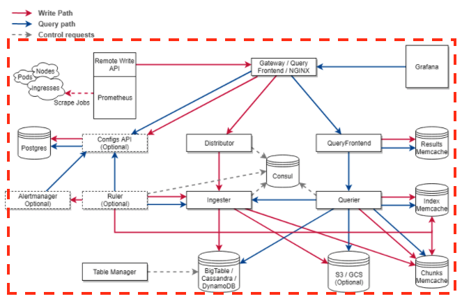
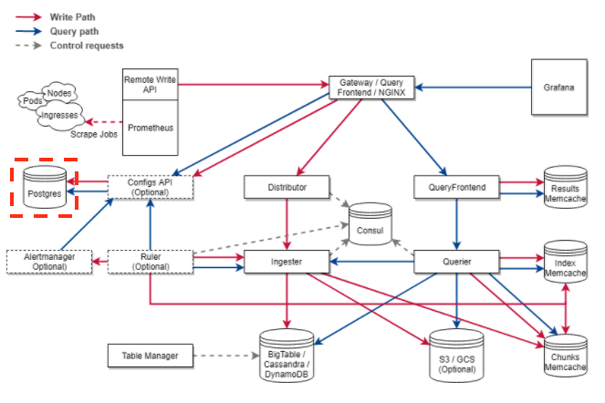
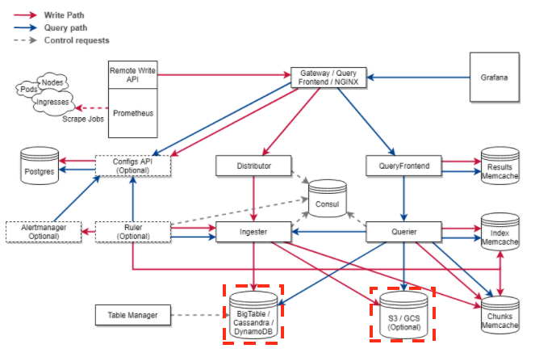
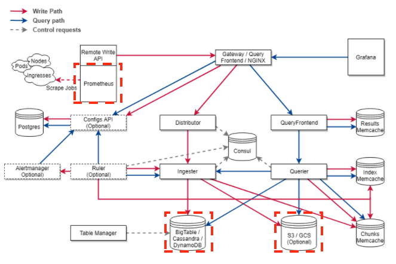

# 03장. Terraform 실습 방향

## Terraform을 어떻게 배워야 하는가

개인적으로 어떤 기술을 공부할 때 제일 좋은 방법은 그 기술을 이용해서 한 번 무엇인가를 만들어보는 것이다. 근데 또 문제가 생긴다. 무엇을 만들 것인가? 자신이 만들 인프라 구조가 있다면, 이 책을 참고해서 만들면 된다. 하지만 없는 사람도 있을 것이다. 그렇다면 내가 만들고 싶은 인프라 구조를, `Terraform`으로 구축해보고 관리하면서 배워보도록 하자.

이제부터 우리가 이 책을 통해서 만들어볼 구조는 `Cortex`라는 오프소스가 원하는 인프라 구조를 만들어 볼 예정이다.

잡담을 하자면, 현재 나는 이커머스 회사에서 `SRE 엔지니어`로 일하고 있다. 우리 팀은 사내 개발팀이 개발한 서비스들에 대한 모니터링 시스템을 구축 및 운영하는 업무를 맡고 있다. 현재 팀에서 주의 깊게 보는 기술 중 하나가 바로 `Cortex`이다. 

이미 IT 업계 전반적으로 유명한 오픈소스 모니터링 시스템으로는 `Prometheus`가 있다. `Prometheus` 그 자체로 훌륭한 모니터링 시스템이지만, `scale-out`구조를 지원하게끔 설계되어 있지 않아서 거대한 시스템을 통합적으로 모니터링 해야할 때 굉장히 큰 어려움을 겪는다. `Cortex`는 이 어려움을 해결하기 위해서 `Grafana Labs`에서 만든 오픈소스로써 수평적인 `scale-out`과 `HA(High Availability) 구조`를 지원하는 `Prometheus`의 원격 저장소 역할을 한다. 

`Cortex`를 적용하기 위해서는 위 그림과 같이 여러 컴포넌트들을 인프라에 적절하게 구성해야 한다. 각 구성 요소를 살펴보자. 

먼저 각 컴포넌트가 통신할 수 있도록 네트워크가 구성되어 있어야 한다. 이 네트워크라는 것이 `AWS`에서는 바로 `VPC`이다. `AWS` 상에서 네트워크를 잘 구성하기 위해서는 `vpc`, `subnet`, `internet gateway`, `nat gateway`, `security group` 등 네트워크에 필요한 리소스들과 그에 대한 보안 정책을 적절히 만들어야 한다.

또한, `Cortex`의 제공하는 서비스 중 `AlertManager`, `Ruler` 등은 `Postgres`라는 `RDB`에 저장된 설정 관련 데이터를 가져오게 된다 `AWS`에서는 `RDS`라는 서비스로 이를 지원한다.  

`Cortex`는 또한 데이터를 저장하는 방식이 크게 2가지가 있다.

* Index/Chunk Storage 방식
* Block Storage 방식

우리는 Index/Chunk 방식을 쓸 것이며 이 때 `AWS`에서 `DynamoDB`와 `S3`가 필요하다.

그리고 `DynamoDB`와 `S3`를 `EC2` 인스턴스에서 접근거나 구성된 인스턴스 내부를 `Prometheus`로 모니터링하기 위해서는 이와 관련된 `IAM`이 필요하다. 

이후, `AWS` 클라우드 환경에서 여러 실습을 진행할 예정이다. 실습에서는 해당 `Cortex`, `Consul`등의 소프트웨어들은 설치하지 않는다. 오로지 `Terraform`으로 인프라 리소스를 구성하는데 초점을 맞출 것이다. 다음 절차로 진행될 예정이다.

* Terraform을 위한 AWS 환경 준비하기
* Terraform으로 IAM 구성하기
* Terraform으로 S3 구성하기
* Terraform으로 DynamoDB 구성하기
* Terraform으로 VPC 구성하기
* Terraform으로 EC2 구성하기
* Terraform으로 RDS 구성하기
* Terraform으로 AutoScaling Group 구성하기
* Terraform으로 Network Load Balancer 구성하기
* Terraform으로 Application Load Balancer 구성하기

위의 실습 과정을 모두 마치고 나면 `Terraform`에 어느 정도 익숙해진 상태일 것이다. 여기서 끝나도 훌륭하지만, `Terraform` 코드를 더 깔끔하게 사용할 수 있는 `variable`, `module` 같은 문법들과 운영할 때 필요한 몇 가지 팁을 소개하는 것으로 이 책을 마칠 예정이다.

`AWS`나 `Terraform`에 대한 경험이 없다면, 조금 진행하긴 어려울 수 있겠으나 최대한 쉽게 풀어볼테니, 포기하지 말고 같이 이 긴 여정을 함께 했으면 좋겠다.

## 참고

* Cortex 공식 문서: [https://cortexmetrics.io/docs/](https://cortexmetrics.io/docs/)