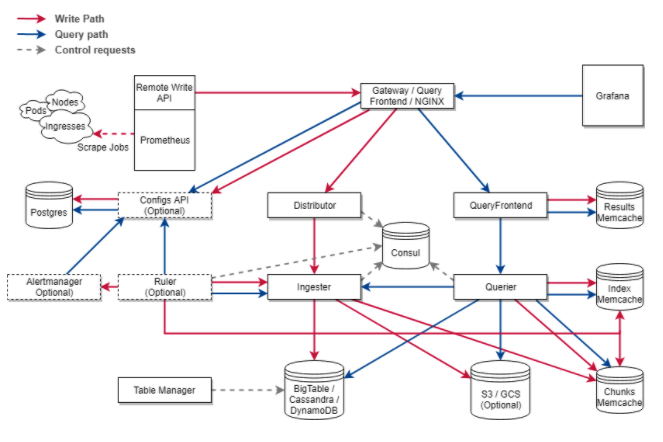

# 03장. 우리가 테라폼으로 무엇을 관리할 것인가

## 우리가 관리할 인프라 구조

개인적으로 어떤 기술을 공부할 때 제일 좋은 방법은 그 기술을 이용해서 한 번 무엇인가를 만들어보는 것이다. 근데 또 문제가 생긴다. 무엇을 만들 것인가? 자신이 만들 인프라 구조가 있다면, 이 책을 참고해서 만들면 된다. 하지만 대부분이 없을 것으로 예상된다. 그렇다면 내가 만들고 싶은 인프라 구조를, `Terraform`으로 구축해보고 관리해보도록 하자.

이제부터 우리가 이 책을 통해서 만들어볼 구조는 `Cortex`라는 오프소스가 원하는 인프라 구조를 만들어 볼 예정이다.

잡담을 하자면, 현재 나는 이커머스 회사에서 `Devops 엔지니어`로 일하고 있다. 우리 팀은 모니터링 시스템을 구축 및 운영하는 팀인데, 현재 팀에서 유의깊게 보는 기술 중 하나가 바로 `Cortex`이다. 

이미 IT 업계 전반적으로 유명한 오픈소스 모니터링 시스템으로는 `Prometheus`가 있다. `Prometheus` 그 자체로 훌륭한 모니터링 시스템이지만, `scale-out`구조를 지원하게끔 설계되어 있지 않아서 거대한 시스템을 통합적으로 모니터링 해야할 때 굉장히 큰 어려움을 겪는다.

`Cortex`는 이 어려움을 해결하기 위해서 `Grafana Labs`에서 만든 오픈소스로써 수평적인 `scale-out`과 `HA(High Availability) 구조`를 지원하는 `Prometheus`의 원격 저장소 역할을 한다. 

`Cortex`를 적용하기 위해서는 위 그림과 같이 여러 컴포넌트들을 인프라에 적절하게 구성해야 한다. 각 컴포넌트가 통신해야 하는 `네트워크`, 여러 개의 `Cortex`로 이루어진 `Cortex 클러스터`, 이를 구성하는 `서비스 디스커버리`, `Cortex 클러스터`의 데이터 저장소, `Cortex 클러스터`에 데이터를 보낼 `데이터 수집 계층`, `Cortex 클러스터`가 저장한 데이터를 읽어올 수 있는 `데이터 쿼리 계층`, 그리고 `Cortex 클러스터`를 적절히 로드 밸런싱 해주는 `게이트웨이`가 바로 그들이다. 클라우드 환경이라면, 클라우드 리소스에 접근할 수 있는 `권한과 사용자`를 적절히 관리해내야 할 것이다.

우리는 `Terraform`을 통해서 이 인프라 구조를 구축하고 관리해볼 것이다. 이 책의 과정을 끝나고 나면 `Terraform`을 어떻게 사용할지 `Terraform`으로 인프라를 어떻게 관리할 것인지에 대해서 훨씬 더 잘 알게 되기를 희망한다.

## 이후 실습 과정

이후 실습들은, 로컬 환경과 클라우드 환경으로 나누어서 진행할 예정이다. 우선 로컬 환경에서 `Terraform`과 `Docker`를 활용하여 위 구조를 만들 것이다. 다음 절차에 따라 진행될 예정이다.

* 네트워크 구성하기
* 데이터 저장소 구성하기
* 서비스 디스커버리 구성하기
* 클러스터 구성하기
* 게이트웨이 구성하기
* 데이터 수집 계층 구성하기
* 데이터 쿼리 계층 구성하기

네트워크 구성은 단일 `Docker Network`로 구성된다. 그 후 데이터 저장소에는 `Cassandra`, 서비스 디스커버리는 `Consul` 3개, 클러스터에는 `Cortex`, 게이트웨이는 `NGINX`, 데이터 수집은 `Prometheus` 2개, `CAdvisor`, `nginx-exporter`, 데이터 쿼리는 `Grafana` 이렇게 도커 이미지, 컨테이너 실행, 설정 등을 모두 `Terraform`으로 구성 및 관리할 것이다.

그 후, `AWS` 클라우드 환경에서 `Cortex Cluster` 인프라 구조를 새로이 구축할 것이다. 클라우드 환경에서는 해당 컴포넌트들을 설치하지 않는다. 오로지 `Terraform`으로 인프라 리소스를 관리하는데 초점을 맞출 것이다. 다음 절차로 진행될 예정이다.

* AWS, Terraform 연동하기
* 유저 관리하기
* 네트워크 구성하기
* 데이터 저장소 구성하기 
* 인스턴스들 구성하기
* 게이트웨이 구성하기
* 클러스터 구성하기
* 모니터링 구성하기

먼저 `AWS`와 `Terraform` 연동을 위한 작업을 진행할 것이다. 그 후 유저 관리를 위해 `AWS IAM`, 네트워크 구성을  위해 `AWS VPC`, 데이터 저장소 구성을 위해 `AWS DynamoDB`, `AWS S3`, 그리고 해당 컴포넌트들을 위한 `AWS EC2`, 게이트웨이를 위한 `AWS Load Balancer`, 동적 클러스터링을 위한 `AWS Auto Scaling`, 그리고 `AWS` 리소스들을 모니터링하기 위한 `Cloud Watch` 순으로 `Terraform`을 통해 구축해 볼 것이다.

이 실습 과정들을 모두 마치면 `Terraform`을 보다 더 잘 관리하기 위한 몇 가지 팁을 소개하는 것으로 이 책을 마칠 예정이다.

## 참고

* Cortex 공식 문서: [https://cortexmetrics.io/docs/](https://cortexmetrics.io/docs/)