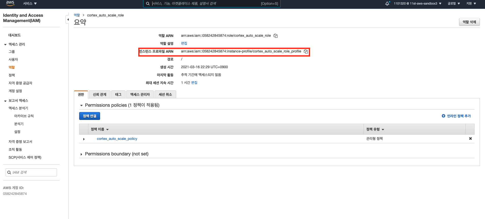

# 10장. Terraform으로 AWS IAM 관리하기

## AWS IAM이란 무엇인가?

`AWS IAM`이란, AWS 리소스에 대한 액세스를 안전하게 제어할 수 있는 웹 서비스이다. IAM을 이용하여, 리소스를 사용하도록 인증 및 권한 부여된 대상을 제어한다.

그냥 쉽게 AWS 리소스를 제어할 수 있는 유저, 그룹, 역할, 정책 등을 관리하는 것이라고 생각하면 된다. 이에 대한 자세한 내용은 다음을 참고하라.

* [AWS 공식 문서 - IAM이란 무엇인가요](https://docs.aws.amazon.com/ko_kr/IAM/latest/UserGuide/introduction.html)

## 우리가 이번에 구성할 것은?

우리가 이번에 구성할 인프라는 바로, `IAM_ROLE`, `IAM_POLICY`, `IAM_INSTNCE_PROFILE`이다. `Cortex 클러스터`를 AWS에서 동적으로 구성하기 위해서는, `AWS AutoScaling` 기능이 필요하다. 

이 때 `IAM`, `S3`, `DynamoDB`, `AutoScaling` 등의 리소스에 접근 권한을 가지는 정책(`IAM_POLICY`)가 필요하고, 이를 연결할 역할(`IAM_ROLE`)이 필요하다. 그리고 `AWS AutoScaling` 기능에서 이 역할을 참조할 수 있도록 인스턴스 프로파일(`IAM_INSTANCE_PROFILE`)을 만들어주어야 한다.

이번 장에서 쓰일 코드는 다음 URL에서 얻을 수 있다.

* 코드 링크 : [https://github.com/gurumee92/gurumee-terraform-code/tree/master/part3/ch10](https://github.com/gurumee92/gurumee-terraform-code/tree/master/part3/ch10)

## AWS Provider 구성

먼저 프로바이더를 구성한다. `provider.tf`를 다음과 같이 생성한다.

part3/ch10/provider.tf
```tf
provider "aws" {
  region = "us-east-1"
}
```

끝이다. `region`의 경우는 적절하게 값을 주면 된다. 대한민국에서 코드를 작성하는 것이라면 `ap-northeast-2`를 추천한다. 나는 이미 이 지역에 리소스가 있어서 `us-east-1`로 지정했다. 별 차이는 없다. 다만 다른 지역에 AWS 리소스가 생성되어 속도 차이가 조금 있을 뿐..?

이제 이 `provider.tf`가 있는 위치에서 `terraform init` 명령어를 실행시킨다.

```bash
$ terraform init
```

## 정책 생성

먼저 `iam.tf`를 생성한다. 그 후 다음을 복사한다.

part3/ch10/iam.tf
```tf
resource "aws_iam_policy" "cortex_auto_scale_policy" {
    name        = "cortex_auto_scale_policy"
    path        = "/"
    description = "auto scale policy for cortex cluster"
    policy = jsonencode({
    Version = "2012-10-17"
    Statement = [
        {
            "Effect": "Allow",
            "Action": [
                "iam:*",
                "organizations:DescribeAccount",
                "organizations:DescribeOrganization",
                "organizations:DescribeOrganizationalUnit",
                "organizations:DescribePolicy",
                "organizations:ListChildren",
                "organizations:ListParents",
                "organizations:ListPoliciesForTarget",
                "organizations:ListRoots",
                "organizations:ListPolicies",
                "organizations:ListTargetsForPolicy"
            ],
            "Resource": "*"
        },
        {
            "Effect": "Allow",
            "Action": "s3:*",
            "Resource": "*"
        },
        {
            "Action": [
                "dynamodb:*",
                "dax:*",
                "application-autoscaling:DeleteScalingPolicy",
                "application-autoscaling:DeregisterScalableTarget",
                "application-autoscaling:DescribeScalableTargets",
                "application-autoscaling:DescribeScalingActivities",
                "application-autoscaling:DescribeScalingPolicies",
                "application-autoscaling:PutScalingPolicy",
                "application-autoscaling:RegisterScalableTarget",
                "cloudwatch:DeleteAlarms",
                "cloudwatch:DescribeAlarmHistory",
                "cloudwatch:DescribeAlarms",
                "cloudwatch:DescribeAlarmsForMetric",
                "cloudwatch:GetMetricStatistics",
                "cloudwatch:ListMetrics",
                "cloudwatch:PutMetricAlarm",
                "cloudwatch:GetMetricData",
                "datapipeline:ActivatePipeline",
                "datapipeline:CreatePipeline",
                "datapipeline:DeletePipeline",
                "datapipeline:DescribeObjects",
                "datapipeline:DescribePipelines",
                "datapipeline:GetPipelineDefinition",
                "datapipeline:ListPipelines",
                "datapipeline:PutPipelineDefinition",
                "datapipeline:QueryObjects",
                "ec2:DescribeVpcs",
                "ec2:DescribeSubnets",
                "ec2:DescribeSecurityGroups",
                "iam:GetRole",
                "iam:ListRoles",
                "kms:DescribeKey",
                "kms:ListAliases",
                "sns:CreateTopic",
                "sns:DeleteTopic",
                "sns:ListSubscriptions",
                "sns:ListSubscriptionsByTopic",
                "sns:ListTopics",
                "sns:Subscribe",
                "sns:Unsubscribe",
                "sns:SetTopicAttributes",
                "lambda:CreateFunction",
                "lambda:ListFunctions",
                "lambda:ListEventSourceMappings",
                "lambda:CreateEventSourceMapping",
                "lambda:DeleteEventSourceMapping",
                "lambda:GetFunctionConfiguration",
                "lambda:DeleteFunction",
                "resource-groups:ListGroups",
                "resource-groups:ListGroupResources",
                "resource-groups:GetGroup",
                "resource-groups:GetGroupQuery",
                "resource-groups:DeleteGroup",
                "resource-groups:CreateGroup",
                "tag:GetResources",
                "kinesis:ListStreams",
                "kinesis:DescribeStream",
                "kinesis:DescribeStreamSummary"
            ],
            "Effect": "Allow",
            "Resource": "*"
        },
        {
            "Action": "cloudwatch:GetInsightRuleReport",
            "Effect": "Allow",
            "Resource": "arn:aws:cloudwatch:*:*:insight-rule/DynamoDBContributorInsights*"
        },
        {
            "Action": [
                "iam:PassRole"
            ],
            "Effect": "Allow",
            "Resource": "*",
            "Condition": {
                "StringLike": {
                    "iam:PassedToService": [
                        "application-autoscaling.amazonaws.com",
                        "application-autoscaling.amazonaws.com.cn",
                        "dax.amazonaws.com"
                    ]
                }
            }
        },
        {
            "Effect": "Allow",
            "Action": [
                "iam:CreateServiceLinkedRole"
            ],
            "Resource": "*",
            "Condition": {
                "StringEquals": {
                    "iam:AWSServiceName": [
                        "replication.dynamodb.amazonaws.com",
                        "dax.amazonaws.com",
                        "dynamodb.application-autoscaling.amazonaws.com",
                        "contributorinsights.dynamodb.amazonaws.com",
                        "kinesisreplication.dynamodb.amazonaws.com"
                    ]
                }
            }
        }
    ]
    })
}
```

위의 코드에서 `policy`에 값으로 설정된 jsonencode 함수의 파라미터로 전달된 JSON 값은 `IAMFullAccess`, `S3FullAccess`, `DynamoDBFullAccess` 정책이 모두 들어가 있다. 따라서 위 권한들을 모두 가진 정책이 생성된다.

어떻게 이 정책들을 찾아서 한 것인지는 `DynamoDBFullAccess`를 예를 들어서 설명하겠다. 먼저 AWS 콘솔에 접속하여 IAM 서비스로 이동한다.

그 후 왼쪽 탭의 "정책" 메뉴를 선택한다.


그 후 검색창에 "DynamoDBFullAccess"를 입력한다.


그럼 다 치기도 전에 관련 정책을 확인할 수 있다.


이를 클릭하면 아래 화면처럼 JSON 형태의 값이 보인다. 이를 다 복사해서 resource의 policy = jsonencode() 함수 안에 넣어준다.


그 후 다른 정책들에서 권한들을 빼올 때면 아래처럼 Statement 리스트 안에, `{ ... }` 값들만 긁어서 `iam.tf`안에 Statement 리스트에 복사해두면 된다.


이제 `terraform plan`를 입력한 후 실제 코드가 잘 반영되는지 테스트해보고 `terraform apply` 명령어를 입력해서 실제 리소스를 만든다. 

```bash
$ terraform apply
....
  Enter a value: yes

aws_iam_policy.cortex_auto_scale_policy: Creating...
aws_iam_policy.cortex_auto_scale_policy: Creation complete after 3s [id=arn:aws:iam::058242845874:policy/cortex_auto_scale_policy]

Apply complete! Resources: 1 added, 0 changed, 0 destroyed.
```

그 후 다시 AWS 콘솔 정책 화면으로 돌아가자. 검색창 왼쪽에 "정책 필터"가 있는데 이를 클릭한다. 그럼 아래처럼 유형을 선택할 수 있다. "고객 관리형"을 클릭한다.


그럼 아래처럼 "cortex_auto_scale_policy"가 만들어진 것을 확인할 수 있다.


이를 클릭해보면 정책이 가진 권한들을 요약해서 확인할 수 있는데, `DynamoDB`, `IAM`, `S3`가 모든 리소스에 접근할 수 있으면 성공이다.


## 역할 생성 및 정책 연결

이제 위에서 만든 `cortex_auto_scale_policy` 정책을 가지는 역할을 만들어보자. 먼저 `iam.tf`에 다음을 추가한다.

part3/ch10/iam.tf
```tf
// ...
resource "aws_iam_role" "cortex_auto_scale_role" {
    name = "cortex_auto_scale_role"
    path = "/"
    assume_role_policy = <<EOF
{
    "Version": "2012-10-17",
    "Statement": [
        {
            "Effect": "Allow",
            "Principal": {
                "Service": "ec2.amazonaws.com"
            },
            "Action": "sts:AssumeRole"
        }
    ]
}
EOF
}
```

`assume_role_policy`는 필수 값인데, 보통 역할을 만들면 위와 같은 JSON 값으로 초기화된다. 역시 `terraform plan`, `terraform apply` 명령어를 쳐서 코드 반영 테스트와, 실제 리소스를 만든다.

그럼 이제 다시 IAM 대시보드로 다시 접속한다. 그 후 왼쪽 탭의 "역할" 메뉴를 클릭한다.


그럼 다음 검색창이 뜨는데 여기서, "cortex_auto_scale_role"를 입력한다.


역시 채 다 치기도 전에 우리가 만든 역할이 만들어진 것을 확인할 수 있다.


이 `cortex_auto_scale_role`을 들어가보면 아무 권한도 없는 것을 확인할 수 있다.


정책이 연결되지 않아서 그렇다. 이제 우리가 만든 정책과 역할을 연결하자. `iam.tf`에 다음의 내용을 추가한다.

part3/ch10/iam.tf
```tf
// ...

resource "aws_iam_role_policy_attachment" "cortex_auto_scale_role_attach" {
    role       = aws_iam_role.cortex_auto_scale_role.name
    policy_arn = aws_iam_policy.cortex_auto_scale_policy.arn
}
```

위의 코드에서 확인할 수 있듯이 우리가 만든 역할의 이름과 정책의 arn을 통해서, `aws_iam_role_policy_attachment` 리소스가 만들어진 것을 확인할 수 있다. 이렇게 하면 정책과 역할이 연결이 된다. `terraform plan`과 `terraform apply` 명령어를 통해서 테스트와 리소스 생성을 해보자.

그 후, 역할의 권한이 들어가나 확인해본다. 콘솔에서 새로고침을 하면 다음 화면처럼 우리가 생성한 정책이 잘 들어간 것을 확인할 수 있다.


## 인스턴스 프로파일 생성

앞서 언급했 듯이 `AWS AutoScaling`을 사용하기 위해서는 결국 위 역할의 "인스턴스 프로파일"이 필요하다. 이제 이를 만들어준다.

part3/ch10/iam.tf
```tf
// ...

resource "aws_iam_instance_profile" "cortex_auto_scale_role_profile" {
    name = "cortex_auto_scale_role_profile"
    role = aws_iam_role.cortex_auto_scale_role.name
}
```

쉽다. `name`과 `role`의 이름만 값으로 주면 된다. 이제 다시 `terraform plan`과 `terraform apply` 명령어를 통해서 테스트와 리소스 생성을 해보자.

그 후 역할에 인스턴스 프로파일이 생성되었는지 확인한다. 잘 생성이 되었다.



이렇게 해서, `AWS AutoScaling`을 위한 `IAM` 리소스들을 모두 만들어두었다. 이 때 정책을 만들 때 혹은 역할을 만들 때 쓰인 JSON 들은 `data`로 빼서 테라폼 코드를 조금 더 깔끔하게 만들 수 있다. 이는 추후에 다시 알아보도록 하겠다.