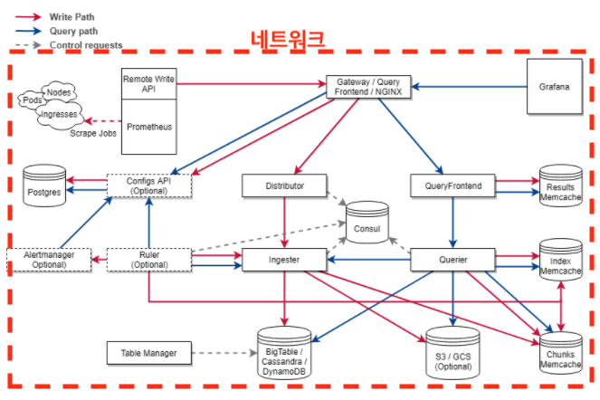

# 04장. 테라폼으로 네트워크 구성하기

## 무엇을 구성할 것인가

이번 장에서는 로컬 환경에서 `도커 네트워크`를 구성한다. `도커 네트워크`는 다음 구성 컴포넌트들을 하나로 묶어주는 일종의 `VPC` 역할을 한다.



이 장의 실습을 진행하기 위해서는 `Docker`와 `Terraform`이 로컬 머신에 설치되어 있어야 한다. 또한 소스 코드는 다음을 참고하라.

* 소스 코드 : [https://github.com/gurumee92/gurumee-terraform-code/tree/master/part2/ch04](https://github.com/gurumee92/gurumee-terraform-code/tree/master/part2/ch04)

터미널에 `docker network ls` 명령어를 입력해보자.

```bash
$ docker network ls
# cortex-cluster란 네트워크가 없습니다.
NETWORK ID     NAME                   DRIVER    SCOPE
789374a98d3b   bridge                 bridge    local
12e60bd27d55   ch08_default           bridge    local
97c6ca6fcf1a   host                   host      local
ab1f5ad1cf90   none                   null      local
abdc162857d2   studies-loki_default   bridge    local
```

현재는 `cortex-cluster`라는 이름의 네트워크가 보이지 않을 것이다. 우리는 이번 장에서 `cortex-cluster`라는 네트워크를 `Terraform`으로 구성할 것이다.

## 프로바이더 설정하기

먼저 우리는 `provider`를 구성해야 한다.

> 참고! provider란?
> 
> "Terraform"으로 관리할 인프라의 종류를 의미합니다. 여기서는 "Docker"가 "Terraform"으로 관리할 인프라를 의미합니다.

`provider.tf`를 다음과 같이 생성한다.

part2/ch04/provider.tf
```tf
terraform {
  required_providers {
    docker = {
      source = "kreuzwerker/docker"
    }
  }
}

provider "docker" {}
```

이렇게 하면, `provider`를 `Docker`로 설정할 수 있다. `provider.tf`가 위치하는 디렉토리로 이동하여 터미널에 `terraform init` 명령어를 입력한다.

```bash
$ terraform init

Initializing the backend...

Initializing provider plugins...
- Finding latest version of kreuzwerker/docker...
- Installing kreuzwerker/docker v2.11.0...
- Installed kreuzwerker/docker v2.11.0 (self-signed, key ID 24E54F214569A8A5)

...
```

이제 `Terraform`으로 `Docker`로 인프라를 구성할 환경이 갖쳐줬다. 위 명령어를 치고 나면 디렉토리에 `.terraform` 디렉토리와 `.terraform.lock.hcl`이 생성된 것을 확인할 수 있다.  

아직 어떤 `resource`도 만들지 않았지만 `terraform plan`이란 명령어를 쳐보자.

> 참고! resource란?
> 
> "Terraform"으로 관리할 인프라 자원을 의미합니다. 도커 네트워크가 바로 리소스입니다. 도커 환경에서는 이미지, 컨테이너 모두 리소스입니다.

```bash
$ terraform plan

No changes. Infrastructure is up-to-date.

This means that Terraform did not detect any differences between your
configuration and real physical resources that exist. As a result, no
actions need to be performed.
```

`terraform plan` 명령어는 우리가 적어 놓은 코드를 인프라에 적용하기 앞서, 잘 구성이 되는지 테스트를 하기 때문에 테라폼 코드가 변경되면 꼭 이 명령어를 실행하자.

이제 `Docker` 인프라에 `Terraform` 코드를 적용을 해보자. `terraform apply` 명령어를 입력한다.

```bash
terraform apply

Apply complete! Resources: 0 added, 0 changed, 0 destroyed.
```

그러면 `terraform.tfstate` 파일이 생성된 것을 확인할 수 있다. 하지만, 아직 아무 `resource`를 구성하지 않았기 때문에 `Docker` 인프라에는 변한 것이 없다. 터미널에 `docker network ls` 명령어를 입력해보자.

```bash
$ docker network ls
# 이전과 동일
# cortex-cluster란 네트워크가 없습니다.
NETWORK ID     NAME                   DRIVER    SCOPE
789374a98d3b   bridge                 bridge    local
...
```

위에서 말했 듯이 `resource`를 구축하지 않았기 때문에 아직 변한 것이 없다. 우리가 이번 절에서 한 실습은 `Terraform`으로 `Docker` 인프라를 관리할 수 있는 환경을 구성한 것이다.

## 네트워크 구성하기

이제 본격적으로 `도커 네트워크`를 구성해보자. `provider.tf`가 위치한 디렉토리에서 `network.tf`를 다음과 같이 생성한다.

part2/ch04/network.tf
```tf
resource "docker_network" "cortex-cluster" {
  name = "cortex-cluster"
}
```

여기서 "docker_network"는 `resource`를 의미한다. "cortex-cluster"는 `resource`의 이름으로 추후에 다른 리소스에서 네트워크를 참조할 때 `docker_network.cortex-cluster`로 접근할 수 있다. 이는 나중에 살펴보겠다.

그리고 속성을 정의할 수 있는데 `name`이란 속성에 "cortex-cluster"란 값을 주었다. 결국 `docker network ls` 명령어 입력시 이 이름이 우리에게 보일 것이다. 이제 코드가 변경되었으니 터미널에서 `terraform plan` 명령어를 입력한다.

```bash
$ terraform plan

An execution plan has been generated and is shown below.
Resource actions are indicated with the following symbols:
  + create

Terraform will perform the following actions:

  # docker_network.cortex-cluster will be created
  + resource "docker_network" "cortex-cluster" {
      + driver      = (known after apply)
      + id          = (known after apply)
      + internal    = (known after apply)
      + ipam_driver = "default"
      + name        = "cortex-cluster"
      + options     = (known after apply)
      + scope       = (known after apply)

      + ipam_config {
          + aux_address = (known after apply)
          + gateway     = (known after apply)
          + ip_range    = (known after apply)
          + subnet      = (known after apply)
        }
    }

Plan: 1 to add, 0 to change, 0 to destroy.

------------------------------------------------------------------------

Note: You didn't specify an "-out" parameter to save this plan, so Terraform
can't guarantee that exactly these actions will be performed if
"terraform apply" is subsequently run.
```

위 터미널을 보면 `도커 네트워크`가 어떻게 설정되었는지 확인할 수 있다. 이제 적용해보자. `terraform apply` 명령어를 입력한다.

```bash
$ terraform apply
An execution plan has been generated and is shown below.
Resource actions are indicated with the following symbols:
  + create

Terraform will perform the following actions:

  # docker_network.cortex-cluster will be created
  + resource "docker_network" "cortex-cluster" {
      + driver      = (known after apply)
      + id          = (known after apply)
      + internal    = (known after apply)
      + ipam_driver = "default"
      + name        = "cortex-cluster"
      + options     = (known after apply)
      + scope       = (known after apply)

      + ipam_config {
          + aux_address = (known after apply)
          + gateway     = (known after apply)
          + ip_range    = (known after apply)
          + subnet      = (known after apply)
        }
    }

Plan: 1 to add, 0 to change, 0 to destroy.

Do you want to perform these actions?
  Terraform will perform the actions described above.
  Only 'yes' will be accepted to approve.

  Enter a value: 
```

위와 같이 터미널에 뜨는데 어떤 `resource`가 추가 될 것인지 확인할 수 있다. "yes"를 입력하고 엔터를 쳐 주자.  그럼 터미널에 도커 네트워크가 생성됨을 확인할 수 있다.

``` bash
docker_network.cortex-cluster: Creating...
docker_network.cortex-cluster: Creation complete after 2s [id=192f763aceb0da5518dd094d18cd7e5737771761ccbc25740db7c64bb43cb5e4]  
```

이제 `docker network ls` 명령어를 터미널에 쳐보자.

```bash
$ docker network ls
NETWORK ID     NAME                   DRIVER    SCOPE
# cortex-cluster란 네트워크가 생김
...
192f763aceb0   cortex-cluster         bridge    local
...
```

성공이다! 우리가 원하는대로 이제 "cortex-cluster"라는 `도커 네트워크`가 생성되었다. 우리가 생성했던 `resource`들을 모두 제거하고 싶으면 `terraform destroy` 명령어를 치면 된다.

```bash
$ terraform destroy

An execution plan has been generated and is shown below.
Resource actions are indicated with the following symbols:
  - destroy

Terraform will perform the following actions:

  # docker_network.cortex-cluster will be destroyed
  - resource "docker_network" "cortex-cluster" {
      - attachable  = false -> null
      - driver      = "bridge" -> null
      - id          = "192f763aceb0da5518dd094d18cd7e5737771761ccbc25740db7c64bb43cb5e4" -> null
      - ingress     = false -> null
      - internal    = false -> null
      - ipam_driver = "default" -> null
      - ipv6        = false -> null
      - name        = "cortex-cluster" -> null
      - options     = {} -> null
      - scope       = "local" -> null

      - ipam_config {
          - aux_address = {} -> null
          - gateway     = "172.18.0.1" -> null
          - subnet      = "172.18.0.0/16" -> null
        }
    }

Plan: 0 to add, 0 to change, 1 to destroy.

Do you really want to destroy all resources?
  Terraform will destroy all your managed infrastructure, as shown above.
  There is no undo. Only 'yes' will be accepted to confirm.

  Enter a value: 
```

역시 제거될 `resource`들을 터미널에서 확인할 수 있다. "yes"를 입력하고 엔터를 쳐주면 네트워크가 삭제됨을 터미널에서 확인할 수 있다.

```bash
docker_network.cortex-cluster: Destroying... [id=192f763aceb0da5518dd094d18cd7e5737771761ccbc25740db7c64bb43cb5e4]
docker_network.cortex-cluster: Destruction complete after 2s
```

이제 `docker network ls` 명령어를 입력해서 잘 삭제가 되었는지 확인해보자.

```bash
$ docker network ls
# cortex-cluster가 삭제된 것을 확인할 수 있다.
NETWORK ID     NAME                   DRIVER    SCOPE
789374a98d3b   bridge                 bridge    local
12e60bd27d55   ch08_default           bridge    local
...
```