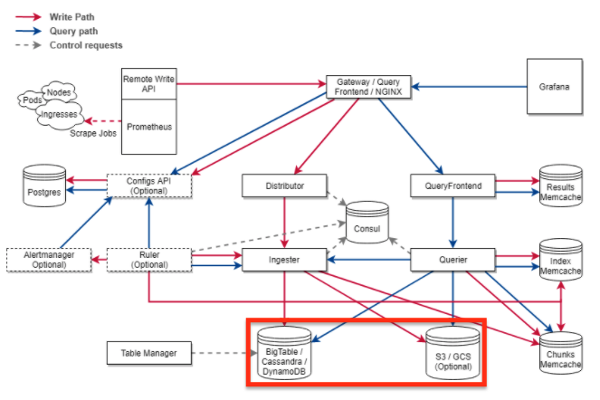

# 05장. 테라폼으로 저장소 구성하기

## 무엇을 구성할 것인가

우리는 이번 장에서 무엇을 구성할 것인가. 다음 그림을 살펴보자.



그림에서 살펴보면, `BigTable/Cassandra/DynamoDB`, `S3/GCS` 등이 보일 것이다. 우리가 만들어야 할 `Cortex 클러스터`는 공통적으로 특정 데이터를 저장해야 하는 저장소가 필요한데 이들이 바로 그 저장소 역할을 한다. 이번 장에서 우리가 구성할 인프라 요소는 바로 이 저장소이다.

저장소는 `Index`와 `Chunk`라는 특별한 데이터 형태로 저장해야 하는데 각각`AWS`환경에서는 `DynamoDB`와 `S3`를, `GCP`에서는 `BigTable`과 `GCS`로 보통 구성한다. 그리고 이들을 사용할 수 없는 온프렘 환경에서는 `Cassandra/Cassandra` 구조를 권하고 있다.

참고적으로 `Cassandra`는 운영 노하우가 잘 알려진 컴포넌트가 아니라서 어지간하면, `AWS` 혹은 `GCP` 기술들을 이용하는 것이 훨씬 좋다. 우리는 로컬 도커 환경에서 저장소를 구성할 것이다. `Cassandra` 2개로 구성할 수 있지만 복잡도를 낮추기 위해 1개만 구성한다. 이제 이미지와 컨테이너를 `Terraform`으로 구성해보자.

이번 장에서 쓰일 코드는 다음 링크에서 확인할 수 있다.

* 코드 링크 : [https://github.com/gurumee92/gurumee-terraform-code/tree/master/part2/ch05](https://github.com/gurumee92/gurumee-terraform-code/tree/master/part2/ch05)

> 참고! 이 장을 진행하기 전에
> 
> 이 장은 4장을 먼저 진행했음을 가정하고 합니다. 즉 이전 장에서 구성했던 tf 파일들(provider, network)이 이미 존재한다고 가정합니다. 없다면 [https://github.com/gurumee92/gurumee-terraform-code/tree/master/part2/ch04](https://github.com/gurumee92/gurumee-terraform-code/tree/master/part2/ch04)를 참고하세요.

## Cassandra 이미지 구성하기

이제 카산드라 이미지를 구성해보자. `store.tf`를 만들고 다음을 입력해보자.

part2/ch05/store.tf
```tf
resource "docker_image" "cassandra" {
  name         = "cassandra:latest"
  keep_locally = false
}
```

`Terraform`으로 `Docker` 기반의 인프라를 관리할 때 "docker_image"라는 `resource`를 사용할 수 있다. 이는 해당 도커 이미지를 관리할 때 사용한다. 그리고 "cassandra"라는 이름으로 이 이미지 리소스를 접근할 수 있다.

"name"은 `Cassandra` 최신 이미지 혹은 자신이 원하는 버전을 설정해주면 된다. 그리고 `keep_locally`는 `terraform destroy` 명령 시, 이미지를 삭제하게 해주는 속성이다. 

이제 터미널에 `terraform plan` 명령어를 입력해보자. 

> 참고! 만약 4장을 건너 뛰었다면?
> 
> 4장을 건너뛰었다면 terraform init 명령어를 먼저 실행해주세요.

```bash
$ terraform plan
docker_network.cortex-cluster: Refreshing state... [id=d732a6972d9f2df14d7062f50c97c436615350b326e872bc8fb0fa8f52abef98]

An execution plan has been generated and is shown below.
Resource actions are indicated with the following symbols:
  + create

Terraform will perform the following actions:

  # docker_image.cassandra will be created
  + resource "docker_image" "cassandra" {
      + id           = (known after apply)
      + keep_locally = false
      + latest       = (known after apply)
      + name         = "cassandra:latest"
      + output       = (known after apply)
    }

Plan: 1 to add, 0 to change, 0 to destroy.

------------------------------------------------------------------------

Note: You didn't specify an "-out" parameter to save this plan, so Terraform
can't guarantee that exactly these actions will be performed if
"terraform apply" is subsequently run.
```

아직 `terraform plan`만 했기 때문에 바뀌는 것은 없다. `Docker`로 설치한 모든 이미지들의 목록을 볼 수 있는 `docker images`라는 명령어를 입력해보자.

```bash
$ docker images
# cassandra 이미지가 없습니다.
REPOSITORY                           TAG                                                     IMAGE ID       CREATED         SIZE
grafana/grafana                      latest                                                  c9e576dccd68   7 days ago      198MB
ch08_was                             latest                                                  12f5b064f4c0   9 days ago      481MB
<none>                               <none>                                                  547d92312396   9 days ago      481MB
demo-board_resource-api              latest                                                  7a889f9b7530   12 days ago     502MB
...
```

이제 `Cassandra` 이미지를 구축해보자. `terraform apply` 명령어를 입력한다.

```bash
$ terraform apply
docker_network.cortex-cluster: Refreshing state... [id=d732a6972d9f2df14d7062f50c97c436615350b326e872bc8fb0fa8f52abef98]

An execution plan has been generated and is shown below.
Resource actions are indicated with the following symbols:
  + create

Terraform will perform the following actions:

  # docker_image.cassandra will be created
  + resource "docker_image" "cassandra" {
      + id           = (known after apply)
      + keep_locally = false
      + latest       = (known after apply)
      + name         = "cassandra:latest"
      + output       = (known after apply)
    }

Plan: 1 to add, 0 to change, 0 to destroy.

Do you want to perform these actions?
  Terraform will perform the actions described above.
  Only 'yes' will be accepted to approve.

  Enter a value: 
```

여기서 "yes"를 입력하고 엔터를 치면 이제 도커 이미지가 설치된다. 터미널에 다음처럼 로그가 보일 것이다.

```bash
docker_image.cassandra: Creating...
docker_image.cassandra: Still creating... [10s elapsed]
docker_image.cassandra: Still creating... [20s elapsed]
docker_image.cassandra: Creation complete after 25s [id=sha256:87779a1dd1f7fa01317fab42d888150c4340369c26cb8904c3a14abeea117447cassandra:latest]

Apply complete! Resources: 1 added, 0 changed, 0 destroyed.
```

이제 도커 이미지 목록에 `cassandra:latest`가 있는지 확인해보자.

```bash
$ docker images
# cassandra 이미지가 생성되었습니다.
REPOSITORY                           TAG                                                     IMAGE ID       CREATED         SIZE
...
cassandra                            latest                                                  87779a1dd1f7   4 weeks ago     402MB
...
```

`Cassandra` 이미지가 생성되었다!

## Cassandra 컨테이너 구성하기

`Docker` 환경에서 도커 이미지는 실제 서버에서 컴포넌트가 실행이 되지 않은 채로 설치된 상태라고 생각하면 된다. 실제 실행이 되려면 도커 컨테이너로 만들어야 한다. 이제 `Cassandra` 이미지를 기반으로 컨테이너로 구성해보자.

`store.tf`에 다음을 추가한다.

part2/ch05/store.tf
```tf
# ...

resource "docker_container" "cortex-cluster-store" {
  image = docker_image.cassandra.latest
  name  = "cortex-cluster-store"
  network_mode = "bridge"
  networks_advanced {
      name = docker_network.cortex-cluster.name
  }
}
```

여기서 "image"는 이전 절에 만들었던 `Cassandra` 도커 이미지이다. `resource.resource_name` 형식으로 접근하는 것을 볼 수 있다. "name"은 컨테이너 이름이다. 그리고 "network_mode"는 "bridge"로 한다. 그리고 "networks_advanced.name"에 이전 장에서 만들었던 도커 네트워크를 사용한다.

> 참고! network_mode?
> 
> 도커 네트워크는 3가지 모드를 가지고 있습니다. 기본적으로 사용하는 모드는 bridge입니다. 이외에 host, overlay가 있지만 이는 시리즈의 내용을 벗어나니 생략하도록 하겠습니다. 혹시 궁금하신 분들은 [https://docs.docker.com/network/](https://docs.docker.com/network/)에서 내용을 확인해보세요.

이제 터미널에 다시 `terraform plan` 명령어를 입력한다.

```bash
$ terraform plan
docker_image.cassandra: Refreshing state... [id=sha256:87779a1dd1f7fa01317fab42d888150c4340369c26cb8904c3a14abeea117447cassandra:latest]
docker_network.cortex-cluster: Refreshing state... [id=0cda95cc4b73c4076a465709e362ccab6cd7c8216d2e0b0960fbea5840532813]

An execution plan has been generated and is shown below.
Resource actions are indicated with the following symbols:
  + create

Terraform will perform the following actions:

  # docker_container.cortex-cluster-store will be created
  + resource "docker_container" "cortex-cluster-store" {
      + attach           = false
      
      # ...

      + name             = "cortex-cluster-store"
      + network_data     = (known after apply)
      + network_mode     = "bridge"
      
      # ...

      + networks_advanced {
          + aliases = []
          + name    = "cortex-cluster"
        }
    }

Plan: 1 to add, 0 to change, 0 to destroy.

------------------------------------------------------------------------

Note: You didn't specify an "-out" parameter to save this plan, so Terraform
can't guarantee that exactly these actions will be performed if
"terraform apply" is subsequently run.
```

이제 `terraform apply` 명령 전에 확인할 것이 있다. 로컬 머신에서 컨테이너가 실행되고 있는지 확인하려면 `docker ps` 명령어를 사용하면 된다.

```bash
$ docker ps
CONTAINER ID   IMAGE     COMMAND   CREATED   STATUS    PORTS     NAMES
```

현재는 컨테이너가 실행되지 않기 때문에 빈 목록이 나타난다. 그리고 생성된 `도커 네트워크`는 `docker network inspect` 명령어를 통해서, 속한 컨테이너 목록을 확인할 수 있다.

```bash
$ docker network inspect cortex-cluster
[
    {
        "Name": "cortex-cluster",
        // ...
        "Containers": {},
        "Options": {},
        "Labels": {}
    }
]
```

현재 "Containers"가 비어 있는 것을 확인할 수 있다. 이제 `terraform apply` 명령어를 실행해보자.

```bash
$ terraform apply
# ...

Do you want to perform these actions?
  Terraform will perform the actions described above.
  Only 'yes' will be accepted to approve.

  Enter a value: 
```

역시 "yes"를 입력한다. 그럼 아래 로그 형식이 출력된다.

```bash
docker_container.cortex-cluster-store: Creating...
docker_container.cortex-cluster-store: Creation complete after 0s [id=308cb6b73ac2953dbe84846e2e1459eae6a09bbb4d9611d76b4c4bcef42c6f8b]
```

이제 컨테이너가 만들어졌다. `docker ps` 명령어로 확인해보자.

```bash
$ docker ps
CONTAINER ID   IMAGE          COMMAND                  CREATED              STATUS              PORTS                                         NAMES
308cb6b73ac2   87779a1dd1f7   "docker-entrypoint.s…"   About a minute ago   Up About a minute   7000-7001/tcp, 7199/tcp, 9042/tcp, 9160/tcp   cortex-cluster-store
```

우리가 설정한 이름으로, `Cassandra` 컨테이너가 실행되고 있음을 확인할 수 있다. 이제 우리가 구성한 `도커 네트워크`에 이 컨테이너가 접속이 되어 있는지 확인해보자.

```bash
$ docker network inspect cortex-cluster
[
    {
        "Name": "cortex-cluster",
        # ...

        "ConfigOnly": false,
        "Containers": {
            "308cb6b73ac2953dbe84846e2e1459eae6a09bbb4d9611d76b4c4bcef42c6f8b": {
                "Name": "cortex-cluster-store",
                "EndpointID": "ffedd32901b8f9cd3ea971a339768ec8c3023917c9e1bd68578290c9aae63d4e",
                "MacAddress": "02:42:ac:15:00:02",
                "IPv4Address": "172.21.0.2/16",
                "IPv6Address": ""
            }
        },

        # ...
    }
]
```
"Containers"에 우리가 구성한 `Cassandra` 컨테이너 이름이 들어간 것을 확인할 수 있다. 우리가 구성한 `도커 네트워크` 안에 `Cassandra` 컨테이너가 존재하고 있다고 보면 된다. 