# 13장. Terraform으로 AWS VPC 관리하기

## AWS VPC이란 무엇인가?

`Amazon Virtual Private Cloud`(이하 Amazon VPC 혹은 VPC)는 AWS 사용자가 정의한 "가상 네트워크"로써 cidr 블록 방식으로 IP 대역을 설정한다.

`VPC`의 대표적인 구성 요소는 다음과 같다.

### Subnet

`subnet`은 `vpc` 대역 안의 IP 주소 범위를 cidr 블록 방식으로 지정한다. 보통은 하나의 `availability zone`을 외부에서 통신할 수 있는 `public subnet`과 외부에서 통신이 불가능한 `private subnet`으로 나눈다.

또한 HA 구성을 위해 `vpc` 내부에 `public-pirvate subnet` 구조가 두 쌍이 되도록 만든다. 

### Internet Gateway(IGW)

`vpc` 내부의 `public subnet` 상의 인스턴스들과 외부 인터넷 간의 통신할 수 있도록 `vpc`에 연결하는 게이트웨이를 뜻한다. `route table`을 통해서, 연결된다.

### NAT Gateway(NGW)

`nat`는 네트워크 주소를 변환하는 장치를 뜻한다. `ngw`는 `vpc` 내부의 `prviate subnet`의 인스턴스들과 인터넷/AWS 서비스에 연결하는 게이트웨이이다. 

내부적으로 `public subnet`에 위치하고 있으며, `elastic IP`를 할당한 상태로 구성된다. 역시, `route table`을 통해서 연결된다. 참고적으로 IPv6는 지원하지 않으므로 아웃바운드 전용 인터넷 게이트웨이를 사용해야 한다.

### Routing Table

`route table`은 네트워크 트래픽을 전달할 위치를 결정하는데 사용되는 라우팅 규칙들의 집합이다. `subnet`과 `subnet` 간 통신, `subnet`과 `gateway`들의 통신을 결정한다.

### Network ACL

`security group`과 함께 `vpc`의 보안 장치 중 하나이다. 1개 이상의 `subnet`과 외부의 트래픽을 제어할 수 있다. 쉽게 말해서, `subnet` 단위의 보안 계층이라고 보면 된다. "stateless"하다라는 특징을 가지고 있다.

`network acl`은 여러 `subnet`과 연결이 가능하지만 반대로 `subnet`은 딱 1개의 `network acl`을 가져야만 한다.

### Security Group 

`network acl`과 함께 `vpc`의 보안 장치 중 하나이다. `security group`은 인스턴스 단위의 보안 계층이며, 인스턴스에 대한 인바운드 및 아웃바운드 트래픽을 제어하는 가상 방화벽 역할을 한다. `network acl`과는 달리 "stateful"하다.

`security group`은 각 인스턴스 당 최대 5개까지 적용이 가능하다. `network acl`과 `security group`을 혼용해서 쓰게 되면 보안 이슈 해결 시 복잡도가 매우 높아지기 떄문에 보통은 둘 중 한 가지를 선택해서 `vpc`에 보안을 적용한다.

우리는 `security group`을 기반으로 `vpc` 보안을 설정할 것이다.

## 우리가 이번에 구성할 것은?

우리가 구성할 인프라스트럭처는 다음과 같다.

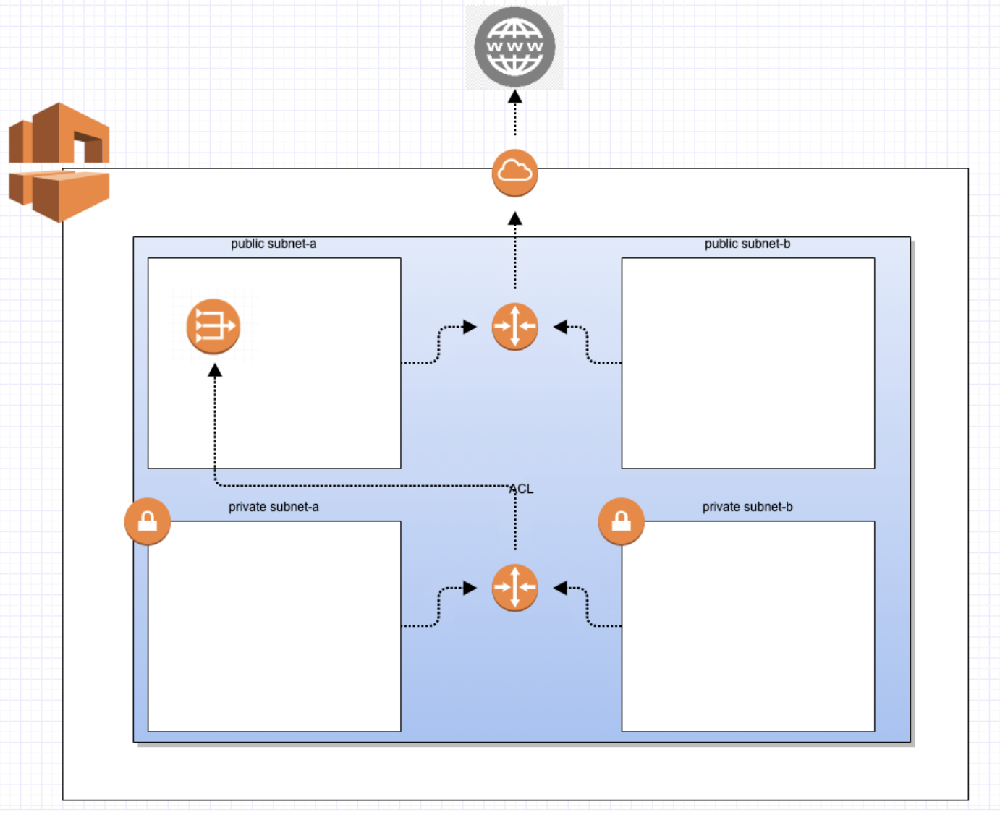

각 구성 요소를 나열하면 다음과 같다.

* VPC 1개
* subnet 4개 (public 2개, private 2개)
* internet gateway(igw) 1개
* nat gateway(ngw) 1개
    * eip 1개
* route table 2개 (public - igw, private - ngw)
    * route table assosiation 5개 (public 2개, private 3개)
* network acl 1개
* security group 3개
    * default (private subnet 인스턴스만 적용)
    * VPN (여기서는 자신의 IP를 VPN 취급)
    * 웹 서버용 (public subnet 인스턴스만 적용 80, 443번 port만 허용)

이번 장에서 만들 코드는 다음에서 확인할 수 있다.

* 코드 링크 : [https://github.com/gurumee92/gurumee-terraform-code/tree/master/part3/ch11](https://github.com/gurumee92/gurumee-terraform-code/tree/master/part3/ch11)

## AWS VPC 리소스 생성

지난 장을 진행하지 않았다면, 반드시 진행하고 오길 바란다.

### VPC


이번 절에서는 `vpc`를 생성한다. 디렉토리에 `vpc.tf`를 만들고 다음을 입력한다.

part3/ch11/vpc.tf
```tf
# vpc
resource "aws_vpc" "vpc" {
    cidr_block = "10.10.0.0/16"

    tags = {
        Name = "vpc"
    }
}
```

`terraform` 공식 레지스트리 문서에 따르면, `cidr_block`이 필수 값으로 들어가 있는 것을 확인할 수 있다. 

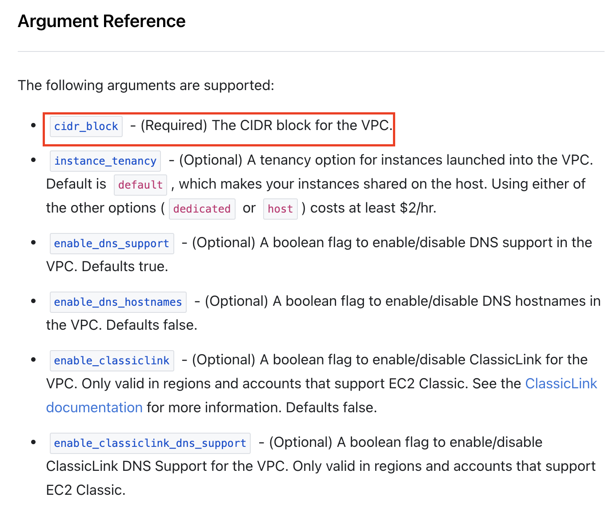

`cidr_block`은 private_ip 대역의 주소 할당 방법의 일환으로, 다음과 같은 대역을 설정할 수 있다.

* 10.0.0.0
* 172.16.0.0
* 192.168.0.0

그리고 블락 설정이라고 "10.10.0.0/16"에서 "/16"이 블락 설정이다. AWS `vpc`에서는 16 ~ 28 사이의 숫자로 설정해주어야 한다. 이제 `terraform apply` 명령어로 인프라스트럭처를 구성해보자. 그리고 구성 전 상황이랑 비교해서, 위의 `vpc.tf`로 어떤 것이 설정 되는지 확인해보자.

이전 인프라스트럭처 상황은 다음과 같다.

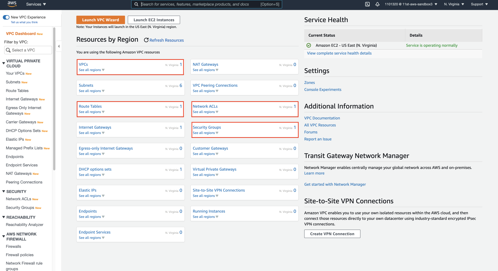

`terraform apply` 명령어 이후, 인프라스트럭처 상황은 다음과 같다.

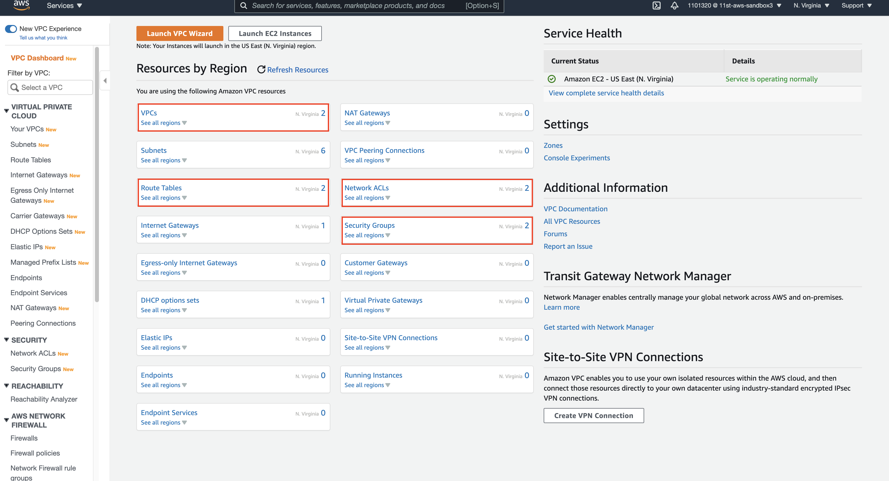

결국 `vpc` 하나를 생성하면, 기본적으로 `route table` 1개, `network acl` 1개, `security group` 1개씩 생긴다. 

이들을 앞에 default를 붙여서, `default route table` 이런 식으로 부른다. 기본적으로 만들어지는 리소스라는 뜻인데, 이마저도 `terraform`으로 관리할 수 있다. 추후 진행되는 절에서 더 자세히 살펴본다.

* Terraform 공식 레지스트리 AWS VPC : [https://registry.terraform.io/providers/hashicorp/aws/latest/docs/resources/vpc](https://registry.terraform.io/providers/hashicorp/aws/latest/docs/resources/vpc)
  
### Subnet


이제 `subnet`을 만들어보자. 위의 그림과 같이 `availabilty zone` 2개에 각각`public subnet` 1개, `private subnet` 1개씩 만들 것이다. 즉 총 4개의 `xubnet`을 생성한다. `vpc.tf`를 다음과 같이 수정한다.

part3/ch11/vpc.tf
```tf
# 이전과 동일

# subnet (public)
resource "aws_subnet" "public_subnet_1a" {
    vpc_id     = aws_vpc.vpc.id
    cidr_block = "10.10.1.0/24"
    availability_zone = "us-east-1a"
    tags = {
        Name = "public_subnet_1a"
    }
}

resource "aws_subnet" "public_subnet_1b" {
    vpc_id     = aws_vpc.vpc.id
    cidr_block = "10.10.2.0/24"
    availability_zone = "us-east-1b"
    tags = {
        Name = "public_subnet_1b"
    }
}

# subnet (private)
resource "aws_subnet" "private_subnet_1a" {
    vpc_id     = aws_vpc.vpc.id
    cidr_block = "10.10.101.0/24"
    availability_zone = "us-east-1a"
    tags = {
        Name = "private_subnet_1a"
    }
}

resource "aws_subnet" "private_subnet_1b" {
    vpc_id     = aws_vpc.vpc.id
    cidr_block = "10.10.102.0/24"
    availability_zone = "us-east-1b"
    tags = {
        Name = "private_subnet_1b"
    }
}
```

`terraform` 공식 레지스트리 문서에 따르면, `cidr_block`과 `vpc_id`가 필수 값으로 들어가 있는 것을 확인할 수 있다. 

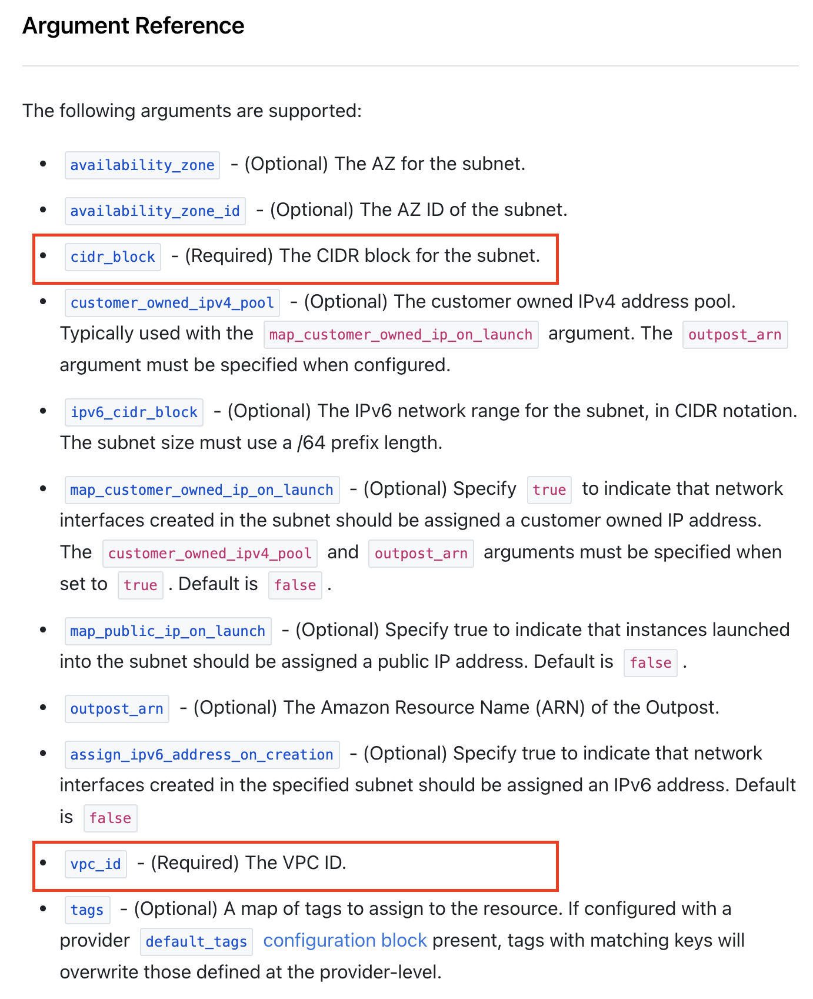

여기서 "cidr_block"은 "10.10.x.0"으로 구성하되, x는 `VPC`와 겹치지 않게 0이 되선 안되고 또한 자기들끼리도 겹치게 설정하면 안된다. 

`vpc_id`는 생성한 `vpc`의 id를 값으로 주면 된다. `terraform`으로 관리하는 리소스의 어트리뷰트를 이용하기 위해서는 다음의 형식을 따른다.

```
# <resource>.<resource_name>.<resource_attribute_name>
aws_vpc.vpc.id
```  

이번에도 `terraform apply` 명령어를 입력하여 어떤 리소스들이 생기는지 확인해보자.

이전 인프라스트럭처 상황은 다음과 같다.

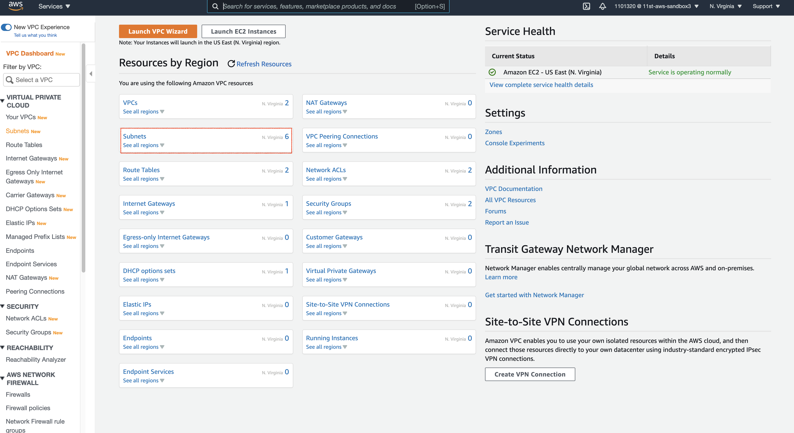

`terraform apply` 명령어에 의해 새롭게 구성된 인프라스트럭처의 상황은 다음과 같다.

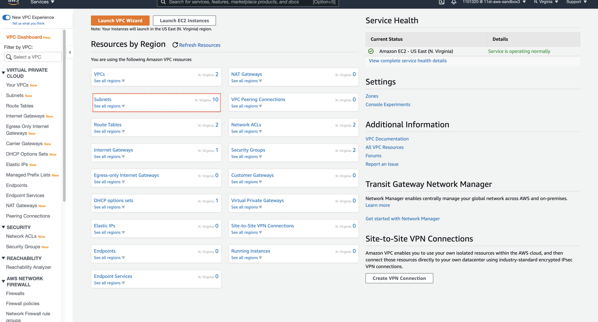

`vpc`처럼 추가적으로 생성되는 default 리소스들은 없다.

* Terraform 공식 레지스트리 AWS Subnet : [https://registry.terraform.io/providers/hashicorp/aws/latest/docs/resources/subnet](https://registry.terraform.io/providers/hashicorp/aws/latest/docs/resources/subnet)


### Internet Gateway(IGW)

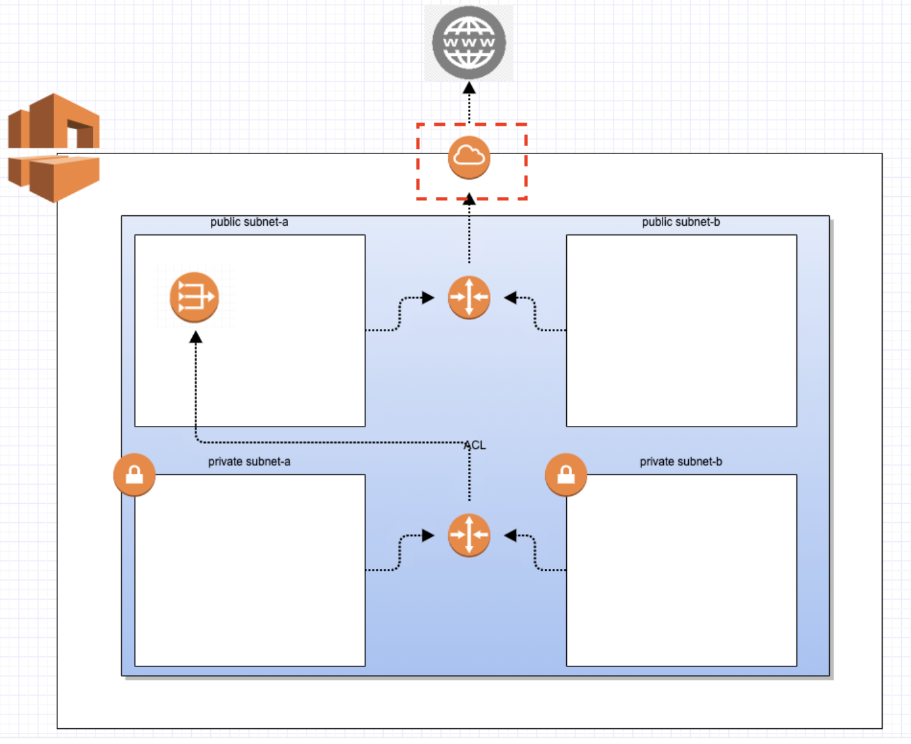

이번에 만들어볼 것은 `public subnet`과 외부 인터넷을 연결하는 `igw`이다. `vpc.tf`를 다음과 같이 수정한다.

part3/ch11/vpc.tf
```tf
# 이전과 동일

# igw
resource "aws_internet_gateway" "igw" {
    vpc_id = aws_vpc.vpc.id

    tags = {
        Name = "Internet Gateway"
    }
}
```

`terraform` 공식 레지스트리 문서에 따르면, `vpc_id`가 필수 값으로 들어가 있는 것을 확인할 수 있다. 

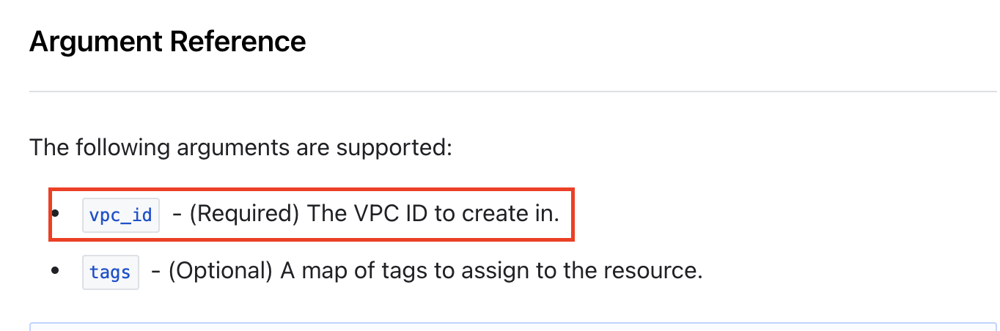

역시 `terraform apply` 명령어로 무엇이 생성되는지 확인해보자. 이전 인프라스트럭처의 상황은 다음과 같다.

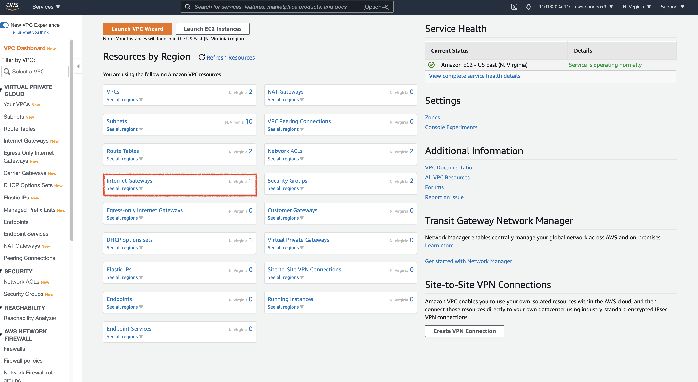

`terraform apply` 명령어에 의해 새롭게 구성된 인프라스트럭처의 상황은 다음과 같다.

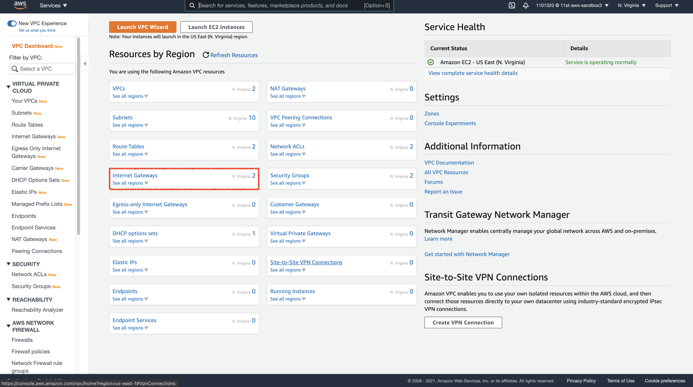

`igw` 역시, `vpc`처럼 추가적으로 생성되는 default 리소스들은 없다.

* Terraform 공식 레지스트리 AWS Internet Gateway : [https://registry.terraform.io/providers/hashicorp/aws/latest/docs/resources/internet_gateway](https://registry.terraform.io/providers/hashicorp/aws/latest/docs/resources/internet_gateway)

### NAT Gateway(NGW)

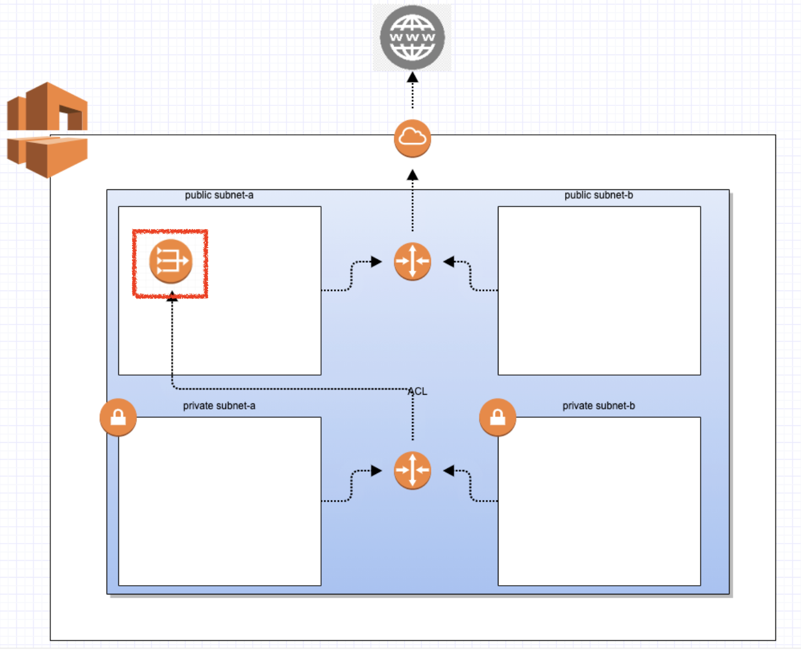

이번에는 `private subnet`에서 외부 인터넷을 통신할 수 있도록 `ngw`를 생성해보자. `vpc.tf`를 다음과 같이 수정한다.

part3/ch11/vpc.tf
```tf
# 이전과 동일

# ngw
resource "aws_eip" "ngw_ip" {
    vpc   = true

    lifecycle {
        create_before_destroy = true
    }
}

resource "aws_nat_gateway" "ngw" {
    allocation_id = aws_eip.ngw_ip.id
    subnet_id     = aws_subnet.public_subnet_1a.id

    tags = {
        Name = "NAT Gateway"
    }
}
```

`terraform` 공식 레지스트리 문서에 따르면, `allocation_id`와 `subnet_id`가 필수 값으로 들어가 있는 것을 확인할 수 있다. 

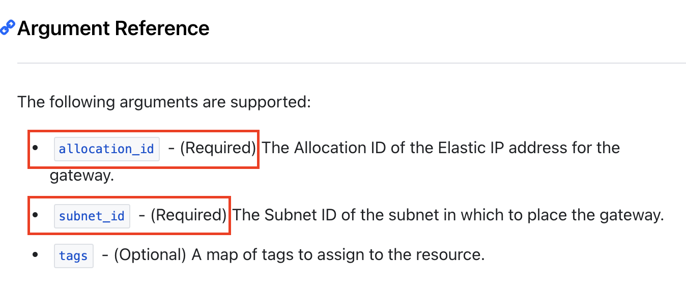

문서를 읽어보면, `allocation_id`는 "elastic ip 주소"라는 것을 알 수 있다. 따라서 `aws_eip`를 생성해 주어야 한다. 이는 `AWS EC2`의 리소스이므로 추후 절에서 더 깊이 다루도록 하겠다. 지금은 이렇게 만든다고만 알아두면 된다.

그리고 `ngw`는 무조건 `public subnet` 상에서 위치해 있어야 한다. 따라서 `subnet_id`는 `public_subet_1a`의 id를 할당해 주었다. 역시 `terraform apply` 명령어로 인해 인프라스트럭처에 어떤 변화가 생긴지 확인해보자.

> 참고! NGW 생성 시 시간이 어느 정도 걸립니다.
> 
> NGW 생성 시에 다른 리소스들과 달리 시간이 어느 정도 더 걸립니다. 왜냐하면 실제 NGW를 위한 ec2 인스턴스를 띄우는 과정이 포함되어 있어서 그렇습니다.

먼저 이전 인프라스트럭처의 상황이다.

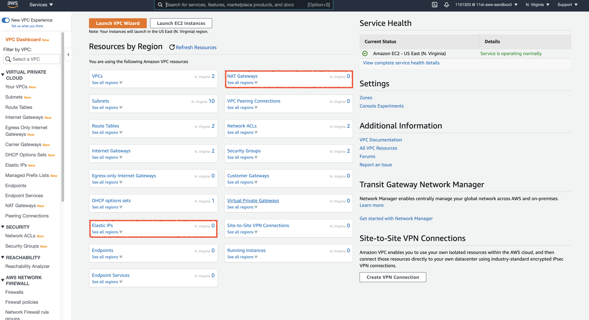

그 다음 `terraform apply` 명령어로 인해 변경된 인프라스트럭처의 상황이다.

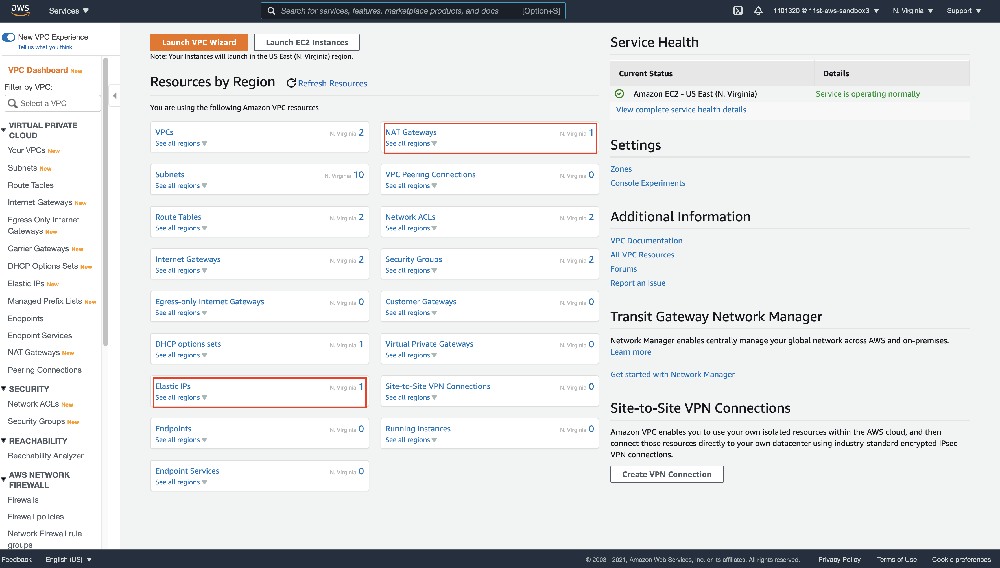

`Elastic ip`와 `NGW`외에 `VPC`처럼 추가적으로 생성되는 default 리소스들은 없다.

* Terraform 공식 레지스트리 AWS NAT Gateway : [https://registry.terraform.io/providers/hashicorp/aws/latest/docs/resources/nat_gateway](https://registry.terraform.io/providers/hashicorp/aws/latest/docs/resources/nat_gateway)

### Route Table

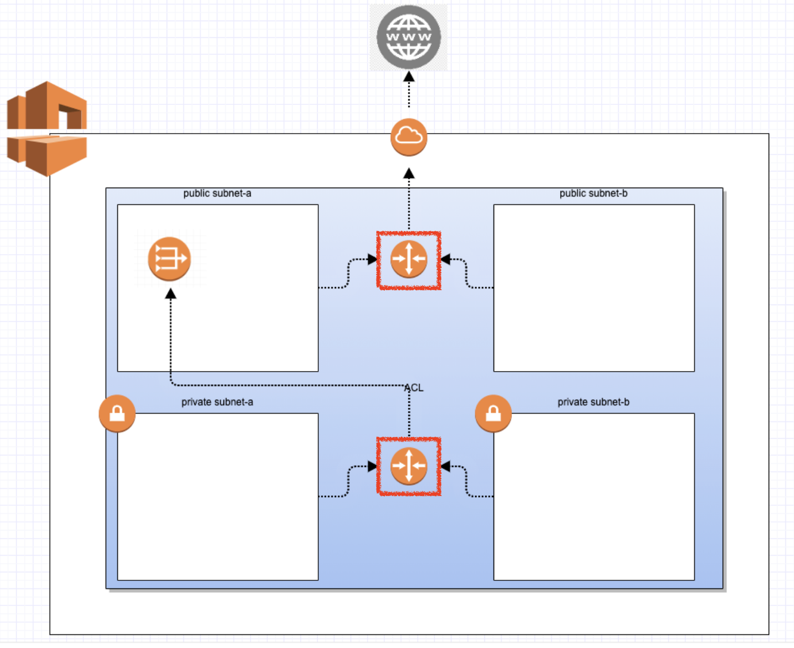

이번에는 트래픽이 어떻게 흐르는지에 대한 규칙을 만들 수 있는 `route table`을 생성한다. 먼저 `vpc`가 생성될 때, 기본으로 생성되는 `default route table`을 생성한다.

part3/ch11/vpc.tf
```tf
# ...
# route table (public)
resource "aws_default_route_table" "public_rt" {
    default_route_table_id = aws_vpc.vpc.default_route_table_id
    
    route {
        cidr_block = "0.0.0.0/0"
        gateway_id = aws_internet_gateway.igw.id
    }

    tags = {
        Name = "public route table"
    }
}
```

공식 문서에 따르면, 필수 argument는 `default_route_table_id`다. 이는 `vpc`의 attribute로 초기화한다.

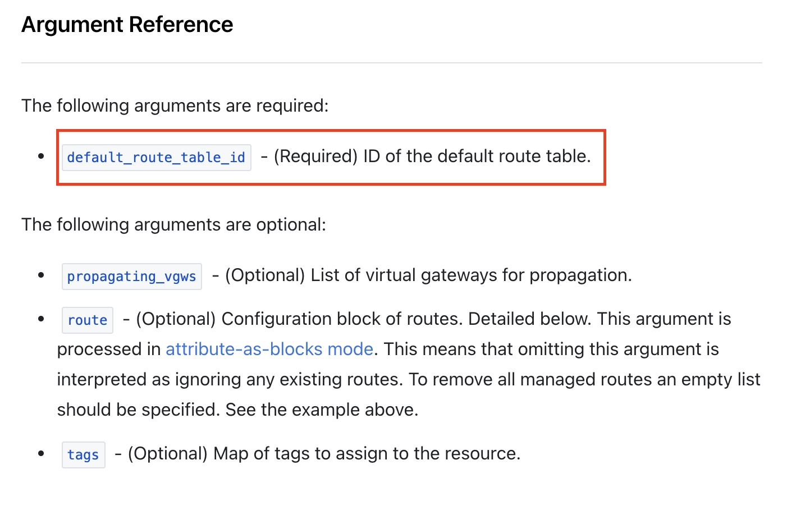

또한, 트래픽을 흐르게 하고 싶으면, 위 코드처럼 `route` argument를 구성하면 된다. 이렇게 하면, 인스턴스에서 외부랑 통신할 때 `igw`로 트래픽이 흐르게 된다. 또한 `route` 역시 리소스로써 구성할 수 있다. 이는 조금 이따가 살펴보도록 하자.

> 참고! 
> 
> 기본적으로 VPC 내 인스턴스 간, 트래픽은 허용됩니다.

이제, 위 `route table`에 `public subnet`이 따르도록 `route table association`을 정의한다. 

part3/ch11/vpc.tf
```tf
# ...
resource "aws_route_table_association" "public_rta_a" {
    subnet_id      = aws_subnet.public_subnet_1a.id
    route_table_id = aws_default_route_table.public_rt.id
}

resource "aws_route_table_association" "public_rta_b" {
    subnet_id      = aws_subnet.public_subnet_1b.id
    route_table_id = aws_default_route_table.public_rt.id
}
```

이렇게 `subnet_id`와 `route_table_id`를 이용하면, `route table association`를 구성할 수 있다. 공식 문서에 따르면, `route_table_id`는 필수 값이며, `subnet_id` 혹은 `gateway_id`를 선택하여 구성할 수 있다. 

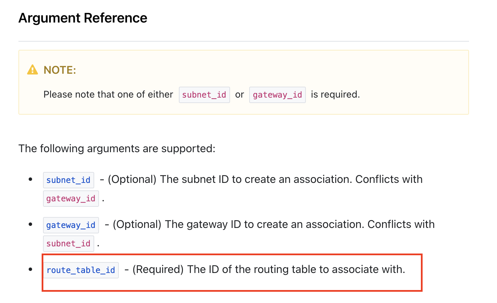

이제 `private subnet`의 `route table`을 생성해보자. 요령은 `aws_default_route_table`과 비슷하다.
 
part3/ch11/vpc.tf
```tf
# ...
# route table (private)
resource "aws_route_table" "private_rt" {
    vpc_id = aws_vpc.vpc.id
    tags = {
        Name = "private route table"
    }
}
```

`aws_default_route_table`는 "default_route_table_id"가 필수 값이라면, `aws_route_table`은 "vpc_id"가 필수 값이다.

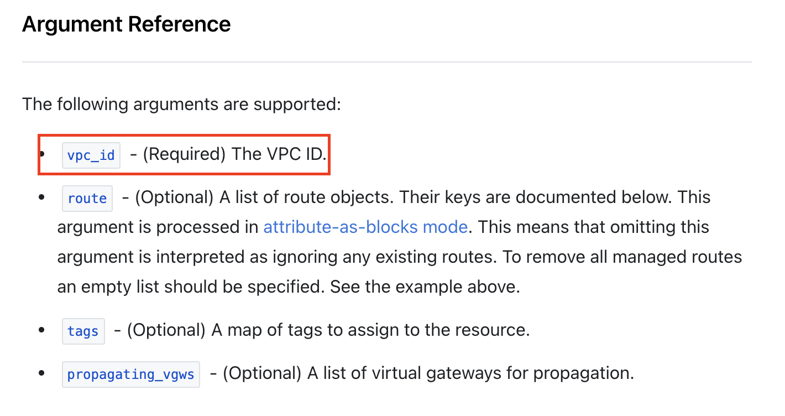

`aws_route_table_association`은 동일하다. 다만, `aws_route_table.private_rt.id` 이런 식으로 정의해주면 된다.

part3/ch11/vpc.tf
```tf
# ...
resource "aws_route_table_association" "private_rta_a" {
    subnet_id      = aws_subnet.private_subnet_1a.id
    route_table_id = aws_route_table.private_rt.id
}

resource "aws_route_table_association" "private_rta_b" {
    subnet_id      = aws_subnet.private_subnet_1b.id
    route_table_id = aws_route_table.private_rt.id
}
```

그리고 아래와 같이 따로 `route`를 정의해줄 수 있다. 아래 `route`는 `private_subnet`에서 인터넷 통신이 필요할 때 트래픽이 `ngw`로 흐를 수 있게 규칙을 정의한다.

part3/ch11/vpc.tf
```tf
# ...
resource "aws_route" "private_rt_route" {
    route_table_id              = aws_route_table.private_rt.id
    destination_cidr_block      = "0.0.0.0/0"
    nat_gateway_id              = aws_nat_gateway.ngw.id
}
```

공식 문서에 따르면, `route_table_id` 값은 필수적이며, `destination_cidr_block`을 지정해서 트래픽을 어디로 흐를지 정의할 수 있다. 또한 `nat_gateway_id` 말고, `gateway_id` 등 다른 게이트웨이 사용도 가능하다.

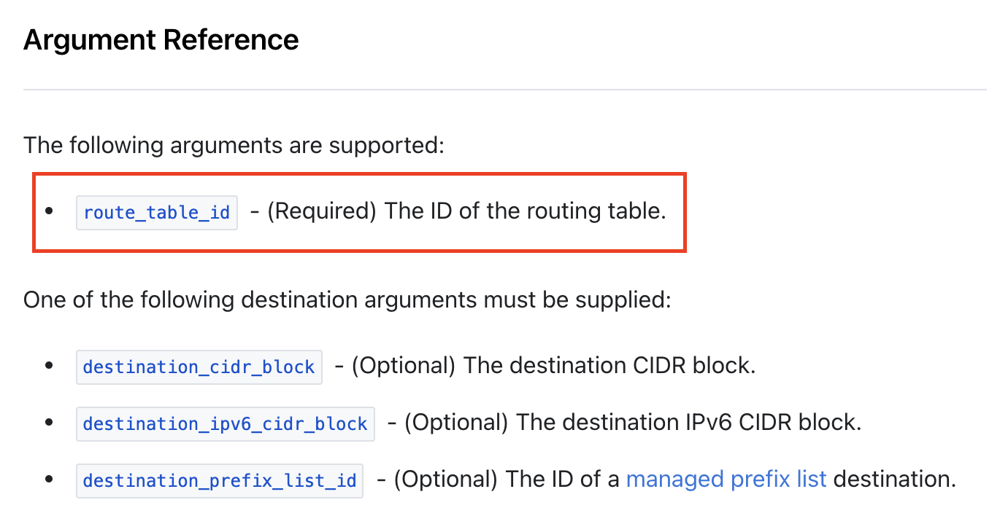

이제 `terraform apply` 명령어를 통해서 인프라스트럭처 구성이 어떻게 달라지는 확인해보자.

"VPC > Route Tables" 메뉴를 살펴면 다음과 같이 구성됨을 확인할 수 있다.

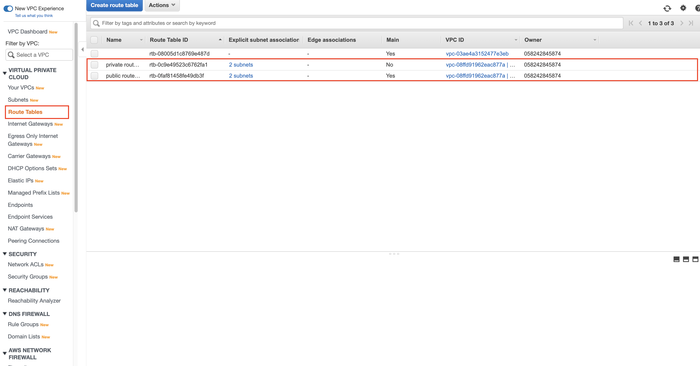

가장 첫 번째 줄은 우리가 생성한 것이 아니라, AWS 내에서 기본적으로 생성된 것이니 무시한다. 이제 `public_route_table`을 찍어보면, `internet gatway`와 연결됨을 확인할 수 있다.


이제 `private_route_table`을 찍어보자. 역시 `NAT gateway`와 연결됨을 확인할 수 있다.

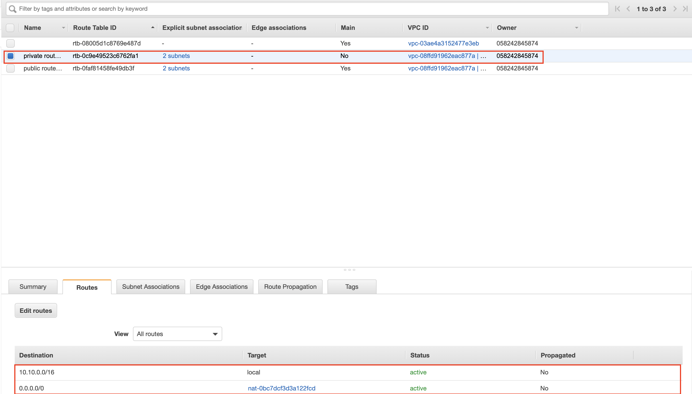

* Terraform 공식 레지스트리 AWS Default Route Table : [https://registry.terraform.io/providers/hashicorp/aws/latest/docs/resources/nat_gateway](https://registry.terraform.io/providers/hashicorp/aws/latest/docs/resources/nat_gateway)
* Terraform 공식 레지스트리 AWS Route Table : [https://registry.terraform.io/providers/hashicorp/aws/latest/docs/resources/route_table](https://registry.terraform.io/providers/hashicorp/aws/latest/docs/resources/route_table)
* * Terraform 공식 레지스트리 AWS Route Table Association : [https://registry.terraform.io/providers/hashicorp/aws/latest/docs/resources/route_table_association](https://registry.terraform.io/providers/hashicorp/aws/latest/docs/resources/route_table_association)
* * Terraform 공식 레지스트리 AWS Route: [https://registry.terraform.io/providers/hashicorp/aws/latest/docs/resources/route](https://registry.terraform.io/providers/hashicorp/aws/latest/docs/resources/route)

### Network ACL

이제 `network acl`을 만들어보자. 여기서는 `vpc` 생성하면 기본적으로 생성되는 `default network acl`을 만든다. `route table`처럼 default와 아닌 것으로 나뉘는데, 요령은 비슷하다. 

또한 주 보안 계층을 `network acl`로 정했으면, `public subnet`, `private subnet`을 따로 따로 구성하는 것이 일반적이다. 여기서는 `security group`을 통해서 보안을 적용하기 때문에 1개만 구성한다.

part3/ch11/vpc.tf
```tf
# ...
# network acl
resource "aws_default_network_acl" "vpc_network_acl" {
    default_network_acl_id = aws_vpc.vpc.default_network_acl_id
    
    egress {
        protocol   = "tcp"
        rule_no    = 100
        action     = "allow"
        cidr_block = "0.0.0.0/0"
        from_port  = 0
        to_port    = 65535
    }

    ingress {
        protocol   = "-1"
        rule_no    = 100
        action     = "allow"
        cidr_block = "0.0.0.0/0"
        from_port  = 0
        to_port    = 0
    }

    tags = {
        Name = "network acl"
    }
}
```

`aws_default_network_acl`는 위와 같이 생성할 수 있으며, 공식 문서에 따르면 필수 "argument"는 다음과 같다.

* default_network_acl_id : VPC의 attribute 값을 넣어주면 된다.

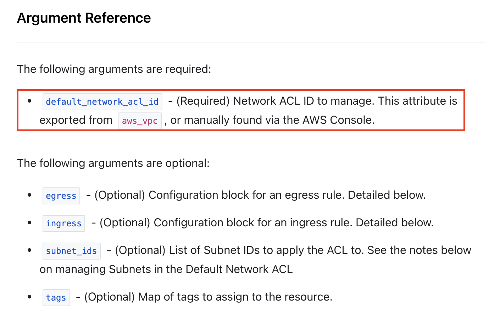

* Terraform 공식 레지스트리 AWS Default Network ACL : [https://registry.terraform.io/providers/hashicorp/aws/latest/docs/resources/default_network_acl](https://registry.terraform.io/providers/hashicorp/aws/latest/docs/resources/default_network_acl)

### Securtity Group

이제 `security group`을 만들어보자. 먼저 `vpc`가 생성되면 자동으로 생성되는 `default security group`을 만든다.

part3/ch11/vpc.tf
```tf
# ...
# security group
resource "aws_default_security_group" "default_sg" {
    vpc_id = aws_vpc.vpc.id

    ingress {
        protocol    = "tcp"
        from_port = 0
        to_port   = 65535
        cidr_blocks = [aws_vpc.vpc.cidr_block]
    }

    egress {
        protocol    = "-1"
        from_port   = 0
        to_port     = 0
        cidr_blocks = ["0.0.0.0/0"]
    }

    tags = {
        Name = "default_sg"
        Description = "default security group"
    }
}
```

`vpc` 대역에 있는 모든 인스턴스 간 통신을 허용하게 만들어준다. 공식 문서에 따르면, `vpc_id`는 필수 값은 아니나 예상치 못한 동작이 발생할 수 있다고 적혀있다. 따라서, 우리가 생성하는 `vpc`의 id로 값을 할당해주자.


이제 VPN 대역만 통할 수 있도록 `security group`을 만들어보자. 여기서는 가상의 IP 주소로 설정했지만 실제로는 공부할 때는 자신의 IP 대역을, 현업에서는 회사의 VPN 대역을 설정하면 된다.

자신의 IP 대역은 여기서 확인할 수 있다.

* 자신의 IP 대역 : [https://www.findip.kr/](https://www.findip.kr/)

part3/ch11/vpc.tf
```tf
# ...
resource "aws_security_group" "inhouse_sg" {
    name        = "pinhouse_sg"
    description = "security group for inhouse"
    vpc_id      = aws_vpc.vpc.id

    ingress {
        description = "For Inhouse ingress"
        from_port   = 0
        to_port     = 65535
        protocol    = "tcp"
        cidr_blocks = [
            aws_vpc.vpc.cidr_block,
            # 자신의 IP 실제로는, 회사 VPN 대역을 넣어주면 된다.
            "111.111.11.111/32",
        ]
    }

    egress {
        protocol    = "-1"
        from_port   = 0
        to_port     = 0
        cidr_blocks = ["0.0.0.0/0"]
    }

    tags = {
        Name = "inhouse_sg"
    }
}
```

역시 공식 문서에 따르면, 필수 값은 없다. 하지만, `vpc_id`값은 채워주는 것이 일반적이다.

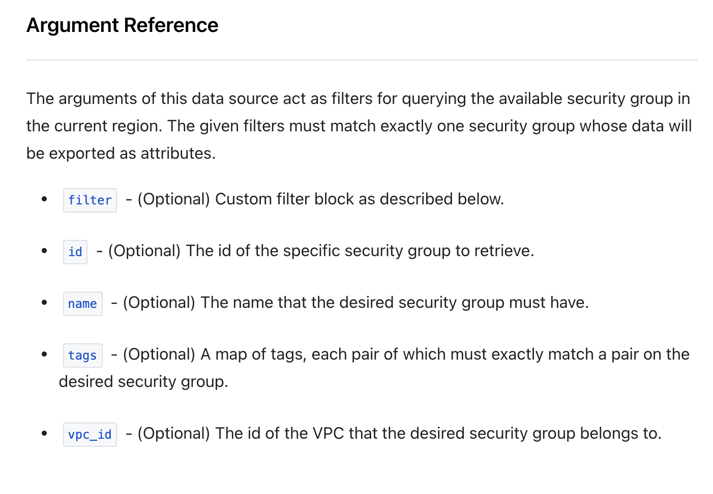

마지막으로 `public subnet`에서만 만들어질 웹 서버에 대한 `security group`을 정해보자. 80(HTTP), 443(HTTPS)에 대한 ingress 트래픽을 모두 허용해주면 된다.

part3/ch11/vpc.tf
```tf
# ...
resource "aws_security_group" "web_server_sg" {
    name        = "web_server_sg"
    description = "security group for web server"
    vpc_id      = aws_vpc.vpc.id

    ingress {
        description = "For http port"
        from_port   = 80
        to_port     = 80
        protocol    = "tcp"
        cidr_blocks = ["0.0.0.0/0"]
    }

    ingress {
        description = "For https port"
        from_port   = 443
        to_port     = 443
        protocol    = "tcp"
        cidr_blocks = ["0.0.0.0/0"]
    }

    egress {
        protocol    = "-1"
        from_port   = 0
        to_port     = 0
        cidr_blocks = ["0.0.0.0/0"]
    }

    tags = {
        Name = "web_server_sg"
    }
}
```

`terraform apply` 명령어를 통해서, 어떤 인프라스트럭처가 만들어지는지 꼭 확인하길 바란다.

* Terraform 공식 레지스트리 AWS Default Security Group : [https://registry.terraform.io/providers/hashicorp/aws/latest/docs/resources/default_security_group](https://registry.terraform.io/providers/hashicorp/aws/latest/docs/resources/default_security_group)
* Terraform 공식 레지스트리 AWS Security Group : [https://registry.terraform.io/providers/hashicorp/aws/latest/docs/data-sources/security_group](https://registry.terraform.io/providers/hashicorp/aws/latest/docs/data-sources/security_group)


이렇게 해서 우리가 원하는 `aws vpc` 구조를 모두 만들었다. 필요한 리소스가 있다면, 공식 레지스트리를 적극적으로 이용하길 바란다.