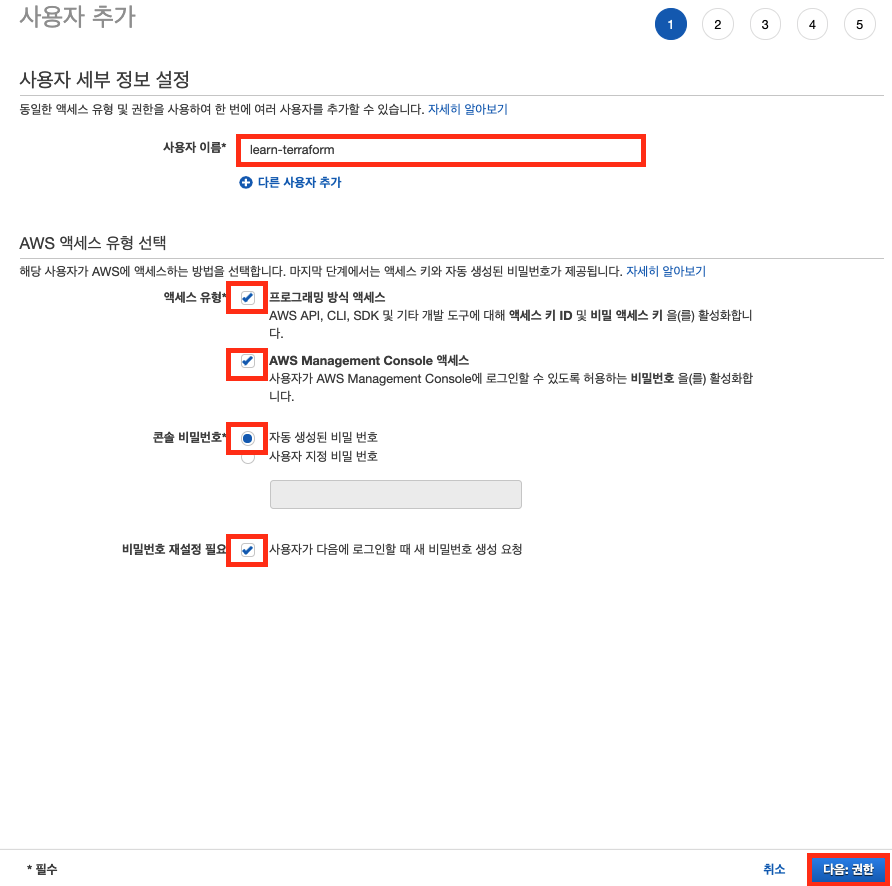
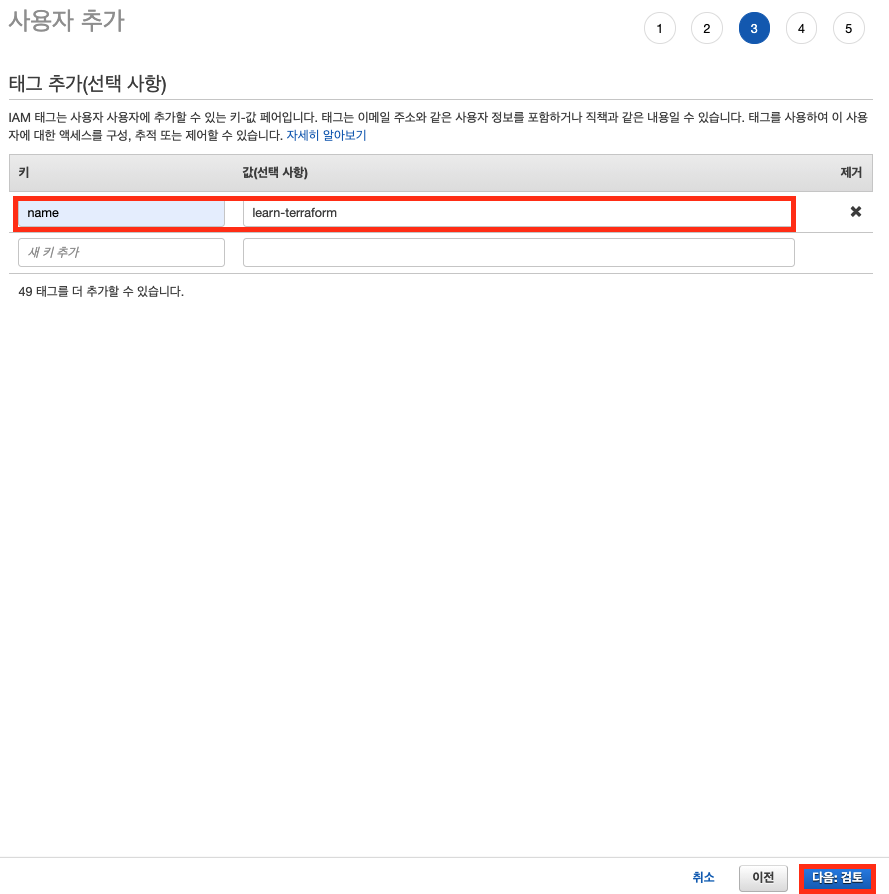

# 9장 AWS 준비하기

테라폼으로 AWS 인프라 리소스를 관리하기 위해선 aws-cli가 설치되어 있어야 하고, aws-cli가 aws의 모든 리소스에 접근할 수 있도록 해당 권한을 가진 유저와 연동이 되어야 한다. 이 장에서는 이를 위한 준비 작업을 진행한다.

## AWS CLI 설치

먼저 `AWS CLI`를 설치한다. 맥과, 윈도우는 아래 링크로 이동해서 설치 파일을 다운 후 설치를 진행하면 된다.

* MacOS [https://docs.aws.amazon.com/ko_kr/cli/latest/userguide/install-cliv2-mac.html](https://docs.aws.amazon.com/ko_kr/cli/latest/userguide/install-cliv2-mac.html)
* Windows [https://docs.aws.amazon.com/ko_kr/cli/latest/userguide/install-cliv2-windows.html](https://docs.aws.amazon.com/ko_kr/cli/latest/userguide/install-cliv2-windows.html)

AWS EC2의 경우에는 이 문서를 따라하면 된다. 먼저 EC2 인스턴스의 경우에는 이미 `AWS CLI`가 설치가 되어 있다. 

```bash
$ aws --version
aws-cli/1.18.147 Python/2.7.18 Linux/4.14.214-160.339.amzn2.x86_64 botocore/1.18.6
```

하지만 최신 버전은 아니다. 2.x 버전이 훨씬 유틸리티가 뛰어나기 때문에 이를 변경해보자. 터미널에 다음을 입력한다.

```bash
$ curl "https://awscli.amazonaws.com/awscli-exe-linux-x86_64.zip" -o "awscliv2.zip"
$ unzip awscliv2.zip
$ sudo ./aws/install
```

그 후, 터미널에 다시 `AWS CLI` 버전을 확인해보자.

```bash
$ aws --version
aws-cli/2.1.27 Python/3.7.4 Darwin/20.1.0 exe/x86_64 prompt/off
```

업데이트가 완료되었다. 

## AWS Configure 설정

테라폼으로 AWS를 관리하기 위해서는 AWS Credential 설정을 필요하다. 그러기 위해서 먼저 AWS 리소스를 관리할 수 있는 권한을 가진 유저 생성이 필요하다. 

EC2 콘솔에 접속한 후, IAM 대시보드로 이동한다. 그 후 왼쪽 탭의 "사용자"를 눌러준다.


사용자 이름을 입력한 후, 프로그래밍 액세스 방식, AWS Management Console 액세스 방식을 제공하기 위해 체크 박스를 클릭한다. 그 후 디폴트로 설정된 값을 따른다. 설정이 끝났으면 우측 하단에 "다음:권한" 버튼을 클릭한다.



이제 "기존 정책 직접 연결"을 클릭한 후, 검색 창에 "AdministratorAccess"을 입력한다. 그러면, 아래 창에 관련 권한이 뜨는데 이를 체크해준다. 그 후 "다음:태그"를 클릭한다.


이제 유저의 태그를 설정한다. 나는 name 키에 learn-terraform 이란 값을 주었다. 태그 설정이 완료되었으면 "다음:검토"를 클릭한다.



마지막으로 추가될 사용자의 정보가 보인다. 잘 설정되었는지 확인 후에 우측 하단에 "사용자 만들기" 버튼을 클릭한다.


그럼 추가된 사용자의 Access Key, Secret Key, Password를 확인할 수 있다. 어딘가에 이 정보들을 기록한다.


이제 로컬 머신이든, EC2 인스턴스든 AWS 설정을 하고 싶다면, 터미널에 다음을 입력한다.

```bash
$ aws configure
AWS Access Key ID [None]: <액세스 키 ID>
AWS Secret Access Key [None]: <비밀 액세스 키>
Default region name [ap-northeast-2]: ap-northeast-2
Default output format [None]: json
```

그 후 터미널에 다음을 입력해보자.

```bash
$ aws s3 ls
2021-01-14 14:09:28 demo-board-deployment
2021-02-01 11:06:41 loki-log-bucket
```

s3 리소스들이 없다면, 다음처럼 안 뜰 수도 있다. Invalid Access Key 이런 에러만 안 뜨면 된다. 이제 AWS 실습을 위한 모든 준비를 마쳤다.