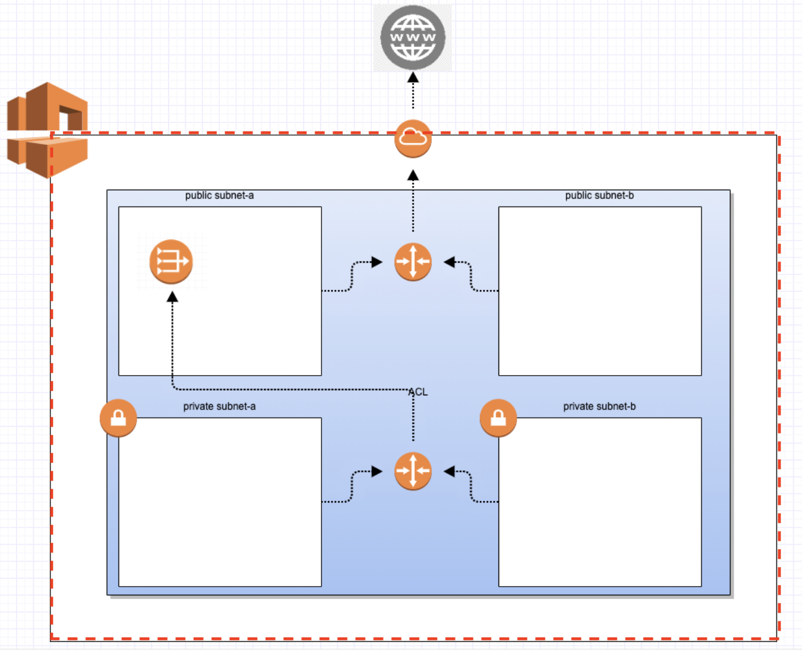
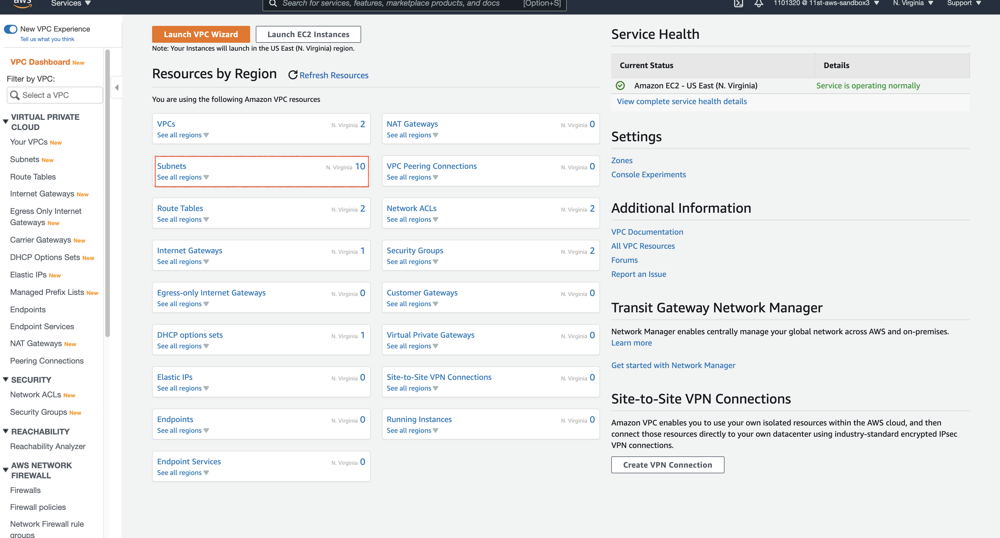
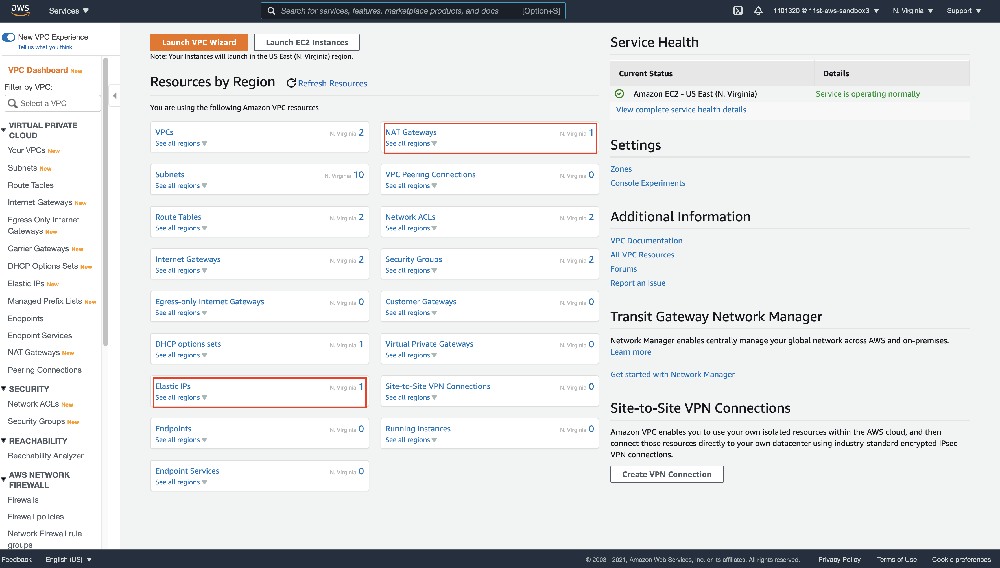

# 13장. Terraform으로 AWS VPC 관리하기

## AWS VPC이란 무엇인가?

`Amazon Virtual Private Cloud`(이하 Amazon VPC 혹은 VPC)는 AWS 사용자가 정의한 "가상 네트워크"로써 cidr 블록 방식으로 IP 대역을 설정한다.

`VPC`의 대표적인 구성 요소는 다음과 같다.

### Subnet

`Subnet`은 `VPC` 대역 안의 IP 주소 범위를 cidr 블록 방식으로 지정한다. 보통은 하나의 `Availability Zone`을 외부에서 통신할 수 있는 public subnet과 외부에서 통신이 불가능한 private subnet으로 나눈다.

또한 HA 구성을 위해 `VPC` 내부에 public-pirvate subnet 구조가 두 쌍이 되도록 만든다. 

### Internet Gateway(IGW)

`VPC` 내부의 `public subnet` 상의 인스턴스들과 외부 인터넷 간의 통신할 수 있도록 `VPC`에 연결하는 게이트웨이를 뜻한다. `route table`을 통해서, 연결된다.

### NAT Gateway(NGW)

`NAT`는 네트워크 주소를 변환하는 장치를 뜻한다. `NGW`는 `VPC` 내부의 `prviate subnet`의 인스턴스들과 인터넷/AWS 서비스에 연결하는 게이트웨이이다. 

내부적으로 `public subnet`에 위치하고 있으며, `elastic IP`를 할당한 상태로 구성된다. 역시, `route table`을 통해서 연결된다.

참고적으로 IPv6는 지원하지 않으므로 아웃바운드 전용 인터넷 게이트웨이를 사용해야 한다.

### Routing Table

`route table`은 네트워크 트래픽을 전달할 위치를 결정하는데 사용되는 라우팅 규칙들의 집합이다. `subnet`과 `subnet` 간 통신, `subnet`과 `gateway`들의 통신을 결정한다.

### Network ACL

`Security Group`과 함께 `AWS VPC`의 보안 장치 중 하나이다. 1개 이상의 `subnet`과 외부의 트래픽을 제어할 수 있다. 쉽게 말해서, `subnet` 단위의 보안 계층이라고 보면 된다. "stateless"하다라는 특징을 가지고 있다.

`Network ACL`은 여러 `subnet`과 연결이 가능하지만 반대로 `subnet`은 딱 1개의 `Network ACL`을 가져야만 한다.

### Security Group 

`Network ACL`과 함께 `AWS VPC`의 보안 장치 중 하나이다. `Security Group`은 인스턴스 단위의 보안 계층이며, 인스턴스에 대한 인바운드 및 아웃바운드 트래픽을 제어하는 가상 방화벽 역할을 한다. `Network ACL`과는 달리 "stateful"하다.

`Security Group`은 각 인스턴스 당 최대 5개까지 적용이 가능하다. `Network ACL`과 `Security Group`을 혼용해서 쓰게 되면 보안 이슈 해결 시 복잡도가 매우 높아지기 떄문에 보통은 둘 중 한 가지를 선택해서 `VPC`에 보안을 적용한다.

우리는 `Security Group`을 기반으로 `VPC` 보안을 설정할 것이다.

## 우리가 이번에 구성할 것은?

우리가 구성할 인프라스트럭처는 다음과 같다.


각 구성 요소를 나열하면 다음과 같다.

* VPC 1개
* subnet 4개 (public 2개, private 2개)
* internet gateway(igw) 1개
* nat gateway(ngw) 1개
    * eip 1개
* route table 2개 (public - igw, private - ngw)
    * route table assosiation 5개 (public 2개, private 3개)
* network acl 1개
* security group 3개
    * default (private subnet 인스턴스만 적용)
    * VPN (여기서는 자신의 IP를 VPN 취급)
    * 웹 서버용 (public subnet 인스턴스만 적용 80, 443번 port만 허용)

이번 장에서 만들 코드는 다음에서 확인할 수 있다.

* 코드 링크 : [https://github.com/gurumee92/gurumee-terraform-code/tree/master/part3/ch11](https://github.com/gurumee92/gurumee-terraform-code/tree/master/part3/ch11)

## AWS VPC 리소스 생성

지난 장을 진행하지 않았다면, 반드시 진행하고 오길 바란다.

### VPC



이번 절에서는 `VPC`를 생성한다. 디렉토리에 `vpc.tf`를 만들고 다음을 입력한다.

part3/ch11/vpc.tf
```tf
# vpc
resource "aws_vpc" "vpc" {
    cidr_block = "10.10.0.0/16"

    tags = {
        Name = "vpc"
    }
}
```

`Terraform` 공식 레지스트리 문서에 따르면, "cidr_block"이 필수 값으로 들어가 있는 것을 확인할 수 있다. 


"cidr_block"은 private_ip 대역의 주소 할당 방법의 일환으로, 다음과 같은 대역을 설정할 수 있다.

* 10.0.0.0
* 172.16.0.0
* 192.168.0.0

그리고 블락 설정이라고 "10.10.0.0/16"에서 "/16"이 블락 설정이다. AWS `VPC`에서는 16 ~ 28 사이의 숫자로 설정해주어야 한다. 이제 `terraform apply` 명령어로 인프라스트럭처를 구성해보자. 그리고 구성 전 상황이랑 비교해서, 위의 `vpc.tf`로 어떤 것이 설정 되는지 확인해보자.

이전 인프라스트럭처 상황은 다음과 같다.


`terraform apply` 명령어 이후, 인프라스트럭처 상황은 다음과 같다.


결국 `VPC` 하나를 생성하면, 기본적으로 `Route Table` 1개, `Network ACL` 1개, `Security Group` 1개씩 생긴다. 

이들을 앞에 default를 붙여서, `default route table` 이런 식으로 부른다. 기본적으로 만들어지는 리소스라는 뜻인데, 이마저도 `Terraform`으로 관리할 수 있다. 추후 진행되는 절에서 더 자세히 살펴본다.

* Terraform 공식 레지스트리 AWS VPC : [https://registry.terraform.io/providers/hashicorp/aws/latest/docs/resources/vpc](https://registry.terraform.io/providers/hashicorp/aws/latest/docs/resources/vpc)
  
### Subnet


이제 `Subnet`을 만들어보자. 위의 그림과 같이 `Availabilty Zone` 2개에 각각`public subnet` 1개, `private subnet` 1개씩 만들 것이다. 즉 총 4개의 `Subnet`을 생성한다. `vpc.tf`를 다음과 같이 수정한다.

part3/ch11/vpc.tf
```tf
# 이전과 동일

# subnet (public)
resource "aws_subnet" "public_subnet_1a" {
    vpc_id     = aws_vpc.vpc.id
    cidr_block = "10.10.1.0/24"
    availability_zone = "us-east-1a"
    tags = {
        Name = "public_subnet_1a"
    }
}

resource "aws_subnet" "public_subnet_1b" {
    vpc_id     = aws_vpc.vpc.id
    cidr_block = "10.10.2.0/24"
    availability_zone = "us-east-1b"
    tags = {
        Name = "public_subnet_1b"
    }
}

# subnet (private)
resource "aws_subnet" "private_subnet_1a" {
    vpc_id     = aws_vpc.vpc.id
    cidr_block = "10.10.101.0/24"
    availability_zone = "us-east-1a"
    tags = {
        Name = "private_subnet_1a"
    }
}

resource "aws_subnet" "private_subnet_1b" {
    vpc_id     = aws_vpc.vpc.id
    cidr_block = "10.10.102.0/24"
    availability_zone = "us-east-1b"
    tags = {
        Name = "private_subnet_1b"
    }
}
```

`Terraform` 공식 레지스트리 문서에 따르면, "cidr_block"과 "vpc_id"가 필수 값으로 들어가 있는 것을 확인할 수 있다. 


여기서 "cidr_block"은 "10.10.x.0"으로 구성하되, x는 `VPC`와 겹치지 않게 0이 되선 안되고 또한 자기들끼리도 겹치게 설정하면 안된다. 

"vpc_id"는 생성한 `VPC`의 id를 값으로 주면 된다. `Terraform`으로 관리하는 리소스의 어트리뷰트를 이용하기 위해서는 다음의 형식을 따른다.

```
# <resource>.<resource_name>.<resource_attribute_name>
aws_vpc.vpc.id
```  

이번에도 `terraform apply` 명령어를 입력하여 어떤 리소스들이 생기는지 확인해보자.

이전 인프라스트럭처 상황은 다음과 같다.


`terraform apply` 명령어에 의해 새롭게 구성된 인프라스트럭처의 상황은 다음과 같다.



`VPC`처럼 추가적으로 생성되는 default 리소스들은 없다.

* Terraform 공식 레지스트리 AWS Subnet : [https://registry.terraform.io/providers/hashicorp/aws/latest/docs/resources/subnet](https://registry.terraform.io/providers/hashicorp/aws/latest/docs/resources/subnet)


### Internet Gateway(IGW)


이번에 만들어볼 것은 `public subnet`과 외부 인터넷을 연결하는 `IGW`이다. `vpc.tf`를 다음과 같이 수정한다.

part3/ch11/vpc.tf
```tf
# 이전과 동일

# igw
resource "aws_internet_gateway" "igw" {
    vpc_id = aws_vpc.vpc.id

    tags = {
        Name = "Internet Gateway"
    }
}
```

`Terraform` 공식 레지스트리 문서에 따르면, "vpc_id"가 필수 값으로 들어가 있는 것을 확인할 수 있다. 


역시 `terraform apply` 명령어로 무엇이 생성되는지 확인해보자. 이전 인프라스트럭처의 상황은 다음과 같다.


`terraform apply` 명령어에 의해 새롭게 구성된 인프라스트럭처의 상황은 다음과 같다.


`IGW` 역시, `VPC`처럼 추가적으로 생성되는 default 리소스들은 없다.

* Terraform 공식 레지스트리 AWS Internet Gateway : [https://registry.terraform.io/providers/hashicorp/aws/latest/docs/resources/internet_gateway](https://registry.terraform.io/providers/hashicorp/aws/latest/docs/resources/internet_gateway)

### NAT Gateway(NGW)


이번에는 `private subnet`에서 외부 인터넷을 통신할 수 있도록 `NGW`를 생성해보자. `vpc.tf`를 다음과 같이 수정한다.

part3/ch11/vpc.tf
```tf
# 이전과 동일

# ngw
resource "aws_eip" "ngw_ip" {
    vpc   = true

    lifecycle {
        create_before_destroy = true
    }
}

resource "aws_nat_gateway" "ngw" {
    allocation_id = aws_eip.ngw_ip.id
    subnet_id     = aws_subnet.public_subnet_1a.id

    tags = {
        Name = "NAT Gateway"
    }
}
```

`Terraform` 공식 레지스트리 문서에 따르면, "allocation_id"와 "subnet_id"가 필수 값으로 들어가 있는 것을 확인할 수 있다. 


문서를 읽어보면, "allocation_id"는 "elastic ip 주소"라는 것을 알 수 있다. 따라서 `aws_eip`를 생성해 주어야 한다. 이는 `AWS EC2`의 리소스이므로 추후 절에서 더 깊이 다루도록 하겠다. 지금은 이렇게 만든다고만 알아두면 된다.

그리고 `NGW`는 무조건 `public subnet` 상에서 위치해 있어야 한다. 따라서 "subnet_id"는 `public_subet_1a`의 id를 할당해 주었다. 역시 `terraform apply` 명령어로 인해 인프라스트럭처에 어떤 변화가 생긴지 확인해보자.

> 참고! NGW 생성 시 시간이 어느 정도 걸립니다.
> 
> NGW 생성 시에 다른 리소스들과 달리 시간이 어느 정도 더 걸립니다. 왜냐하면 실제 NGW를 위한 ec2 인스턴스를 띄우는 과정이 포함되어 있어서 그렇습니다.

먼저 이전 인프라스트럭처의 상황이다.


그 다음 `terraform apply` 명령어로 인해 변경된 인프라스트럭처의 상황이다.



* Terraform 공식 레지스트리 AWS NAT Gateway : [https://registry.terraform.io/providers/hashicorp/aws/latest/docs/resources/nat_gateway](https://registry.terraform.io/providers/hashicorp/aws/latest/docs/resources/nat_gateway)

`Elastic ip`와 `NGW`외에 `VPC`처럼 추가적으로 생성되는 default 리소스들은 없다.

### Route Table

part3/ch11/vpc.tf
```tf
# ...
# route table (public)
resource "aws_default_route_table" "public_rt" {
    default_route_table_id = aws_vpc.vpc.default_route_table_id
    
    route {
        cidr_block = "0.0.0.0/0"
        gateway_id = aws_internet_gateway.igw.id
    }

    tags = {
        Name = "public route table"
    }
}

resource "aws_route_table_association" "public_rta_a" {
    subnet_id      = aws_subnet.public_subnet_1a.id
    route_table_id = aws_default_route_table.public_rt.id
}

resource "aws_route_table_association" "public_rta_b" {
    subnet_id      = aws_subnet.public_subnet_1b.id
    route_table_id = aws_default_route_table.public_rt.id
}

# route table (private)
resource "aws_route_table" "private_rt" {
    vpc_id = aws_vpc.vpc.id
    tags = {
        Name = "private route table"
    }
}

resource "aws_route_table_association" "private_rta_a" {
    subnet_id      = aws_subnet.private_subnet_1a.id
    route_table_id = aws_route_table.private_rt.id
}

resource "aws_route_table_association" "private_rta_b" {
    subnet_id      = aws_subnet.private_subnet_1b.id
    route_table_id = aws_route_table.private_rt.id
}

resource "aws_route" "private_rt_route" {
    route_table_id              = aws_route_table.private_rt.id
    destination_cidr_block      = "0.0.0.0/0"
    nat_gateway_id              = aws_nat_gateway.ngw.id
}
```

### Network ACL

part3/ch11/vpc.tf
```tf
# ...
# network acl
resource "aws_default_network_acl" "vpc_network_acl" {
    default_network_acl_id = aws_vpc.vpc.default_network_acl_id
    
    egress {
        protocol   = "tcp"
        rule_no    = 100
        action     = "allow"
        cidr_block = "0.0.0.0/0"
        from_port  = 0
        to_port    = 65535
    }

    ingress {
        protocol   = "-1"
        rule_no    = 100
        action     = "allow"
        cidr_block = "0.0.0.0/0"
        from_port  = 0
        to_port    = 0
    }

    tags = {
        Name = "network acl"
    }
}
```

### Securtity Group

part3/ch11/vpc.tf
```tf
# ...
# security group
resource "aws_default_security_group" "default_sg" {
    vpc_id = aws_vpc.vpc.id

    ingress {
        protocol    = "tcp"
        from_port = 0
        to_port   = 65535
        cidr_blocks = [aws_vpc.vpc.cidr_block]
    }

    egress {
        protocol    = "-1"
        from_port   = 0
        to_port     = 0
        cidr_blocks = ["0.0.0.0/0"]
    }

    tags = {
        Name = "default_sg"
        Description = "default security group"
    }
}

resource "aws_security_group" "inhouse_sg" {
    name        = "pinhouse_sg"
    description = "security group for inhouse"
    vpc_id      = aws_vpc.vpc.id

    ingress {
        description = "For Inhouse ingress"
        from_port   = 0
        to_port     = 65535
        protocol    = "tcp"
        cidr_blocks = [
            aws_vpc.vpc.cidr_block,
            "121.161.72.112/32",
        ]
    }

    egress {
        protocol    = "-1"
        from_port   = 0
        to_port     = 0
        cidr_blocks = ["0.0.0.0/0"]
    }

    tags = {
        Name = "inhouse_sg"
    }
}

resource "aws_security_group" "web_server_sg" {
    name        = "web_server_sg"
    description = "security group for web server"
    vpc_id      = aws_vpc.vpc.id

    ingress {
        description = "For http port"
        from_port   = 80
        to_port     = 80
        protocol    = "tcp"
        cidr_blocks = ["0.0.0.0/0"]
    }

    ingress {
        description = "For https port"
        from_port   = 443
        to_port     = 443
        protocol    = "tcp"
        cidr_blocks = ["0.0.0.0/0"]
    }

    egress {
        protocol    = "-1"
        from_port   = 0
        to_port     = 0
        cidr_blocks = ["0.0.0.0/0"]
    }

    tags = {
        Name = "web_server_sg"
    }
}
```