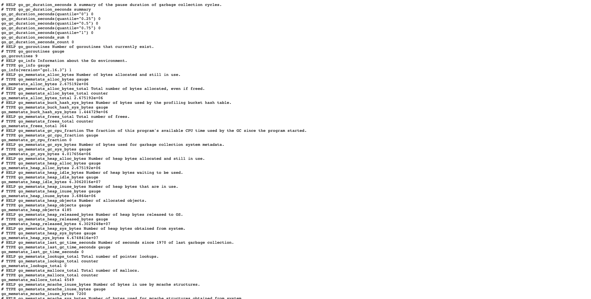
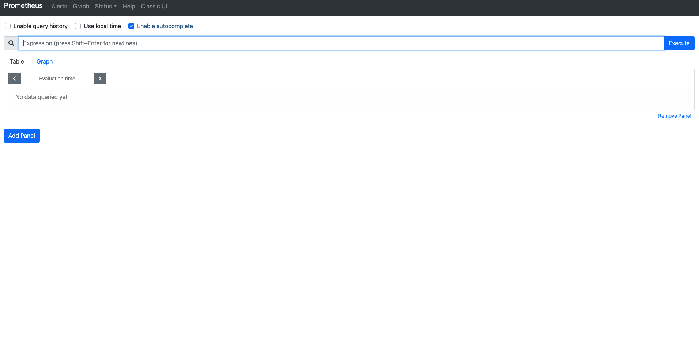
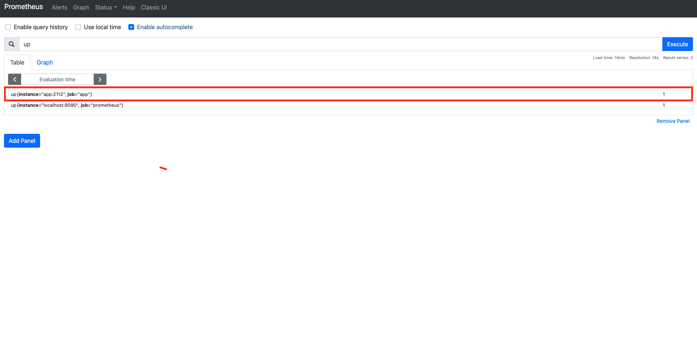
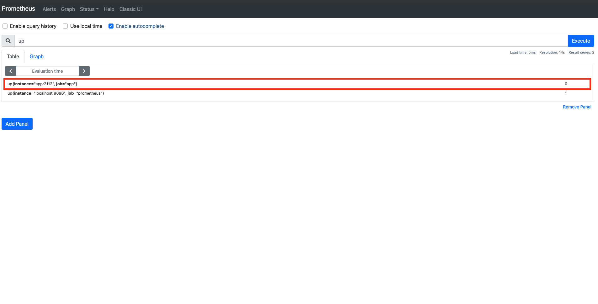

# 03장. Prometheus 메트릭 타입

## 개요

`Prometheus`에서 메트릭을 수집하는 방법은 대표적으로 크게 2가지가 있다.

> 참고! 메트릭이란?
> 
> 메트릭이란 수집하는 시계열 데이터를 일컫는 말이라고 보시면 됩니다. 

* Client Library를 통한 메트릭 수집
* Exporter를 통한 메트릭 수집

위 2가지 방법 모두, `Prometheus`에서 지원하는 다음의 4가지 메트릭 타입으로 각 메트릭을 정의하여 저장한다.

1. Counter
2. Gauge
3. Summary
4. Histogram

보통 모니터링 상황에서는 `Exporter`를 이용해서, 각 메트릭을 수집하는 것이 일반적이지만, 이번 장에서는 `Prometheus`의 메트릭 타입을 살펴보기 위해서, `Golang` 기반의 `Client Library`를 이용하여, 메트릭을 수집해 볼 것이다.

코드는 다음에서 확인할 수 있다.

* 3장 코드 : [https://github.com/gurumee92/gurumee-prometheus-code/tree/master/part1/ch03](https://github.com/gurumee92/gurumee-prometheus-code/tree/master/part1/ch03)

> 참고! 이 장을 시작하기 전에...
> 
> 이 장을 시작하기 전에, Docker와 docker-compose가 로컬 머신에 반드시 설치가 필요합니다!

## 프로젝트 구조

프로젝트의 구조는 다음과 같다.

```
|- ch03
    |- config
        |- prometheus.yml
    |- .gitignore
    |- Dockerfile
    |- docker-compose.yml
    |- go.mod
    |- go.sum
    |- main.go 
```

먼저 `Golang` 기반의 간단한 애플리케이션이 작성된 것을 확인할 수 있다.

part1/ch03/main.go
```go
package main

import (
	"fmt"
	"html"
	"math/rand"
	"net/http"
	"time"

	"github.com/prometheus/client_golang/prometheus"
	"github.com/prometheus/client_golang/prometheus/promauto"
	"github.com/prometheus/client_golang/prometheus/promhttp"
)

var (
	COUNTER = promauto.NewCounter(prometheus.CounterOpts{
		Name: "hello_world_total",
		Help: "Hello World requested",
	})

	GAUGE_INPROGRESS = promauto.NewGauge(prometheus.GaugeOpts{
		Name: "hello_world_inprogress",
		Help: "Number of /gauge in progress",
	})
	GAUGE_LAST = promauto.NewGauge(prometheus.GaugeOpts{
		Name: "hello_world_last_time_seconds",
		Help: "Last Time a /guage served",
	})

	SUMMARY = promauto.NewSummary(prometheus.SummaryOpts{
		Name: "hello_world_latency_seconds",
		Help: "Time for a request /summary",
	})

	HISTOGRAM = promauto.NewHistogram(prometheus.HistogramOpts{
		Name:    "hello_world_random_histogram",
		Help:    "A histogram of normally distributed random numbers.",
		Buckets: prometheus.LinearBuckets(-3, .1, 61),
	})
)

func index(w http.ResponseWriter, r *http.Request) {
	COUNTER.Inc()
	fmt.Fprintf(w, "Hello, %q", html.EscapeString(r.URL.Path))
}

func gauge(w http.ResponseWriter, r *http.Request) {
	GAUGE_INPROGRESS.Inc()
	time.Sleep(1 * time.Second)
	defer GAUGE_INPROGRESS.Dec()
	GAUGE_LAST.SetToCurrentTime()
	fmt.Fprintf(w, "Gauge, %q", html.EscapeString(r.URL.Path))
}

func summary(w http.ResponseWriter, r *http.Request) {
	start := time.Now()
	defer SUMMARY.Observe(float64(time.Now().Sub(start)))
	fmt.Fprintf(w, "Summary, %q", html.EscapeString(r.URL.Path))
}

func histogram(w http.ResponseWriter, r *http.Request) {
	HISTOGRAM.Observe(rand.NormFloat64())
	fmt.Fprintf(w, "Histogram, %q", html.EscapeString(r.URL.Path))
}

func main() {
	http.HandleFunc("/", index)
	http.HandleFunc("/gauge", gauge)
	http.HandleFunc("/summary", summary)
	http.HandleFunc("/histogram", histogram)
	http.Handle("/metrics", promhttp.Handler())
	http.ListenAndServe(":2112", nil)
}
```

코드 설명은 차차 하기로 하고, 여기서 중요한 것은 이 `Golang` 코드는 `Prometheus Client Library` 의존성이 있다는 것이다. 이를 위해서, `go.mod`, `go.sum`이 생성되어 있으며, `Dockerfile`을 통해서, 이 애플리케이션이 도커 이미지로 만들어진다.

그리고, `docker-compose.yml`을 보자.

part1/ch03/docker-compose.yml
```yml
version: "3"

services:
  app:
    container_name: app
    build: .
    ports:
      - 2112:2112
  
  prometheus:
    container_name: prometheus
    image: prom/prometheus:latest
    ports:
      - 9090:9090
    command:
      - '--config.file=/etc/prometheus/prometheus.yml'
      - '--storage.tsdb.path=/prometheus'
      - '--web.console.libraries=/usr/share/prometheus/console_libraries'
      - '--web.console.templates=/usr/share/prometheus/consoles'
    volumes:
      - ./config/prometheus.yml:/etc/prometheus/prometheus.yml
```

여기서 작성된 도커 이미지 기반으로 `app`이라는 컨테이너를 1개 생성하고 로컬 머신에 포트 2112번에 매핑시킨다. 또한 `Proemtheus` 컨테이너도 1개 생성한 후, `config/prometheus.yml` 기반으로 `Prometheus`가 동작할 수 있도록 설정되어 있다. 역시 9090번에 매핑되어 있다.

`Prometheus` 설정을 잠깐 살펴보자.

part1/ch03/config/prometheus.yml
```yml
# my global config
global:
  scrape_interval:     15s # By default, scrape targets every 15 seconds.
  evaluation_interval: 15s # By default, scrape targets every 15 seconds.
  
  external_labels:
    monitor: 'my-project'

rule_files:
  # ...
scrape_configs:
  - job_name: 'prometheus'
    scrape_interval: 5s

    static_configs:
      - targets: ['localhost:9090']

  - job_name: 'app'
    scrape_interval: 5s

    static_configs:
      - targets: ['app:2112']
```

위 설정은 `Prometheus` 자신과, `app`의 메트릭을 5초에 1번씩 수집하도록 하는 설정이다. `Proemtheus`에서는 `scrape_interval` 주기로 메트릭을 수집하는 단위를 `job`이라고 한다. 

이제 잘 구성이 되어 있나 확인해보자. 먼저 터미널에 다음을 입력하여, 도커 컨테이너들을 만든다.

```bash
# 현재 위치 확인 ch03이 있는 곳으로 가야 함.
$ pwd
/Users/gurumee/Workspace/gurumee-prometheus-code/part1/ch03

# docker 컨테이너 구동
$ docker-compose up --build -d
```

약간의 시간 후 브라우저에서 "localhost:2112/metrics"를 접속해본다. 그럼 다음 화면이 보인다.



위 화면은 우리가 `Golang` 기반의 애플리케이션으로, `Prometheus Client Library`를 이용하여, "/metrics" 경로에 수집할 수 있는 여러 메트릭들을 노출시키고 있다.

`Prometheus`는 이 경로를 통해서 노출된 메트릭을 수집하는 것이다. 이제 "localhost:9090"에 접속해보자.



검색 쿼리 창에 "up"이란 명령어를 쳐보자. 그럼 다음 결과가 보일 것이다.



"up" 쿼리는 `Prometeus`에서 설정한 `job`이 잘 돌고 있는지 확인할 수 있는 쿼리이다. 위에서 보면 우리가 설정한 `job` 2개였던 "app", "prometheus"가 1임을 확인할 수 있다. 

이제 아래 명령어를 실행하여서 "app" 컨테이너를 죽여보자.

```bash
$ docker-compose stop app
```

그 후 다시 브라우저에서 "up" 쿼리를 실행해보자. "app"이 0이 됨을 확인할 수 있다. 즉 "up" 쿼리는 `job`이 정상적으로 동작하고 있으면 1을 비정상적이면 0을 결과로 보여준다.



## 코드를 작성하며 알아보는 Prometheus 메트릭 타입
### Counter
### Gauge
### Summary
### Histogram

## 어떻게 계측할 것인가