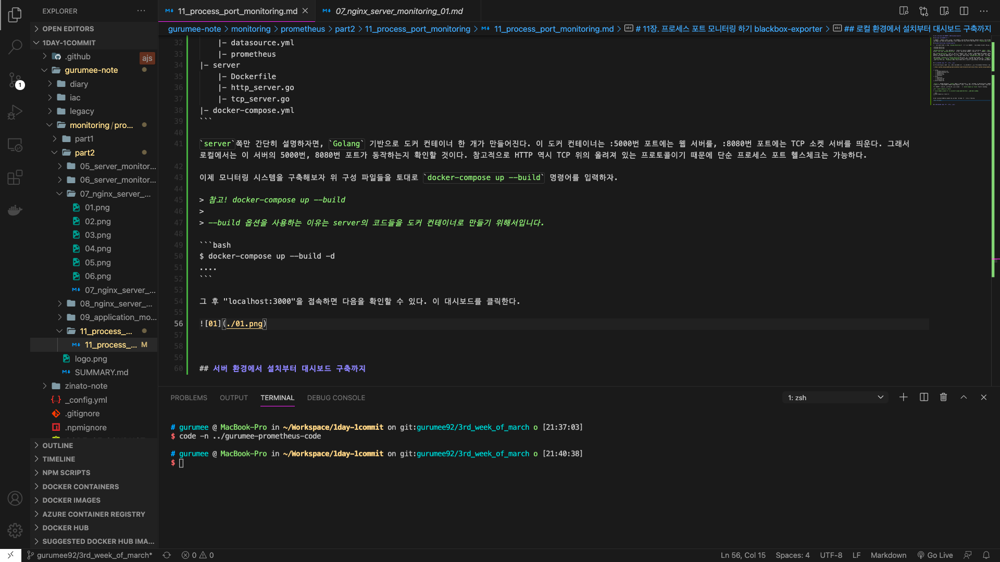

# 11장. 프로세스 포트 모니터링 하기 blackbox-exporter

## 프로세스 포트 모니터링이란?

이 모니터링은 필자의 회사에서 사용하고 있는 모니터링 시스템의 기능 중 하나이다. 간단하게 설명해서 특정 IP:PORT로 TCP 통신이 가능한 지 헬스 체크하는 것이다. 보통은 `Zabbix`, `PRTG` 등의 기술로 실행 중인 프로세스에 매핑된 포트를 모니터링을 한다. 우리는 이번 장에서 이를 `Prometheus`와 `blackbox-exporter`를 이용해서 구축한다.

## Blackbox Monitoring과 blackbox-exporter

먼저 용어 설명이 필요할것 같다. `Blackbox Monitoring`이란 무엇일까? 모니터링은 어떤 방법을 체택하는지에 따라 크게 다음과 같이 분류할 수 있다.

* Whitebox Monitoring
* Blackbox Monitoring

`Whitebox Monitoring`은 보통, 에이전트 혹은 소프트웨어를 설치해서 모니터링 하는 것을 말한다. `Zabbix`, `PRTG`, `Prometheus` 등이 이에 속한다. 일반적인 모니터링 기술들이 이에 속한다고 보면 된다. `Whitebox Monitoring`은 접근성은 좋으나 실제 모니터링 시스템을 구축할 때 모니터링 "소스"가 되는 기술에 대한 이해도가 높아야 한다. 

반면 `Blackbox Monitoring`은 시스템 내부가 어떻게 동작하는지보다 관측 가능한 행위에 초점을 두는 모니터링 기법이다. 쉽게 예를 들면, CPU가 어떻게 동작하는지, Memory가 어떻게 동작하는지 몰라도 된다. 그냥 CPU 사용량이 얼마인지, Memory 사용량이 얼마인지가 중요할 뿐인 것이다. 프로세스 포트 모니터링도 마찬가지이다. TCP가 어떻게 동작하는지 알 필요가 없다. 실행되는 프로세스에 TCP 연결이 가능한지 그 여부가 중요할 뿐인 것이다. `Blackbox Monitoring`쪽에서 유명한 기술은 `Nagios`가 있다.

헌데 이상하다. `Prometheus`는 `Whitebox Monitoring`에 속한다고 하지 않았는가? 프로메테우스 재단은 `Prometheus`로 `Blackbox Monitoring`을 지원하기 위해서, 공식적으로 `blackbox-exporter`를 지원한다. `blackbox-exporter`는 HTTP, HTTPS는 물론 TCP, ICMP, DNS 등의 프로토콜 위에서 동작하는 엔드포인트들에 대한 `Blackbox Monitoring`을 할 수 있게 만들어준다. 특이한 점은 `Prometheus`쪽에서 해당 IP:PORT 정보를 제공해야 한다는 점이다. 이는 추후 절의 설정에서 살펴보기로 하자.


## 로컬 환경에서 설치부터 대시보드 구축까지

각 컴포넌트 간 자세한 설정은 다음 절에서 진행하기로 하고, 로컬 환경에서는 구축된 컴포넌트들을 살펴보도록 한다. 우선 다음 URL에서 코드를 얻어온다.

* [https://github.com/gurumee92/gurumee-prometheus-code/tree/master/part2/ch11](https://github.com/gurumee92/gurumee-prometheus-code/tree/master/part2/ch11)

```
|- config
    |- blackbox-exporter.yml
    |- dashboard_blackbox.json
    |- dashboard.yml
    |- datasource.yml
    |- prometheus
|- server
    |- Dockerfile
    |- http_server.go
    |- tcp_server.go
|- docker-compose.yml
```

`server`쪽만 간단히 설명하자면, `Golang` 기반으로 도커 컨테이너 한 개가 만들어진다. 이 도커 컨테이너는 :5000번 포트에는 웹 서버를, :8080번 포트에는 TCP 소켓 서버를 띄운다. 그래서 로컬에서는 이 서버의 5000번, 8080번 포트가 동작하는지 확인할 것이다. 참고적으로 HTTP 역시 TCP 위의 올려져 있는 프로토콜이기 때문에 단순 프로세스 포트 헬스체크는 가능하다.

이제 모니터링 시스템을 구축해보자 위 구성 파일들을 토대로 `docker-compose up --build` 명령어를 입력하자.

> 참고! docker-compose up --build
> 
> --build 옵션을 사용하는 이유는 server의 코드들을 도커 컨테이너로 만들기 위해서입니다.

```bash
$ docker-compose up --build -d
....
```

그 후 "localhost:3000"을 접속하면 다음을 확인할 수 있다. 이 대시보드를 클릭한다.



그럼 다음 화면을 볼 수 있다.


하나하나 살펴보자면, 맨 위의 패널은 `Prometheus`가 지정한 모든 IP:PORT에 대해서 통신 duration에 대한 그래프를 나타낸다.


그리고 이제 지정한 IP:PORT만큼 이 형식의 패널들이 반복되서 생성된다. 해당 IP:PORT가 접속이 되는지 duration은 얼마나 되는지 확인할 수 있다.


이제 터미널에서 다음을 입력해보자.

```bash
$ docker-compose stop server
```

얼마 시간이 지난 후, 대시보드에서 확인해보면 다음과 같이 IP:PORT가 DOWN, 즉 해당 프로세스가 죽었음을 알 수 있다.


다시 `server` 도커 컨테이너를 키면 "UP"이 되는 것을 확인할 수 있다.

## 서버 환경에서 설치부터 대시보드 구축까지

이제 본격적으로 `blackbox-exporter` 설치부터 설정, `Prometheus` 연동, `Grafana` 대시보드 구축까지 진행해보자.

> 참고! 적어도 이번 실습을 진행하기 위해서는...
> 
> 이번 장 실습은 적어도 7장, 9장이 선행되어야 합니다. 혹은 nginx와 8080번에 WAS가 실행되고 있어야 실습을 제대로 진행할 수 있습니다.

### blackbox-exporter 설치

먼저 `blackbox-exporter`를 설치해보자. 터미널에 다음 명령어들을 입력한다.

```bash
# 설치 디렉토리 이동
$ cd apps

# 최신 버전 blackbox-exporter 설치
$ wget https://github.com/prometheus/blackbox_exporter/releases/download/v0.18.0/blackbox_exporter-0.18.0.linux-amd64.tar.gz

# 압축 파일 해제
$ tar -xvf blackbox_exporter-0.18.0.linux-amd64.tar.gz

# 관리 쉽게 이름 변경
$ mv blackbox_exporter-0.18.0.linux-amd64 blackbox_exporter

# blackbox_exporter 이동
$ cd blackbox_exporter

# blackbox_exporter 바이너리 파일에 실행 파일 권한 부여
$ chmod +x blackbox_exporter
```

이제 터미널에 다음을 입력하면 실행이 된다.

```bash
$ ./blackbox_exporter
level=info ts=2021-03-18T05:37:31.160Z caller=main.go:212 msg="Starting blackbox_exporter" version="(version=0.18.0, branch=HEAD, revision=60c86e6ce5a1111f7958b06ae7a08222bb6ec839)"
level=info ts=2021-03-18T05:37:31.160Z caller=main.go:213 msg="Build context" (gogo1.15.2,userroot@53d72328d93f,date20201012-09:46:31)=(MISSING)
level=info ts=2021-03-18T05:37:31.161Z caller=main.go:225 msg="Loaded config file"
level=info ts=2021-03-18T05:37:31.161Z caller=main.go:369 msg="Listening on address" address=:9115
^Clevel=info ts=2021-03-18T05:37:37.504Z caller=main.go:379 msg="Received SIGTERM, exiting gracefully..."
```

`blackbox_exporter` 실행 파일과 같은 경로에 `blackbox.yml` 있을 것이다. `blackbox_exporter`의 설정 파일인데, 이 설정 파일 토대로 `blackbox_exporter`를 실행시키려면 다음처럼 실행시키면 된다.

```bash
# <blackbox_exporter 경로> --config.file=<blackbox_exporter 설정 파일 경로>
$ ./blackbox_exporter --config.file=/home/ec2-user/apps/blackbox_exporter/blackbox.yml
...
```

보다 관리를 쉽게 하기 위해서 서비스로 등록한다. 터미널에 다음을 입력한다.

```bash
$ sudo vim /etc/systemd/system/blackbox-exporter.service 
```

그리고 다음을 입력한 후 저장한다.

/etc/systemd/system/blackbox-exporter.service 
```
[Unit]
Description=Blackbox Exporter
Wants=network-online.target
After=network-online.target

[Service]
ExecStart=/home/ec2-user/apps/blackbox_exporter/blackbox_exporter --config.file=/home/ec2-user/apps/blackbox_exporter/blackbox.yml

[Install]
WantedBy=multi-user.target
```

그 후 터미널에 다음을 입력한다.

```bash
$ sudo systemctl start blackbox-exporter

$ sudo systemctl status blackbox-exporter
● blackbox-exporter.service - Blackbox Exporter
   Loaded: loaded (/etc/systemd/system/blackbox-exporter.service; disabled; vendor preset: disabled)
   Active: active (running) since 목 2021-03-18 05:47:05 UTC; 1min 50s ago
 Main PID: 32412 (blackbox_export)
...
```

### blackbox-exporter 설정

이제 `blackbox-exporter`가 `Prometheus`가 설정한 IP:PORT에서 TCP 통신이 가능한지 여부에 대한 메트릭을 수집하게 하려면 설정 파일에서 모듈을 만들어야 한다. 터미널에 다음을 입력한다.

```bash
$ vim blackbox.yml
```

이제 이를 입력하고 저장한다.

/home/ec2-user/apps/blackbox_exporter/blackbox.yml
```yml
modules:
  tcp_connect:
    prober: tcp
    timeout: 5s
```

이렇게 하면 지정한 IP:PORT에서 5초 주기로 TCP 통신을 시도하게 된다. 자세한 설정은 다음을 참고하라. 아래 URL에 보면, TCP는 물론, HTTP, HTTPS, DNS 여러 프로토콜에 대한 설정을 확인할 수 있다.

* [blackbox-exporter 공식 레포지토리 - 설정](https://github.com/prometheus/blackbox_exporter/blob/master/CONFIGURATION.md)

### blackbox-exporter와 Prometheus 연동


### Grafana 대시보드 구축


