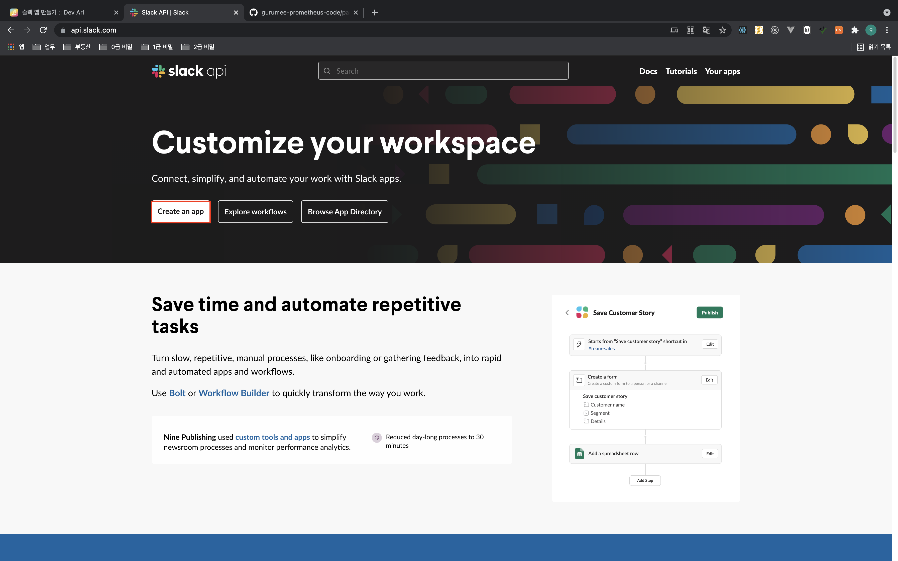
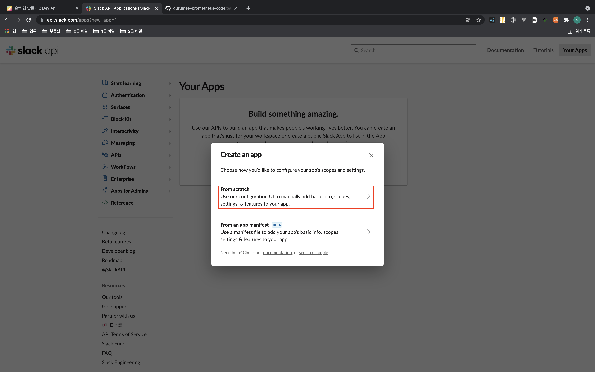
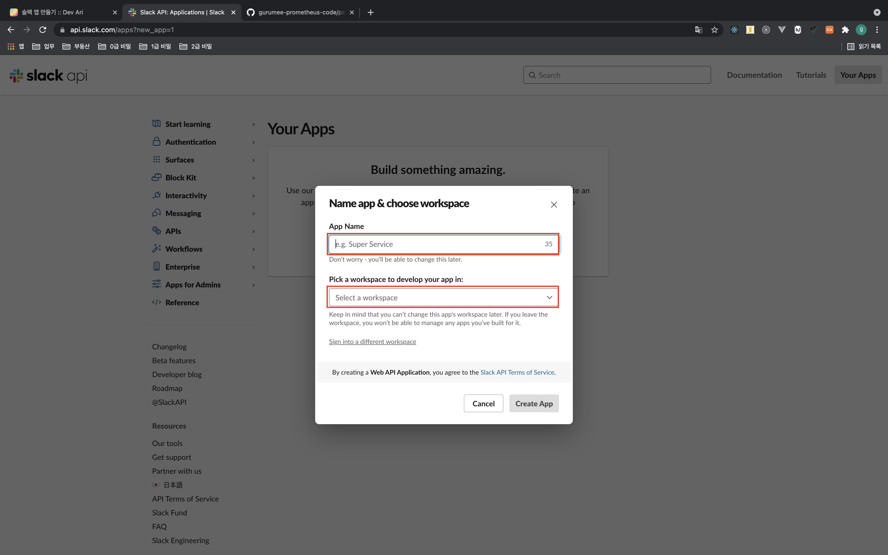
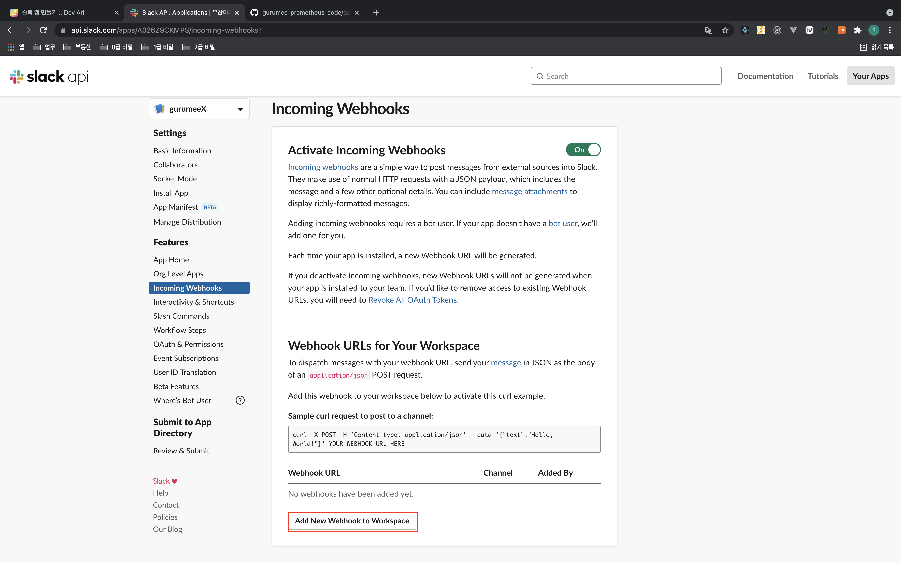
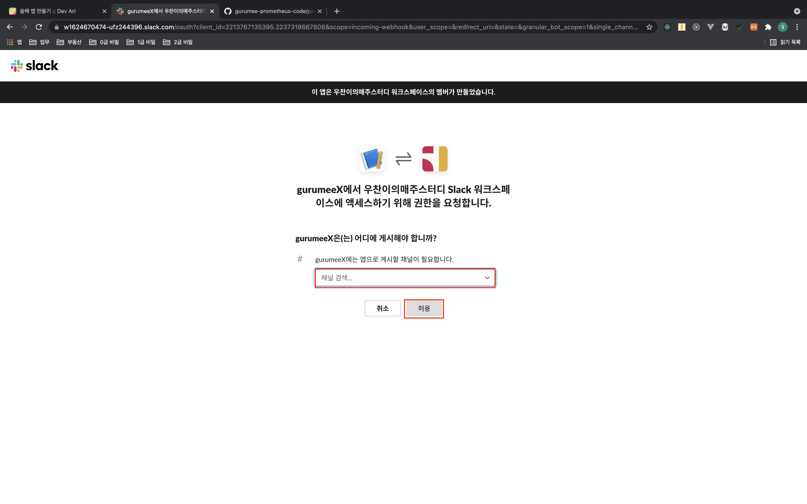
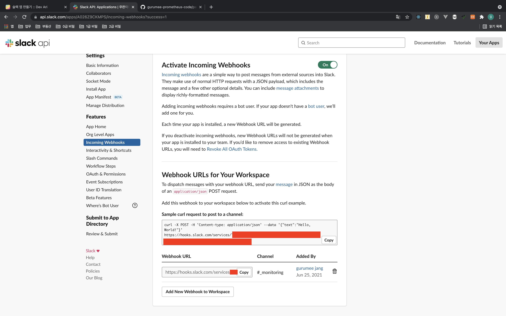

# 알람 파이프라인 구축하기

## 개요

이번 장에서는 `Prometheus`, `Alertmanager`, `Slack`을 연동해서, 알람 파이프라인을 구축할 것이다. 우리가 구축할 알람 파이프라인은 다음과 같다.

알람 파이프라인에 대해 간단히 설명하자면, 먼저 지난 장 "[서비스 메트릭 모니터링하기 (1) prometheus-nginxlog-exporter]()"에서 진행했던 것을 토대로 `Nginx`, `Prometheus`, `prometheus-nginxlog-exporter`를 연동해서 **상태 코드 및, 응답 실패율**에 대한 정보를 얻는다. 그리고 다음 조건을 만족하면 `Prometheus`에서 알람을 발생(Firing)시킨다.

1. 1분간 상태 코드 4xx, 5xx 개수의 합이 10개 이상이다.
2. 1분간 응답 실패율이 50% 이상이다.

그리고 이 발생된 알람을 `Alertmanager`에 전달하고 알람이 처리(Resolved)되기 전까지 매 2분동안 `Slack`에 알람을 전달(Notify)하는 것이다.

이 문서에서는 편의성을 위해서 `Docker` 환경에서 진행할 것이나, 실제 서버 환경에서 어떻게 작업해야 하는지까지 최대한 다루도록 하겠다. 관련 코드는 다음 링크를 참고하길 바란다.

* 이번 장 코드 : [https://github.com/gurumee92/gurumee-prometheus-code/tree/master/part4/ch01](https://github.com/gurumee92/gurumee-prometheus-code/tree/master/part4/ch01)

## 사전 작업 (1) Slack App 만들기

`Prometheus`에서 발생된 알람을 `Alertmanager`에서 `Slack`으로 전달하기 위해서는 사전에 `Slack` 회원가입 및 워크 스페이스를 가지고 있어야 하며, `Slack App` 생성해두어야 한다. 왜냐하면  앱을 만들게 되면 외부에서 앱을 통해서 `Slack API`를 사용할 수 있도록 "웹 훅 URL"이 할당되는데, 이를 `Alertmanager`가 이용해서 `Slack`에게 알람을 전달하기 때문이다. 파이프라인 구축을 위해서 슬랙 앱을 만들어보자. 

먼저 "[https://api.slack.com/](https://api.slack.com/)"에 접속한다.

위의 그림에서, "Create an app"을 누른다. 그럼 페이지 이동과 함께 다음과 같은 팝업창이 뜨게 된다.

"From scratch"를 클릭한다.

앱의 이름과 연동할 워크스페이스를 지정한다. 그 후, "Create App"을 누른다.

그러면 위의 그림과 같이 다른 페이지로 이동되는데, "Incoming Webhooks"를 누른다.

그럼 Webhook을 설정할 수 있는 페이지로 넘어간다. 상단 "off" 토글을 눌러 "on"으로 변경한다.

그럼 위 그림처럼 UI가 변경되는데, 하단에 "Add New Webhook to Workspace"를 클릭한다.

그럼 위의 그림처럼 페이지 이동이 되는데, 여기서 알람을 전송할 채널을 선택하면 된다. 선택 후 "Allow" 버튼을 누르면 된다. 

그럼 위 그림과 같이 Webhook URL이 보이는 페이지로 리다이렉션된다. 이 URL은 외부로 노출이 되면 안되기 때문에 보안에 유의한다. 

추후 `Alertmanger`에서 `Slack`으로 전송하게 하는 설정에서 이 Webhook URL을 사용할 것이다. (아래 Copy 버튼을 누른다.)

## 사전 작업 (2) Alertmanager 설치하기

## 파이프라인 구축하기 (1) promql과 alert rule 이용해서 알람 만들기

## 파이프라인 구축하기 (2) recording rule 이용해서 알람 최적화하기

## 파이프라인 구축하기 (3) Alertmanager 이용해서 Slack에 알람 전송하기